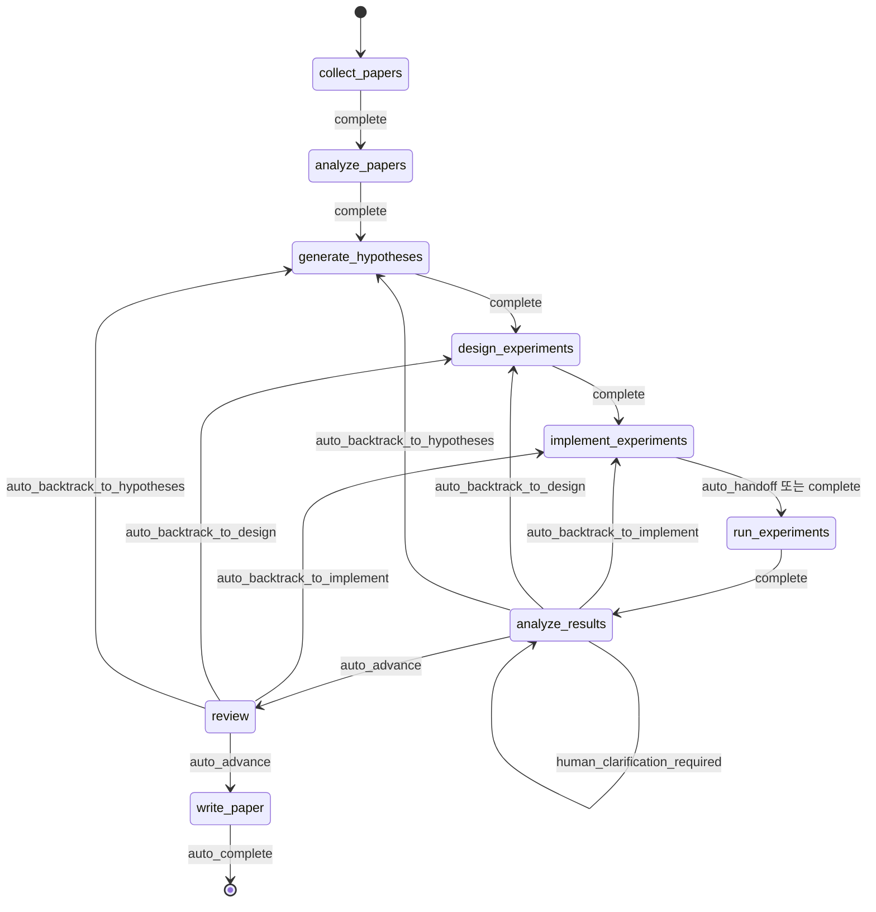
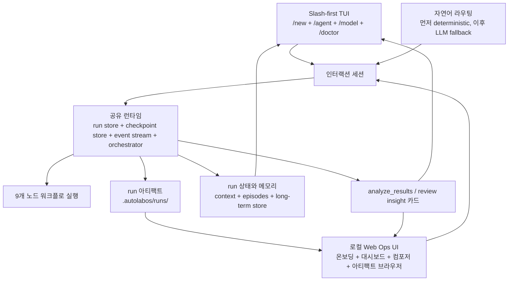
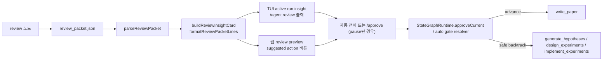
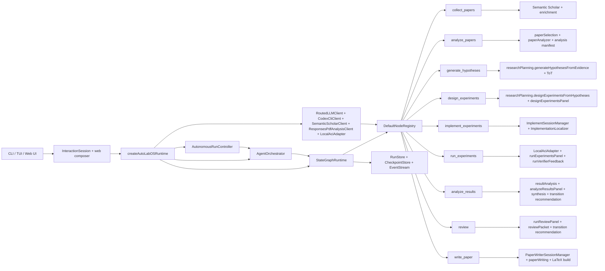

<div align="center">
  <h1>AutoLabOS</h1>
  <p><strong>AI 에이전트 기반 연구 자동화를 위한 slash-first TUI와 로컬 web ops UI</strong></p>
  <p>
    논문 수집과 근거 분석부터 실험 실행, 논문 초안 작성까지 이어지는 흐름을
    워크스페이스 로컬에 머무는 체크포인트 가능한 워크플로로 묶습니다.
  </p>
  <p>
    <a href="./README.md"><strong>English</strong></a>
    ·
    <a href="./README.ko.md"><strong>한국어</strong></a>
  </p>
  <p>
    <a href="https://github.com/lhy0718/AutoLabOS/actions/workflows/smoke.yml">
      
    </a>
    
    
    
    
    
    
  </p>
  <p>
    
    <a href="https://github.com/lhy0718/AutoLabOS/stargazers">
      
    </a>
    <a href="https://github.com/lhy0718/AutoLabOS/commits/main">
      
    </a>
  </p>
</div>

## 왜 AutoLabOS인가?

- `collect_papers`부터 `write_paper`까지 연구 루프를 고정 9단계 상태 그래프로 다루며, 집필 전 `review` 단계를 둡니다.
- 메인 워크플로는 `codex` 또는 `OpenAI API` 중에서 고를 수 있고, PDF 분석 모드는 별도로 바꿀 수 있습니다.
- 체크포인트, 예산, 재시도, 점프, 런별 메모리를 통해 작업 상태를 로컬에서 추적하고 복구할 수 있습니다.

## 핵심 특징

| 기능 | 제공하는 가치 |
| --- | --- |
| Slash-first TUI | `/new`, `/agent ...`, `/model`, `/settings`, `/doctor` 중심으로 전체 흐름을 조작 |
| 로컬 Web Ops UI | `autolabos web`으로 브라우저 온보딩, 대시보드 제어, 아티팩트, 체크포인트, 라이브 세션 상태를 확인 |
| 결정적 자연어 라우팅 | 자주 쓰는 의도는 LLM fallback 전에 로컬 핸들러나 슬래시 명령으로 우선 처리 |
| 하이브리드 provider | Codex 로그인 기반 흐름과 OpenAI API 기반 흐름을 상황에 맞게 선택 |
| PDF 분석 모드 | 로컬 텍스트 추출 + Codex, 또는 Responses API 직접 분석 중 선택 가능 |
| 연구 실행 패턴 | ReAct, ReWOO, ToT, Reflexion 패턴을 노드 성격에 맞게 사용 |
| 로컬 ACI 실행 | `implement_experiments`, `run_experiments`를 파일/명령/테스트 액션으로 수행 |

## 여기서 시작하세요

- 처음 써본다면 `autolabos web`부터 추천합니다. 온보딩, 대시보드, 로그, 체크포인트, 아티팩트 브라우징을 한 화면에서 볼 수 있습니다.
- 터미널 중심으로 쓰고 싶다면 `autolabos`로 시작하면 됩니다.
- 두 명령 모두 AutoLabOS가 관리할 연구 프로젝트 폴더에서 실행하세요. 워크스페이스 상태는 `.autolabos/` 아래에 저장됩니다.

## 준비물

| 항목 | 필요한 경우 | 메모 |
| --- | --- | --- |
| `SEMANTIC_SCHOLAR_API_KEY` | 항상 필요 | 논문 탐색과 메타데이터 조회에 사용 |
| `OPENAI_API_KEY` | 메인 provider 또는 PDF 모드가 `api`일 때만 필요 | OpenAI API 모델 실행에 사용 |
| Codex CLI 로그인 | 메인 provider 또는 PDF 모드가 `codex`일 때만 필요 | 로컬 Codex 세션을 사용 |

## 빠른 시작

1. AutoLabOS를 설치하고 빌드합니다.

```bash
npm install
npm run build
npm link
```

2. 워크스페이스로 사용할 연구 프로젝트 폴더로 이동합니다.

```bash
cd /path/to/your-research-project
```

3. 추천 경로인 브라우저 UI를 실행합니다.

```bash
autolabos web
```

기본 주소는 `http://127.0.0.1:4317`입니다. TUI부터 시작하고 싶다면 `autolabos`를 실행하면 됩니다.

4. 온보딩을 완료합니다. 아직 `.autolabos/config.yaml`이 없다면 웹에서는 onboarding이, TUI에서는 setup wizard가 열리며 같은 워크스페이스 스캐폴드와 설정을 작성합니다.

5. 첫 실행이 성공했는지 확인합니다. 프로젝트 안에 `.autolabos/config.yaml`이 생기고, 대시보드 또는 TUI 홈 화면에서 run을 시작할 수 있으면 준비가 끝난 것입니다.

6. run을 만들거나 선택한 뒤 `/new`, `/agent collect "your topic"`, 또는 웹 워크플로 카드로 첫 실행을 시작합니다.

## 첫 실행에서 일어나는 일

- AutoLabOS는 워크스페이스 설정을 `.autolabos/config.yaml`에 저장하고, 실행 시 `process.env` 또는 `.env`의 `SEMANTIC_SCHOLAR_API_KEY`, `OPENAI_API_KEY`를 읽습니다.
- 기본 LLM provider를 고릅니다. `codex`는 로컬 Codex 세션을 사용하고, `api`는 OpenAI API 모델을 사용합니다.
- PDF 분석 모드는 별도로 고릅니다. `codex`는 로컬에서 텍스트를 추출한 뒤 분석하고, `api`는 PDF를 Responses API로 직접 보냅니다.
- 메인 provider 또는 PDF 모드가 `api`이면 onboarding과 `/settings`에서 OpenAI 모델을 선택할 수 있습니다.
- `/model`은 먼저 활성 백엔드를 고른 뒤, 나중에 슬롯과 모델을 다시 바꿀 수 있게 해줍니다.

## 처음 사용자용 문제 해결

- 저장소 체크아웃 환경에서 웹 자산이 없다는 메시지가 보이면, AutoLabOS 패키지 루트에서 `npm --prefix web run build`를 한 번 실행한 뒤 `autolabos web`을 다시 시작하세요.
- `npm link`를 쓰지 않으려면 AutoLabOS 저장소 루트에서 `node dist/cli/main.js` 또는 `node dist/cli/main.js web`으로 실행할 수 있습니다.
- 다른 호스트나 포트가 필요하면 `autolabos web --host 0.0.0.0 --port 8080`을 사용하세요.
- 로컬 개발 모드는 `npm run dev`, `npm run dev:web`입니다.

## Web Ops UI

`autolabos web`은 TUI와 같은 런타임을 공유하는 로컬 단일 사용자용 브라우저 UI를 실행합니다.

- 온보딩은 같은 비대화형 setup helper를 사용하므로, 웹에서 초기 설정해도 TUI wizard와 동일한 `.autolabos/config.yaml`과 `.env` 값이 생성됩니다.
- 대시보드에서 run 검색/선택, 9개 노드 워크플로 보기, 노드 액션, 라이브 로그, 체크포인트, 아티팩트, 메타데이터, `/doctor` 요약을 확인할 수 있습니다.
- 하단 컴포저는 슬래시 명령과 지원되는 자연어 입력을 모두 받습니다.
- 복합 자연어 실행 계획은 `y/a/n` 대신 `Run next`, `Run all`, `Cancel` 버튼으로 제어합니다.
- 아티팩트 브라우저는 `.autolabos/runs/<run_id>` 범위로 제한되며, 주요 텍스트 파일·이미지·PDF는 inline preview를 제공합니다.

웹 사용 흐름:

1. `autolabos web`으로 서버를 시작합니다.
   관리하려는 연구 프로젝트 폴더에서 실행합니다.
   저장소 체크아웃 환경에서 웹 자산이 없다는 메시지가 나오면 AutoLabOS 패키지 루트에서 `npm --prefix web run build`를 한 번 실행한 뒤 서버를 다시 시작합니다.
2. 브라우저에서 `http://127.0.0.1:4317`을 엽니다.
3. 아직 설정되지 않았다면 onboarding을 완료합니다.
4. run을 만들거나 선택한 뒤 워크플로 카드나 컴포저로 실행을 제어합니다.

## 노드와 에이전트 구조

AutoLabOS에는 이름이 비슷해서 헷갈리기 쉬운 두 레이어가 있습니다.

- 오케스트레이션 레이어: `/agent ...`가 대상으로 삼는 9개 그래프 노드입니다. 코드에서는 `AgentId`가 현재 `GraphNodeId`의 alias입니다.
- 역할 레이어: 각 노드 내부 프롬프트, 이벤트, 세션 매니저에서 쓰는 export된 `agentRole` 정체성입니다. 예를 들면 `implementer`, `runner`, `paper_writer`, `reviewer`가 여기에 속합니다.
- 일부 노드는 여기서 한 단계 더 내려가 node 내부 정체성이나 결정적 컨트롤러로 fan-out합니다. 프롬프트 중심 예시는 `generate_hypotheses` 안의 evidence synthesizer + skeptical reviewer, 그리고 `review` 안의 5인 specialist panel이고, 결정적 패널/컨트롤러 예시는 이제 `design_experiments`, `run_experiments`, `analyze_results`에도 들어갑니다.

### 노드와 역할 매핑

```mermaid
flowchart TB
    subgraph Orchestration["오케스트레이션 레이어 (`/agent` 대상, 9개 노드)"]
        O["AgentOrchestrator + StateGraphRuntime"]
        N1["collect_papers"]
        N2["analyze_papers"]
        N3["generate_hypotheses"]
        N4["design_experiments"]
        N5["implement_experiments"]
        N6["run_experiments"]
        N7["analyze_results"]
        N8["review"]
        N9["write_paper"]

        O --> N1 --> N2 --> N3 --> N4 --> N5 --> N6 --> N7 --> N8 --> N9
    end

    subgraph Roles["export된 역할 레이어 (`agentRole`)"]
        R1["collector_curator"]
        R2["reader_evidence_extractor"]
        R3["hypothesis_agent"]
        R4["experiment_designer"]
        R5["implementer"]
        R6["runner"]
        R7["analyst_statistician"]
        R8["paper_writer"]
        R9["reviewer"]
    end

    subgraph Internal["노드 내부 정체성과 컨트롤러"]
        P1["evidence synthesizer"]
        P2["skeptical reviewer"]
        P3["feasibility reviewer"]
        P4["statistical reviewer"]
        P5["ops-budget planner"]
        P6["trial manager"]
        P7["failure triager"]
        P8["resource/log watchdog"]
        P9["rerun planner"]
        P10["metric auditor"]
        P11["robustness reviewer"]
        P12["confounder detector"]
        P13["decision calibrator"]
        P14["claim verifier"]
        P15["methodology reviewer"]
        P16["statistics reviewer"]
        P17["writing readiness reviewer"]
        P18["integrity reviewer"]
    end

    N1 -. 주 역할 .-> R1
    N2 -. 주 역할 .-> R2
    N3 -. 주 역할 .-> R3
    N3 -. synthesis .-> P1
    N3 -. critique .-> P2
    N4 -. 주 역할 .-> R4
    N4 -. selection panel .-> P3
    N4 -. selection panel .-> P4
    N4 -. selection panel .-> P5
    N5 -. 주 역할 .-> R5
    N6 -. 주 역할 .-> R6
    N6 -. execution controller .-> P6
    N6 -. execution controller .-> P7
    N6 -. execution controller .-> P8
    N6 -. execution controller .-> P9
    N7 -. 주 역할 .-> R7
    N7 -. result panel .-> P10
    N7 -. result panel .-> P11
    N7 -. result panel .-> P12
    N7 -. result panel .-> P13
    N8 -. panel role .-> R9
    N8 -. specialist .-> P14
    N8 -. specialist .-> P15
    N8 -. specialist .-> P16
    N8 -. specialist .-> P17
    N8 -. specialist .-> P18
    N9 -. drafting .-> R8
    N9 -. critique .-> R9
```



### 실행 그래프



상위 워크플로우는 계속 고정 9노드 그래프입니다. 최근 자동화는 노드 내부의 bounded loop로 들어가므로, evidence window 확장, 보강 실험 프로필, objective grounding 재시도, 논문 초안 repair 때문에 상위 노드를 더 늘리지는 않습니다.

### 실행 제어 표

| 계층 | 설정 또는 명령 | 기본값 | 하는 일 | 사람이 개입하는 시점 |
| --- | --- | --- | --- | --- |
| Workflow mode | `agent_approval` | 고정 | 논문 수집부터 논문 작성까지 9개 노드 연구 그래프를 실행 | 자체적으로 pause를 만들지는 않음 |
| Approval mode | `workflow.approval_mode: minimal` | 예 | 일반 완료 게이트를 자동 승인하고, review 결과를 포함한 안전한 전이 추천을 자동 적용 | recommendation이 `pause_for_human`이거나 `autoExecutable=false`이면 멈춤 |
| Approval mode | `workflow.approval_mode: manual` | 선택 | 자동 해소 대신 모든 승인 경계에서 멈춤 | `/approve`, `/agent apply`, `/agent jump` 같은 명시적 명령으로 진행 |
| Autonomy preset | `/agent overnight` | 필요할 때만 실행 | 현재 run을 사람 없이 한동안 진행하는 보수적인 야간 자동운전 정책 | `write_paper` 직전, low-confidence 또는 허용되지 않은 backtrack, 반복 recommendation, 시간 제한, 수동 전용 recommendation에서 멈춤 |

### 인간 개입이 필요한 조건

| 위치 | 조건 | 결과 |
| --- | --- | --- |
| `analyze_results` | best-effort metric rematch 뒤에도 objective metric을 구체적인 수치 신호에 연결하지 못함 | 다음 단계로 넘어가기 전에 clarification을 위해 pause |
| `analyze_results` | hypothesis reset 추천이 나왔지만 confidence가 낮아 `autoExecutable=true`가 아님 | 자동 backtrack 대신 사람 검토를 위해 pause |
| 모든 노드 (`manual` approval mode) | 노드가 승인 경계에 도달함 | `/approve`, `/agent apply`, 또는 다른 명시적 운영자 선택을 기다림 |
| `/agent overnight` | `write_paper` 도달, low-confidence 또는 비허용 recommendation, recommendation 반복 과다, 야간 시간 예산 도달 | overnight 실행을 중단하고 운영자에게 제어를 돌려줌 |

기본 설정에서는 review 결과가 자동으로 `write_paper` 또는 지원되는 backtrack으로 적용됩니다. `minimal` 모드에서 review는 별도의 수동 hold 지점이 아닙니다.

### Bounded Automation 및 내부 패널

| 노드 | 내부 자동화 | 트리거 | 제한 또는 산출물 |
| --- | --- | --- | --- |
| `analyze_papers` | fresh `top_n` 선택을 자동 확장하고 manifest 기반 완료 분석을 재사용 | 처음 선택된 범위의 evidence가 너무 얇아 가설 grounding이 약할 때 | 최대 2회 자동 확장 |
| `design_experiments` | 생성된 후보를 결정적인 `designer / feasibility / statistical / ops-budget` 패널로 점수화하고 선택 | `designExperimentsFromHypotheses(...)`가 후보 설계를 반환했을 때 | 설계 실행마다 1회 수행되며 내부 `design_experiments_panel/*` 아티팩트를 남김 |
| `run_experiments` | execution plan을 만들고, 실패를 분류하고, transient failure에 대해 1회 자동 재시도 정책을 적용 | primary run command가 해석되었을 때 | policy block, missing metrics, invalid metrics는 재시도하지 않고, transient command failure만 1회 재시도 |
| `run_experiments` | managed `standard -> quick_check -> confirmatory` 프로필을 연쇄 실행 | managed `real_execution` bundle이 standard run을 observed/met로 끝냈을 때 | supplemental run은 best effort이며 primary success를 뒤집지 않음 |
| `analyze_results` | best-effort metric rematch로 objective grounding을 다시 시도한 뒤 결정적 result panel로 confidence를 보정 | 캐시된 또는 fresh objective evaluation이 `missing` 또는 `unknown`이거나, 최종 transition recommendation을 확정해야 할 때 | 사람 clarification pause 전 1회 bounded rematch, 그리고 내부 `analyze_results_panel/*` 아티팩트 생성 |
| `write_paper` | 문헌 커버리지가 얇을 때 drafting 전에 작은 query planner와 coverage auditor가 붙은 bounded related-work scout를 수행 | 검증된 writing bundle의 analyzed paper/corpus 수가 부족하거나 review context가 citation gap을 가리킬 때 | best-effort Semantic Scholar scout를 `paper/related_work_scout/*`에 기록하고, planned query를 coverage가 충분해지면 일찍 멈춘 뒤 메인 `corpus.jsonl` 대신 집필용 in-memory bundle에만 합침 |
| `write_paper` | validation-aware repair를 한 번 더 돌리고 재검증 | draft validation에서 repair 가능한 borrowed grounding warning이 나올 때 | 최대 1회 repair, warning 수가 늘어나면 채택하지 않음 |

### 단계별 연결 그래프

아래 4개의 그래프는 전체 9개 노드를 모두 덮으며, 각 단계 안에서 실제로 어떤 역할 에이전트나 세션 매니저가 일을 수행하는지 보여줍니다.

#### 수집과 읽기

```mermaid
flowchart LR
    Topic["run topic + 수집 제약"] --> CP["collect_papers"]
    CP --> CC["collector_curator"]
    CC --> SS["Semantic Scholar 검색"]
    SS --> Enrich["enrichment + BibTeX 복구"]
    Enrich --> Corpus["corpus.jsonl + bibtex.bib"]

    Corpus --> AP["analyze_papers"]
    AP --> Select["selection request + hybrid rerank"]
    Select --> Manifest["analysis_manifest resume / prune"]
    Manifest --> RE["reader_evidence_extractor"]
    RE --> Pdf["로컬 text/image 분석 또는 Responses API PDF"]
    Pdf --> ReviewLoop["extractor -> reviewer normalization"]
    ReviewLoop --> Evidence["paper_summaries.jsonl + evidence_store.jsonl"]
```



#### 가설과 실험 설계

```mermaid
flowchart LR
    Evidence["paper_summaries.jsonl + evidence_store.jsonl"] --> GH["generate_hypotheses"]
    GH --> HA["hypothesis_agent"]
    HA --> Axes["evidence synthesizer -> evidence axes"]
    Axes --> ToT["ToT branch expansion"]
    ToT --> Drafts["mechanism / contradiction / intervention drafts"]
    Drafts --> Reviews["skeptical reviewer"]
    Reviews --> Select["diversity + evidence-quality top-k selection"]
    Select --> Hyp["hypotheses.jsonl + axes/reviews/llm_trace"]

    Hyp --> DE["design_experiments"]
    DE --> ED["experiment_designer"]
    ED --> Profiles["constraint profile + objective metric profile"]
    Profiles --> Plans["설계 후보"]
    Plans --> Panel["designer + feasibility + statistical + ops-budget panel"]
    Panel --> Choice["panel selection"]
    Choice --> Bundle{"managed real_execution bundle 지원?"}
    Bundle -->|yes| Managed["bundle sections + runnable profiles"]
    Bundle -->|no| Plain["plain experiment plan"]
    Managed --> PlanYaml["experiment_plan.yaml"]
    Plain --> PlanYaml
```



#### 구현, 실행, 결과 루프

```mermaid
flowchart LR
    PlanYaml["experiment_plan.yaml"] --> IE["implement_experiments"]
    IE --> IM["ImplementSessionManager"]
    IM --> Impl["implementer"]
    IM --> Localizer["ImplementationLocalizer + branch planning"]
    IM --> Codex["Codex CLI session"]
    IM --> Memory["EpisodeMemory + LongTermStore"]
    Codex --> VerifyPatch["로컬 검증 + verify report"]
    VerifyPatch --> Handoff{"auto handoff?"}

    Handoff -->|yes| RX["run_experiments"]
    Handoff -->|no| Gate["승인 경계<br/>minimal이면 자동 해소"]
    Gate --> RX

    RX --> Runner["runner"]
    Runner --> Trial["trial manager"]
    Trial --> ACI["Local ACI preflight/tests/command 실행"]
    ACI --> Triage["failure triager + rerun planner"]
    Triage -->|transient면 1회 재시도| ACI
    ACI --> Watchdog["resource/log watchdog"]
    Watchdog --> Profiles["managed standard -> quick_check -> confirmatory"]
    Profiles --> Metrics["metrics.json + supplemental runs + run_verifier_feedback"]
    Metrics -. runner feedback .-> IM
    Metrics --> AR["analyze_results"]
    AR --> Analyst["analyst_statistician"]
    Analyst --> Ground["best-effort metric rematch"]
    Ground --> ResultPanel["metric auditor + robustness reviewer + confounder detector + decision calibrator"]
    ResultPanel --> Synth["objective evaluation + synthesis + transition recommendation"]

    Synth -->|advance| RV["review"]
    Synth -->|backtrack_to_implement| IE
    Synth -->|backtrack_to_design| DE["design_experiments"]
    Synth -->|backtrack_to_hypotheses| GH["generate_hypotheses"]
```



#### 리뷰, 집필, 서피싱

```mermaid
flowchart LR
    Inputs["result_analysis + corpus + evidence + hypotheses + experiment_plan"] --> RV["review"]
    RV --> Panel["runReviewPanel"]
    Panel --> Claim["claim verifier"]
    Panel --> Method["methodology reviewer"]
    Panel --> Stats["statistics reviewer"]
    Panel --> Ready["writing readiness reviewer"]
    Panel --> Integrity["integrity reviewer"]
    Panel --> Score["scorecard + consistency + bias"]
    Panel --> Decision["decision + revision_plan"]
    Score --> Packet["review_packet.json + checklist.md"]
    Decision --> Packet
    Packet --> Insight["review insight + suggested actions"]
    Insight --> Gate{"review outcome 적용"}

    Gate -->|advance| WP["write_paper"]
    Gate -->|backtrack_to_hypotheses| GH["generate_hypotheses"]
    Gate -->|backtrack_to_design| DE["design_experiments"]
    Gate -->|backtrack_to_implement| IE["implement_experiments"]

    WP --> PWM["PaperWriterSessionManager"]
    PWM --> Mode["Codex session 또는 staged LLM"]
    Mode --> Writer["paper_writer"]
    Mode --> Reviewer["reviewer"]
    Writer --> Outline["outline"]
    Outline --> Draft["draft"]
    Draft --> Review["review critique"]
    Review --> Final["finalize"]
    Final --> Validate["draft validation"]
    Validate --> Repair{"repair 가능한 borrowed warning?"}
    Repair -->|yes| Revise["validation-aware repair (최대 1회)"]
    Revise --> Revalidate["재검증"]
    Repair -->|no| Tex["paper/main.tex + references.bib + evidence_links.json"]
    Revalidate --> Tex
    Tex --> Build{"PDF build enabled?"}
    Build -->|yes| Latex["LaTeX compile + optional repair"]
    Build -->|no| Done["LaTeX 산출물만 생성"]
    Latex --> Pdf["paper/main.pdf (optional)"]
```



| 그래프 노드 | 주 역할 | 현재 구현 형태 |
| --- | --- | --- |
| `collect_papers` | `collector_curator` | Semantic Scholar 검색, 중복 제거, 보강, BibTeX 생성 |
| `analyze_papers` | `reader_evidence_extractor` | 논문 선택 랭킹과 재개 가능한 planner -> extractor -> reviewer 기반 로컬/Responses API PDF 분석, evidence가 얇으면 bounded top-N auto-expansion 포함 |
| `generate_hypotheses` | `hypothesis_agent` | evidence-axis synthesis, ToT branching, skeptical review, diversity-aware top-k selection |
| `design_experiments` | `experiment_designer` | 실험 후보 설계 생성 뒤 결정적인 `designer / feasibility / statistical / ops-budget` 패널로 선택하고 `experiment_plan.yaml`을 기록 |
| `implement_experiments` | `implementer` | `ImplementSessionManager`, localization, Codex 패치, 검증, optional handoff |
| `run_experiments` | `runner` | ACI 기반 preflight/tests/command 실행, execution-plan + triage + watchdog 제어, transient failure 1회 재시도, managed supplemental profile chaining, verifier feedback |
| `analyze_results` | `analyst_statistician` | best-effort metric rematching, 결정적 result panel 기반 confidence calibration, 결과 합성, transition recommendation |
| `review` | `reviewer` | `runReviewPanel`, 5인 specialist reviewer, heuristic+LLM refinement, review packet 생성, transition recommendation |
| `write_paper` | `paper_writer`, `reviewer` | `PaperWriterSessionManager`, bounded related-work scout, outline/draft/review/finalize, validation-aware repair, optional LaTeX repair |

역할 카탈로그와 실제 멀티턴 런타임은 완전히 같은 범위는 아닙니다. 가장 깊은 멀티턴 session manager는 여전히 `implement_experiments`, `write_paper`이고, `review`는 가장 강한 LLM-panelized 노드로 남아 있으며, `generate_hypotheses`도 evidence-synthesis / skeptical-review 프롬프트를 유지합니다. 새로 강화된 `design_experiments`, `run_experiments`, `analyze_results`는 상위 그래프 역할이나 운영자 표면을 바꾸지 않고, 노드 내부에서만 동작하는 결정적 패널/컨트롤러를 추가한 형태입니다.

### 아티팩트 흐름

```mermaid
flowchart TB
    A["collect_papers"] --> A1["collect_request.json<br/>collect_result.json<br/>collect_enrichment.jsonl<br/>corpus.jsonl<br/>bibtex.bib"]
    A1 --> B["analyze_papers"]
    B --> B1["analysis_manifest.json<br/>paper_summaries.jsonl<br/>evidence_store.jsonl"]
    B1 --> C["generate_hypotheses"]
    C --> C1["hypotheses.jsonl<br/>hypothesis_generation/evidence_axes.json<br/>hypothesis_generation/selection.json<br/>hypothesis_generation/drafts.jsonl<br/>hypothesis_generation/reviews.jsonl"]
    C1 --> D["design_experiments"]
    D --> D1["experiment_plan.yaml<br/>design_experiments_panel/candidates.json<br/>design_experiments_panel/reviews.json<br/>design_experiments_panel/selection.json"]
    D1 --> E["implement_experiments"]
    E --> F["run_experiments"]
    F --> F1["exec_logs/run_experiments.txt<br/>exec_logs/observations.jsonl<br/>metrics.json<br/>objective_evaluation.json<br/>run_experiments_supplemental_runs.json (optional)<br/>run_experiments_verify_report.json<br/>run_experiments_panel/execution_plan.json<br/>run_experiments_panel/triage.json<br/>run_experiments_panel/rerun_decision.json"]
    F1 --> G["analyze_results"]
    G --> G1["result_analysis.json<br/>result_analysis_synthesis.json<br/>transition_recommendation.json<br/>figures/performance.svg<br/>analyze_results_panel/inputs.json<br/>analyze_results_panel/reviews.json<br/>analyze_results_panel/scorecard.json<br/>analyze_results_panel/decision.json"]
    G1 --> H["review"]
    H --> H1["review/findings.jsonl<br/>review/scorecard.json<br/>review/consistency_report.json<br/>review/bias_report.json<br/>review/revision_plan.json<br/>review/decision.json<br/>review/review_packet.json<br/>review/checklist.md"]
    H1 --> I["write_paper"]
    I --> I1["paper/main.tex<br/>paper/references.bib<br/>paper/evidence_links.json<br/>paper/draft.json<br/>paper/validation.json<br/>paper/validation_repair_report.json<br/>paper/related_work_scout/* (optional)<br/>paper/main.pdf (optional)"]
```



모든 run 아티팩트는 `.autolabos/runs/<run_id>/` 아래에 저장되므로, TUI와 로컬 웹 UI 양쪽에서 같은 실행 결과를 추적하고 점검할 수 있습니다.

`analyze_papers`는 `analysis_manifest.json`을 이용해 미완료 작업만 재개합니다. 선택된 논문 집합이 바뀌거나, 분석 설정이 바뀌거나, `paper_summaries.jsonl` / `evidence_store.jsonl`가 manifest와 어긋나면 AutoLabOS는 오래된 행을 정리하고 영향받은 논문만 다시 큐에 넣은 뒤 downstream 노드를 계속 진행합니다.

새로운 중간 파이프라인 강화는 v1에서 내부 전용으로만 노출됩니다. `design_experiments`는 `design_experiments_panel/*`, `run_experiments`는 `run_experiments_panel/*`, `analyze_results`는 `analyze_results_panel/*`를 쓰고, 대응되는 run-context memory key는 `design_experiments.panel_selection`, `run_experiments.triage`, `analyze_results.panel_decision`입니다.

managed `run_experiments`는 successful standard run 뒤에 자동으로 `quick_check`, `confirmatory`를 따라 돌리면 `run_experiments_supplemental_runs.json`도 남깁니다. `write_paper`는 planned query variant와 coverage audit가 붙은 bounded related-work scout를 실행하면 `paper/related_work_scout/*`도 남기고, bounded repair loop가 실제로 실행되면 `validation_repair_report.json`과 `validation_repair.*` 아티팩트도 기록합니다.

### 제어 표면



### Review Decision Loop



### 구체적인 에이전트 런타임



핵심 소스 영역:

- `src/runtime/createRuntime.ts`: 설정, provider, store, runtime, orchestrator, 공용 실행 의존성을 조립
- `src/interaction/*`: TUI와 웹 컴포저가 함께 쓰는 공용 command/session 레이어
- `src/core/stateGraph/*`: 노드 실행, 재시도, 승인, 예산, 점프, 체크포인트 처리
- `src/core/nodes/*`: 9개 워크플로 핸들러와 아티팩트 생성 로직
- `src/core/analysis/researchPlanning.ts`, `src/core/designExperimentsPanel.ts`, `src/core/runExperimentsPanel.ts`, `src/core/analyzeResultsPanel.ts`, `src/core/reviewSystem.ts`, `src/core/reviewPacket.ts`: 다단계 가설 생성/실험 설계, 결정적 중간 패널/컨트롤러, specialist review panel, review packet 빌드/서피싱
- `src/core/agents/*`: 세션 매니저, export된 역할 정의, search-backed implementation localization
- `src/integrations/*`, `src/tools/*`: provider 클라이언트, Semantic Scholar 연동, Responses PDF 분석, 로컬 실행 어댑터
- `src/web/*`, `web/src/*`, `src/interaction/*`, `src/tui/*`: 같은 런타임 위에 얹힌 로컬 HTTP 서버, 브라우저 UI, 터미널 surface와 insight 카드

## 자주 쓰는 명령어

| 명령어 | 설명 |
| --- | --- |
| `/new` | run 생성 |
| `/runs [query]` | run 목록 조회 또는 검색 |
| `/run <run>` | run 선택 |
| `/resume <run>` | run 재개 |
| `/agent collect [query] [options]` | 필터, 정렬, 서지 옵션으로 논문 수집 |
| `/agent run <node> [run]` | 특정 그래프 노드부터 실행 |
| `/agent status [run]` | 노드 상태 조회 |
| `/agent graph [run]` | 그래프 상태 보기 |
| `/agent resume [run] [checkpoint]` | 최신 또는 특정 체크포인트에서 재개 |
| `/agent retry [node] [run]` | 노드 재시도 |
| `/agent jump <node> [run] [--force]` | 노드 점프 |
| `/agent budget [run]` | 예산 사용량 확인 |
| `/model` | 모델 및 reasoning selector 열기 |
| `/settings` | 기본 설정 수정 |
| `/doctor` | 환경 점검 |

자주 쓰는 수집 옵션:

- `--run <run_id>`
- `--limit <n>`
- `--additional <n>`
- `--last-years <n>`
- `--year <spec>`
- `--date-range <start:end>`
- `--sort <relevance|citationCount|publicationDate|paperId>`
- `--order <asc|desc>`
- `--field <csv>`
- `--venue <csv>`
- `--type <csv>`
- `--min-citations <n>`
- `--open-access`
- `--bibtex <generated|s2|hybrid>`
- `--dry-run`

예시:

- `/agent collect --last-years 5 --sort relevance --limit 100`
- `/agent collect "agent planning" --sort citationCount --order desc --min-citations 100`
- `/agent collect --additional 200 --run <run_id>`

## 자연어 제어

AutoLabOS는 모든 문장을 규칙으로 처리하려고 하지 않습니다. 대신 지원하는 deterministic intent family를 정의하고, 이 범위는 로컬 핸들러나 슬래시 명령으로 우선 처리한 뒤 나머지는 workspace 기반 LLM으로 넘깁니다.

TUI 안에서 아래처럼 입력하면 현재 지원 목록을 확인할 수 있습니다.

- `지원되는 자연어 입력을 보여줘`
- `what natural inputs are supported?`

대표 예시:

- `새 run 시작해줘`
- `최근 5년 관련도 순으로 100개 수집해줘`
- `현재 상태 보여줘`
- `collect_papers로 돌아가줘`
- `논문 몇 개 모였어?`

복합 자연어 실행 계획은 단계별로 멈춥니다.

- `y`: 다음 step 1개만 실행
- `a`: 남은 step을 더 멈추지 않고 모두 실행
- `n`: 남은 계획 취소

구현 위치:

- deterministic 라우팅: [src/core/commands/naturalDeterministic.ts](./src/core/commands/naturalDeterministic.ts)
- 상태 / 다음 단계 로컬 응답: [src/core/commands/naturalAssistant.ts](./src/core/commands/naturalAssistant.ts)

<details>
<summary>전체 슬래시 명령어 목록</summary>

| 명령어 | 설명 |
| --- | --- |
| `/help` | 명령 목록 표시 |
| `/new` | run 생성 |
| `/doctor` | 환경 점검 |
| `/runs [query]` | run 목록/검색 |
| `/run <run>` | run 선택 |
| `/resume <run>` | run 재개 |
| `/agent list` | 그래프 노드 목록 |
| `/agent run <node> [run]` | 노드 실행 |
| `/agent status [run]` | 노드 상태 조회 |
| `/agent collect [query] [options]` | 필터/정렬 옵션으로 논문 수집 |
| `/agent recollect <n> [run]` | 현재 run에 논문을 추가 수집 |
| `/agent focus <node>` | safe jump로 노드 포커스 이동 |
| `/agent graph [run]` | 그래프 상태 출력 |
| `/agent resume [run] [checkpoint]` | 최신/특정 체크포인트 재개 |
| `/agent retry [node] [run]` | 노드 재시도 |
| `/agent jump <node> [run] [--force]` | 노드 점프 |
| `/agent budget [run]` | 예산 사용량 조회 |
| `/agent overnight [run]` | 기본 safe policy로 overnight autonomy preset 실행 |
| `/model` | 화살표 선택기로 모델/effort 선택 |
| `/approve` | 멈춘 현재 노드를 승인 |
| `/retry` | 현재 노드 재시도 |
| `/settings` | 기본 설정 수정 |
| `/quit` | 종료 |

</details>

<details>
<summary>지원하는 자연어 입력 범주</summary>

1. 도움말 / 설정 / 모델 / 환경 점검 / 종료
   - 예: `도움말 보여줘`, `모델 선택기 열어줘`, `환경 점검해줘`
2. run 라이프사이클
   - 예: `새 run 시작해줘`, `run 목록 보여줘`, `alpha run 열어줘`, `이전 run 재개해줘`
3. run title 변경
   - 예: `run title을 Multi-agent collaboration으로 바꿔줘`
4. 워크플로 구조 / 현재 상태 / 다음 단계
   - 예: `현재 상태 보여줘`, `다음에 뭐 해야 해?`, `워크플로 구조 알려줘`
5. 논문 수집
   - 예: `최근 5년 관련도 순으로 100개 수집해줘`
   - 예: `오픈액세스 리뷰 논문 50개 수집해줘`
   - 예: `논문 200개 더 수집해줘`
   - 예: `기존 논문을 지우고 새 논문 100개 다시 수집해줘`
6. 노드 제어
   - 예: `collect_papers로 이동해줘`, `가설 노드 다시 실행해줘`, `implement_experiments에 집중해줘`
7. 그래프 / 예산 / 승인
   - 예: `그래프 보여줘`, `예산 상태 보여줘`, `멈춘 현재 노드 승인해줘`, `현재 노드 재시도해줘`
8. 수집된 논문 직접 질의
   - 예: `논문 몇 개 모았어?`
   - 예: `pdf 경로가 없는 논문이 몇 개야?`
   - 예: `citation이 가장 높은 논문이 뭐야?`
   - 예: `논문 제목 3개 보여줘`

</details>

<details>
<summary>런타임 기본값, 저장 구조, 실행 디테일</summary>

### 상태 그래프

고정 그래프 노드:

1. `collect_papers`
2. `analyze_papers`
3. `generate_hypotheses`
4. `design_experiments`
5. `implement_experiments`
6. `run_experiments`
7. `analyze_results`
8. `review`
9. `write_paper`

### 런타임 정책

- 체크포인트: `.autolabos/runs/<run_id>/checkpoints/`
- 체크포인트 phase: `before | after | fail | jump | retry`
- 재시도 정책: `maxAttemptsPerNode=3`
- 자동 롤백 정책: `maxAutoRollbacksPerNode=2`
- 점프 모드:
  - `safe`: 현재 또는 이전 노드만 허용
  - `force`: 미래 노드 점프 허용, 건너뛴 노드는 기록
- 예산 정책:
  - `maxToolCalls=150`
  - `maxWallClockMinutes=240`
  - `maxUsd=15` (provider 비용을 모르면 soft-check)

### 에이전트 실행 패턴

- ReAct 루프: `PLAN_CREATED -> TOOL_CALLED -> OBS_RECEIVED`
- ReWOO 분리(Planner/Worker): 고비용 노드 중심
- ToT(Tree-of-Thoughts): 가설/설계 노드에서 사용
- Reflexion: 실패 episode를 저장해 재시도 시 재활용

### 메모리 계층

- Run context memory: run 단기 상태
- Long-term store: JSONL 기반 요약/색인 히스토리
- Episode memory: Reflexion 실패 학습

### ACI (Agent-Computer Interface)

표준 액션:

- `read_file`
- `write_file`
- `apply_patch`
- `run_command`
- `run_tests`
- `tail_logs`

`implement_experiments`, `run_experiments` 노드는 ACI를 통해 실행됩니다.

### 명령 팔레트

- `/` 입력: 명령 목록 열기
- `Tab`: 자동완성
- `↑/↓`: 후보 이동
- `Enter`: 실행
- run 제안 항목은 `run_id + title + current_node + status + 상대 시간`을 표시
- 입력이 비어 있으면 현재 상태 기준의 다음 액션, 정확한 명령어, 자연어 예시를 함께 표시
- 다음 액션 패널은 이제 실행, 상태, 그래프, 예산, 산출물 개수, 점프, 자연어 질문까지 더 넓게 보여줍니다
- 이 안내는 최근 사용자 입력이나 OS 로케일에 맞춰 한/영으로 바뀌며, 빈 입력에서 `Tab`을 누르면 첫 추천 액션이 바로 채워집니다

### Run 메타데이터

`runs.json` 주요 필드:

- `version: 3`
- `workflowVersion: 3`
- `currentNode`
- `graph` (`RunGraphState`)
- `nodeThreads` (`Partial<Record<GraphNodeId, string>>`)
- `memoryRefs` (`runContextPath`, `longTermPath`, `episodePath`)

### 생성 경로

- `.autolabos/config.yaml`
- `.autolabos/runs/runs.json`
- `.autolabos/runs/<run_id>/checkpoints/*`
- `.autolabos/runs/<run_id>/memory/*`
- `.autolabos/runs/<run_id>/paper/*`

</details>

## 개발

```bash
npm run build
npm test
npm run test:smoke:all
npm run test:smoke:natural-collect
npm run test:smoke:natural-collect-execute
npm run test:smoke:ci
```

스모크 테스트 안내:

- smoke harness 파일은 `tests/smoke/` 아래에 있습니다.
- 수동 실행용 예시 workspace는 `/test` 아래에 있습니다.
- smoke는 루트 `/test` 상태를 덮어쓰지 않도록 `/test/smoke-workspace`를 별도 workspace로 사용합니다.
- `test:smoke:natural-collect`는 자연어 수집 요청 -> pending `/agent collect ...` 생성 흐름을 검증합니다.
- `test:smoke:natural-collect-execute`는 자연어 수집 요청 -> `y` 실행 -> 수집 산출물 생성 흐름을 검증합니다.
- `test:smoke:all`은 `/test/smoke-workspace` 기준 전체 로컬 smoke 묶음을 실행합니다.
- 실제 Codex 호출 없이 `AUTOLABOS_FAKE_CODEX_RESPONSE`를 사용합니다.
- execute smoke는 `AUTOLABOS_FAKE_SEMANTIC_SCHOLAR_RESPONSE`도 사용합니다.
- `test:smoke:ci`는 CI 모드 smoke 선택 실행입니다.
  - 기본 모드: `pending`
  - 추가 모드: `execute`, `composite`, `composite-all`, `llm-composite`, `llm-composite-all`, `llm-replan`
  - CI에서 `AUTOLABOS_SMOKE_MODE=<mode>` 또는 `AUTOLABOS_SMOKE_MODE=all`로 시나리오를 전환할 수 있습니다.
- smoke 출력은 기본적으로 조용하며, 전체 PTY 로그가 필요하면 `AUTOLABOS_SMOKE_VERBOSE=1`을 사용합니다.
