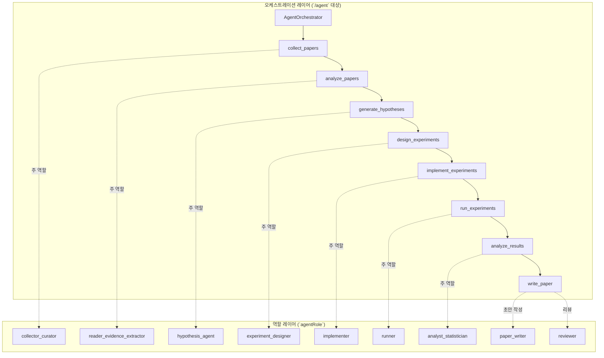
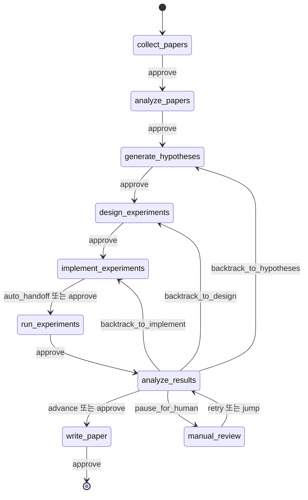
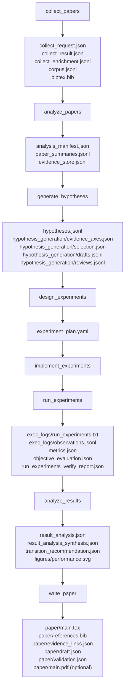
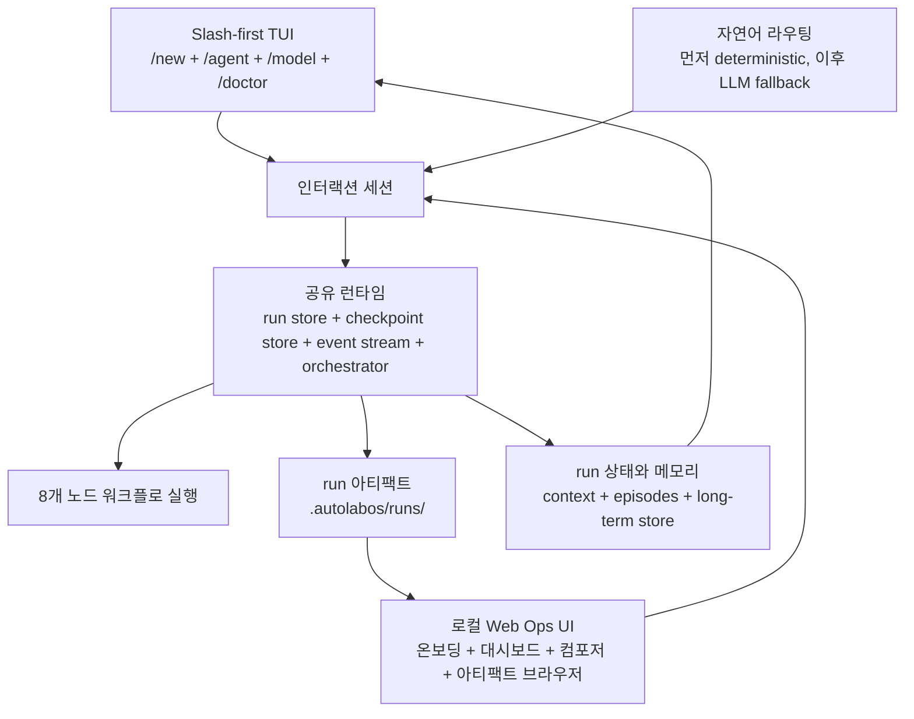
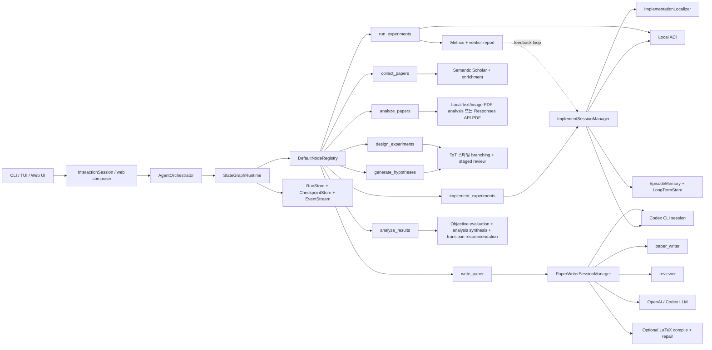

<div align="center">
  <h1>AutoLabOS</h1>
  <p><strong>AI 에이전트 기반 연구 자동화를 위한 slash-first TUI와 로컬 web ops UI</strong></p>
  <p>
    논문 수집과 근거 분석부터 실험 실행, 논문 초안 작성까지 이어지는 흐름을
    워크스페이스 로컬에 머무는 체크포인트 가능한 워크플로로 묶습니다.
  </p>
  <p>
    <a href="./README.md"><strong>English</strong></a>
    ·
    <a href="./README.ko.md"><strong>한국어</strong></a>
  </p>
  <p>
    <a href="https://github.com/lhy0718/AutoLabOS/actions/workflows/smoke.yml">
      
    </a>
    
    
    
    
    
    
  </p>
  <p>
    
    <a href="https://github.com/lhy0718/AutoLabOS/stargazers">
      
    </a>
    <a href="https://github.com/lhy0718/AutoLabOS/commits/main">
      
    </a>
  </p>
</div>

## 왜 AutoLabOS인가?

- `collect_papers`부터 `write_paper`까지 연구 루프를 고정 8단계 상태 그래프로 다룹니다.
- 메인 워크플로는 `codex` 또는 `OpenAI API` 중에서 고를 수 있고, PDF 분석 모드는 별도로 바꿀 수 있습니다.
- 체크포인트, 예산, 재시도, 점프, 런별 메모리를 통해 작업 상태를 로컬에서 추적하고 복구할 수 있습니다.

## 핵심 특징

| 기능 | 제공하는 가치 |
| --- | --- |
| Slash-first TUI | `/new`, `/agent ...`, `/model`, `/settings`, `/doctor` 중심으로 전체 흐름을 조작 |
| 로컬 Web Ops UI | `autolabos web`으로 브라우저 온보딩, 대시보드 제어, 아티팩트, 체크포인트, 라이브 세션 상태를 확인 |
| 결정적 자연어 라우팅 | 자주 쓰는 의도는 LLM fallback 전에 로컬 핸들러나 슬래시 명령으로 우선 처리 |
| 하이브리드 provider | Codex 로그인 기반 흐름과 OpenAI API 기반 흐름을 상황에 맞게 선택 |
| PDF 분석 모드 | 로컬 텍스트 추출 + Codex, 또는 Responses API 직접 분석 중 선택 가능 |
| 연구 실행 패턴 | ReAct, ReWOO, ToT, Reflexion 패턴을 노드 성격에 맞게 사용 |
| 로컬 ACI 실행 | `implement_experiments`, `run_experiments`를 파일/명령/테스트 액션으로 수행 |

## 빠른 시작

> [!IMPORTANT]
> `SEMANTIC_SCHOLAR_API_KEY`는 필수입니다. `OPENAI_API_KEY`는 메인 provider 또는 PDF 분석 모드가 `api`일 때만 필요합니다.

1. 설치 및 빌드

```bash
npm install
npm run build
npm link
```

2. 환경 변수 설정

```bash
cp .env.example .env
echo 'SEMANTIC_SCHOLAR_API_KEY=your_key_here' >> .env
echo 'OPENAI_API_KEY=your_openai_key_here' >> .env
```

3. TUI 실행

```bash
autolabos
```

4. 웹 UI 실행

```bash
autolabos web
```

기본 주소는 `http://127.0.0.1:4317`입니다.
AutoLabOS가 워크스페이스로 사용할 연구 프로젝트 폴더에서 이 명령을 실행하면 됩니다.

저장소 체크아웃으로 사용 중이고 웹 자산이 없다는 메시지가 뜨면, AutoLabOS 패키지 루트에서 웹 번들을 한 번 빌드한 뒤 다시 실행하면 됩니다.

```bash
cd /path/to/AutoLabOS
npm --prefix web run build
autolabos web
```

호스트나 포트를 바꾸려면:

```bash
autolabos web --host 0.0.0.0 --port 8080
```

개발 모드:

```bash
npm run dev
npm run dev:web
```

`npm link` 없이 실행하려면:

```bash
node dist/cli/main.js
node dist/cli/main.js web
```

> [!NOTE]
> 외부 진입 커맨드는 `autolabos`와 `autolabos web`입니다. `autolabos init`은 의도적으로 지원하지 않습니다.

## 첫 실행

1. 빈 프로젝트에서 `autolabos` 또는 `autolabos web`을 실행합니다.
2. `.autolabos/config.yaml`이 없으면 TUI에서는 setup wizard가, 웹에서는 onboarding 폼이 열립니다.
3. 두 흐름 모두 같은 설정과 스캐폴드를 만들고, Semantic Scholar 키를 저장한 뒤 메인 대시보드로 진입합니다.
4. 기본 LLM provider를 선택합니다.
   - `codex`: 메인 워크플로를 Codex ChatGPT 로그인으로 실행 (기본값)
   - `api`: 메인 워크플로를 OpenAI API 모델로 실행 (`OPENAI_API_KEY` 필요)
5. PDF 분석 모드를 선택합니다.
   - `codex`: PDF를 로컬에서 텍스트 추출 후 Codex로 분석 (기본값)
   - `api`: PDF를 Responses API로 직접 전달해 분석 (`OPENAI_API_KEY` 필요)
6. provider 또는 PDF 분석 모드가 `api`이면 setup wizard와 `/settings`에서 모델을 고를 수 있습니다.
   - 현재 내장 카탈로그: `gpt-5.4`, `gpt-5`, `gpt-5-mini`, `gpt-4.1`, `gpt-4o`, `gpt-4o-mini`
7. `/model`은 먼저 사용할 백엔드를 고른 뒤, 그 백엔드에 맞는 슬롯/모델을 선택합니다.
   - Codex CLI backend: Codex 모델 선택기
   - OpenAI API backend: OpenAI API 모델 선택기
8. 실행 시 AutoLabOS는 `process.env` 또는 `.env`의 `SEMANTIC_SCHOLAR_API_KEY`, `OPENAI_API_KEY`를 읽습니다.

## Web Ops UI

`autolabos web`은 TUI와 같은 런타임을 공유하는 로컬 단일 사용자용 브라우저 UI를 실행합니다.

- 온보딩은 같은 비대화형 setup helper를 사용하므로, 웹에서 초기 설정해도 TUI wizard와 동일한 `.autolabos/config.yaml`과 `.env` 값이 생성됩니다.
- 대시보드에서 run 검색/선택, 8개 노드 워크플로 보기, 노드 액션, 라이브 로그, 체크포인트, 아티팩트, 메타데이터, `/doctor` 요약을 확인할 수 있습니다.
- 하단 컴포저는 슬래시 명령과 지원되는 자연어 입력을 모두 받습니다.
- 복합 자연어 실행 계획은 `y/a/n` 대신 `Run next`, `Run all`, `Cancel` 버튼으로 제어합니다.
- 아티팩트 브라우저는 `.autolabos/runs/<run_id>` 범위로 제한되며, 주요 텍스트 파일·이미지·PDF는 inline preview를 제공합니다.

웹 사용 흐름:

1. `autolabos web`으로 서버를 시작합니다.
   관리하려는 연구 프로젝트 폴더에서 실행합니다.
   저장소 체크아웃 환경에서 웹 자산이 없다는 메시지가 나오면 AutoLabOS 패키지 루트에서 `npm --prefix web run build`를 한 번 실행한 뒤 서버를 다시 시작합니다.
2. 브라우저에서 `http://127.0.0.1:4317`을 엽니다.
3. 아직 설정되지 않았다면 onboarding을 완료합니다.
4. run을 만들거나 선택한 뒤 워크플로 카드나 컴포저로 실행을 제어합니다.

## 노드와 에이전트 구조

AutoLabOS에는 이름이 비슷해서 헷갈리기 쉬운 두 레이어가 있습니다.

- 오케스트레이션 레이어: `/agent ...`가 대상으로 삼는 8개 그래프 노드입니다. 코드에서는 `AgentId`가 현재 `GraphNodeId`의 alias입니다.
- 역할 레이어: 각 노드 내부 프롬프트, 이벤트, 세션 매니저에서 쓰는 `agentRole` 정체성입니다. 예를 들면 `implementer`, `runner`, `paper_writer`가 여기에 속합니다.

### 노드와 역할 매핑



### 실행 그래프



기본 `agent_approval` 모드에서는 각 노드가 끝날 때마다 멈춥니다. 예외적으로 `implement_experiments`는 `run_experiments`로 자동 handoff할 수 있고, `analyze_results`는 결과에 따라 그래프를 뒤로 되돌리는 추천을 낼 수 있습니다.

| 그래프 노드 | 주 역할 | 현재 구현 형태 |
| --- | --- | --- |
| `collect_papers` | `collector_curator` | Semantic Scholar 검색, 중복 제거, 보강, BibTeX 생성 |
| `analyze_papers` | `reader_evidence_extractor` | 논문 선택 랭킹과 로컬/Responses API PDF 분석 |
| `generate_hypotheses` | `hypothesis_agent` | evidence-axis -> draft -> review -> selection 단계형 파이프라인 |
| `design_experiments` | `experiment_designer` | 실험 후보 설계 생성과 `experiment_plan.yaml` 선택 |
| `implement_experiments` | `implementer` | `ImplementSessionManager`, localization, Codex 패치, 검증, optional handoff |
| `run_experiments` | `runner` | ACI 기반 preflight/tests/command 실행, metrics 수집, verifier feedback |
| `analyze_results` | `analyst_statistician` | objective 평가, 결과 합성, transition recommendation |
| `write_paper` | `paper_writer`, `reviewer` | `PaperWriterSessionManager`, outline/draft/review/finalize, optional LaTeX repair |

역할 카탈로그와 실제 멀티턴 런타임은 완전히 같은 범위는 아닙니다. 현재 가장 깊게 세션 기반으로 묶여 있는 노드는 `implement_experiments`와 `write_paper`이고, 앞단 노드들은 구조화된 node handler와 역할별 프롬프트/이벤트 중심으로 작동합니다.

### 아티팩트 흐름



모든 run 아티팩트는 `.autolabos/runs/<run_id>/` 아래에 저장되므로, TUI와 로컬 웹 UI 양쪽에서 같은 실행 결과를 추적하고 점검할 수 있습니다.

### 제어 표면



### 구체적인 에이전트 런타임



핵심 소스 영역:

- `src/runtime/createRuntime.ts`: 설정, provider, store, event stream, runtime, orchestrator를 조립
- `src/interaction/*`: TUI와 웹 컴포저가 함께 쓰는 공용 command/session 레이어
- `src/core/stateGraph/*`: 노드 실행, 재시도, 승인, 예산, 점프, 체크포인트 처리
- `src/core/nodes/*`: 8개 워크플로 핸들러와 아티팩트 생성 로직
- `src/integrations/*`, `src/tools/*`: provider 클라이언트, Semantic Scholar 연동, 로컬 실행 어댑터
- `src/web/*`, `web/src/*`: 같은 런타임 위에 얹힌 로컬 HTTP 서버와 브라우저 UI

## 자주 쓰는 명령어

| 명령어 | 설명 |
| --- | --- |
| `/new` | run 생성 |
| `/runs [query]` | run 목록 조회 또는 검색 |
| `/run <run>` | run 선택 |
| `/resume <run>` | run 재개 |
| `/agent collect [query] [options]` | 필터, 정렬, 서지 옵션으로 논문 수집 |
| `/agent run <node> [run]` | 특정 그래프 노드부터 실행 |
| `/agent status [run]` | 노드 상태 조회 |
| `/agent graph [run]` | 그래프 상태 보기 |
| `/agent resume [run] [checkpoint]` | 최신 또는 특정 체크포인트에서 재개 |
| `/agent retry [node] [run]` | 노드 재시도 |
| `/agent jump <node> [run] [--force]` | 노드 점프 |
| `/agent budget [run]` | 예산 사용량 확인 |
| `/model` | 모델 및 reasoning selector 열기 |
| `/settings` | 기본 설정 수정 |
| `/doctor` | 환경 점검 |

자주 쓰는 수집 옵션:

- `--run <run_id>`
- `--limit <n>`
- `--additional <n>`
- `--last-years <n>`
- `--year <spec>`
- `--date-range <start:end>`
- `--sort <relevance|citationCount|publicationDate|paperId>`
- `--order <asc|desc>`
- `--field <csv>`
- `--venue <csv>`
- `--type <csv>`
- `--min-citations <n>`
- `--open-access`
- `--bibtex <generated|s2|hybrid>`
- `--dry-run`

예시:

- `/agent collect --last-years 5 --sort relevance --limit 100`
- `/agent collect "agent planning" --sort citationCount --order desc --min-citations 100`
- `/agent collect --additional 200 --run <run_id>`

## 자연어 제어

AutoLabOS는 모든 문장을 규칙으로 처리하려고 하지 않습니다. 대신 지원하는 deterministic intent family를 정의하고, 이 범위는 로컬 핸들러나 슬래시 명령으로 우선 처리한 뒤 나머지는 workspace 기반 LLM으로 넘깁니다.

TUI 안에서 아래처럼 입력하면 현재 지원 목록을 확인할 수 있습니다.

- `지원되는 자연어 입력을 보여줘`
- `what natural inputs are supported?`

대표 예시:

- `새 run 시작해줘`
- `최근 5년 관련도 순으로 100개 수집해줘`
- `현재 상태 보여줘`
- `collect_papers로 돌아가줘`
- `논문 몇 개 모였어?`

복합 자연어 실행 계획은 단계별로 멈춥니다.

- `y`: 다음 step 1개만 실행
- `a`: 남은 step을 더 멈추지 않고 모두 실행
- `n`: 남은 계획 취소

구현 위치:

- deterministic 라우팅: [src/core/commands/naturalDeterministic.ts](./src/core/commands/naturalDeterministic.ts)
- 상태 / 다음 단계 로컬 응답: [src/core/commands/naturalAssistant.ts](./src/core/commands/naturalAssistant.ts)

<details>
<summary>전체 슬래시 명령어 목록</summary>

| 명령어 | 설명 |
| --- | --- |
| `/help` | 명령 목록 표시 |
| `/new` | run 생성 |
| `/doctor` | 환경 점검 |
| `/runs [query]` | run 목록/검색 |
| `/run <run>` | run 선택 |
| `/resume <run>` | run 재개 |
| `/agent list` | 그래프 노드 목록 |
| `/agent run <node> [run]` | 노드 실행 |
| `/agent status [run]` | 노드 상태 조회 |
| `/agent collect [query] [options]` | 필터/정렬 옵션으로 논문 수집 |
| `/agent recollect <n> [run]` | 추가 수집용 하위 호환 alias |
| `/agent focus <node>` | safe jump로 노드 포커스 이동 |
| `/agent graph [run]` | 그래프 상태 출력 |
| `/agent resume [run] [checkpoint]` | 최신/특정 체크포인트 재개 |
| `/agent retry [node] [run]` | 노드 재시도 |
| `/agent jump <node> [run] [--force]` | 노드 점프 |
| `/agent budget [run]` | 예산 사용량 조회 |
| `/model` | 화살표 선택기로 모델/effort 선택 |
| `/approve` | 현재 노드 승인 |
| `/retry` | 현재 노드 재시도 |
| `/settings` | 기본 설정 수정 |
| `/quit` | 종료 |

</details>

<details>
<summary>지원하는 자연어 입력 범주</summary>

1. 도움말 / 설정 / 모델 / 환경 점검 / 종료
   - 예: `도움말 보여줘`, `모델 선택기 열어줘`, `환경 점검해줘`
2. run 라이프사이클
   - 예: `새 run 시작해줘`, `run 목록 보여줘`, `alpha run 열어줘`, `이전 run 재개해줘`
3. run title 변경
   - 예: `run title을 Multi-agent collaboration으로 바꿔줘`
4. 워크플로 구조 / 현재 상태 / 다음 단계
   - 예: `현재 상태 보여줘`, `다음에 뭐 해야 해?`, `워크플로 구조 알려줘`
5. 논문 수집
   - 예: `최근 5년 관련도 순으로 100개 수집해줘`
   - 예: `오픈액세스 리뷰 논문 50개 수집해줘`
   - 예: `논문 200개 더 수집해줘`
   - 예: `기존 논문을 지우고 새 논문 100개 다시 수집해줘`
6. 노드 제어
   - 예: `collect_papers로 이동해줘`, `가설 노드 다시 실행해줘`, `implement_experiments에 집중해줘`
7. 그래프 / 예산 / 승인
   - 예: `그래프 보여줘`, `예산 상태 보여줘`, `현재 노드 승인해줘`, `현재 노드 재시도해줘`
8. 수집된 논문 직접 질의
   - 예: `논문 몇 개 모았어?`
   - 예: `pdf 경로가 없는 논문이 몇 개야?`
   - 예: `citation이 가장 높은 논문이 뭐야?`
   - 예: `논문 제목 3개 보여줘`

</details>

<details>
<summary>런타임 기본값, 저장 구조, 실행 디테일</summary>

### 상태 그래프

고정 그래프 노드:

1. `collect_papers`
2. `analyze_papers`
3. `generate_hypotheses`
4. `design_experiments`
5. `implement_experiments`
6. `run_experiments`
7. `analyze_results`
8. `write_paper`

### 런타임 정책

- 체크포인트: `.autolabos/runs/<run_id>/checkpoints/`
- 체크포인트 phase: `before | after | fail | jump | retry`
- 재시도 정책: `maxAttemptsPerNode=3`
- 자동 롤백 정책: `maxAutoRollbacksPerNode=2`
- 점프 모드:
  - `safe`: 현재 또는 이전 노드만 허용
  - `force`: 미래 노드 점프 허용, 건너뛴 노드는 기록
- 예산 정책:
  - `maxToolCalls=150`
  - `maxWallClockMinutes=240`
  - `maxUsd=15` (provider 비용을 모르면 soft-check)

### 에이전트 실행 패턴

- ReAct 루프: `PLAN_CREATED -> TOOL_CALLED -> OBS_RECEIVED`
- ReWOO 분리(Planner/Worker): 고비용 노드 중심
- ToT(Tree-of-Thoughts): 가설/설계 노드에서 사용
- Reflexion: 실패 episode를 저장해 재시도 시 재활용

### 메모리 계층

- Run context memory: run 단기 상태
- Long-term store: JSONL 기반 요약/색인 히스토리
- Episode memory: Reflexion 실패 학습

### ACI (Agent-Computer Interface)

표준 액션:

- `read_file`
- `write_file`
- `apply_patch`
- `run_command`
- `run_tests`
- `tail_logs`

`implement_experiments`, `run_experiments` 노드는 ACI를 통해 실행됩니다.

### 명령 팔레트

- `/` 입력: 명령 목록 열기
- `Tab`: 자동완성
- `↑/↓`: 후보 이동
- `Enter`: 실행
- run 제안 항목은 `run_id + title + current_node + status + 상대 시간`을 표시
- 입력이 비어 있으면 현재 상태 기준의 다음 액션, 정확한 명령어, 자연어 예시를 함께 표시
- 다음 액션 패널은 이제 실행, 상태, 그래프, 예산, 산출물 개수, 점프, 자연어 질문까지 더 넓게 보여줍니다
- 이 안내는 최근 사용자 입력이나 OS 로케일에 맞춰 한/영으로 바뀌며, 빈 입력에서 `Tab`을 누르면 첫 추천 액션이 바로 채워집니다

### Run 메타데이터

`runs.json` 주요 필드:

- `version: 3`
- `workflowVersion: 3`
- `currentNode`
- `graph` (`RunGraphState`)
- `nodeThreads` (`Partial<Record<GraphNodeId, string>>`)
- `memoryRefs` (`runContextPath`, `longTermPath`, `episodePath`)

기존 run 데이터는 로드시 자동으로 v3로 마이그레이션됩니다.

### 생성 경로

- `.autolabos/config.yaml`
- `.autolabos/runs/runs.json`
- `.autolabos/runs/<run_id>/checkpoints/*`
- `.autolabos/runs/<run_id>/memory/*`
- `.autolabos/runs/<run_id>/paper/*`

</details>

## 개발

```bash
npm run build
npm test
npm run test:smoke:all
npm run test:smoke:natural-collect
npm run test:smoke:natural-collect-execute
npm run test:smoke:ci
```

스모크 테스트 안내:

- smoke harness 파일은 `tests/smoke/` 아래에 있습니다.
- 수동 실행용 예시 workspace는 `/test` 아래에 있습니다.
- smoke는 루트 `/test` 상태를 덮어쓰지 않도록 `/test/smoke-workspace`를 별도 workspace로 사용합니다.
- `test:smoke:natural-collect`는 자연어 수집 요청 -> pending `/agent collect ...` 생성 흐름을 검증합니다.
- `test:smoke:natural-collect-execute`는 자연어 수집 요청 -> `y` 실행 -> 수집 산출물 생성 흐름을 검증합니다.
- `test:smoke:all`은 `/test/smoke-workspace` 기준 전체 로컬 smoke 묶음을 실행합니다.
- 실제 Codex 호출 없이 `AUTOLABOS_FAKE_CODEX_RESPONSE`를 사용합니다.
- execute smoke는 `AUTOLABOS_FAKE_SEMANTIC_SCHOLAR_RESPONSE`도 사용합니다.
- `test:smoke:ci`는 CI 모드 smoke 선택 실행입니다.
  - 기본 모드: `pending`
  - 추가 모드: `execute`, `composite`, `composite-all`, `llm-composite`, `llm-composite-all`, `llm-replan`
  - CI에서 `AUTOLABOS_SMOKE_MODE=<mode>` 또는 `AUTOLABOS_SMOKE_MODE=all`로 시나리오를 전환할 수 있습니다.
- smoke 출력은 기본적으로 조용하며, 전체 PTY 로그가 필요하면 `AUTOLABOS_SMOKE_VERBOSE=1`을 사용합니다.
