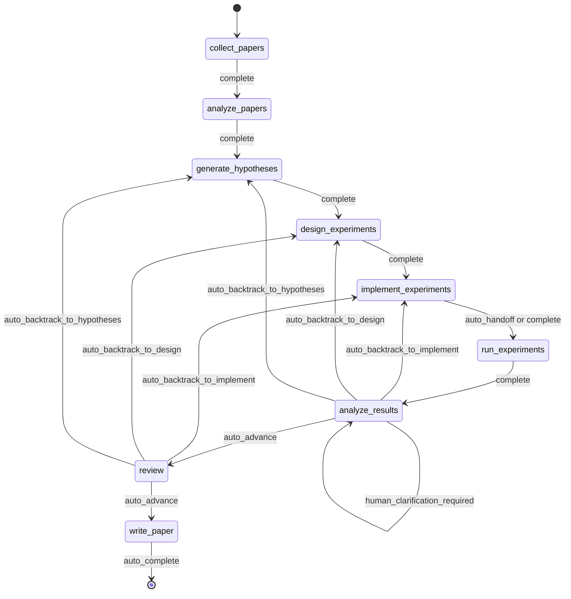
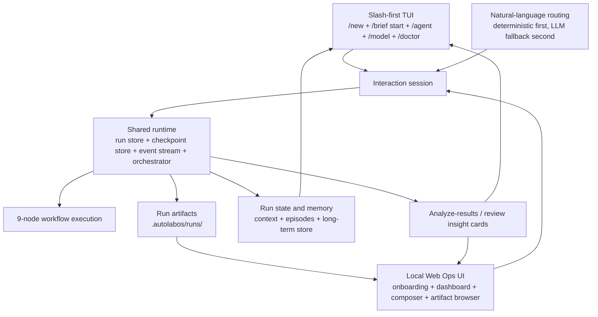
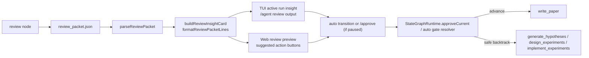
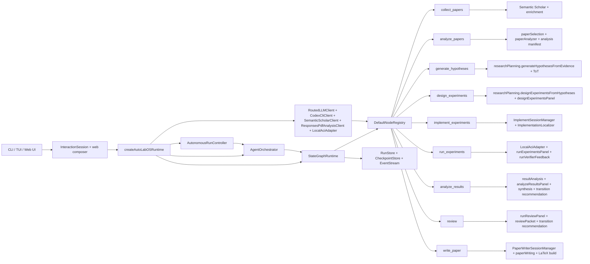

<div align="center">
  <h1>AutoLabOS</h1>
  <p><strong>AI-agent-driven research automation with a slash-first TUI and local web ops UI.</strong></p>
  <p>
    Move from paper collection and evidence analysis to experiment execution and
    paper drafting with a checkpointed, inspectable workflow that stays local to
    your workspace.
  </p>
  <p>
    <a href="./README.md"><strong>English</strong></a>
    ·
    <a href="./README.ko.md"><strong>한국어</strong></a>
  </p>
  <p>
    <a href="https://github.com/lhy0718/AutoLabOS/actions/workflows/smoke.yml">
      
    </a>
    
    
    
    
    
    
  </p>
  <p>
    
    <a href="https://github.com/lhy0718/AutoLabOS/stargazers">
      
    </a>
    <a href="https://github.com/lhy0718/AutoLabOS/commits/main">
      
    </a>
  </p>
</div>

## Why AutoLabOS?

- Turn the research loop into a fixed 9-node state graph from `collect_papers` to `write_paper`, with an explicit `review` stage before drafting.
- Run the main workflow with either `codex` or `OpenAI API`, then switch PDF analysis independently.
- Keep work local and inspectable with checkpoints, budgets, retries, jumps, and run-scoped memory.

## Highlights

| Capability | What it gives you |
| --- | --- |
| Slash-first TUI | Create a brief with `/new`, launch it with `/brief start`, then steer the run with `/agent ...`, `/model`, `/settings`, and `/doctor` |
| Local Web Ops UI | Run `autolabos web` for onboarding, dashboard controls, artifacts, checkpoints, and live session state in the browser |
| Deterministic natural-language routing | Common intents map to local handlers or slash commands before LLM fallback |
| Hybrid provider model | Default to Codex login for the primary flow, or move to OpenAI API models when you want explicit API-backed execution |
| PDF analysis modes | Default to local extraction + Codex hybrid PDF analysis, or send PDFs directly to the Responses API when needed |
| Research runtime patterns | ReAct, ReWOO, ToT, and Reflexion are used where they make sense |
| Local ACI execution | `implement_experiments` and `run_experiments` execute through file, command, and test actions |

## Start Here

- If this is your first time, start with `autolabos web`. It gives you guided onboarding, the dashboard, logs, checkpoints, and artifact browsing in one place.
- Use `autolabos` when you prefer a terminal-first loop with slash commands.
- Run either command from the research project directory you want AutoLabOS to manage. Workspace state lives under `.autolabos/`.

## What You Need

| Item | When it is needed | Notes |
| --- | --- | --- |
| `SEMANTIC_SCHOLAR_API_KEY` | Always | Required for paper discovery and metadata lookup |
| `OPENAI_API_KEY` | Only when the primary provider or PDF mode is `api` | Used for OpenAI API model execution |
| Codex CLI login | Only when the primary provider or PDF mode is `codex` | AutoLabOS uses your local Codex session |

## Quick Start

1. Install and build AutoLabOS.

```bash
npm install
npm run build
npm link
```

2. Move into the research project directory you want to use as the workspace.

```bash
cd /path/to/your-research-project
```

3. Start the recommended browser workflow.

```bash
autolabos web
```

The web server listens on `http://127.0.0.1:4317` by default. Use `autolabos` instead if you want the TUI first.

4. Finish onboarding. If `.autolabos/config.yaml` does not exist yet, the web app opens onboarding and the TUI opens the setup wizard. Both flows write the same workspace scaffold and config.

5. Confirm the first run worked. You should now have `.autolabos/config.yaml`, a configured workspace, and either the dashboard or the TUI home screen ready for a run.

6. In the TUI, create a Markdown brief with `/new`, then start it with `/brief start --latest`. In the web UI, you can still start from structured fields, a natural-language brief, or the workflow cards.

## What Happens On First Run

- AutoLabOS stores workspace config in `.autolabos/config.yaml` and reads `SEMANTIC_SCHOLAR_API_KEY` and `OPENAI_API_KEY` from `process.env` or `.env`.
- The TUI first-run wizard is model-focused: choose the primary provider, model slots, reasoning defaults, PDF mode, and an OpenAI API key only when `api` is involved.
- The workspace folder name becomes `project_name` automatically in the TUI flow, and the TUI does not create a run until you explicitly start a research brief.
- Choose the primary LLM provider: `codex` uses your local Codex session, while `api` uses OpenAI API models.
- Choose the PDF analysis mode separately: `codex` keeps PDF extraction local before analysis, while `api` sends the PDF to the Responses API.
- If the primary provider or PDF mode is `api`, onboarding and `/settings` let you choose the OpenAI model.
- `/model` lets you switch the active backend first, then choose the slot and model later.

## TUI Brief-First Flow

- `/new` creates a Markdown template under `.autolabos/briefs/<timestamp>-<slug>.md`.
- If `$EDITOR` or `$VISUAL` is set, AutoLabOS opens the brief there, validates the required sections, and asks once whether it should start the run now.
- `/brief start <path>` or `/brief start --latest` snapshots the brief into `.autolabos/runs/<run_id>/brief/source_brief.md`, extracts `topic`, `objective metric`, `constraints`, and `plan`, then auto-starts from `collect_papers`.
- The generated template uses these sections: `# Research Brief`, `## Topic`, `## Objective Metric`, `## Constraints`, `## Plan`, plus optional `## Notes` and `## Questions / Risks`.
- Natural-language run creation still works, but the recommended TUI path is file-first so the research brief stays editable and inspectable outside the terminal.

## Common First-Run Fixes

- If a repository checkout says the installed web assets are missing, build them once from the AutoLabOS package root with `npm --prefix web run build`, then restart `autolabos web`.
- If you do not want `npm link`, you can still run `node dist/cli/main.js` or `node dist/cli/main.js web` from the AutoLabOS repository root.
- If you need a different bind address or port, run `autolabos web --host 0.0.0.0 --port 8080`.
- For local development, use `npm run dev` and `npm run dev:web`.

## Web Ops UI

`autolabos web` starts a local single-user browser UI on top of the same runtime used by the TUI.

- Onboarding uses the same non-interactive setup helper, so web setup writes the same `.autolabos/config.yaml` and `.env` values as the TUI wizard.
- The dashboard includes run search and selection, the 9-node workflow view, node actions, live logs, checkpoints, artifacts, metadata, and `/doctor` summaries.
- The bottom composer accepts both slash commands and supported natural-language requests.
- New runs can start from either the structured form fields or a single natural-language research brief. The brief parser extracts topic, objective metric, constraints, and a short plan hint, then can auto-start the run from `collect_papers`.
- Multi-step natural-language plans use browser buttons instead of `y/a/n`: `Run next`, `Run all`, and `Cancel`.
- Artifact browsing is restricted to `.autolabos/runs/<run_id>` and previews common text files, images, and PDFs inline.

Typical web flow:

1. Start the server with `autolabos web`.
   Run this from the project directory you want to manage.
   If you see a missing web assets message while using a repository checkout, build once from the AutoLabOS package root with `npm --prefix web run build`, then restart the server.
2. Open `http://127.0.0.1:4317`.
3. Complete onboarding if the workspace is not configured yet.
4. Create or select a run, then use the workflow cards or composer to drive execution.

## Node and Agent Structure

AutoLabOS has two layers that are easy to conflate:

- Orchestration layer: `/agent ...` targets the 9 graph nodes. In code, `AgentId` is currently an alias of `GraphNodeId`.
- Role layer: nodes emit or run exported `agentRole` identities such as `implementer`, `runner`, `paper_writer`, and `reviewer`.
- Some nodes also fan out into node-internal personas or deterministic controllers. Prompt-heavy examples are the evidence synthesizer plus skeptical reviewer inside `generate_hypotheses` and the 5-specialist panel inside `review`; deterministic panel/controller examples now include `design_experiments`, `run_experiments`, and `analyze_results`.

### Node-to-Role Map

```mermaid
flowchart TB
    subgraph Orchestration["Orchestration layer (`/agent` targets, 9 nodes)"]
        O["AgentOrchestrator + StateGraphRuntime"]
        N1["collect_papers"]
        N2["analyze_papers"]
        N3["generate_hypotheses"]
        N4["design_experiments"]
        N5["implement_experiments"]
        N6["run_experiments"]
        N7["analyze_results"]
        N8["review"]
        N9["write_paper"]

        O --> N1 --> N2 --> N3 --> N4 --> N5 --> N6 --> N7 --> N8 --> N9
    end

    subgraph Roles["Exported role layer (`agentRole`)"]
        R1["collector_curator"]
        R2["reader_evidence_extractor"]
        R3["hypothesis_agent"]
        R4["experiment_designer"]
        R5["implementer"]
        R6["runner"]
        R7["analyst_statistician"]
        R8["paper_writer"]
        R9["reviewer"]
    end

    subgraph Internal["Node-internal personas and controllers"]
        P1["evidence synthesizer"]
        P2["skeptical reviewer"]
        P3["feasibility reviewer"]
        P4["statistical reviewer"]
        P5["ops-budget planner"]
        P6["trial manager"]
        P7["failure triager"]
        P8["resource/log watchdog"]
        P9["rerun planner"]
        P10["metric auditor"]
        P11["robustness reviewer"]
        P12["confounder detector"]
        P13["decision calibrator"]
        P14["claim verifier"]
        P15["methodology reviewer"]
        P16["statistics reviewer"]
        P17["writing readiness reviewer"]
        P18["integrity reviewer"]
    end

    N1 -. primary role .-> R1
    N2 -. primary role .-> R2
    N3 -. primary role .-> R3
    N3 -. synthesis .-> P1
    N3 -. critique .-> P2
    N4 -. primary role .-> R4
    N4 -. selection panel .-> P3
    N4 -. selection panel .-> P4
    N4 -. selection panel .-> P5
    N5 -. primary role .-> R5
    N6 -. primary role .-> R6
    N6 -. execution controller .-> P6
    N6 -. execution controller .-> P7
    N6 -. execution controller .-> P8
    N6 -. execution controller .-> P9
    N7 -. primary role .-> R7
    N7 -. result panel .-> P10
    N7 -. result panel .-> P11
    N7 -. result panel .-> P12
    N7 -. result panel .-> P13
    N8 -. panel role .-> R9
    N8 -. specialist .-> P14
    N8 -. specialist .-> P15
    N8 -. specialist .-> P16
    N8 -. specialist .-> P17
    N8 -. specialist .-> P18
    N9 -. drafting .-> R8
    N9 -. critique .-> R9
```



### Execution Graph



The top-level workflow remains a fixed 9-node graph. Recent automation work lives inside bounded node-internal loops so we do not add extra top-level nodes for evidence-window expansion, supplemental experiment profiles, objective grounding retries, or paper-draft repair.

### Execution Controls

| Layer | Setting or command | Default | What it does | When a human steps in |
| --- | --- | --- | --- | --- |
| Workflow mode | `agent_approval` | Fixed | Runs the full 9-node research graph from collection to paper writing | Not a pause setting by itself |
| Approval mode | `workflow.approval_mode: minimal` | Yes | Auto-approves ordinary completion gates and auto-applies safe transition recommendations, including review outcomes | Pauses when a recommendation is `pause_for_human` or `autoExecutable=false` |
| Approval mode | `workflow.approval_mode: manual` | Optional | Pauses at every approval boundary instead of auto-resolving it | Use `/approve`, `/agent apply`, or `/agent jump` to continue |
| Autonomy preset | `/agent overnight` | On demand | Runs the current run unattended with a conservative overnight policy layered on top of the workflow | Stops before `write_paper`, on low-confidence or disallowed backtracks, repeated recommendations, time limit, or manual-only recommendations |
| TUI supervisor | Interactive run supervisor | Default in `autolabos` | Keeps a run moving in `minimal` mode, restores pending questions after restart, and only hands control back when a real human answer is needed | Captures the answer in the TUI, applies the configured resume action, then continues the run automatically |

### Human Intervention Triggers

| Where | Condition | What happens |
| --- | --- | --- |
| `analyze_results` | The objective metric still cannot be grounded to a concrete numeric signal after best-effort rematching | The TUI asks which metric or success criterion to use, stores the answer, retries `analyze_results`, and then resumes automatic execution |
| `analyze_results` | A hypothesis reset is recommended, but confidence is too low for `autoExecutable=true` | The TUI presents explicit next-step choices, applies the selected transition or jump, and then resumes automatic execution |
| Any node in `manual` approval mode | The node reaches an approval boundary | The run waits for `/approve`, `/agent apply`, or another explicit operator choice |
| `/agent overnight` | The run reaches `write_paper`, hits a low-confidence or disallowed recommendation, repeats the same recommendation too many times, or reaches the overnight time budget | Overnight stops and hands control back to the operator |

In the default setup, review outcomes auto-apply into `write_paper` or one of the supported backtracks. Review is no longer a dedicated manual hold in `minimal` mode.

### Bounded Automation and Internal Panels

| Node | Internal automation | Trigger | Bound or output |
| --- | --- | --- | --- |
| `analyze_papers` | Expands a fresh `top_n` selection and reuses manifest-backed completed analyses | The initial selected window is too sparse to ground hypotheses well | At most 2 auto-expansions |
| `design_experiments` | Scores generated candidates with a deterministic `designer / feasibility / statistical / ops-budget` panel | Candidate designs are available from `designExperimentsFromHypotheses(...)` | Always runs once per design execution and emits internal `design_experiments_panel/*` artifacts |
| `run_experiments` | Builds an execution plan, classifies failures, and applies a one-shot transient rerun policy | The primary run command has been resolved | Never retries policy blocks, missing metrics, or invalid metrics; retries only one transient command failure |
| `run_experiments` | Chains managed `standard -> quick_check -> confirmatory` profiles | A managed `real_execution` bundle completes the standard run with an observed/met objective | Supplemental runs are best effort and do not overturn a successful primary run |
| `analyze_results` | Re-tries objective grounding with best-effort metric rematching, then calibrates confidence with a deterministic result panel | Cached or fresh objective evaluation comes back `missing` or `unknown`, or a transition recommendation must be finalized | One bounded rematch before any human clarification pause, plus internal `analyze_results_panel/*` artifacts |
| `write_paper` | Runs a bounded related-work scout with a small query planner and coverage auditor before drafting when literature coverage is thin | The validated writing bundle has too few analyzed papers/corpus entries, or review context flags citation gaps | Best-effort Semantic Scholar scout under `paper/related_work_scout/*`; planned queries stop early once coverage is good enough, and results are merged into the in-memory writing bundle only |
| `write_paper` | Runs a validation-aware repair pass, then re-validates | Draft validation reports repairable borrowed grounding warnings | One extra repair pass, adopted only when warning count does not increase |

### Phase-by-Phase Connection Graphs

```mermaid
flowchart LR
    Topic["run topic + collect constraints"] --> CP["collect_papers"]
    CP --> CC["collector_curator"]
    CC --> SS["Semantic Scholar search"]
    SS --> Enrich["enrichment + BibTeX recovery"]
    Enrich --> Corpus["corpus.jsonl + bibtex.bib"]

    Corpus --> AP["analyze_papers"]
    AP --> Select["selection request + hybrid rerank"]
    Select --> Manifest["analysis_manifest resume / prune"]
    Manifest --> RE["reader_evidence_extractor"]
    RE --> Pdf["local text/image analysis or Responses API PDF"]
    Pdf --> ReviewLoop["extractor -> reviewer normalization"]
    ReviewLoop --> Evidence["paper_summaries.jsonl + evidence_store.jsonl"]
```

The four focused graphs below cover the full 9-node pipeline and show which role or session manager is actually doing the work inside each phase.

#### Discovery and Reading



#### Hypothesis and Experiment Design

```mermaid
flowchart LR
    Evidence["paper_summaries.jsonl + evidence_store.jsonl"] --> GH["generate_hypotheses"]
    GH --> HA["hypothesis_agent"]
    HA --> Axes["evidence synthesizer -> evidence axes"]
    Axes --> ToT["ToT branch expansion"]
    ToT --> Drafts["mechanism / contradiction / intervention drafts"]
    Drafts --> Reviews["skeptical reviewer"]
    Reviews --> Select["diversity + evidence-quality top-k selection"]
    Select --> Hyp["hypotheses.jsonl + axes/reviews/llm_trace"]

    Hyp --> DE["design_experiments"]
    DE --> ED["experiment_designer"]
    ED --> Profiles["constraint profile + objective metric profile"]
    Profiles --> Plans["design candidates"]
    Plans --> Panel["designer + feasibility + statistical + ops-budget panel"]
    Panel --> Choice["panel selection"]
    Choice --> Bundle{"supports managed real_execution bundle?"}
    Bundle -->|yes| Managed["bundle sections + runnable profiles"]
    Bundle -->|no| Plain["plain experiment plan"]
    Managed --> PlanYaml["experiment_plan.yaml"]
    Plain --> PlanYaml
```



#### Implementation, Execution, and Result Loop

```mermaid
flowchart LR
    PlanYaml["experiment_plan.yaml"] --> IE["implement_experiments"]
    IE --> IM["ImplementSessionManager"]
    IM --> Impl["implementer"]
    IM --> Localizer["ImplementationLocalizer + branch planning"]
    IM --> Codex["Codex CLI session"]
    IM --> Memory["EpisodeMemory + LongTermStore"]
    Codex --> VerifyPatch["local verification + verify reports"]
    VerifyPatch --> Handoff{"auto handoff?"}

    Handoff -->|yes| RX["run_experiments"]
    Handoff -->|no| Gate["approval boundary<br/>minimal auto-resolves"]
    Gate --> RX

    RX --> Runner["runner"]
    Runner --> Trial["trial manager"]
    Trial --> ACI["Local ACI preflight/tests/command execution"]
    ACI --> Triage["failure triager + rerun planner"]
    Triage -->|retry once if transient| ACI
    ACI --> Watchdog["resource/log watchdog"]
    Watchdog --> Profiles["managed standard -> quick_check -> confirmatory"]
    Profiles --> Metrics["metrics.json + supplemental runs + run_verifier_feedback"]
    Metrics -. runner feedback .-> IM
    Metrics --> AR["analyze_results"]
    AR --> Analyst["analyst_statistician"]
    Analyst --> Ground["best-effort metric rematch"]
    Ground --> ResultPanel["metric auditor + robustness reviewer + confounder detector + decision calibrator"]
    ResultPanel --> Synth["objective evaluation + synthesis + transition recommendation"]

    Synth -->|advance| RV["review"]
    Synth -->|backtrack_to_implement| IE
    Synth -->|backtrack_to_design| DE["design_experiments"]
    Synth -->|backtrack_to_hypotheses| GH["generate_hypotheses"]
```



#### Review, Writing, and Surfacing

```mermaid
flowchart LR
    Inputs["result_analysis + corpus + evidence + hypotheses + experiment_plan"] --> RV["review"]
    RV --> Panel["runReviewPanel"]
    Panel --> Claim["claim verifier"]
    Panel --> Method["methodology reviewer"]
    Panel --> Stats["statistics reviewer"]
    Panel --> Ready["writing readiness reviewer"]
    Panel --> Integrity["integrity reviewer"]
    Panel --> Score["scorecard + consistency + bias"]
    Panel --> Decision["decision + revision_plan"]
    Score --> Packet["review_packet.json + checklist.md"]
    Decision --> Packet
    Packet --> Insight["review insight + suggested actions"]
    Insight --> Gate{"resolve review outcome"}

    Gate -->|advance| WP["write_paper"]
    Gate -->|backtrack_to_hypotheses| GH["generate_hypotheses"]
    Gate -->|backtrack_to_design| DE["design_experiments"]
    Gate -->|backtrack_to_implement| IE["implement_experiments"]

    WP --> PWM["PaperWriterSessionManager"]
    PWM --> Mode["Codex session or staged LLM"]
    Mode --> Writer["paper_writer"]
    Mode --> Reviewer["reviewer"]
    Writer --> Outline["outline"]
    Outline --> Draft["draft"]
    Draft --> Review["review critique"]
    Review --> Final["finalize"]
    Final --> Validate["draft validation"]
    Validate --> Repair{"repairable borrowed warnings?"}
    Repair -->|yes| Revise["validation-aware repair (1 pass max)"]
    Revise --> Revalidate["re-validate"]
    Repair -->|no| Tex["paper/main.tex + references.bib + evidence_links.json"]
    Revalidate --> Tex
    Tex --> Build{"PDF build enabled?"}
    Build -->|yes| Latex["LaTeX compile + optional repair"]
    Build -->|no| Done["LaTeX artifacts only"]
    Latex --> Pdf["paper/main.pdf (optional)"]
```



| Graph node | Primary role(s) | Current implementation shape |
| --- | --- | --- |
| `collect_papers` | `collector_curator` | Semantic Scholar search, de-duplication, enrichment, and BibTeX generation |
| `analyze_papers` | `reader_evidence_extractor` | ranked paper selection plus resumable planner -> extractor -> reviewer analysis over local or Responses API PDF inputs, with bounded top-N auto-expansion when evidence is too thin |
| `generate_hypotheses` | `hypothesis_agent` | evidence-axis synthesis, ToT branching, skeptical review, and diversity-aware top-k selection |
| `design_experiments` | `experiment_designer` | candidate design generation plus deterministic `designer / feasibility / statistical / ops-budget` panel selection before writing `experiment_plan.yaml` |
| `implement_experiments` | `implementer` | `ImplementSessionManager`, localization, Codex patching, verification, and optional handoff |
| `run_experiments` | `runner` | ACI preflight/tests/command execution, execution-plan + triage + watchdog control, one-shot transient rerun, managed supplemental profile chaining, and verifier feedback |
| `analyze_results` | `analyst_statistician` | objective evaluation with best-effort metric rematching, deterministic result-panel calibration, result synthesis, and transition recommendation |
| `review` | `reviewer` | `runReviewPanel`, 5 specialist reviewers, heuristic+LLM refinement, review packet generation, and transition recommendation |
| `write_paper` | `paper_writer`, `reviewer` | `PaperWriterSessionManager`, bounded related-work scout, outline/draft/review/finalize stages, validation-aware repair, and optional LaTeX repair |

The role catalog is broader than the concrete runtime wiring. The deepest multi-turn session managers are still `implement_experiments` and `write_paper`, `review` remains the most LLM-panelized node, and `generate_hypotheses` still fans out into evidence-synthesis and skeptical-review prompts. The newer mid-pipeline reinforcements in `design_experiments`, `run_experiments`, and `analyze_results` are intentionally node-local deterministic panels/controllers that write internal artifacts without changing top-level graph roles or operator surfaces.

### Artifact Flow

```mermaid
flowchart TB
    A["collect_papers"] --> A1["collect_request.json<br/>collect_result.json<br/>collect_enrichment.jsonl<br/>corpus.jsonl<br/>bibtex.bib"]
    A1 --> B["analyze_papers"]
    B --> B1["analysis_manifest.json<br/>paper_summaries.jsonl<br/>evidence_store.jsonl"]
    B1 --> C["generate_hypotheses"]
    C --> C1["hypotheses.jsonl<br/>hypothesis_generation/evidence_axes.json<br/>hypothesis_generation/selection.json<br/>hypothesis_generation/drafts.jsonl<br/>hypothesis_generation/reviews.jsonl"]
    C1 --> D["design_experiments"]
    D --> D1["experiment_plan.yaml<br/>design_experiments_panel/candidates.json<br/>design_experiments_panel/reviews.json<br/>design_experiments_panel/selection.json"]
    D1 --> E["implement_experiments"]
    E --> F["run_experiments"]
    F --> F1["exec_logs/run_experiments.txt<br/>exec_logs/observations.jsonl<br/>metrics.json<br/>objective_evaluation.json<br/>run_experiments_supplemental_runs.json (optional)<br/>run_experiments_verify_report.json<br/>run_experiments_panel/execution_plan.json<br/>run_experiments_panel/triage.json<br/>run_experiments_panel/rerun_decision.json"]
    F1 --> G["analyze_results"]
    G --> G1["result_analysis.json<br/>result_analysis_synthesis.json<br/>transition_recommendation.json<br/>figures/performance.svg<br/>analyze_results_panel/inputs.json<br/>analyze_results_panel/reviews.json<br/>analyze_results_panel/scorecard.json<br/>analyze_results_panel/decision.json"]
    G1 --> H["review"]
    H --> H1["review/findings.jsonl<br/>review/scorecard.json<br/>review/consistency_report.json<br/>review/bias_report.json<br/>review/revision_plan.json<br/>review/decision.json<br/>review/review_packet.json<br/>review/checklist.md"]
    H1 --> I["write_paper"]
    I --> I1["paper/main.tex<br/>paper/references.bib<br/>paper/evidence_links.json<br/>paper/draft.json<br/>paper/validation.json<br/>paper/validation_repair_report.json<br/>paper/related_work_scout/* (optional)<br/>paper/main.pdf (optional)"]
```



All run artifacts live under `.autolabos/runs/<run_id>/`, which makes the pipeline inspectable from both the TUI and the local web UI.

`analyze_papers` uses `analysis_manifest.json` to resume unfinished work. If the selected paper set changes, the analysis configuration changes, or `paper_summaries.jsonl` / `evidence_store.jsonl` drift out of sync with the manifest, AutoLabOS prunes stale rows and re-queues only the affected papers before downstream nodes continue.

The new mid-pipeline reinforcements are internal-only in v1: `design_experiments` writes `design_experiments_panel/*`, `run_experiments` writes `run_experiments_panel/*`, and `analyze_results` writes `analyze_results_panel/*`. The corresponding run-context memory keys are `design_experiments.panel_selection`, `run_experiments.triage`, and `analyze_results.panel_decision`.

Managed `run_experiments` runs may also emit `run_experiments_supplemental_runs.json` when the runtime automatically follows a successful standard run with `quick_check` and `confirmatory` profiles. `write_paper` may emit `paper/related_work_scout/*` when it performs a bounded related-work scout with planned query variants and a coverage audit, and it emits `validation_repair_report.json` plus `validation_repair.*` artifacts when the bounded repair loop actually runs.

When a run starts from the TUI brief flow, AutoLabOS snapshots the source Markdown brief to `.autolabos/runs/<run_id>/brief/source_brief.md` and records provenance in `run_brief.*` memory entries. If a human answer is required, the active request is mirrored to `.autolabos/runs/<run_id>/human_intervention/request.json` and tracked through `human_intervention.pending` and `human_intervention.history`.

### Control Surfaces



### Review Decision Loop



### Concrete Agent Runtime



Key source areas:

- `src/runtime/createRuntime.ts`: wires config, providers, stores, runtime, orchestrator, and the shared execution dependencies
- `src/interaction/*`: shared command/session layer used by the TUI and the web composer
- `src/core/stateGraph/*`: node execution, retries, approvals, budgets, jumps, and checkpoints
- `src/core/nodes/*`: the 9 workflow handlers and their artifact-writing logic
- `src/core/analysis/researchPlanning.ts`, `src/core/designExperimentsPanel.ts`, `src/core/runExperimentsPanel.ts`, `src/core/analyzeResultsPanel.ts`, `src/core/reviewSystem.ts`, and `src/core/reviewPacket.ts`: multi-stage hypothesis generation/design, deterministic mid-pipeline panels/controllers, the specialist review panel, packet building, and review surfacing
- `src/core/agents/*`: session managers, exported roles, and search-backed implementation localization
- `src/integrations/*` and `src/tools/*`: provider clients, Semantic Scholar access, Responses PDF analysis, and local execution adapters
- `src/web/*`, `web/src/*`, `src/interaction/*`, and `src/tui/*`: local HTTP server, browser UI, and terminal surfaces that expose analysis/review insight cards

## Most-Used Commands

| Command | Description |
| --- | --- |
| `/new` | Create a research brief file |
| `/brief start <path|--latest>` | Start research from a brief file |
| `/runs [query]` | List or search runs |
| `/run <run>` | Select a run |
| `/resume <run>` | Resume a run |
| `/agent collect [query] [options]` | Collect papers with filters, sort, and bibliographic options |
| `/agent run <node> [run]` | Execute from a graph node |
| `/agent status [run]` | Show node statuses |
| `/agent graph [run]` | Show graph state |
| `/agent resume [run] [checkpoint]` | Resume from the latest or a specific checkpoint |
| `/agent retry [node] [run]` | Retry a node |
| `/agent jump <node> [run] [--force]` | Jump between nodes |
| `/agent budget [run]` | Show budget usage |
| `/model` | Open model and reasoning selector |
| `/settings` | Edit provider, model, and PDF settings |
| `/doctor` | Run environment checks |

Common collection options:

- `--run <run_id>`
- `--limit <n>`
- `--additional <n>`
- `--last-years <n>`
- `--year <spec>`
- `--date-range <start:end>`
- `--sort <relevance|citationCount|publicationDate|paperId>`
- `--order <asc|desc>`
- `--field <csv>`
- `--venue <csv>`
- `--type <csv>`
- `--min-citations <n>`
- `--open-access`
- `--bibtex <generated|s2|hybrid>`
- `--dry-run`

Examples:

- `/agent collect --last-years 5 --sort relevance --limit 100`
- `/agent collect "agent planning" --sort citationCount --order desc --min-citations 100`
- `/agent collect --additional 200 --run <run_id>`

## Natural-Language Control

AutoLabOS does not try to support every sentence with hard-coded rules. Instead, it defines deterministic intent families and routes those locally before falling back to the workspace-grounded LLM.

Ask this inside the TUI to see the live supported list:

- `what natural inputs are supported?`

Typical examples:

- `create a new research run`
- `collect 100 papers from the last 5 years by relevance`
- `show current status`
- `jump back to collect_papers`
- `how many papers were collected?`

In the TUI, the recommended path is still `/new` plus `/brief start --latest`, because that leaves an editable brief file on disk. Natural-language run creation remains available for quick one-shot starts.

Multi-step natural-language plans pause between steps:

- `y`: run only the next step
- `a`: run all remaining steps without pausing again
- `n`: cancel the remaining plan

Implementation references:

- Deterministic routing: [src/core/commands/naturalDeterministic.ts](./src/core/commands/naturalDeterministic.ts)
- Local status / next-step assistant: [src/core/commands/naturalAssistant.ts](./src/core/commands/naturalAssistant.ts)

<details>
<summary>Full slash command list</summary>

| Command | Description |
| --- | --- |
| `/help` | Show command list |
| `/new` | Create a research brief file |
| `/brief start <path|--latest>` | Start research from a brief file |
| `/doctor` | Environment checks |
| `/runs [query]` | List or search runs |
| `/run <run>` | Select run |
| `/resume <run>` | Resume run |
| `/agent list` | List graph nodes |
| `/agent run <node> [run]` | Execute from node |
| `/agent status [run]` | Show node statuses |
| `/agent collect [query] [options]` | Collect papers with filters, sort, and options |
| `/agent recollect <n> [run]` | Collect additional papers for the current run |
| `/agent focus <node>` | Move focus to node with a safe jump |
| `/agent graph [run]` | Show graph state |
| `/agent resume [run] [checkpoint]` | Resume from latest or specific checkpoint |
| `/agent retry [node] [run]` | Retry node |
| `/agent jump <node> [run] [--force]` | Jump node |
| `/agent budget [run]` | Show budget usage |
| `/agent overnight [run]` | Run the overnight autonomy preset with the default safe policy |
| `/model` | Open arrow-key selector for model and reasoning effort |
| `/approve` | Approve the current paused node |
| `/retry` | Retry current node |
| `/settings` | Edit provider, model, and PDF settings |
| `/quit` | Exit |

</details>

<details>
<summary>Supported natural-language intent families</summary>

1. Help / settings / model / doctor / quit
   - Examples: `show help`, `open model selector`, `run environment checks`
2. Run lifecycle
   - Examples: `create a new run`, `list runs`, `open run alpha`, `resume the previous run`
   - Examples: `start a new research run: topic: multi-agent code repair, objective: pass@1, constraints: recent papers only`
3. Run title changes
   - Examples: `change the run title to Multi-agent collaboration`
4. Workflow structure / status / next step
   - Examples: `what should I do next?`, `show current status`, `show the workflow`
5. Paper collection
   - Examples: `collect 100 papers from the last 5 years by relevance`
   - Examples: `collect 50 open-access review papers`
   - Examples: `collect 200 more papers`
   - Examples: `clear collected papers, then collect 100 new papers`
6. Node control
   - Examples: `jump back to collect_papers`, `retry the hypothesis node`, `focus on implement_experiments`
7. Graph / budget / approval
   - Examples: `show graph`, `show budget`, `approve the current paused node`, `retry current node`
8. Direct questions about collected papers
   - Examples: `how many papers were collected?`
   - Examples: `how many papers are missing PDF paths?`
   - Examples: `what is the top-cited paper?`
   - Examples: `show 3 paper titles`

</details>

<details>
<summary>Runtime defaults, storage, and execution details</summary>

### State Graph

Fixed graph nodes:

1. `collect_papers`
2. `analyze_papers`
3. `generate_hypotheses`
4. `design_experiments`
5. `implement_experiments`
6. `run_experiments`
7. `analyze_results`
8. `review`
9. `write_paper`

### Runtime Policies

- Checkpoints: `.autolabos/runs/<run_id>/checkpoints/`
- Checkpoint phases: `before | after | fail | jump | retry`
- Retry policy: `maxAttemptsPerNode=3`
- Auto rollback policy: `maxAutoRollbacksPerNode=2`
- Jump modes:
  - `safe`: only current or previous node
  - `force`: forward jumps allowed and skipped nodes are recorded
- Budget policy:
  - `maxToolCalls=150`
  - `maxWallClockMinutes=240`
  - `maxUsd=15` (soft-check if provider cost is unavailable)

### Agent Runtime Patterns

- ReAct loop: `PLAN_CREATED -> TOOL_CALLED -> OBS_RECEIVED`
- ReWOO split (planner/worker): used for high-cost nodes
- ToT (Tree-of-Thoughts): used in hypothesis and design nodes
- Reflexion: failure episodes are stored and reused on retries

### Memory Layers

- Run context memory: per-run short-term state
- Long-term store: JSONL summary and index history
- Episode memory: Reflexion failure lessons

### ACI (Agent-Computer Interface)

Standard actions:

- `read_file`
- `write_file`
- `apply_patch`
- `run_command`
- `run_tests`
- `tail_logs`

`implement_experiments` and `run_experiments` are executed via ACI.

### Command Palette

- Type `/`: open command list
- `Tab`: autocomplete
- `Up/Down`: navigate candidates
- `Enter`: execute
- Run suggestions include `run_id + title + current_node + status + relative time`
- When the input is empty, the TUI shows context-aware next actions with exact commands and natural-language examples
- The next-actions panel now expands into a broader state-aware action catalog: run, status, graph, budget, count, jump, and natural-language queries
- Empty-input guidance follows the user's recent language or OS locale, and `Tab` fills the first suggested action

### Run Metadata

`runs.json` stores:

- `version: 3`
- `workflowVersion: 3`
- `currentNode`
- `graph` (`RunGraphState`)
- `nodeThreads` (`Partial<Record<GraphNodeId, string>>`)
- `memoryRefs` (`runContextPath`, `longTermPath`, `episodePath`)

### Generated Paths

- `.autolabos/config.yaml`
- `.autolabos/runs/runs.json`
- `.autolabos/runs/<run_id>/checkpoints/*`
- `.autolabos/runs/<run_id>/memory/*`
- `.autolabos/runs/<run_id>/paper/*`

</details>

## Development

```bash
npm run build
npm test
npm run test:smoke:all
npm run test:smoke:natural-collect
npm run test:smoke:natural-collect-execute
npm run test:smoke:ci
```

Smoke test notes:

- Smoke harness files live under `tests/smoke/`.
- The manual example workspace stays under `/test`.
- Smoke uses an isolated workspace under `/test/smoke-workspace` so it does not overwrite root `/test` example state.
- `test:smoke:natural-collect` verifies natural-language collect request -> pending `/agent collect ...` command.
- `test:smoke:natural-collect-execute` verifies natural-language collect request -> `y` execute -> collect artifacts created.
- `test:smoke:all` runs the full local smoke bundle in `/test/smoke-workspace`.
- Smoke uses `AUTOLABOS_FAKE_CODEX_RESPONSE` to avoid live Codex calls.
- Execute smoke also uses `AUTOLABOS_FAKE_SEMANTIC_SCHOLAR_RESPONSE`.
- `test:smoke:ci` runs CI-mode smoke selection.
  - Default mode: `pending`
  - Additional modes: `execute`, `composite`, `composite-all`, `llm-composite`, `llm-composite-all`, `llm-replan`
  - Set `AUTOLABOS_SMOKE_MODE=<mode>` or `AUTOLABOS_SMOKE_MODE=all` to switch CI scenarios.
- Smoke output is quiet by default. Set `AUTOLABOS_SMOKE_VERBOSE=1` to print full PTY logs.
