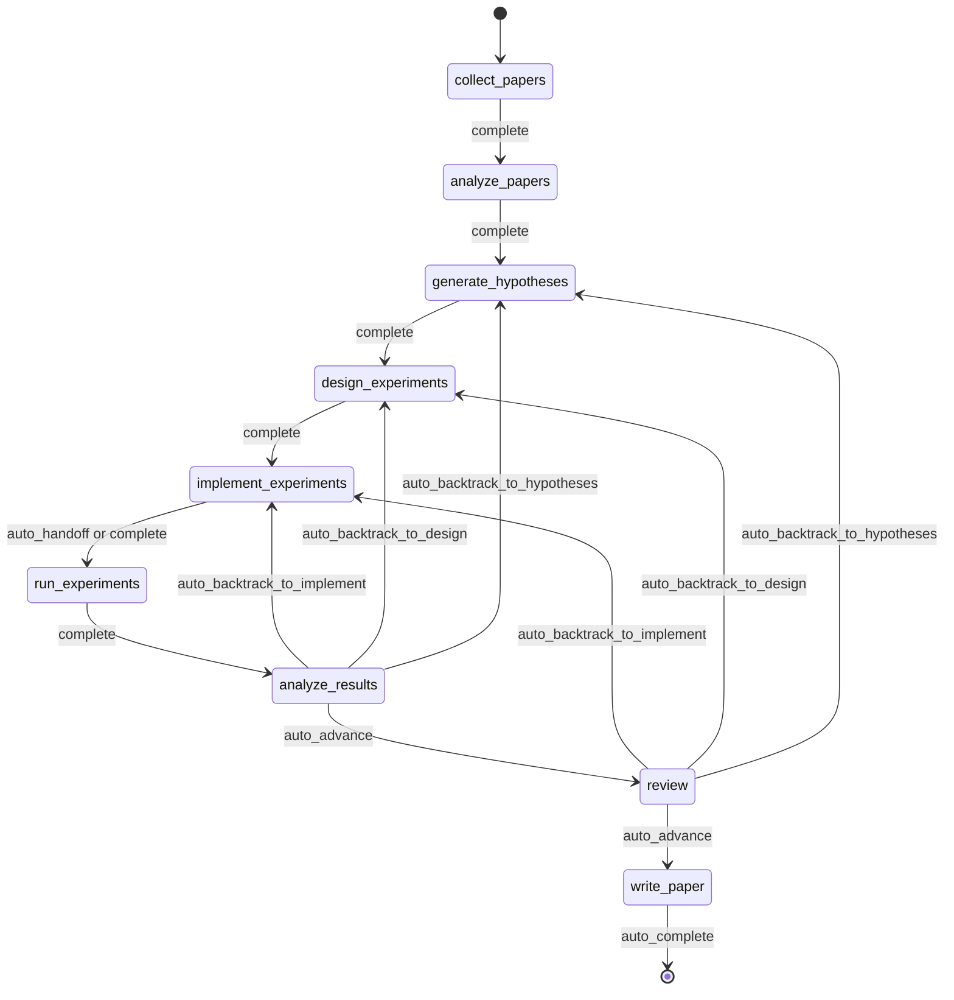
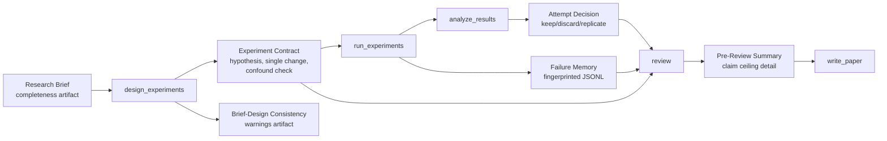
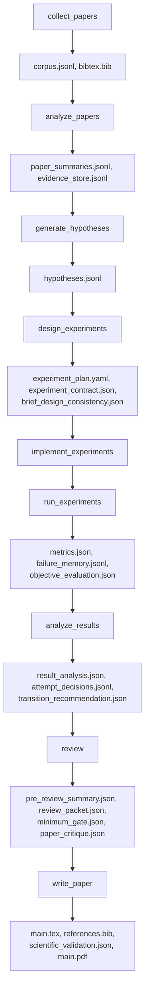
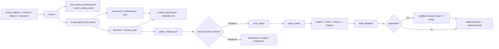
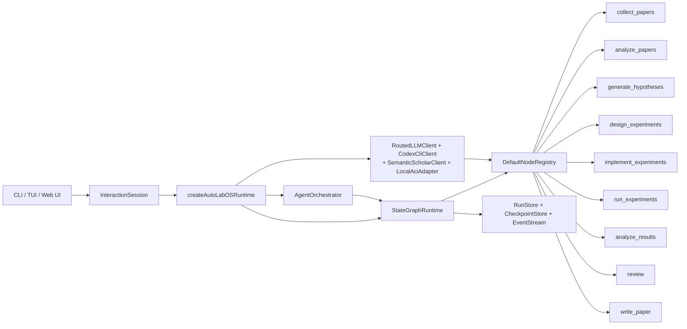

```mermaid
flowchart LR
    Topic["run topic + collect constraints"] --> CP["collect_papers"]
    CP --> CC["collector_curator"]
    CC --> SS["Semantic Scholar search"]
    SS --> Enrich["enrichment + BibTeX recovery"]
    Enrich --> Corpus["corpus.jsonl + bibtex.bib"]

    Corpus --> AP["analyze_papers"]
    AP --> Select["selection request + hybrid rerank"]
    Select --> Manifest["analysis_manifest resume / prune"]
    Manifest --> RE["reader_evidence_extractor"]
    RE --> Pdf["local text/image analysis or Responses API PDF"]
    Pdf --> ReviewLoop["extractor -> reviewer normalization"]
    ReviewLoop --> Evidence["paper_summaries.jsonl + evidence_store.jsonl"]
```

```mermaid
flowchart LR
    PlanYaml["experiment_plan.yaml"] --> IE["implement_experiments"]
    IE --> IM["ImplementSessionManager"]
    IM --> Impl["implementer"]
    IM --> Codex["Codex CLI session"]
    Codex --> VerifyPatch["local verification"]
    VerifyPatch --> Handoff{"auto handoff?"}

    Handoff -->|yes| RX["run_experiments"]
    Handoff -->|no| Gate["approval boundary"]
    Gate --> RX

    RX --> Runner["runner"]
    Runner --> FailCheck["failure memory: check do-not-retry"]
    FailCheck --> ACI["ACI preflight/tests/command"]
    ACI --> Triage["failure triager + rerun planner"]
    Triage -->|retry once if transient| ACI
    ACI --> FailRecord["record to failure_memory.jsonl"]
    ACI --> Metrics["metrics.json + supplemental runs"]
    Metrics --> AR["analyze_results"]
    AR --> ResultPanel["metric auditor + robustness + confounder + calibrator"]
    ResultPanel --> AttemptDec["attempt_decisions.jsonl"]
    ResultPanel --> Synth["transition recommendation"]

    Synth -->|advance| RV["review"]
    Synth -->|backtrack| IE
```

<div align="center">

  <br/>

  

  <h1>A Research Operating System</h1>

  <p><strong>Research execution, not research generation.</strong><br/>
  From literature to manuscript — inside a governed, checkpointed, inspectable loop.</p>

  <p>
    <a href="./README.md"><strong>English</strong></a>
    &nbsp;&middot;&nbsp;
    <a href="./README.ko.md"><strong>한국어</strong></a>
  </p>

  <!-- CI & Quality -->
  <p>
    <a href="https://github.com/lhy0718/AutoLabOS/actions/workflows/ci.yml">
      
    </a>
    <a href="https://github.com/lhy0718/AutoLabOS/actions/workflows/smoke.yml">
      
    </a>
    
  </p>

  <!-- Tech stack -->
  <p>
    
    
    
  </p>

  <!-- Core features -->
  <p>
    
    
    
    
  </p>

  <!-- Integrations -->
  <p>
    
    
    
    
  </p>

  <!-- Community -->
  <p>
    <a href="https://github.com/lhy0718/AutoLabOS/stargazers">
      
    </a>
    <a href="https://github.com/lhy0718/AutoLabOS/commits/main">
      
    </a>
  </p>

</div>

---

Most tools that claim to automate research actually automate **text generation**. They produce polished-looking outputs from shallow reasoning, with no experiment governance, no evidence tracking, and no honest accounting of what the evidence actually supports.

AutoLabOS takes a different position: **the hard part of research isn't writing — it's the discipline between the question and the draft.** Literature grounding, hypothesis testing, experiment governance, failure tracking, claim bounding, and review gating all happen inside a fixed 9-node state graph. Every node produces auditable artifacts. Every transition is checkpointed. Every claim has an evidence ceiling.

The output isn't just a paper. It's a governed research state you can inspect, resume, and defend.

> **Evidence first. Claims second.**
>
> **Runs you can inspect, resume, and defend.**
>
> **A research operating system, not a prompt pack.**
>
> **Your lab shouldn't repeat the same failed experiment twice.**
>
> **Review is a structural gate, not a polish pass.**

---

## What You Get After a Run

AutoLabOS doesn't just produce a PDF. It produces a full, traceable research state:

| Output | What it contains |
|---|---|
| **Literature corpus** | Collected papers, BibTeX, extracted evidence store |
| **Hypotheses** | Literature-grounded hypotheses with skeptical review |
| **Experiment plan** | Governed design with contract, baseline lock, and consistency checks |
| **Executed results** | Metrics, objective evaluation, failure memory log |
| **Result analysis** | Statistical analysis, attempt decisions, transition reasoning |
| **Review packet** | 5-specialist panel scorecard, claim ceiling, pre-draft critique |
| **Manuscript** | LaTeX draft with evidence links, scientific validation, optional PDF |
| **Checkpoints** | Full state snapshots at every node boundary — resume anytime |

Everything lives under `.autolabos/runs/<run_id>/` with public-facing outputs mirrored to `outputs/`.

---

## Why AutoLabOS?

Most AI research tools optimize for **output appearance**. AutoLabOS optimizes for **governed execution**.

| | Typical research tools | AutoLabOS |
|---|---|---|
| Workflow | Open-ended agent drift | Fixed 9-node graph with bounded transitions |
| Experiment design | Unstructured | Contracts with single-change enforcement, confounding detection |
| Failed experiments | Forgotten and retried | Fingerprinted in failure memory, never repeated |
| Claims | As strong as the LLM will generate | Bounded by a claim ceiling tied to actual evidence |
| Review | Optional cleanup pass | Structural gate — blocks writing if evidence is insufficient |
| Paper evaluation | Single LLM "looks good" check | Two-layer gate: deterministic minimum + LLM quality evaluator |
| State | Ephemeral | Checkpointed, resumable, inspectable |

---

## Quick Start

```bash
# 1. Install and build
npm install && npm run build && npm link

# 2. Move to your research workspace
cd /path/to/your-research-project

# 3. Launch (choose one)
autolabos web    # Browser UI — onboarding, dashboard, artifact browser
autolabos        # Terminal-first slash-command workflow
```

> **First run?** Both UIs guide you through onboarding if `.autolabos/config.yaml` doesn't exist yet.

### Prerequisites

| Item | When needed | Notes |
|---|---|---|
| `SEMANTIC_SCHOLAR_API_KEY` | Always | Paper discovery and metadata |
| `OPENAI_API_KEY` | When provider or PDF mode is `api` | OpenAI API model execution |
| Codex CLI login | When provider or PDF mode is `codex` | Uses your local Codex session |

---

## The 9-Node Workflow

A fixed graph. Not a suggestion — a contract.



`collect_papers` → `analyze_papers` → `generate_hypotheses` → `design_experiments` → `implement_experiments` → `run_experiments` → `analyze_results` → `review` → `write_paper`

Backtracking is built in. If results are weak, the graph routes back to hypotheses or design — not forward into wishful writing. All automation lives inside bounded node-internal loops.

---

## Core Properties

### Experiment Governance

Every experiment run goes through a structured contract:

- **Experiment contract** — locks hypothesis, causal mechanism, single-change rule, abort condition, and keep/discard criteria
- **Confounding detection** — catches conjunction changes, list-form interventions, and mechanism-change mismatches
- **Brief-design consistency** — flags when design drifts from the original research brief
- **Baseline lock** — comparison contract freezes objective metric and baseline before execution

### Claim Ceiling Enforcement

The system doesn't let claims outrun evidence.

The `review` node produces a `pre_review_summary` containing the **strongest defensible claim**, a list of **blocked stronger claims** with reasons, and **evidence gaps** that would need to be filled to unlock them. This ceiling flows directly into manuscript generation.

### Failure Memory

Run-scoped JSONL that records and deduplicates failure patterns:

- **Error fingerprinting** — strips timestamps, paths, and numbers for stable clustering
- **Equivalent-failure stopping** — 3+ identical fingerprints exhausts retries immediately
- **Do-not-retry markers** — structural failures block re-execution until the design changes

Your lab learns from its own failures within a run.

### Two-Layer Paper Evaluation

Paper readiness is not a single LLM judgment call.

- **Layer 1 — Deterministic minimum gate**: 7 artifact-presence checks that categorically block under-evidenced work from entering `write_paper`. No LLM involved. Pass or fail.
- **Layer 2 — LLM paper-quality evaluator**: Structured critique across 11 dimensions — claim verification, methodology, statistical rigor, related-work depth, writing readiness, and more. Produces blocking issues, non-blocking issues, and a manuscript-type classification.

If evidence is insufficient, the system recommends backtracking — not polishing.

### 5-Specialist Review Panel

The `review` node runs five independent specialist passes:

1. **Claim verifier** — checks claims against evidence
2. **Methodology reviewer** — validates experimental design
3. **Statistics reviewer** — assesses quantitative rigor
4. **Writing readiness** — checks clarity and completeness
5. **Integrity reviewer** — identifies bias and conflicts

The panel produces a scorecard, consistency assessment, and a gate decision.

---

## Dual Interface

Two UI surfaces, one runtime. Same artifacts, same workflow, same checkpoints.

| | TUI | Web Ops UI |
|---|---|---|
| Launch | `autolabos` | `autolabos web` |
| Interaction | Slash commands, natural language | Browser dashboard, composer |
| Workflow view | Real-time node progress in terminal | 9-node visual graph with actions |
| Artifacts | CLI inspection | Inline preview (text, images, PDFs) |
| Best for | Fast iteration, scripting | Visual monitoring, artifact browsing |

---

## Execution Modes

AutoLabOS preserves the 9-node workflow and all safety gates across every mode.

| Mode | Command | Behavior |
|---|---|---|
| **Interactive** | `autolabos` | Slash-command TUI with explicit approval gates |
| **Minimal approval** | Config: `approval_mode: minimal` | Auto-approves safe transitions |
| **Overnight** | `/agent overnight [run]` | Unattended single pass, 24-hour limit, conservative backtracking |
| **Autonomous** | `/agent autonomous [run]` | Open-ended research exploration, no time limit |

### Autonomous Mode

Designed for sustained hypothesis → experiment → analysis loops with minimal intervention. Runs two parallel internal loops:

1. **Research exploration** — generate hypotheses, design/run experiments, analyze, derive next hypothesis
2. **Paper-quality improvement** — identify strongest branch, tighten baselines, strengthen evidence linkage

Stops on: explicit user stop, resource limits, stagnation detection, or catastrophic failure. Does **not** stop merely because one experiment was negative or paper quality is temporarily flat.

Writes a live `RUN_STATUS.md` tracking current cycle, hypothesis, evidence gaps, gate status, and stop risk.

---

## Research Brief System

Every run starts from a structured Markdown brief that defines scope, constraints, and governance rules.

```bash
/new                        # Create a brief
/brief start --latest       # Validate, snapshot, extract, launch
```

Briefs carry **core** sections (topic, objective metric) and **governance** sections (target comparison, minimum evidence, disallowed shortcuts, paper ceiling). AutoLabOS grades brief completeness and warns when governance coverage is insufficient for paper-scale work.

<details>
<summary><strong>Brief sections and grading</strong></summary>

| Section | Status | Purpose |
|---|---|---|
| `## Topic` | Required | Research question in 1–3 sentences |
| `## Objective Metric` | Required | Primary success metric |
| `## Constraints` | Recommended | Compute budget, dataset limits, reproducibility rules |
| `## Plan` | Recommended | Step-by-step experiment plan |
| `## Target Comparison` | Governance | Proposed method vs. explicit baseline |
| `## Minimum Acceptable Evidence` | Governance | Minimum effect size, fold count, decision boundary |
| `## Disallowed Shortcuts` | Governance | Shortcuts that invalidate results |
| `## Paper Ceiling If Evidence Remains Weak` | Governance | Maximum paper classification if evidence is insufficient |
| `## Manuscript Format` | Optional | Column count, page budget, reference/appendix rules |

| Grade | Meaning | Paper-scale ready? |
|---|---|---|
| `complete` | Core + 4+ governance sections substantive | Yes |
| `partial` | Core complete + 2+ governance | Proceed with warnings |
| `minimal` | Only core sections | No |

</details>

---

## Governance Artifact Flow



---

## Artifact Flow

Every node produces structured, inspectable artifacts.



<details>
<summary><strong>Public output bundle</strong></summary>

```
outputs/<title-slug>-<run_id_prefix>/
  ├── paper/           # TeX source, PDF, references, build log
  ├── experiment/      # Baseline summary, experiment code
  ├── analysis/        # Result table, evidence analysis
  ├── review/          # Paper critique, gate decision
  ├── results/         # Compact quantitative summaries
  ├── reproduce/       # Reproduction scripts, README
  ├── manifest.json    # Section registry
  └── README.md        # Human-readable run summary
```

</details>

---

## Node Architecture

| Node | Role(s) | What it does |
|---|---|---|
| `collect_papers` | collector, curator | Discovers and curates candidate paper set via Semantic Scholar |
| `analyze_papers` | reader, evidence extractor | Extracts summaries and evidence from selected papers |
| `generate_hypotheses` | hypothesis agent + skeptical reviewer | Synthesizes ideas from literature, then pressure-tests them |
| `design_experiments` | designer + feasibility/statistical/ops panel | Filters plans for practicality, writes experiment contract |
| `implement_experiments` | implementer | Produces code and workspace changes through ACI actions |
| `run_experiments` | runner + failure triager + rerun planner | Drives execution, records failures, decides reruns |
| `analyze_results` | analyst + metric auditor + confounder detector | Checks result reliability, writes attempt decisions |
| `review` | 5-specialist panel + claim ceiling + two-layer gate | Structural review — blocks writing if evidence is insufficient |
| `write_paper` | paper writer + reviewer critique | Drafts manuscript, runs post-draft critique, builds PDF |

<details>
<summary><strong>Phase-by-phase connection graphs</strong></summary>

**Discovery and Reading**



**Hypothesis and Experiment Design**

```mermaid
flowchart LR
    Evidence["paper_summaries.jsonl + evidence_store.jsonl"] --> GH["generate_hypotheses"]
    GH --> HA["hypothesis_agent"]
    HA --> Axes["evidence synthesizer -> evidence axes"]
    Axes --> ToT["ToT branch expansion"]
    ToT --> Drafts["mechanism / contradiction / intervention drafts"]
    Drafts --> Reviews["skeptical reviewer"]
    Reviews --> Select["diversity + evidence-quality top-k selection"]
    Select --> Hyp["hypotheses.jsonl + axes/reviews/llm_trace"]
    Hyp --> DE["design_experiments"]
    DE --> ED["experiment_designer"]
    ED --> Profiles["constraint profile + objective metric profile"]
    Profiles --> Plans["design candidates"]
    Plans --> Panel["designer + feasibility + statistical + ops-capacity panel"]
    Panel --> Choice["panel selection"]
    Choice --> Contract["experiment_contract.json + brief_design_consistency.json"]
```



**Implementation, Execution, and Result Loop**



**Review, Writing, and Surfacing**



</details>

---

## Bounded Automation

Every internal automation has an explicit bound.

| Node | Internal automation | Bound |
|---|---|---|
| `analyze_papers` | Auto-expands evidence window when too sparse | ≤ 2 expansions |
| `design_experiments` | Deterministic panel scoring + experiment contract | Runs once per design |
| `run_experiments` | Failure triage + one-shot transient rerun | Never retries structural failures |
| `run_experiments` | Failure memory fingerprinting | ≥ 3 identical → exhausts retries |
| `analyze_results` | Objective rematching + result panel calibration | One rematch before human pause |
| `write_paper` | Related-work scout + validation-aware repair | 1 repair pass max |

---

## Common Commands

| Command | Description |
|---|---|
| `/new` | Create a research brief |
| `/brief start <path\|--latest>` | Start research from a brief |
| `/runs [query]` | List or search runs |
| `/resume <run>` | Resume a run |
| `/agent run <node> [run]` | Execute from a graph node |
| `/agent status [run]` | Show node statuses |
| `/agent overnight [run]` | Run unattended (24-hour limit) |
| `/agent autonomous [run]` | Open-ended autonomous research |
| `/model` | Switch model and reasoning effort |
| `/doctor` | Environment + workspace diagnostics |

<details>
<summary><strong>Full command list</strong></summary>

| Command | Description |
|---|---|
| `/help` | Show command list |
| `/new` | Create a research brief file |
| `/brief start <path\|--latest>` | Start research from a brief file |
| `/doctor` | Environment + workspace diagnostics |
| `/runs [query]` | List or search runs |
| `/run <run>` | Select run |
| `/resume <run>` | Resume run |
| `/agent list` | List graph nodes |
| `/agent run <node> [run]` | Execute from node |
| `/agent status [run]` | Show node statuses |
| `/agent collect [query] [options]` | Collect papers |
| `/agent recollect <n> [run]` | Collect additional papers |
| `/agent focus <node>` | Move focus with safe jump |
| `/agent graph [run]` | Show graph state |
| `/agent resume [run] [checkpoint]` | Resume from checkpoint |
| `/agent retry [node] [run]` | Retry node |
| `/agent jump <node> [run] [--force]` | Jump node |
| `/agent overnight [run]` | Overnight autonomy (24h) |
| `/agent autonomous [run]` | Open-ended autonomous research |
| `/model` | Model and reasoning selector |
| `/approve` | Approve paused node |
| `/retry` | Retry current node |
| `/settings` | Provider and model settings |
| `/quit` | Exit |

</details>

<details>
<summary><strong>Collection options and examples</strong></summary>

```
--limit <n>          --last-years <n>      --year <spec>
--date-range <s:e>   --sort <relevance|citationCount|publicationDate>
--order <asc|desc>   --min-citations <n>   --open-access
--field <csv>        --venue <csv>         --type <csv>
--bibtex <generated|s2|hybrid>             --dry-run
--additional <n>     --run <run_id>
```

```bash
/agent collect --last-years 5 --sort relevance --limit 100
/agent collect "agent planning" --sort citationCount --min-citations 100
/agent collect --additional 200 --run <run_id>
```

</details>

---

## Web Ops UI

`autolabos web` starts a local browser UI at `http://127.0.0.1:4317`.

- **Onboarding** — same setup as TUI, writes `.autolabos/config.yaml`
- **Dashboard** — run search, 9-node workflow view, node actions, live logs
- **Artifacts** — browse runs, preview text/images/PDFs inline
- **Composer** — slash commands and natural language, with step-by-step plan control

```bash
autolabos web                              # Default port 4317
autolabos web --host 0.0.0.0 --port 8080  # Custom bind
```

---

## Philosophy

AutoLabOS is built around a few hard constraints:

- **Workflow completion ≠ paper readiness.** A run can complete the graph without the output being paper-worthy. The system tracks the difference.
- **Claims must not exceed evidence.** The claim ceiling is enforced structurally, not by prompting harder.
- **Review is a gate, not a suggestion.** If evidence is insufficient, the `review` node blocks `write_paper` and recommends backtracking.
- **Negative results are allowed.** A failed hypothesis is a valid research outcome — but it must be framed honestly.
- **Reproducibility is an artifact property.** Checkpoints, experiment contracts, failure logs, and evidence stores exist so that a run's reasoning can be traced and challenged.

---

## Development

```bash
npm install              # Install deps (also installs web sub-package)
npm run build            # Build TypeScript + web UI
npm test                 # Run all unit tests (931+)
npm run test:watch       # Watch mode

# Single test file
npx vitest run tests/<name>.test.ts

# Smoke tests
npm run test:smoke:all                      # Full local smoke bundle
npm run test:smoke:natural-collect          # NL collect -> pending command
npm run test:smoke:natural-collect-execute  # NL collect -> execute -> verify
npm run test:smoke:ci                       # CI smoke selection
```

<details>
<summary><strong>Smoke test environment variables</strong></summary>

```bash
AUTOLABOS_FAKE_CODEX_RESPONSE=1              # Avoid live Codex calls
AUTOLABOS_FAKE_SEMANTIC_SCHOLAR_RESPONSE=1   # Avoid live S2 calls
AUTOLABOS_SMOKE_VERBOSE=1                    # Print full PTY logs
AUTOLABOS_SMOKE_MODE=<mode>                  # CI mode selection
```

</details>

<details>
<summary><strong>Runtime internals</strong></summary>

### State Graph Policies

- Checkpoints: `.autolabos/runs/<run_id>/checkpoints/` — phases: `before | after | fail | jump | retry`
- Retry policy: `maxAttemptsPerNode = 3`
- Auto rollback: `maxAutoRollbacksPerNode = 2`
- Jump modes: `safe` (current or previous) / `force` (forward, skipped nodes recorded)

### Agent Runtime Patterns

- **ReAct** loop: `PLAN_CREATED → TOOL_CALLED → OBS_RECEIVED`
- **ReWOO** split (planner/worker): used for high-cost nodes
- **ToT** (Tree-of-Thoughts): used in hypothesis and design nodes
- **Reflexion**: failure episodes stored and reused on retries

### Memory Layers

| Layer | Scope | Format |
|---|---|---|
| Run context memory | Per-run key/value | `run_context.jsonl` |
| Long-term store | Cross-attempt | JSONL summary and index |
| Episode memory | Reflexion | Failure lessons for retries |

### ACI Actions

`implement_experiments` and `run_experiments` execute through:
`read_file` · `write_file` · `apply_patch` · `run_command` · `run_tests` · `tail_logs`

</details>

<details>
<summary><strong>Agent runtime diagram</strong></summary>



</details>

---

## Documentation

| Document | Coverage |
|---|---|
| `docs/architecture.md` | System architecture and design decisions |
| `docs/tui-live-validation.md` | TUI validation and testing approach |
| `docs/experiment-quality-bar.md` | Experiment execution standards |
| `docs/paper-quality-bar.md` | Manuscript quality requirements |
| `docs/reproducibility.md` | Reproducibility guarantees |
| `docs/research-brief-template.md` | Full brief template with all governance sections |

---

## Status

AutoLabOS is in active development (v0.1.0). The workflow, governance system, and core runtime are functional and tested. Interfaces, artifact coverage, and execution modes are under continuous validation.

Contributions and feedback welcome — see [Issues](https://github.com/lhy0718/AutoLabOS/issues).

---

<div align="center">
  <sub>Built for researchers who want their experiments governed and their claims defensible.</sub>
</div>
