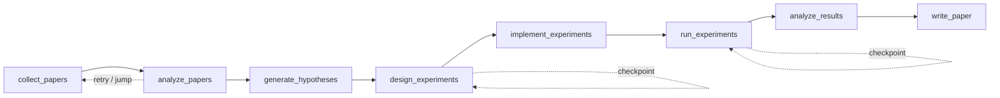

<div align="center">
  <h1>AutoResearch</h1>
  <p><strong>Slash-first TUI for AI-agent-driven research automation.</strong></p>
  <p>
    Collect papers, analyze evidence, generate hypotheses, design experiments,
    run implementations, and keep the whole workflow checkpointed.
  </p>
  <p>
    <a href="./README.md"><strong>English</strong></a>
    ·
    <a href="./README.ko.md"><strong>한국어</strong></a>
  </p>
  <p>
    <a href="https://github.com/lhy0718/AutoResearch/actions/workflows/smoke.yml">
      
    </a>
    
    
    
    
  </p>
  <p>
    <a href="https://github.com/lhy0718/AutoResearch/stargazers">
      
    </a>
    <a href="https://github.com/lhy0718/AutoResearch/commits/main">
      
    </a>
  </p>
</div>

## Why AutoResearch?

- Turn the research loop into a fixed 8-node state graph from `collect_papers` to `write_paper`.
- Run the main workflow with either `codex` or `OpenAI API`, then switch PDF analysis independently.
- Keep work local and inspectable with checkpoints, budgets, retries, jumps, and run-scoped memory.

## Highlights

| Capability | What it gives you |
| --- | --- |
| Slash-first TUI | Operate the system from `/new`, `/agent ...`, `/model`, `/settings`, and `/doctor` |
| Local Web Ops UI | Run `autoresearch web` for onboarding, dashboard controls, artifacts, checkpoints, and live session state in the browser |
| Deterministic natural-language routing | Common intents map to local handlers or slash commands before LLM fallback |
| Hybrid provider model | Use Codex login for the primary flow or move to OpenAI API models when you want explicit API-backed execution |
| PDF analysis modes | Analyze PDFs via local extraction + Codex, or send them directly to the Responses API |
| Research runtime patterns | ReAct, ReWOO, ToT, and Reflexion are used where they make sense |
| Local ACI execution | `implement_experiments` and `run_experiments` execute through file, command, and test actions |

## Quick Start

> [!IMPORTANT]
> `SEMANTIC_SCHOLAR_API_KEY` is required. `OPENAI_API_KEY` is only needed when the main provider or PDF analysis mode is `api`.

1. Install and build

```bash
npm install
npm run build
npm link
```

2. Add environment variables

```bash
cp .env.example .env
echo 'SEMANTIC_SCHOLAR_API_KEY=your_key_here' >> .env
echo 'OPENAI_API_KEY=your_openai_key_here' >> .env
```

3. Launch the TUI

```bash
autoresearch
```

4. Launch the web UI

```bash
autoresearch web
```

The web server listens on `http://127.0.0.1:4317` by default.
Run this from the research project directory you want AutoResearch to use as its workspace.

If you are using a repository checkout and the CLI says the installed web assets are missing, build the web bundle once from the AutoResearch package root:

```bash
cd /path/to/AutoResearch
npm --prefix web run build
autoresearch web
```

Use a custom bind address or port when needed:

```bash
autoresearch web --host 0.0.0.0 --port 8080
```

Development mode:

```bash
npm run dev
npm run dev:web
```

Without `npm link`, you can still run:

```bash
node dist/cli/main.js
node dist/cli/main.js web
```

> [!NOTE]
> External entrypoints are `autoresearch` and `autoresearch web`. `autoresearch init` is intentionally not supported.

## First Run

1. Run `autoresearch` or `autoresearch web` in an empty project.
2. If `.autoresearch/config.yaml` does not exist, the TUI opens the setup wizard and the web app shows the onboarding form.
3. Both flows create the same scaffold/config, store your Semantic Scholar key, and open the main dashboard.
4. Choose the primary LLM provider:
   - `codex`: use Codex ChatGPT login for the main workflow
   - `api`: use OpenAI API models for the main workflow (`OPENAI_API_KEY` required)
5. Choose the PDF analysis mode:
   - `codex`: download and extract PDF text locally, then analyze with Codex
   - `api`: send the PDF directly to the Responses API (`OPENAI_API_KEY` required)
6. If the provider or PDF mode is `api`, setup wizard and `/settings` let you choose a model.
   - Current built-in catalog: `gpt-5.4`, `gpt-5`, `gpt-5-mini`, `gpt-4.1`, `gpt-4o`, `gpt-4o-mini`
7. `/model` follows the active primary provider:
   - Codex provider: Codex model selector
   - OpenAI API provider: OpenAI API model selector
8. At runtime, AutoResearch reads `SEMANTIC_SCHOLAR_API_KEY` and `OPENAI_API_KEY` from `process.env` or `.env`.

## Web Ops UI

`autoresearch web` starts a local single-user browser UI on top of the same runtime used by the TUI.

- Onboarding uses the same non-interactive setup helper, so web setup writes the same `.autoresearch/config.yaml` and `.env` values as the TUI wizard.
- The dashboard includes run search and selection, the 8-node workflow view, node actions, live logs, checkpoints, artifacts, metadata, and `/doctor` summaries.
- The bottom composer accepts both slash commands and supported natural-language requests.
- Multi-step natural-language plans use browser buttons instead of `y/a/n`: `Run next`, `Run all`, and `Cancel`.
- Artifact browsing is restricted to `.autoresearch/runs/<run_id>` and previews common text files, images, and PDFs inline.

Typical web flow:

1. Start the server with `autoresearch web`.
   Run this from the project directory you want to manage.
   If you see a missing web assets message while using a repository checkout, build once from the AutoResearch package root with `npm --prefix web run build`, then restart the server.
2. Open `http://127.0.0.1:4317`.
3. Complete onboarding if the workspace is not configured yet.
4. Create or select a run, then use the workflow cards or composer to drive execution.

## Workflow At A Glance



Default flow is linear `1 -> 8`, but runtime controls let you retry, jump, resume from checkpoints, and apply approval gates between steps.

## Most-Used Commands

| Command | Description |
| --- | --- |
| `/new` | Create a run |
| `/runs [query]` | List or search runs |
| `/run <run>` | Select a run |
| `/resume <run>` | Resume a run |
| `/agent collect [query] [options]` | Collect papers with filters, sort, and bibliographic options |
| `/agent run <node> [run]` | Execute from a graph node |
| `/agent status [run]` | Show node statuses |
| `/agent graph [run]` | Show graph state |
| `/agent resume [run] [checkpoint]` | Resume from the latest or a specific checkpoint |
| `/agent retry [node] [run]` | Retry a node |
| `/agent jump <node> [run] [--force]` | Jump between nodes |
| `/agent budget [run]` | Show budget usage |
| `/model` | Open model and reasoning selector |
| `/settings` | Edit defaults |
| `/doctor` | Run environment checks |

Common collection options:

- `--run <run_id>`
- `--limit <n>`
- `--additional <n>`
- `--last-years <n>`
- `--year <spec>`
- `--date-range <start:end>`
- `--sort <relevance|citationCount|publicationDate|paperId>`
- `--order <asc|desc>`
- `--field <csv>`
- `--venue <csv>`
- `--type <csv>`
- `--min-citations <n>`
- `--open-access`
- `--bibtex <generated|s2|hybrid>`
- `--dry-run`

Examples:

- `/agent collect --last-years 5 --sort relevance --limit 100`
- `/agent collect "agent planning" --sort citationCount --order desc --min-citations 100`
- `/agent collect --additional 200 --run <run_id>`

## Natural-Language Control

AutoResearch does not try to support every sentence with hard-coded rules. Instead, it defines deterministic intent families and routes those locally before falling back to the workspace-grounded LLM.

Ask this inside the TUI to see the live supported list:

- `what natural inputs are supported?`

Typical examples:

- `create a new run`
- `collect 100 papers from the last 5 years by relevance`
- `show current status`
- `jump back to collect_papers`
- `how many papers were collected?`

Multi-step natural-language plans pause between steps:

- `y`: run only the next step
- `a`: run all remaining steps without pausing again
- `n`: cancel the remaining plan

Implementation references:

- Deterministic routing: [src/core/commands/naturalDeterministic.ts](./src/core/commands/naturalDeterministic.ts)
- Local status / next-step assistant: [src/core/commands/naturalAssistant.ts](./src/core/commands/naturalAssistant.ts)

<details>
<summary>Full slash command list</summary>

| Command | Description |
| --- | --- |
| `/help` | Show command list |
| `/new` | Create run |
| `/doctor` | Environment checks |
| `/runs [query]` | List or search runs |
| `/run <run>` | Select run |
| `/resume <run>` | Resume run |
| `/agent list` | List graph nodes |
| `/agent run <node> [run]` | Execute from node |
| `/agent status [run]` | Show node statuses |
| `/agent collect [query] [options]` | Collect papers with filters, sort, and options |
| `/agent recollect <n> [run]` | Backward-compatible alias for additional collection |
| `/agent focus <node>` | Move focus to node with a safe jump |
| `/agent graph [run]` | Show graph state |
| `/agent resume [run] [checkpoint]` | Resume from latest or specific checkpoint |
| `/agent retry [node] [run]` | Retry node |
| `/agent jump <node> [run] [--force]` | Jump node |
| `/agent budget [run]` | Show budget usage |
| `/model` | Open arrow-key selector for model and reasoning effort |
| `/approve` | Approve current node |
| `/retry` | Retry current node |
| `/settings` | Edit defaults |
| `/quit` | Exit |

</details>

<details>
<summary>Supported natural-language intent families</summary>

1. Help / settings / model / doctor / quit
   - Examples: `show help`, `open model selector`, `run environment checks`
2. Run lifecycle
   - Examples: `create a new run`, `list runs`, `open run alpha`, `resume the previous run`
3. Run title changes
   - Examples: `change the run title to Multi-agent collaboration`
4. Workflow structure / status / next step
   - Examples: `what should I do next?`, `show current status`, `show the workflow`
5. Paper collection
   - Examples: `collect 100 papers from the last 5 years by relevance`
   - Examples: `collect 50 open-access review papers`
   - Examples: `collect 200 more papers`
   - Examples: `clear collected papers, then collect 100 new papers`
6. Node control
   - Examples: `jump back to collect_papers`, `retry the hypothesis node`, `focus on implement_experiments`
7. Graph / budget / approval
   - Examples: `show graph`, `show budget`, `approve current node`, `retry current node`
8. Direct questions about collected papers
   - Examples: `how many papers were collected?`
   - Examples: `how many papers are missing PDF paths?`
   - Examples: `what is the top-cited paper?`
   - Examples: `show 3 paper titles`

</details>

<details>
<summary>Runtime defaults, storage, and execution details</summary>

### State Graph

Fixed graph nodes:

1. `collect_papers`
2. `analyze_papers`
3. `generate_hypotheses`
4. `design_experiments`
5. `implement_experiments`
6. `run_experiments`
7. `analyze_results`
8. `write_paper`

### Runtime Policies

- Checkpoints: `.autoresearch/runs/<run_id>/checkpoints/`
- Checkpoint phases: `before | after | fail | jump | retry`
- Retry policy: `maxAttemptsPerNode=3`
- Auto rollback policy: `maxAutoRollbacksPerNode=2`
- Jump modes:
  - `safe`: only current or previous node
  - `force`: forward jumps allowed and skipped nodes are recorded
- Budget policy:
  - `maxToolCalls=150`
  - `maxWallClockMinutes=240`
  - `maxUsd=15` (soft-check if provider cost is unavailable)

### Agent Runtime Patterns

- ReAct loop: `PLAN_CREATED -> TOOL_CALLED -> OBS_RECEIVED`
- ReWOO split (planner/worker): used for high-cost nodes
- ToT (Tree-of-Thoughts): used in hypothesis and design nodes
- Reflexion: failure episodes are stored and reused on retries

### Memory Layers

- Run context memory: per-run short-term state
- Long-term store: JSONL summary and index history
- Episode memory: Reflexion failure lessons

### ACI (Agent-Computer Interface)

Standard actions:

- `read_file`
- `write_file`
- `apply_patch`
- `run_command`
- `run_tests`
- `tail_logs`

`implement_experiments` and `run_experiments` are executed via ACI.

### Command Palette

- Type `/`: open command list
- `Tab`: autocomplete
- `Up/Down`: navigate candidates
- `Enter`: execute
- Run suggestions include `run_id + title + current_node + status + relative time`
- When the input is empty, the TUI shows context-aware next actions with exact commands and natural-language examples
- The next-actions panel now expands into a broader state-aware action catalog: run, status, graph, budget, count, jump, and natural-language queries
- Empty-input guidance follows the user's recent language or OS locale, and `Tab` fills the first suggested action

### Run Metadata

`runs.json` stores:

- `version: 3`
- `workflowVersion: 3`
- `currentNode`
- `graph` (`RunGraphState`)
- `nodeThreads` (`Partial<Record<GraphNodeId, string>>`)
- `memoryRefs` (`runContextPath`, `longTermPath`, `episodePath`)

Legacy runs are auto-migrated to v3 on load.

### Generated Paths

- `.autoresearch/config.yaml`
- `.autoresearch/runs/runs.json`
- `.autoresearch/runs/<run_id>/checkpoints/*`
- `.autoresearch/runs/<run_id>/memory/*`
- `.autoresearch/runs/<run_id>/paper/*`

</details>

## Development

```bash
npm run build
npm test
npm run test:smoke:all
npm run test:smoke:natural-collect
npm run test:smoke:natural-collect-execute
npm run test:smoke:ci
```

Smoke test notes:

- Smoke harness files live under `tests/smoke/`.
- The manual example workspace stays under `/test`.
- Smoke uses an isolated workspace under `/test/smoke-workspace` so it does not overwrite root `/test` example state.
- `test:smoke:natural-collect` verifies natural-language collect request -> pending `/agent collect ...` command.
- `test:smoke:natural-collect-execute` verifies natural-language collect request -> `y` execute -> collect artifacts created.
- `test:smoke:all` runs the full local smoke bundle in `/test/smoke-workspace`.
- Smoke uses `AUTORESEARCH_FAKE_CODEX_RESPONSE` to avoid live Codex calls.
- Execute smoke also uses `AUTORESEARCH_FAKE_SEMANTIC_SCHOLAR_RESPONSE`.
- `test:smoke:ci` runs CI-mode smoke selection.
  - Default mode: `pending`
  - Additional modes: `execute`, `composite`, `composite-all`, `llm-composite`, `llm-composite-all`, `llm-replan`
  - Set `AUTORESEARCH_SMOKE_MODE=<mode>` or `AUTORESEARCH_SMOKE_MODE=all` to switch CI scenarios.
- Smoke output is quiet by default. Set `AUTORESEARCH_SMOKE_VERBOSE=1` to print full PTY logs.
