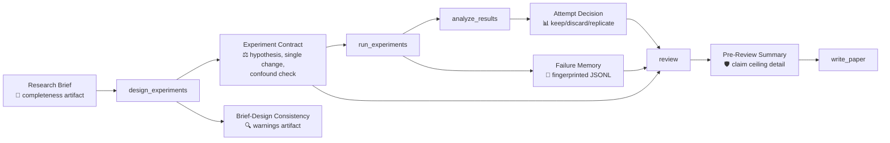
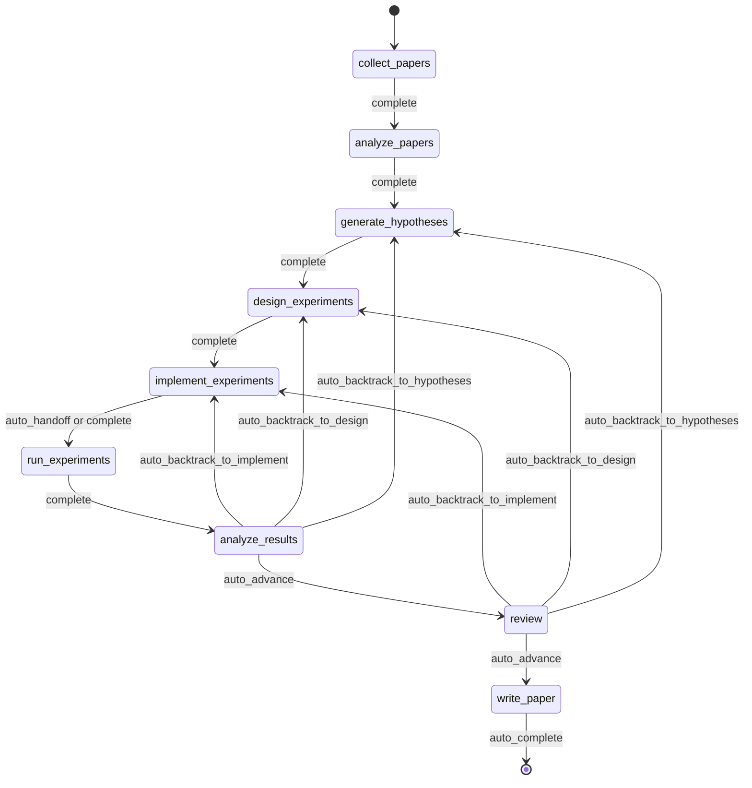
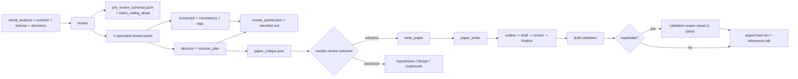
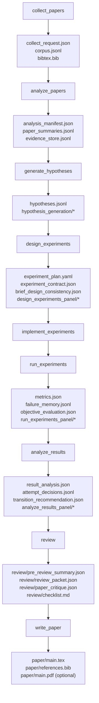
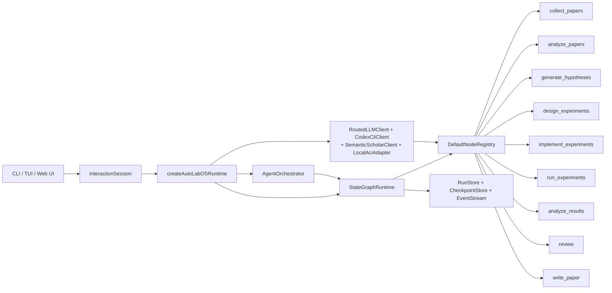

```mermaid
flowchart LR
    Evidence["paper_summaries.jsonl + evidence_store.jsonl"] --> GH["generate_hypotheses"]
    GH --> HA["hypothesis_agent"]
    HA --> Axes["evidence synthesizer -> evidence axes"]
    Axes --> ToT["ToT branch expansion"]
    ToT --> Drafts["mechanism / contradiction / intervention drafts"]
    Drafts --> Reviews["skeptical reviewer"]
    Reviews --> Select["diversity + evidence-quality top-k selection"]
    Select --> Hyp["hypotheses.jsonl + axes/reviews/llm_trace"]

    Hyp --> DE["design_experiments"]
    DE --> ED["experiment_designer"]
    ED --> Profiles["constraint profile + objective metric profile"]
    Profiles --> Plans["design candidates"]
    Plans --> Panel["designer + feasibility + statistical + ops-capacity panel"]
    Panel --> Choice["panel selection"]
    Choice --> Contract["experiment_contract.json + brief_design_consistency.json"]
    Choice --> Bundle{"supports managed real_execution bundle?"}
    Bundle -->|yes| Managed["bundle sections + runnable profiles"]
    Bundle -->|no| Plain["plain experiment plan"]
    Managed --> PlanYaml["experiment_plan.yaml"]
    Plain --> PlanYaml
```

```mermaid
flowchart LR
    PlanYaml["experiment_plan.yaml"] --> IE["implement_experiments"]
    IE --> IM["ImplementSessionManager"]
    IM --> Impl["implementer"]
    IM --> Codex["Codex CLI session"]
    Codex --> VerifyPatch["local verification"]
    VerifyPatch --> Handoff{"auto handoff?"}

    Handoff -->|yes| RX["run_experiments"]
    Handoff -->|no| Gate["approval boundary"]
    Gate --> RX

    RX --> Runner["runner"]
    Runner --> FailCheck["failure memory: check do-not-retry"]
    FailCheck --> ACI["ACI preflight/tests/command"]
    ACI --> Triage["failure triager + rerun planner"]
    Triage -->|retry once if transient| ACI
    ACI --> FailRecord["record to failure_memory.jsonl"]
    ACI --> Metrics["metrics.json + supplemental runs"]
    Metrics --> AR["analyze_results"]
    AR --> ResultPanel["metric auditor + robustness + confounder + calibrator"]
    ResultPanel --> AttemptDec["attempt_decisions.jsonl"]
    ResultPanel --> Synth["transition recommendation"]

    Synth -->|advance| RV["review"]
    Synth -->|backtrack| IE
```

<div align="center">

  <br/>

  <picture>
    <source media="(prefers-color-scheme: dark)" srcset="https://img.shields.io/badge/AutoLabOS-0F766E?style=for-the-badge&logoColor=white&logo=data:image/svg+xml;base64,PHN2ZyB4bWxucz0iaHR0cDovL3d3dy53My5vcmcvMjAwMC9zdmciIHdpZHRoPSIyNCIgaGVpZ2h0PSIyNCIgdmlld0JveD0iMCAwIDI0IDI0IiBmaWxsPSJub25lIiBzdHJva2U9IndoaXRlIiBzdHJva2Utd2lkdGg9IjIiPjxwYXRoIGQ9Ik0xMiAyTDIgN2wxMCA1IDEwLTV6Ii8+PHBhdGggZD0iTTIgMTdsMTAgNSAxMC01Ii8+PHBhdGggZD0iTTIgMTJsMTAgNSAxMC01Ii8+PC9zdmc+"/>
    
  </picture>

  <h3>Autonomous Research Lab Operating System</h3>

  <p>
    <em>Collect papers &rarr; Analyze evidence &rarr; Run real experiments &rarr; Draft manuscripts</em><br/>
    <strong>A checkpointed, 9-node state graph that enforces experiment discipline from hypothesis to paper.</strong>
  </p>

  <p>
    <a href="./README.md"><strong>English</strong></a>
    &nbsp;&middot;&nbsp;
    <a href="./README.ko.md"><strong>한국어</strong></a>
  </p>

  <!-- CI & Quality -->
  <p>
    <a href="https://github.com/lhy0718/AutoLabOS/actions/workflows/ci.yml">
      
    </a>
    <a href="https://github.com/lhy0718/AutoLabOS/actions/workflows/smoke.yml">
      
    </a>
    
  </p>

  <!-- Tech stack -->
  <p>
    
    
    
  </p>

  <!-- Core features — unified teal -->
  <p>
    
    
    
    
  </p>

  <!-- Integrations -->
  <p>
    
    
    
    
  </p>

  <!-- Community -->
  <p>
    <a href="https://github.com/lhy0718/AutoLabOS/stargazers">
      
    </a>
    <a href="https://github.com/lhy0718/AutoLabOS/commits/main">
      
    </a>
  </p>

</div>

---

## Why AutoLabOS?

Most AI research tools handle one piece of the pipeline. AutoLabOS is a **complete research operating system** that turns the full loop — from literature survey to paper draft — into a single checkpointed workflow.

<table>
<tr>
<td width="50%">

**🔬 The Problem**
- Research involves dozens of manual handoffs
- Experiment decisions are undocumented and unreproducible
- Claims drift beyond what evidence supports
- Failed approaches get retried without learning

</td>
<td width="50%">

**🧪 The Solution**
- Fixed 9-node graph with automatic transitions
- Experiment contracts enforce causal discipline
- Claim ceilings block unsupported assertions
- Failure memory prevents repeating the same mistakes

</td>
</tr>
</table>

## Highlights

| | Capability | Description |
|---|---|---|
| 📝 | **Brief-first workflow** | Create a Markdown brief → validate completeness → auto-extract topic, metric, constraints → launch |
| 🌐 | **Dual UI** | Brief-first TUI + local Web Ops UI (`autolabos web` on port 4317) share the same runtime |
| 🔄 | **9-node state graph** | `collect_papers` → `analyze_papers` → `generate_hypotheses` → `design_experiments` → `implement_experiments` → `run_experiments` → `analyze_results` → `review` → `write_paper` |
| ⚖️ | **Experiment governance** | Experiment contracts, confounding detection, brief-design consistency checks, failure memory |
| 📊 | **Claim ceiling enforcement** | Pre-review summary with strongest defensible claim, blocked claims, and evidence gaps |
| 🔁 | **Failure memory** | JSONL-based error fingerprinting, equivalent-failure stopping, do-not-retry markers |
| 🤖 | **Hybrid provider model** | Codex CLI or OpenAI API for primary flow; independent PDF analysis mode |
| 🧠 | **Runtime patterns** | ReAct, ReWOO, ToT, and Reflexion used where they make sense |
| 🛡️ | **5-specialist review panel** | Claim verifier, methodology reviewer, statistics reviewer, writing readiness, integrity reviewer |

---

## Quick Start

```bash
# 1. Install and build
npm install && npm run build && npm link

# 2. Move to your research workspace
cd /path/to/your-research-project

# 3. Launch (choose one)
autolabos web    # Browser UI with onboarding, dashboard, artifacts
autolabos        # Terminal-first brief-driven workflow
```

> **First run?** Both UIs will guide you through onboarding if `.autolabos/config.yaml` doesn't exist yet.

### Prerequisites

| Item | When needed | Notes |
|---|---|---|
| `SEMANTIC_SCHOLAR_API_KEY` | Always | Paper discovery and metadata |
| `OPENAI_API_KEY` | When provider or PDF mode is `api` | OpenAI API model execution |
| Codex CLI login | When provider or PDF mode is `codex` | Uses your local Codex session |

---

## Research Brief System

AutoLabOS is **brief-first**: every run starts from a structured Markdown document that defines the research scope.

### Creating a Brief

```bash
/new                        # Creates .autolabos/briefs/<timestamp>-<slug>.md
/brief start --latest       # Validates, snapshots, extracts, and launches
```

### Brief Sections

The brief template includes **core** sections (required) and **governance** sections (recommended for paper-scale work):

<table>
<tr><th>Section</th><th>Status</th><th>Purpose</th></tr>
<tr><td><code>## Topic</code></td><td>🔴 Required</td><td>Research question in 1–3 sentences</td></tr>
<tr><td><code>## Objective Metric</code></td><td>🔴 Required</td><td>Primary success metric and what counts as improvement</td></tr>
<tr><td><code>## Constraints</code></td><td>🟡 Recommended</td><td>Compute budget, dataset limits, reproducibility rules</td></tr>
<tr><td><code>## Plan</code></td><td>🟡 Recommended</td><td>Step-by-step experiment plan</td></tr>
<tr><td><code>## Target Comparison</code></td><td>🟡 Governance</td><td>Proposed method vs. explicit baseline on specific dimension</td></tr>
<tr><td><code>## Minimum Acceptable Evidence</code></td><td>🟡 Governance</td><td>Minimum effect size, number of folds, decision boundary</td></tr>
<tr><td><code>## Disallowed Shortcuts</code></td><td>🟡 Governance</td><td>Shortcuts that invalidate results (cherry-picking, fabrication)</td></tr>
<tr><td><code>## Allowed Budgeted Passes</code></td><td>🟡 Governance</td><td>Extra analysis passes permitted within compute budget</td></tr>
<tr><td><code>## Paper Ceiling If Evidence Remains Weak</code></td><td>🟡 Governance</td><td>Maximum paper classification if evidence is insufficient</td></tr>
</table>

### Brief Completeness Grading

At run creation, AutoLabOS generates a **machine-readable completeness artifact** grading the brief:

| Grade | Meaning | Paper-scale ready? |
|---|---|---|
| `complete` | Core + 4+ governance sections substantive | ✅ Yes |
| `partial` | Core complete + 2+ governance sections present | ⚠️ Proceed with warnings |
| `minimal` | Only core sections or boilerplate | ❌ No |

---

## Experiment Governance

AutoLabOS enforces experiment discipline through a system of structured artifacts that flow between nodes.

### Governance Artifact Flow



### Experiment Contract

Written by `design_experiments` as `experiment_contract.json`:

```json
{
  "version": 1,
  "hypothesis": "Shared state schema improves multi-agent coordination",
  "causal_mechanism": "Structured JSON handoff reduces information loss",
  "single_change": "Replace free-form chat with shared_state_schema",
  "confounded": false,
  "expected_metric_effect": "Improve macro-F1 by at least +0.5 points",
  "abort_condition": "Abort if F1 drops below baseline by more than 1 point",
  "keep_or_discard_rule": "Keep if macro-F1 improves; discard if no improvement"
}
```

**Enhanced confounding detection** goes beyond the structural `additional_changes` flag:
- **Conjunction-split**: Detects `"Add batch normalization and switch optimizer from SGD to Adam"` as two distinct interventions
- **List-form**: Detects numbered/bulleted lists inside `single_change`
- **Mechanism-change mismatch**: Flags when `causal_mechanism` references interventions not captured in `single_change`

### Failure Memory

Run-scoped JSONL (`failure_memory.jsonl`) that records and deduplicates failure patterns:

- **Error fingerprinting** strips timestamps, file paths, and numbers for stable clustering
- **Equivalent-failure stopping**: 3+ identical fingerprints → exhausts retries immediately
- **Do-not-retry markers**: Structural failures block re-execution until design changes
- **Coverage**: All 5 failure paths in `run_experiments` (resolve, preflight, command, metrics missing, metrics invalid)

### Claim Ceiling Enforcement

The `review` node generates `pre_review_summary.json` with a detailed `claim_ceiling_detail`:

```json
{
  "strongest_defensible_claim": "macro-F1 improved over explicit baseline under controlled single-change conditions.",
  "blocked_stronger_claims": [
    { "claim": "Robust improvement across multiple attempts", "reason": "Only one kept attempt." }
  ],
  "additional_evidence_needed": [
    "Additional successful attempt to strengthen robustness."
  ]
}
```

### Brief-Design Consistency

At design time, `brief_design_consistency.json` detects:

| Code | Severity | Trigger |
|---|---|---|
| `MISSING_TARGET_COMPARISON` | error/warning | Brief lacks target comparison |
| `MISSING_EVIDENCE_PLAN` | warning | No minimum evidence specification |
| `DISALLOWED_SHORTCUT_DETECTED` | error | Design references a forbidden shortcut |
| `POTENTIAL_CHERRY_PICK` | warning | Single metric when cherry-picking is disallowed |
| `CLAIMS_EXCEED_CEILING` | warning | Design expectations exceed paper ceiling |
| `CONFOUNDED_DESIGN` | warning | Multiple changes in single-change experiment |
| `BRIEF_NOT_PAPER_SCALE` | warning | Brief completeness below `complete` grade |

---

## Execution Graph



The workflow is a **fixed 9-node graph**. All automation — evidence-window expansion, supplemental profiles, objective grounding retries, paper-draft repair — lives inside bounded node-internal loops.

---

## Node Architecture

### Node-to-Role Map

| Node | Exported role(s) | Internal helpers | What the extra layer does |
|---|---|---|---|
| `collect_papers` | `collector_curator` | — | Collects and curates the candidate paper set |
| `analyze_papers` | `reader_evidence_extractor` | — | Extracts summaries and evidence from selected papers |
| `generate_hypotheses` | `hypothesis_agent` | evidence synthesizer, skeptical reviewer | Synthesizes ideas, then pressure-tests them |
| `design_experiments` | `experiment_designer` | feasibility reviewer, statistical reviewer, ops-capacity planner | Filters plans for practicality + writes experiment contract + brief-design consistency check |
| `implement_experiments` | `implementer` | — | Produces code and local workspace changes through ACI actions |
| `run_experiments` | `runner` | trial manager, failure triager, resource watchdog, rerun planner | Drives execution, records failures to memory, decides reruns |
| `analyze_results` | `analyst_statistician` | metric auditor, robustness reviewer, confounder detector, decision calibrator | Checks whether results are reliable enough + writes attempt decisions |
| `review` | `reviewer` | claim verifier, methodology reviewer, statistics reviewer, writing readiness, integrity reviewer | Runs 5-specialist review + builds claim ceiling detail |
| `write_paper` | `paper_writer`, `reviewer` | — | Drafts the paper, then runs a reviewer critique pass |

### Phase-by-Phase Connection Graphs

```mermaid
flowchart LR
    Topic["run topic + collect constraints"] --> CP["collect_papers"]
    CP --> CC["collector_curator"]
    CC --> SS["Semantic Scholar search"]
    SS --> Enrich["enrichment + BibTeX recovery"]
    Enrich --> Corpus["corpus.jsonl + bibtex.bib"]

    Corpus --> AP["analyze_papers"]
    AP --> Select["selection request + hybrid rerank"]
    Select --> Manifest["analysis_manifest resume / prune"]
    Manifest --> RE["reader_evidence_extractor"]
    RE --> Pdf["local text/image analysis or Responses API PDF"]
    Pdf --> ReviewLoop["extractor -> reviewer normalization"]
    ReviewLoop --> Evidence["paper_summaries.jsonl + evidence_store.jsonl"]
```

<details>
<summary><strong>📚 Discovery and Reading</strong></summary>



</details>

<details>
<summary><strong>💡 Hypothesis and Experiment Design</strong></summary>



</details>

<details>
<summary><strong>⚙️ Implementation, Execution, and Result Loop</strong></summary>



</details>

<details>
<summary><strong>📋 Review, Writing, and Surfacing</strong></summary>



</details>

---

## Artifact Flow



All run artifacts live under `.autolabos/runs/<run_id>/`. User-facing deliverables are mirrored to `outputs/<run-title>-<run_id_prefix>/`.

<details>
<summary><strong>Public output sections</strong></summary>

| Section | Typical files |
|---|---|
| `experiment/` | `experiment_plan.yaml`, `metrics.json`, `objective_evaluation.json`, optional supplemental metrics |
| `analysis/` | `result_analysis.json`, `result_analysis_synthesis.json`, `transition_recommendation.json`, optional `figures/performance.svg` |
| `review/` | `review_packet.json`, `checklist.md`, `decision.json`, `findings.jsonl`, `paper_critique.json` |
| `paper/` | `main.tex`, `references.bib`, `evidence_links.json`, optional `main.pdf` |

</details>

---

## Execution Controls

| Layer | Setting | Default | What it does |
|---|---|---|---|
| Approval mode | `minimal` | ✅ | Auto-approves safe transitions including review outcomes |
| Approval mode | `manual` | Optional | Pauses at every approval boundary |
| Autonomy | `/agent overnight` | On demand | Runs unattended with conservative policy |
| Supervisor | Interactive TUI | Default | Keeps run moving, captures human answers when needed |

### Bounded Automation

| Node | Internal automation | Bound |
|---|---|---|
| `analyze_papers` | Auto-expands evidence window when too sparse | ≤ 2 expansions |
| `design_experiments` | Deterministic panel scoring + experiment contract + brief consistency | Runs once per design |
| `run_experiments` | Failure triage + one-shot transient rerun + supplemental profiles | Never retries structural failures |
| `run_experiments` | Failure memory: fingerprint → equivalent-failure stopping | ≥ 3 identical → exhausts retries |
| `analyze_results` | Objective rematching + result panel calibration | One rematch before human pause |
| `write_paper` | Related-work scout + validation-aware repair | Best-effort, 1 repair pass max |

---

## Common Commands

| Command | Description |
|---|---|
| `/new` | Create a research brief file |
| `/brief start <path\|--latest>` | Start research from a brief |
| `/runs [query]` | List or search runs |
| `/run <run>` | Select a run |
| `/resume <run>` | Resume a run |
| `/agent collect [query] [opts]` | Collect papers with filters |
| `/agent run <node> [run]` | Execute from a graph node |
| `/agent status [run]` | Show node statuses |
| `/agent jump <node> [--force]` | Jump between nodes |
| `/agent overnight [run]` | Run unattended overnight |
| `/model` | Switch model and reasoning effort |
| `/settings` | Edit provider, model, PDF settings |
| `/doctor` | Environment + workspace diagnostics |

<details>
<summary><strong>Collection options</strong></summary>

```
--limit <n>          --last-years <n>      --year <spec>
--date-range <s:e>   --sort <relevance|citationCount|publicationDate>
--order <asc|desc>   --min-citations <n>   --open-access
--field <csv>        --venue <csv>         --type <csv>
--bibtex <generated|s2|hybrid>             --dry-run
--additional <n>     --run <run_id>
```

Examples:
```bash
/agent collect --last-years 5 --sort relevance --limit 100
/agent collect "agent planning" --sort citationCount --min-citations 100
/agent collect --additional 200 --run <run_id>
```

</details>

<details>
<summary><strong>Natural-language examples</strong></summary>

AutoLabOS routes common intents deterministically before LLM fallback:

```
create a new research run
collect 100 papers from the last 5 years by relevance
show current status
jump back to collect_papers
how many papers were collected?
what should I do next?
```

Multi-step plans pause between steps: `y` (next), `a` (all), `n` (cancel).

</details>

<details>
<summary><strong>Full slash command list</strong></summary>

| Command | Description |
|---|---|
| `/help` | Show command list |
| `/new` | Create a research brief file |
| `/brief start <path\|--latest>` | Start research from a brief file |
| `/doctor` | Environment + workspace diagnostics |
| `/runs [query]` | List or search runs |
| `/run <run>` | Select run |
| `/resume <run>` | Resume run |
| `/agent list` | List graph nodes |
| `/agent run <node> [run]` | Execute from node |
| `/agent status [run]` | Show node statuses |
| `/agent collect [query] [options]` | Collect papers |
| `/agent recollect <n> [run]` | Collect additional papers |
| `/agent focus <node>` | Move focus with safe jump |
| `/agent graph [run]` | Show graph state |
| `/agent resume [run] [checkpoint]` | Resume from checkpoint |
| `/agent retry [node] [run]` | Retry node |
| `/agent jump <node> [run] [--force]` | Jump node |
| `/agent overnight [run]` | Overnight autonomy |
| `/model` | Model and reasoning selector |
| `/approve` | Approve paused node |
| `/retry` | Retry current node |
| `/settings` | Provider and model settings |
| `/quit` | Exit |

</details>

---

## Web Ops UI

`autolabos web` starts a local single-user browser UI at `http://127.0.0.1:4317`.

- **Onboarding** — same setup as TUI, writes `.autolabos/config.yaml`
- **Dashboard** — run search, 9-node workflow view, node actions, live logs
- **Artifacts** — browse `.autolabos/runs/<run_id>`, preview text/images/PDFs inline
- **Composer** — slash commands and natural-language, with `Run next` / `Run all` / `Cancel` for multi-step plans

```bash
autolabos web                              # Default port 4317
autolabos web --host 0.0.0.0 --port 8080  # Custom bind
```

---

## Operational Quality

| Document | Coverage |
|---|---|
| `docs/architecture.md` | System architecture and design decisions |
| `docs/tui-live-validation.md` | TUI validation and testing approach |
| `docs/experiment-quality-bar.md` | Experiment execution standards |
| `docs/paper-quality-bar.md` | Manuscript quality requirements |
| `docs/reproducibility.md` | Reproducibility guarantees |
| `docs/research-brief-template.md` | Full brief template with all governance sections |

---

## Development

```bash
npm install              # Install deps (also installs web sub-package)
npm run build            # Build TypeScript + web UI
npm test                 # Run all 826 unit tests
npm run test:watch       # Watch mode

# Single test file
npx vitest run tests/<name>.test.ts

# Smoke tests
npm run test:smoke:all                      # Full local smoke bundle
npm run test:smoke:natural-collect          # NL collect -> pending command
npm run test:smoke:natural-collect-execute  # NL collect -> execute -> verify
npm run test:smoke:ci                       # CI smoke selection
```

<details>
<summary><strong>Smoke test environment variables</strong></summary>

```bash
AUTOLABOS_FAKE_CODEX_RESPONSE=1              # Avoid live Codex calls
AUTOLABOS_FAKE_SEMANTIC_SCHOLAR_RESPONSE=1   # Avoid live S2 calls
AUTOLABOS_SMOKE_VERBOSE=1                    # Print full PTY logs
AUTOLABOS_SMOKE_MODE=<mode>                  # CI mode selection
# Modes: pending, execute, composite, composite-all, llm-composite, llm-composite-all, llm-replan, all
```

</details>

<details>
<summary><strong>Runtime internals</strong></summary>

### State Graph Policies

- Checkpoints: `.autolabos/runs/<run_id>/checkpoints/` — phases: `before | after | fail | jump | retry`
- Retry policy: `maxAttemptsPerNode = 3`
- Auto rollback: `maxAutoRollbacksPerNode = 2`
- Jump modes: `safe` (current or previous) / `force` (forward, skipped nodes recorded)

### Agent Runtime Patterns

- **ReAct** loop: `PLAN_CREATED → TOOL_CALLED → OBS_RECEIVED`
- **ReWOO** split (planner/worker): used for high-cost nodes
- **ToT** (Tree-of-Thoughts): used in hypothesis and design nodes
- **Reflexion**: failure episodes stored and reused on retries

### Memory Layers

| Layer | Scope | Format |
|---|---|---|
| Run context memory | Per-run key/value | `run_context.jsonl` |
| Long-term store | Cross-attempt | JSONL summary and index |
| Episode memory | Reflexion | Failure lessons for retries |

### ACI Actions

`implement_experiments` and `run_experiments` execute through:
`read_file` · `write_file` · `apply_patch` · `run_command` · `run_tests` · `tail_logs`

</details>

<details>
<summary><strong>Concrete agent runtime diagram</strong></summary>



Key source areas:
- `src/runtime/createRuntime.ts` — wires config, providers, stores, runtime, orchestrator
- `src/interaction/*` — shared command/session layer for TUI and web
- `src/core/stateGraph/*` — node execution, retries, approvals, checkpoints
- `src/core/nodes/*` — the 9 workflow handlers
- `src/core/experiments/*` — experiment contracts, failure memory, attempt decisions, brief-design consistency
- `src/core/agents/*` — session managers, exported roles
- `src/integrations/*` — provider clients (Codex, OpenAI, Semantic Scholar)
- `src/web/*`, `web/src/*` — local HTTP server and browser UI

</details>

---

<div align="center">
  <sub>Built for researchers who want their experiments governed and their claims defensible.</sub>
</div>
