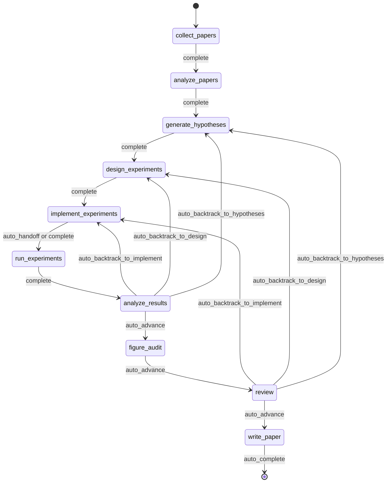
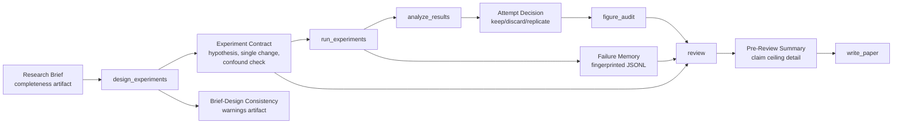
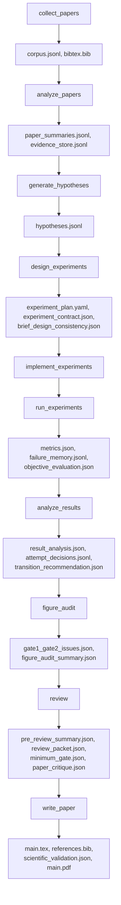

<div align="center">

  <br/>

  

  <h1>An Operating System for Autonomous Research</h1>

  <p><strong>Autonomous research execution, not just research generation.</strong><br/>
  Governed, checkpointed, inspectable research runs from brief to manuscript.</p>

  <p>
    <a href="./README.md"><strong>English</strong></a>
    &nbsp;&middot;&nbsp;
    <a href="./docs/README.ko.md"><strong>한국어</strong></a>
    &nbsp;&middot;&nbsp;
    <a href="./docs/README.ja.md"><strong>日本語</strong></a>
    &nbsp;&middot;&nbsp;
    <a href="./docs/README.zh-CN.md"><strong>简体中文</strong></a>
    &nbsp;&middot;&nbsp;
    <a href="./docs/README.zh-TW.md"><strong>繁體中文</strong></a>
    &nbsp;&middot;&nbsp;
    <a href="./docs/README.es.md"><strong>Español</strong></a>
    &nbsp;&middot;&nbsp;
    <a href="./docs/README.fr.md"><strong>Français</strong></a>
    &nbsp;&middot;&nbsp;
    <a href="./docs/README.de.md"><strong>Deutsch</strong></a>
    &nbsp;&middot;&nbsp;
    <a href="./docs/README.pt.md"><strong>Português</strong></a>
    &nbsp;&middot;&nbsp;
    <a href="./docs/README.ru.md"><strong>Русский</strong></a>
  </p>

  <p><sub>Localized README files are maintained translations of this document. For normative wording and latest edits, use the English README as the canonical reference.</sub></p>

  <p>
    <a href="https://github.com/lhy0718/AutoLabOS/actions/workflows/ci.yml">
      
    </a>
    <a href="https://github.com/lhy0718/AutoLabOS/actions/workflows/smoke.yml">
      
    </a>
    
  </p>

  <p>
    
    
    
  </p>

  <p>
    
    
    
    
  </p>

</div>

---

AutoLabOS is a governed operating system for research execution. It treats a run as checkpointed research state rather than a one-shot generation step.

The core loop is inspectable end to end: literature collection, hypothesis formation, experiment design, execution, analysis, figure audit, review, and manuscript drafting all produce auditable artifacts. Claims stay evidence-bounded through a claim ceiling. Review is a structural gate, not a polish pass.

Quality assumptions are turned into explicit checks. Real behavior matters more than prompt-level appearance. Reproducibility is enforced through artifacts, checkpoints, and inspectable transitions.

---

## Why AutoLabOS Exists

Most research-agent systems are optimized around producing text. AutoLabOS is optimized around running a governed research process.

That difference matters when a project needs more than a plausible-looking draft:

- a research brief that acts as an execution contract
- explicit workflow gates instead of open-ended agent drift
- checkpoints and artifacts that can be inspected after the fact
- review that can stop weak work before manuscript generation
- failure memory so the same failed experiment is not repeated blindly
- evidence-bounded claims rather than prose that outruns the data

AutoLabOS is for teams that want autonomous help without giving up auditability, backtracking, or validation.

---

## What Happens In One Run

One governed run follows the same research arc every time:

`Brief.md` → literature → hypothesis → experiment design → implementation → execution → analysis → figure audit → review → manuscript

In practice:

1. `/new` creates or opens a research brief.
2. `/brief start --latest` validates the brief, snapshots it into the run, and launches a governed run.
3. The system moves through the fixed research workflow, checkpointing state and artifacts at each boundary.
4. Weak evidence triggers backtracking or downgrade instead of automatic polishing.
5. If the review gate passes, `write_paper` drafts a manuscript from bounded evidence.

The historical 9-node contract remains the architectural baseline. In the current runtime, `figure_audit` is the one approved post-analysis checkpoint inserted between `analyze_results` and `review` so figure-quality critique can checkpoint and resume independently.



All automation inside that flow is bounded inside node-internal loops. The workflow stays governed even in unattended modes.

---

## What You Get After A Run

AutoLabOS does not just emit a PDF. It emits a traceable research state.

| Output | What it contains |
|---|---|
| **Literature corpus** | Collected papers, BibTeX, extracted evidence store |
| **Hypotheses** | Literature-grounded hypotheses with skeptical review |
| **Experiment plan** | Governed design with contract, baseline lock, and consistency checks |
| **Executed results** | Metrics, objective evaluation, failure memory log |
| **Result analysis** | Statistical analysis, attempt decisions, transition reasoning |
| **Figure audit** | Figure lint, caption/reference consistency, optional vision critique summary |
| **Review packet** | 5-specialist panel scorecard, claim ceiling, pre-draft critique |
| **Manuscript** | LaTeX draft with evidence links, scientific validation, optional PDF |
| **Checkpoints** | Full state snapshots at every node boundary — resume anytime |

Everything lives under `.autolabos/runs/<run_id>/`, with public-facing outputs mirrored to `outputs/`.

That is the reproducibility model: artifacts, checkpoints, and inspectable transitions rather than hidden state.

---

## Quick Start

```bash
# 1. Install and build
npm install
npm run build
npm link

# 2. Move to a research workspace
cd /path/to/your-research-workspace

# 3. Launch one interface
autolabos        # TUI
autolabos web    # Web UI
```

Typical first-use flow:

```bash
/new
/brief start --latest
/doctor
```

Notes:

- Both UIs guide onboarding if `.autolabos/config.yaml` does not exist yet.
- TUI and Web UI share the same runtime, artifacts, and checkpoints.

### Prerequisites

| Item | When needed | Notes |
|---|---|---|
| `SEMANTIC_SCHOLAR_API_KEY` | Always | Paper discovery and metadata |
| `OPENAI_API_KEY` | When provider is `api` | OpenAI API model execution |
| Codex CLI login | When provider is `codex` | Uses your local Codex session |

---

## Research Brief System

The brief is not just a startup note. It is the governed contract for a run.

`/new` creates or opens `Brief.md`. `/brief start --latest` validates it, snapshots it into the run, and starts execution from that snapshot. The run records the brief source path, the snapshot path, and any parsed manuscript format so the provenance of the run remains inspectable even if the workspace brief changes later.
`Appendix Preferences` can now be structured with `Prefer appendix for:` and `Keep in main body:` so appendix-routing intent is explicit in the brief contract.

That makes the brief part of the audit trail, not just part of the prompt.

In the current contract, `.autolabos/config.yaml` is primarily for provider/runtime defaults and workspace policy. Run-specific research intent, evidence bars, baseline expectations, manuscript-format targets, and manuscript template path belong in the brief. Persisted config may therefore omit brief-owned sections such as research defaults and some manuscript-profile or paper-template fields.

```bash
/new
/brief start --latest
```

Briefs are expected to define both research intent and governance constraints: topic, objective metric, baseline or comparator, minimum acceptable evidence, disallowed shortcuts, and the paper ceiling if evidence remains weak.

<details>
<summary><strong>Brief sections and grading</strong></summary>

| Section | Status | Purpose |
|---|---|---|
| `## Topic` | Required | Research question in 1-3 sentences |
| `## Objective Metric` | Required | Primary success metric |
| `## Constraints` | Recommended | Compute budget, dataset limits, reproducibility rules |
| `## Plan` | Recommended | Step-by-step experiment plan |
| `## Target Comparison` | Governance | Proposed method vs. explicit baseline |
| `## Minimum Acceptable Evidence` | Governance | Minimum effect size, fold count, decision boundary |
| `## Disallowed Shortcuts` | Governance | Shortcuts that invalidate results |
| `## Paper Ceiling If Evidence Remains Weak` | Governance | Maximum paper classification if evidence is insufficient |
| `## Manuscript Format` | Optional | Column count, page budget, reference/appendix rules |

| Grade | Meaning | Paper-scale ready? |
|---|---|---|
| `complete` | Core + 4+ governance sections substantive | Yes |
| `partial` | Core complete + 2+ governance | Proceed with warnings |
| `minimal` | Only core sections | No |

</details>

---

## Two Interfaces, One Runtime

AutoLabOS has two front ends over the same governed runtime.

| | TUI | Web UI |
|---|---|---|
| Launch | `autolabos` | `autolabos web` |
| Interaction | Slash commands, natural language | Browser dashboard and composer |
| Workflow view | Real-time node progress in terminal | Governed workflow graph with actions |
| Artifacts | CLI inspection | Inline preview for text, images, PDFs |
| Operations surfaces | `/watch`, `/queue`, `/explore`, `/doctor` | Jobs queue, live watch cards, exploration status, diagnostics |
| Best for | Fast iteration and direct control | Visual monitoring and artifact browsing |

The important constraint is that both surfaces see the same checkpoints, the same runs, and the same underlying artifacts.

---

## What Makes AutoLabOS Different

AutoLabOS is designed around governed execution rather than prompt-only orchestration.

| | Typical research tools | AutoLabOS |
|---|---|---|
| Workflow | Open-ended agent drift | Governed fixed graph with explicit review boundaries |
| State | Ephemeral | Checkpointed, resumable, inspectable |
| Claims | As strong as the model will generate | Bounded by evidence and a claim ceiling |
| Review | Optional cleanup pass | Structural gate that can block writing |
| Failures | Forgotten and retried | Fingerprinted in failure memory |
| Interfaces | Separate code paths | TUI and Web share one runtime |

This is why the system reads more like research infrastructure than a paper generator.

---

## Core Guarantees

### Governed Workflow

The workflow is bounded and auditable. Backtracking is part of the contract. Results that do not justify forward motion are sent back to hypotheses, design, or implementation rather than polished into stronger prose.

### Checkpointed Research State

Every node boundary writes state you can inspect and resume. The unit of progress is not only text output. It is a run with artifacts, transitions, and recoverable state.

### Claim Ceiling

Claims are kept under the strongest defensible evidence ceiling. The system records blocked stronger claims and the evidence gaps required to unlock them.

### Review As A Structural Gate

`review` is not a cosmetic cleanup stage. It is where readiness, methodology sanity, evidence linkage, writing discipline, and reproducibility handoff are checked before manuscript generation.

### Failure Memory

Failure fingerprints are persisted so structural errors and repeated equivalent failures are not retried blindly.

### Reproducibility Through Artifacts


---

## Validation And Harness-Oriented Quality Model

AutoLabOS treats validation surfaces as first-class.

- `/doctor` checks environment and workspace readiness before a run starts

Paper readiness is not a single binary prompt judgment.

- **Layer 1 - deterministic minimum gate** blocks under-evidenced work with explicit artifact and evidence-integrity checks
- **Layer 2 - LLM paper-quality evaluator** adds structured critique over methodology, evidence strength, writing structure, claim support, and limitations honesty
- **Review packet + specialist panel** determine whether the manuscript path should advance, revise, or backtrack

`paper_readiness.json` can include an `overall_score`. It should be read as a run-quality signal inside the system, not as a universal scientific benchmark. Some advanced evaluation and self-improvement flows use that score to compare runs or candidate prompt mutations.

---

## Advanced Self-Improvement Capabilities

AutoLabOS includes bounded self-improvement paths, but they are governed by validation and rollback rather than blind autonomous rewriting.

### `autolabos meta-harness`

`autolabos meta-harness` builds a context directory from recent completed runs and evaluation history under `outputs/meta-harness/<timestamp>/`.

It can include:

- filtered run events
- node artifacts such as `result_analysis.json` or `review/decision.json`
- `paper_readiness.json`
- `outputs/eval-harness/history.jsonl`
- current `node-prompts/` files for the targeted node

The LLM is instructed through `TASK.md` to return only `TARGET_FILE + unified diff`, and the target is constrained to `node-prompts/`. In apply mode, the candidate must pass validation checks; otherwise the change is rolled back and an audit log is written. `--no-apply` builds context only. `--dry-run` shows the diff without modifying files.

### `autolabos evolve`

`autolabos evolve` runs a bounded mutation-and-evaluation loop over `.codex` and `node-prompts`.

- supports `--max-cycles`, `--target skills|prompts|all`, and `--dry-run`
- reads run fitness from `paper_readiness.overall_score`
- can mutate prompts and skills, run validation, and compare fitness across cycles
- rolls back regressions by restoring `.codex` and `node-prompts` from the last good git tag

This is a self-improvement path, but not an unconstrained repo-wide rewrite path.

### Harness Preset Layer

AutoLabOS also has built-in harness presets such as `base`, `compact`, `failure-aware`, and `review-heavy`. These adjust artifact/context policy, failure-memory emphasis, prompt policy, and compression strategy for comparative evaluation paths without changing the governed production workflow.

---

## Common Commands

| Command | Description |
|---|---|
| `/new` | Create or open `Brief.md` |
| `/brief start <path\|--latest>` | Start research from a brief |
| `/runs [query]` | List or search runs |
| `/resume <run>` | Resume a run |
| `/agent run <node> [run]` | Execute from a graph node |
| `/agent status [run]` | Show node statuses |
| `/agent overnight [run]` | Run unattended with conservative bounds |
| `/agent autonomous [run]` | Run open-ended bounded research exploration |
| `/watch` | Live watch view for active runs and background jobs |
| `/explore` | Show exploration-engine status for the active run |
| `/queue` | Show running, waiting, and stalled jobs |
| `/doctor` | Environment and workspace diagnostics |
| `/model` | Switch model and reasoning effort |

<details>
<summary><strong>Full command list</strong></summary>

| Command | Description |
|---|---|
| `/help` | Show command list |
| `/new` | Create or open workspace `Brief.md` |
| `/brief start <path\|--latest>` | Start research from workspace `Brief.md` or a brief path |
| `/doctor` | Environment + workspace diagnostics |
| `/runs [query]` | List or search runs |
| `/run <run>` | Select run |
| `/resume <run>` | Resume run |
| `/agent list` | List graph nodes |
| `/agent run <node> [run]` | Execute from node |
| `/agent status [run]` | Show node statuses |
| `/agent collect [query] [options]` | Collect papers |
| `/agent recollect <n> [run]` | Collect additional papers |
| `/agent focus <node>` | Move focus with safe jump |
| `/agent graph [run]` | Show graph state |
| `/agent resume [run] [checkpoint]` | Resume from checkpoint |
| `/agent retry [node] [run]` | Retry node |
| `/agent jump <node> [run] [--force]` | Jump node |
| `/agent overnight [run]` | Overnight autonomy (24h) |
| `/agent autonomous [run]` | Open-ended autonomous research |
| `/model` | Model and reasoning selector |
| `/approve` | Approve paused node |
| `/queue` | Show running / waiting / stalled jobs |
| `/watch` | Live watch view for active runs |
| `/explore` | Show exploration-engine status |
| `/retry` | Retry current node |
| `/settings` | Provider and model settings |
| `/quit` | Exit |

</details>

---

## Who This Is For / Not For

### Good fit

- teams that want autonomous help with a governed workflow
- research engineering work where checkpoints and artifacts matter
- paper-scale or paper-adjacent projects that need evidence discipline
- environments where review, traceability, and resumability matter as much as generation

### Not a good fit

- users who only want a fast one-shot draft
- workflows that do not need artifact trails or review gates
- projects that want free-form agent behavior more than governed execution
- cases where a simple literature summary tool is enough

---

## Advanced Details

<details>
<summary><strong>Execution modes</strong></summary>

AutoLabOS preserves the governed workflow and safety gates across every mode.

| Mode | Command | Behavior |
|---|---|---|
| **Interactive** | `autolabos` | Slash-command TUI with explicit approval gates |
| **Minimal approval** | Config: `approval_mode: minimal` | Auto-approves safe transitions |
| **Hybrid approval** | Config: `approval_mode: hybrid` | Auto-advances strong low-risk transitions, pauses risky or low-confidence ones |
| **Overnight** | `/agent overnight [run]` | Unattended single pass, 24-hour limit, conservative backtracking |
| **Autonomous** | `/agent autonomous [run]` | Open-ended bounded research exploration |

</details>

<details>
<summary><strong>Governance artifact flow</strong></summary>



</details>

<details>
<summary><strong>Artifact flow</strong></summary>



</details>

<details>
<summary><strong>Node architecture</strong></summary>

| Node | Role(s) | What it does |
|---|---|---|
| `collect_papers` | collector, curator | Discovers and curates candidate paper set via Semantic Scholar |
| `analyze_papers` | reader, evidence extractor | Extracts summaries and evidence from selected papers |
| `generate_hypotheses` | hypothesis agent + skeptical reviewer | Synthesizes ideas from literature, then pressure-tests them |
| `design_experiments` | designer + feasibility/statistical/ops panel | Filters plans for practicality, writes experiment contract |
| `implement_experiments` | implementer | Produces code and workspace changes through ACI actions |
| `run_experiments` | runner + failure triager + rerun planner | Drives execution, records failures, decides reruns |
| `analyze_results` | analyst + metric auditor + confounder detector | Checks result reliability, writes attempt decisions |
| `figure_audit` | figure auditor + optional vision critique | Checks evidence alignment, captions/references, and publication readiness before review |
| `review` | 5-specialist panel + claim ceiling + two-layer gate | Structural review - blocks writing if evidence is insufficient |
| `write_paper` | paper writer + reviewer critique | Drafts manuscript, runs post-draft critique, builds PDF |

</details>

<details>
<summary><strong>Bounded automation</strong></summary>

| Node | Internal automation | Bound |
|---|---|---|
| `analyze_papers` | Auto-expands evidence window when too sparse | <= 2 expansions |
| `design_experiments` | Deterministic panel scoring + experiment contract | Runs once per design |
| `run_experiments` | Failure triage + one-shot transient rerun | Never retries structural failures |
| `run_experiments` | Failure memory fingerprinting | >= 3 identical exhausts retries |
| `analyze_results` | Objective rematching + result panel calibration | One rematch before human pause |
| `figure_audit` | Gate 3 figure critique + summary aggregation | Vision critique remains independently resumable |
| `write_paper` | Related-work scout + validation-aware repair | 1 repair pass max |

</details>

<details>
<summary><strong>Public output bundle</strong></summary>

```
outputs/<title-slug>-<run_id_prefix>/
  ├── paper/
  ├── experiment/
  ├── analysis/
  ├── review/
  ├── results/
  ├── reproduce/
  ├── manifest.json
  └── README.md
```

</details>

---

## Status

AutoLabOS is an active OSS research-engineering project. The canonical references for behavior and contracts are the repository docs under `docs/`, especially:

- `docs/architecture.md`
- `docs/experiment-quality-bar.md`
- `docs/paper-quality-bar.md`
- `docs/reproducibility.md`
- `docs/research-brief-template.md`

