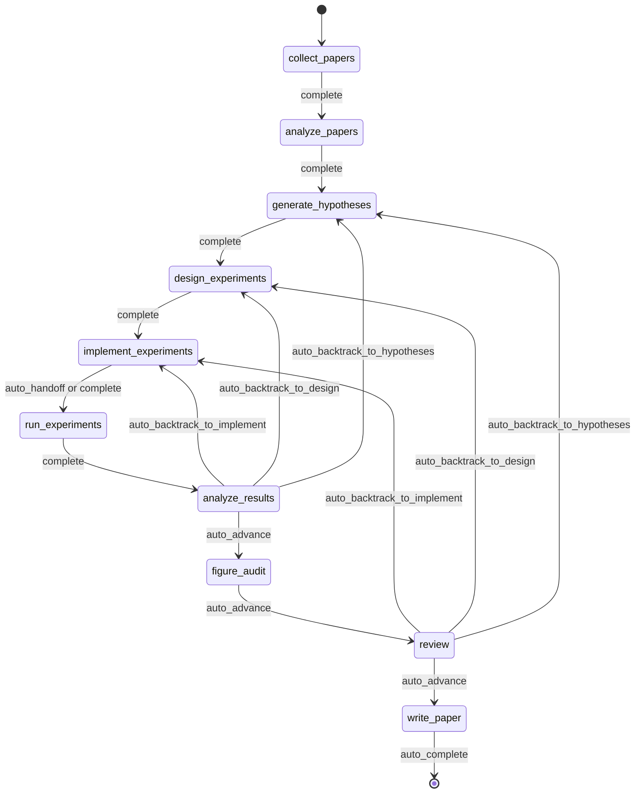
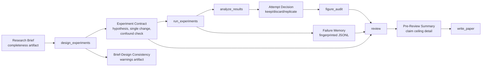
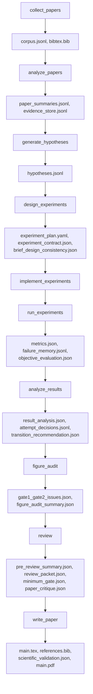

<div align="center">

  <br/>

  

  <h1>Ein Betriebssystem für autonome Forschung</h1>

  <p><strong>Nicht Forschungsgenerierung, sondern autonome Forschungsausführung.</strong><br/>
  Vom Brief bis zum Manuskript in einer governed, checkpointed und inspectable Ausführung.</p>

  <p>
    <a href="../README.md"><strong>English</strong></a>
    &nbsp;&middot;&nbsp;
    <a href="./README.ko.md"><strong>한국어</strong></a>
    &nbsp;&middot;&nbsp;
    <a href="./README.ja.md"><strong>日本語</strong></a>
    &nbsp;&middot;&nbsp;
    <a href="./README.zh-CN.md"><strong>简体中文</strong></a>
    &nbsp;&middot;&nbsp;
    <a href="./README.zh-TW.md"><strong>繁體中文</strong></a>
    &nbsp;&middot;&nbsp;
    <a href="./README.es.md"><strong>Español</strong></a>
    &nbsp;&middot;&nbsp;
    <a href="./README.fr.md"><strong>Français</strong></a>
    &nbsp;&middot;&nbsp;
    <a href="./README.de.md"><strong>Deutsch</strong></a>
    &nbsp;&middot;&nbsp;
    <a href="./README.pt.md"><strong>Português</strong></a>
    &nbsp;&middot;&nbsp;
    <a href="./README.ru.md"><strong>Русский</strong></a>
  </p>

  <p><sub>Die lokalisierten README-Dateien sind gepflegte Übersetzungen dieses Dokuments. Für normative Formulierungen und die neuesten Änderungen ist das englische README die canonical reference.</sub></p>

  <p>
    <a href="https://github.com/lhy0718/AutoLabOS/actions/workflows/ci.yml">
      
    </a>
    <a href="https://github.com/lhy0718/AutoLabOS/actions/workflows/smoke.yml">
      
    </a>
    
  </p>

  <p>
    
    
    
  </p>

  <p>
    
    
    
    
  </p>

</div>

---

AutoLabOS ist ein Betriebssystem für governed research execution. Es behandelt einen Run als checkpointed Forschungszustand und nicht als einmaligen Generierungsschritt.

Die gesamte Kernschleife ist inspectable. Literatursammlung, Hypothesenbildung, Experimentdesign, Implementierung, Ausführung, Analyse, figure audit, Review und Manuskripterstellung erzeugen auditierbare Artefakte. Behauptungen bleiben evidence-bounded unter einem claim ceiling. Review ist kein Polierschritt, sondern ein structural gate.

Qualitätsannahmen werden in explizite Checks übersetzt. Reales Verhalten ist wichtiger als Oberfläche auf Prompt-Ebene. Reproduzierbarkeit wird durch Artefakte, Checkpoints und inspectable transitions erzwungen.

---

## Warum AutoLabOS existiert

Viele Research-Agent-Systeme sind darauf optimiert, Text zu erzeugen. AutoLabOS ist darauf optimiert, einen governed Forschungsprozess auszuführen.

Dieser Unterschied ist wichtig, wenn ein Projekt mehr als einen plausibel wirkenden Entwurf braucht.

- ein research brief als Ausführungsvertrag
- explizite Workflow-Gates statt offener Agentendrift
- Checkpoints und Artefakte, die sich im Nachhinein prüfen lassen
- ein Review, das schwache Arbeit vor der Manuskripterstellung stoppen kann
- failure memory, damit dasselbe fehlgeschlagene Experiment nicht blind wiederholt wird
- evidence-bounded claims statt Prosa, die stärker ist als die Daten

AutoLabOS ist für Teams gedacht, die Autonomie wollen, ohne Auditierbarkeit, Backtracking und Validation aufzugeben.

---

## Was in einem Run passiert

Ein governed Run folgt immer demselben Forschungsbogen.

`Brief.md` → literature → hypothesis → experiment design → implementation → execution → analysis → figure audit → review → manuscript

Praktisch bedeutet das:

1. `/new` erstellt oder öffnet den research brief
2. `/brief start --latest` validiert den brief, speichert einen Snapshot im Run und startet einen governed Run
3. das System durchläuft den festen Workflow und checkpointet State und Artefakte an jeder Grenze
4. bei schwacher Evidence wird zurückgesprungen oder downgraded statt Text automatisch zu polieren
5. nur wenn das Review-Gate passiert wird, schreibt `write_paper` ein Manuskript auf Basis begrenzter Evidence

Der historische 9-node contract bleibt die architektonische Basis. Im aktuellen Runtime ist `figure_audit` der eine zusätzliche, genehmigte Checkpoint zwischen `analyze_results` und `review`, damit Figure-Kritik unabhängig checkpointed und resumed werden kann.



Alle Automatisierung innerhalb dieses Flusses bleibt auf bounded node-internal loops begrenzt. Auch in unbeaufsichtigten Modi bleibt der Workflow governed.

---

## Was du nach einem Run bekommst

AutoLabOS erzeugt nicht nur ein PDF. Es erzeugt einen nachvollziehbaren Forschungszustand.

| Ausgabe | Inhalt |
|---|---|
| **Literatur-Corpus** | gesammelte Papers, BibTeX, extrahierter Evidence Store |
| **Hypothesen** | literaturbasierte Hypothesen mit skeptical review |
| **Experimentplan** | governed design mit contract, baseline lock und Konsistenzprüfungen |
| **Ausgeführte Ergebnisse** | metrics, objective evaluation, failure memory log |
| **Ergebnisanalyse** | statistische Analyse, attempt decisions, transition reasoning |
| **Figure Audit** | figure lint, caption/reference consistency, optionale vision critique |
| **Review Packet** | Scorecard des 5er-Spezialistenpanels, claim ceiling, critique vor dem Draft |
| **Manuskript** | LaTeX-Draft mit evidence links, scientific validation und optionalem PDF |
| **Checkpoints** | vollständige State-Snapshots an jeder Node-Grenze, jederzeit resumable |

Alles liegt unter `.autolabos/runs/<run_id>/`, während öffentliche Ausgaben nach `outputs/` gespiegelt werden.

Das ist das Reproduzierbarkeitsmodell: kein versteckter Zustand, sondern Artefakte, Checkpoints und inspectable transitions.

---

## Quick Start

```bash
# 1. Installieren und bauen
npm install
npm run build
npm link

# 2. In den Research-Workspace wechseln
cd /path/to/your-research-workspace

# 3. Eine Oberfläche starten
autolabos        # TUI
autolabos web    # Web UI
```

Typischer Einstieg:

```bash
/new
/brief start --latest
/doctor
```

Hinweise:

- wenn `.autolabos/config.yaml` fehlt, führen beide UIs durch das Onboarding
- AutoLabOS nicht aus dem Repository-Root starten; verwende `test/` oder einen eigenen Workspace
- TUI und Web UI teilen sich denselben Runtime, dieselben Artefakte und dieselben Checkpoints

### Voraussetzungen

| Punkt | Wann nötig | Hinweise |
|---|---|---|
| `SEMANTIC_SCHOLAR_API_KEY` | Immer | Paper Discovery und Metadata |
| `OPENAI_API_KEY` | Wenn der Provider `api` ist | Ausführung über OpenAI API Modelle |
| Codex CLI Login | Wenn der Provider `codex` ist | Nutzt deine lokale Codex-Session |

---

## Research-Brief-System

Der Brief ist nicht nur ein Startdokument. Er ist der governed contract für einen Run.

`/new` erstellt oder öffnet `Brief.md`. `/brief start --latest` validiert den Brief, snapshotet ihn in den Run und startet die Ausführung auf Basis dieses Snapshots. Der Run speichert den source path des Briefs, den snapshot path und ein eventuell geparstes manuscript format. So bleibt die Provenance des Runs inspectable, auch wenn sich der Workspace-Brief später ändert.

Mit anderen Worten: Der Brief ist nicht nur Teil des Prompts. Er ist Teil des Audit Trails.

Im aktuellen Vertrag speichert `.autolabos/config.yaml` vor allem Provider-/Runtime-Defaults und Workspace-Policy. Die run-spezifische Forschungsabsicht, Evidence-Schwellen, Baseline-Erwartungen, Manuscript-Format-Ziele und der Pfad zum Manuscript-Template gehören dagegen in den Brief. Deshalb kann der persistierte Config `research`-Defaults sowie einige manuscript-profile- bzw. paper-template-Felder auslassen.

```bash
/new
/brief start --latest
```

Ein Brief muss sowohl Forschungsabsicht als auch Governance-Einschränkungen abdecken: topic, objective metric, baseline oder comparator, minimum acceptable evidence, disallowed shortcuts und das paper ceiling, falls die Evidence schwach bleibt.

<details>
<summary><strong>Brief-Abschnitte und Grading</strong></summary>

| Abschnitt | Status | Zweck |
|---|---|---|
| `## Topic` | Erforderlich | Forschungsfrage in 1-3 Sätzen definieren |
| `## Objective Metric` | Erforderlich | Primäre Erfolgsmetrik |
| `## Constraints` | Empfohlen | compute budget, Dataset-Limits, Reproduzierbarkeitsregeln |
| `## Plan` | Empfohlen | Schritt-für-Schritt-Experimentplan |
| `## Target Comparison` | Governance | Vergleich mit einem expliziten Baseline |
| `## Minimum Acceptable Evidence` | Governance | minimale effect size, fold count, decision boundary |
| `## Disallowed Shortcuts` | Governance | Abkürzungen, die Ergebnisse ungültig machen |
| `## Paper Ceiling If Evidence Remains Weak` | Governance | maximale Paper-Klassifikation bei schwacher Evidence |
| `## Manuscript Format` | Optional | Spaltenzahl, Seitenbudget, Regeln für references / appendix |

| Grad | Bedeutung | Paper-scale ready? |
|---|---|---|
| `complete` | Core + 4 oder mehr substanzielle Governance-Abschnitte | Ja |
| `partial` | Core vollständig + 2 oder mehr Governance-Abschnitte | Mit Warnungen fortfahren |
| `minimal` | Nur Core-Abschnitte | Nein |

</details>

---

## Zwei Interfaces, ein Runtime

AutoLabOS bietet zwei Frontends auf demselben governed Runtime.

| | TUI | Web UI |
|---|---|---|
| Start | `autolabos` | `autolabos web` |
| Interaktion | Slash-Commands, natürliche Sprache | Browser-Dashboard und Composer |
| Workflow-Ansicht | Node-Fortschritt in Echtzeit im Terminal | Governed Workflow-Graph mit Aktionen |
| Artefakte | CLI-Inspektion | Inline-Vorschau für Text, Bilder und PDFs |
| Betriebsflächen | `/watch`, `/queue`, `/explore`, `/doctor` | Jobs-Queue, Live-Watch-Karten, Exploration-Status, Diagnostics |
| Geeignet für | schnelle Iteration und direkte Kontrolle | visuelles Monitoring und Artefakt-Browsing |

Wichtig ist, dass beide Oberflächen dieselben Checkpoints, dieselben Runs und dieselben zugrunde liegenden Artefakte sehen.

---

## Was AutoLabOS unterscheidet

AutoLabOS ist auf governed execution ausgelegt, nicht auf prompt-only orchestration.

| | Typische Forschungstools | AutoLabOS |
|---|---|---|
| Workflow | offene Agentendrift | governed fixed graph mit expliziten review boundaries |
| State | flüchtig | checkpointed, resumable, inspectable |
| Claims | so stark, wie das Modell sie formuliert | begrenzt durch Evidence und claim ceiling |
| Review | optionale Cleanup-Passage | structural gate, die Schreiben stoppen kann |
| Failures | werden vergessen und erneut versucht | mit Fingerprint in failure memory gespeichert |
| Validation | nachrangig | `/doctor`, Harnesses, Smoke und Live Validation sind first-class |
| Interfaces | getrennte Codepfade | TUI und Web teilen sich einen Runtime |

Deshalb sollte dieses System eher als Research Infrastructure denn als Paper Generator gelesen werden.

---

## Zentrale Garantien

### Governed Workflow

Der Workflow ist bounded und auditable. Backtracking ist Teil des Contracts. Ergebnisse, die kein Vorankommen rechtfertigen, gehen zurück zu hypotheses, design oder implementation, statt in stärkere Prosa umgewandelt zu werden.

### Checkpointed Research State

Jede Node-Grenze schreibt inspectable und resumable state. Die Einheit des Fortschritts ist nicht nur Text, sondern ein Run mit Artefakten, Transitions und recoverable state.

### Claim Ceiling

Claims bleiben unter dem strongest defensible evidence ceiling. Das System protokolliert blockierte stärkere Claims und die Evidence Gaps, die nötig wären, um sie freizuschalten.

### Review As A Structural Gate

`review` ist kein kosmetischer Cleanup-Schritt. Es ist das structural gate, in dem readiness, methodische Plausibilität, evidence linkage, writing discipline und reproducibility handoff vor der Manuskriptgenerierung geprüft werden.

### Failure Memory

Failure Fingerprints werden persistiert, damit strukturelle Fehler und wiederholte equivalent failures nicht blind erneut ausgeführt werden.

### Reproducibility Through Artifacts

Reproduzierbarkeit wird durch Artefakte, Checkpoints und inspectable transitions erzwungen. Auch öffentlich sichtbare Zusammenfassungen beruhen auf persisted run outputs statt auf einer zweiten Wahrheitsquelle.

---

## Validation und harness-orientiertes Qualitätsmodell

AutoLabOS behandelt Validation Surfaces als first-class.

- `/doctor` prüft Environment und Workspace-Readiness vor dem Start eines Runs
- Harness Validation schützt Workflow-, Artifact- und Governance-Contracts
- Targeted Smoke Checks liefern diagnostische Regressionsabdeckung
- wenn interaktives Verhalten wichtig ist, wird Live Validation verwendet

Paper Readiness ist nicht das Ergebnis eines einzelnen Prompt-Eindrucks.

- **Layer 1 - deterministic minimum gate** stoppt under-evidenced work mit expliziten artifact / evidence-integrity checks
- **Layer 2 - LLM paper-quality evaluator** liefert strukturierte Kritik zu methodology, evidence strength, writing structure, claim support und limitations honesty
- **Review Packet + Specialist Panel** entscheiden, ob der Manuskriptpfad advance, revise oder backtrack soll

`paper_readiness.json` kann ein `overall_score` enthalten. Dieser Wert sollte als internes Run-Quality-Signal gelesen werden, nicht als allgemeiner wissenschaftlicher Benchmark. Einige fortgeschrittene evaluation / self-improvement paths nutzen ihn, um Runs oder Prompt-Mutation-Kandidaten zu vergleichen.

<details>
<summary><strong>Warum dieses Validation-Modell wichtig ist</strong></summary>

Qualitätsannahmen werden in explizite Checks übersetzt. Reales Verhalten zählt mehr als Oberfläche auf Prompt-Ebene. Das Ziel ist nicht „das Modell hat etwas Überzeugendes geschrieben“, sondern „dieser Run lässt sich inspizieren und verteidigen“.

</details>

---

## Fortgeschrittene Self-Improvement-Fähigkeiten

AutoLabOS enthält bounded self-improvement paths, aber keine blinde autonome Umschreibung. Diese Pfade bleiben durch Validation und Rollback begrenzt.

### `autolabos meta-harness`

`autolabos meta-harness` erstellt ein Context Directory unter `outputs/meta-harness/<timestamp>/` auf Basis von recent completed runs und Evaluation-Historie.

Es kann enthalten:

- gefilterte Run Events
- Node-Artefakte wie `result_analysis.json` oder `review/decision.json`
- `paper_readiness.json`
- `outputs/eval-harness/history.jsonl`
- aktuelle `node-prompts/`-Dateien für den Zielknoten

Das LLM wird durch `TASK.md` darauf beschränkt, nur `TARGET_FILE + unified diff` zurückzugeben, und das Ziel ist auf `node-prompts/` begrenzt. Im Apply-Modus muss der Kandidat `validate:harness` bestehen; andernfalls erfolgt Rollback und ein Audit Log wird geschrieben. `--no-apply` erstellt nur den Context. `--dry-run` zeigt den Diff, ohne Dateien zu ändern.

### `autolabos evolve`

`autolabos evolve` führt eine bounded mutation-and-evaluation loop über `.codex` und `node-prompts` aus.

- unterstützt `--max-cycles`, `--target skills|prompts|all` und `--dry-run`
- liest die Run-Fitness aus `paper_readiness.overall_score`
- mutiert Prompts und Skills, führt Validation aus und vergleicht die Fitness über Zyklen hinweg
- bei Regression wird `.codex` und `node-prompts` vom letzten good git tag wiederhergestellt

Das ist ein self-improvement path, aber kein unbeschränkter repo-wide rewrite path.

### Harness Preset Layer

AutoLabOS bietet außerdem built-in harness presets wie `base`, `compact`, `failure-aware` und `review-heavy`. Diese passen artifact/context policy, failure-memory emphasis, prompt policy und compression strategy für vergleichende Evaluationspfade an, ohne den governed production workflow selbst zu ändern.

---

## Häufige Befehle

| Befehl | Beschreibung |
|---|---|
| `/new` | `Brief.md` erstellen oder öffnen |
| `/brief start <path\|--latest>` | Forschung aus einem Brief starten |
| `/runs [query]` | Runs auflisten oder suchen |
| `/resume <run>` | Run fortsetzen |
| `/agent run <node> [run]` | Ab einem Graph-Node ausführen |
| `/agent status [run]` | Node-Status anzeigen |
| `/agent overnight [run]` | Unbeaufsichtigten Run in konservativen Grenzen ausführen |
| `/agent autonomous [run]` | Bounded Research Exploration ausführen |
| `/watch` | Live-Watch-Ansicht für aktive Runs und Hintergrundjobs |
| `/explore` | Status der Exploration Engine des aktiven Runs anzeigen |
| `/queue` | Running / Waiting / Stalled Jobs anzeigen |
| `/doctor` | Environment- und Workspace-Diagnostics |
| `/model` | Modell und Reasoning Effort wechseln |

<details>
<summary><strong>Vollständige Befehlsliste</strong></summary>

| Befehl | Beschreibung |
|---|---|
| `/help` | Befehlsliste anzeigen |
| `/new` | Workspace-`Brief.md` erstellen oder öffnen |
| `/brief start <path\|--latest>` | Forschung aus Workspace-`Brief.md` oder einem angegebenen Brief starten |
| `/doctor` | Environment + Workspace Diagnostics |
| `/runs [query]` | Runs auflisten oder suchen |
| `/run <run>` | Run auswählen |
| `/resume <run>` | Run fortsetzen |
| `/agent list` | Graph-Nodes auflisten |
| `/agent run <node> [run]` | Ab Node ausführen |
| `/agent status [run]` | Node-Status anzeigen |
| `/agent collect [query] [options]` | Papers sammeln |
| `/agent recollect <n> [run]` | Zusätzliche Papers sammeln |
| `/agent focus <node>` | Fokus per Safe Jump verschieben |
| `/agent graph [run]` | Graph-State anzeigen |
| `/agent resume [run] [checkpoint]` | Ab Checkpoint fortsetzen |
| `/agent retry [node] [run]` | Node erneut versuchen |
| `/agent jump <node> [run] [--force]` | Zu einem Node springen |
| `/agent overnight [run]` | Overnight Autonomy (24h) |
| `/agent autonomous [run]` | Open-ended autonomous research |
| `/model` | Modell- und Reasoning-Selector |
| `/approve` | Pausierten Node genehmigen |
| `/queue` | Running / Waiting / Stalled Jobs anzeigen |
| `/watch` | Live-Watch für aktive Runs |
| `/explore` | Status der Exploration Engine anzeigen |
| `/retry` | Aktuellen Node erneut versuchen |
| `/settings` | Provider- und Modell-Einstellungen |
| `/quit` | Beenden |

</details>

---

## Für wen es gedacht ist / nicht gedacht ist

### Gute Passung

- Teams, die Autonomie wollen, ohne governed workflow aufzugeben
- Research Engineering, bei dem Checkpoints und Artefakte wichtig sind
- Paper-scale- oder paper-adjacent-Projekte mit Bedarf an Evidence-Disziplin
- Umgebungen, in denen Review, Traceability und Resumability genauso wichtig sind wie Generation

### Schlechte Passung

- Nutzer, die nur einen schnellen One-shot-Draft wollen
- Workflows ohne Bedarf an Artifact Trail oder Review Gates
- Projekte, die freies Agentenverhalten der governed execution vorziehen
- Fälle, in denen ein einfaches Literature-Summary-Tool ausreicht

---

## Entwicklung

```bash
npm install
npm run build
npm test
npm run test:web
npm run validate:harness
```

Wähle das kleinste Validation-Set, das die Änderung ehrlich abdeckt. Bei interaktiven Defects solltest du dich – wenn die Umgebung es erlaubt – nicht nur auf Tests verlassen, sondern denselben TUI- / Web-Flow erneut ausführen.

Nützliche Befehle:

```bash
npm run test:watch
npm run test:smoke:natural-collect
npm run test:smoke:natural-collect-execute
npm run test:smoke:all
```

---

## Advanced Details

<details>
<summary><strong>Ausführungsmodi</strong></summary>

AutoLabOS behält den governed workflow und die safety gates in allen Modi bei.

| Modus | Befehl | Verhalten |
|---|---|---|
| **Interactive** | `autolabos` | Slash-Command-TUI mit expliziten Approval Gates |
| **Minimal approval** | Config: `approval_mode: minimal` | Genehmigt sichere Übergänge automatisch |
| **Hybrid approval** | Config: `approval_mode: hybrid` | Lässt starke und risikoarme Übergänge automatisch weiterlaufen; pausiert riskante oder wenig vertrauenswürdige Übergänge |
| **Overnight** | `/agent overnight [run]` | Unbeaufsichtigte Ein-Pass-Ausführung, 24-Stunden-Limit, konservatives Backtracking |
| **Autonomous** | `/agent autonomous [run]` | Open-ended bounded research exploration |

</details>

<details>
<summary><strong>Governance Artifact Flow</strong></summary>



</details>

<details>
<summary><strong>Artifact Flow</strong></summary>



</details>

<details>
<summary><strong>Status</strong></summary>

AutoLabOS ist ein aktiv entwickeltes OSS-Research-Engineering-Projekt. Die kanonischen Referenzen für Verhalten und Contracts liegen unter `docs/`, insbesondere:

- `docs/architecture.md`
- `docs/tui-live-validation.md`
- `docs/experiment-quality-bar.md`
- `docs/paper-quality-bar.md`
- `docs/reproducibility.md`
- `docs/research-brief-template.md`

Wenn du Runtime-Verhalten änderst, behandle diese Dokumente, die veröffentlichten Tests und die beobachtbaren Artefakte als source of truth.

</details>
