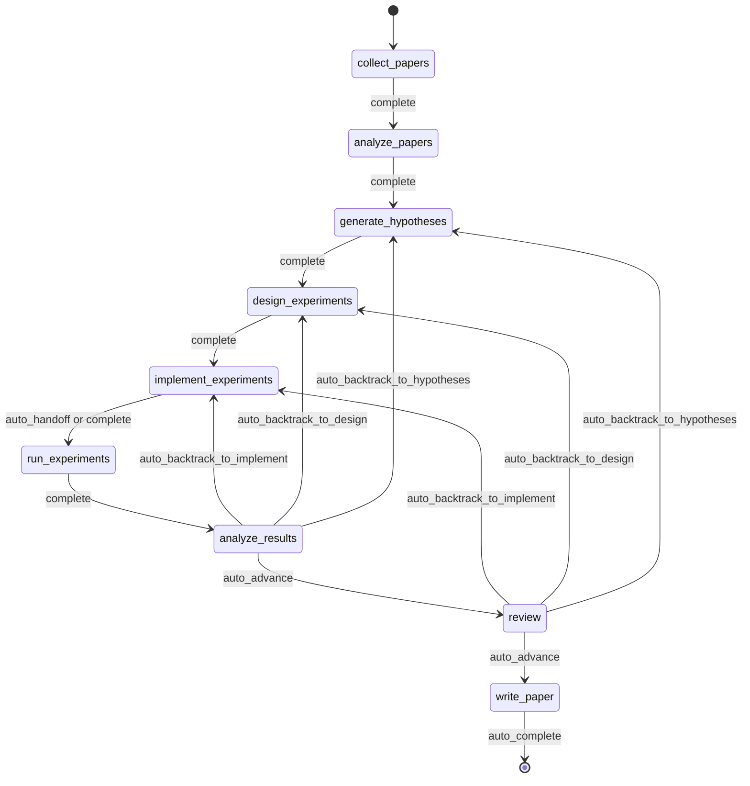
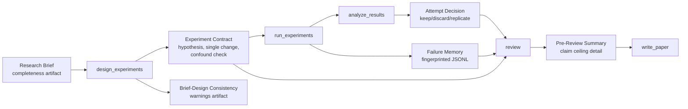
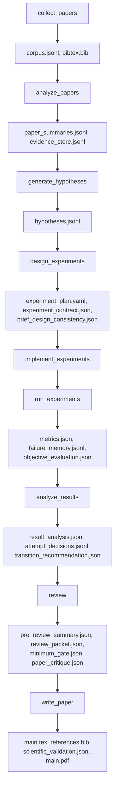
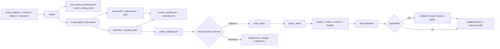
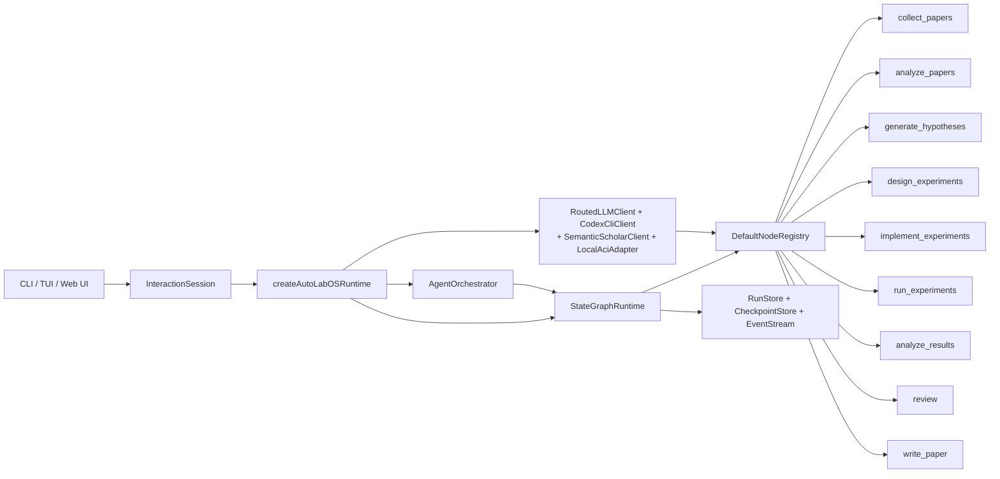

<div align="center">

  <br/>

  

  <h1>Ein Betriebssystem für autonome Forschung</h1>

  <p><strong>Autonome Forschungsausführung, nicht nur Forschungsgenerierung.</strong><br/>
  Von der Literatur bis zum Manuskript — innerhalb einer gesteuerten, checkpointbaren und inspizierbaren Schleife.</p>

  <p>
    <a href="../README.md"><strong>English</strong></a>
    &nbsp;&middot;&nbsp;
    <a href="./README.ko.md"><strong>한국어</strong></a>
    &nbsp;&middot;&nbsp;
    <a href="./README.ja.md"><strong>日本語</strong></a>
    &nbsp;&middot;&nbsp;
    <a href="./README.zh-CN.md"><strong>简体中文</strong></a>
    &nbsp;&middot;&nbsp;
    <a href="./README.zh-TW.md"><strong>繁體中文</strong></a>
    &nbsp;&middot;&nbsp;
    <a href="./README.es.md"><strong>Español</strong></a>
    &nbsp;&middot;&nbsp;
    <a href="./README.fr.md"><strong>Français</strong></a>
    &nbsp;&middot;&nbsp;
    <a href="./README.de.md"><strong>Deutsch</strong></a>
    &nbsp;&middot;&nbsp;
    <a href="./README.pt.md"><strong>Português</strong></a>
    &nbsp;&middot;&nbsp;
    <a href="./README.ru.md"><strong>Русский</strong></a>
  </p>

  <p><sub>Lokalisierte README-Dateien sind gepflegte Übersetzungen dieses Dokuments. Für normative Formulierungen und die neuesten Änderungen gilt das englische README als kanonische Referenz.</sub></p>

  <!-- CI & Quality -->
  <p>
    <a href="https://github.com/lhy0718/AutoLabOS/actions/workflows/ci.yml">
      
    </a>
    <a href="https://github.com/lhy0718/AutoLabOS/actions/workflows/smoke.yml">
      
    </a>
    
  </p>

  <!-- Tech stack -->
  <p>
    
    
    
  </p>

  <!-- Core features -->
  <p>
    
    
    
    
  </p>

  <!-- Integrations -->
  <p>
    
    
    
    
  </p>

  <!-- Community -->
  <p>
    <a href="https://github.com/lhy0718/AutoLabOS/stargazers">
      
    </a>
    <a href="https://github.com/lhy0718/AutoLabOS/commits/main">
      
    </a>
  </p>

</div>

---

Die meisten Werkzeuge, die behaupten, Forschung zu automatisieren, automatisieren in Wirklichkeit **Textgenerierung**. Sie erzeugen poliert wirkende Ergebnisse auf Basis oberflächlicher Überlegungen — ohne Experiment-Governance, ohne Evidenzverfolgung und ohne ehrliche Bilanzierung dessen, was die Evidenz tatsächlich trägt.

AutoLabOS nimmt eine andere Position ein: **Der schwierige Teil von Forschung ist nicht das Schreiben — es ist die Disziplin zwischen der Frage und dem Entwurf.** Literaturfundierung, Hypothesentests, Experiment-Governance, Fehlerverfolgung, Claim-Begrenzung und Review-Gating finden alle innerhalb eines festen 9-Knoten-Zustandsgraphen statt. Jeder Knoten erzeugt prüfbare Artefakte. Jeder Übergang wird als Checkpoint gespeichert. Jeder Claim hat eine Evidenzobergrenze.

Das Ergebnis ist nicht nur ein Paper. Es ist ein gesteuerter Forschungszustand, den man inspizieren, fortsetzen und verteidigen kann.

> **Evidenz zuerst. Claims danach.**
>
> **Runs, die man inspizieren, fortsetzen und verteidigen kann.**
>
> **Ein Forschungsbetriebssystem, kein Prompt-Paket.**
>
> **Ihr Labor sollte dasselbe gescheiterte Experiment nicht zweimal wiederholen.**
>
> **Review ist ein strukturelles Gate, kein Polierschritt.**

---

## Was man nach einem Run erhält

AutoLabOS produziert nicht nur ein PDF. Es erzeugt einen vollständigen, nachvollziehbaren Forschungszustand:

| Ausgabe | Inhalt |
|---|---|
| **Literaturkorpus** | Gesammelte Paper, BibTeX, extrahierter Evidenz-Speicher |
| **Hypothesen** | Literaturbasierte Hypothesen mit skeptischer Überprüfung |
| **Experimentplan** | Gesteuertes Design mit Vertrag, Baseline-Lock und Konsistenzprüfungen |
| **Ausgeführte Ergebnisse** | Metriken, objektive Bewertung, Failure-Memory-Log |
| **Ergebnisanalyse** | Statistische Analyse, Versuchsentscheidungen, Transitionsreasonierung |
| **Review-Paket** | 5-Spezialisten-Scorecard, Claim-Ceiling, Vor-Entwurf-Kritik |
| **Manuskript** | LaTeX-Entwurf mit Evidenzlinks, wissenschaftlicher Validierung, optionalem PDF |
| **Checkpoints** | Vollständige Zustandssnapshots an jeder Knotengrenze — jederzeit fortsetzbar |

Alles liegt unter `.autolabos/runs/<run_id>/`, öffentliche Ausgaben werden nach `outputs/` gespiegelt.

---

## Warum AutoLabOS?

Die meisten KI-Forschungswerkzeuge optimieren die **äußere Erscheinung** der Ergebnisse. AutoLabOS optimiert **gesteuerte Ausführung**.

| | Typische Forschungstools | AutoLabOS |
|---|---|---|
| Workflow | Offene Agentendrift | Fester 9-Knoten-Graph mit begrenzten Transitionen |
| Experimentdesign | Unstrukturiert | Verträge mit Single-Change-Regel und Confound-Erkennung |
| Fehlgeschlagene Experimente | Vergessen und wiederholt | In Failure Memory fingerprinted, nie wiederholt |
| Claims | So stark wie das LLM sie formuliert | Durch ein evidenzgebundenes Claim Ceiling begrenzt |
| Review | Optionaler Aufräumschritt | Strukturelles Gate — blockiert Schreiben bei unzureichender Evidenz |
| Paper-Bewertung | Ein einzelner LLM-„Sieht gut aus"-Check | Zwei-Schichten-Gate: deterministisches Minimum + LLM-Qualitätsevaluator |
| Zustand | Ephemer | Checkpointed, fortsetzbar, inspizierbar |

---

## Schnellstart

```bash
# 1. Installieren und bauen
npm install && npm run build && npm link

# 2. Zum Forschungsarbeitsbereich wechseln
cd /path/to/your-research-project

# 3. Starten (eines wählen)
autolabos web    # Browser-UI — Onboarding, Dashboard, Artefakt-Browser
autolabos        # Terminal-zentrierter Slash-Command-Workflow
```

> **Erster Start?** Beide UIs führen durch das Onboarding, wenn `.autolabos/config.yaml` noch nicht existiert.

### Voraussetzungen

| Element | Wann benötigt | Hinweise |
|---|---|---|
| `SEMANTIC_SCHOLAR_API_KEY` | Immer | Paper-Erkennung und Metadaten |
| `OPENAI_API_KEY` | Wenn Provider oder PDF-Modus `api` ist | OpenAI-API-Modellausführung |
| Codex-CLI-Login | Wenn Provider oder PDF-Modus `codex` ist | Nutzt Ihre lokale Codex-Sitzung |

---

## Der 9-Knoten-Workflow

Ein fester Graph. Kein Vorschlag — ein Vertrag.



`collect_papers` → `analyze_papers` → `generate_hypotheses` → `design_experiments` → `implement_experiments` → `run_experiments` → `analyze_results` → `review` → `write_paper`

Backtracking ist eingebaut. Wenn die Ergebnisse schwach sind, leitet der Graph zurück zu Hypothesen oder Design — nicht vorwärts in wunschbasiertes Schreiben. Alle Automatisierung findet innerhalb begrenzter knoteninterner Schleifen statt.

---

## Kerneigenschaften

### Experiment-Governance

Jeder Experimentlauf durchläuft einen strukturierten Vertrag:

- **Experimentvertrag** — sperrt Hypothese, Kausalmechanismus, Single-Change-Regel, Abbruchbedingung und Behalten/Verwerfen-Kriterien
- **Confound-Erkennung** — erkennt Konjunktionsänderungen, listenförmige Interventionen und Mechanismus-Änderungs-Mismatches
- **Brief-Design-Konsistenz** — warnt, wenn das Design vom ursprünglichen Forschungs-Brief abweicht
- **Baseline-Lock** — der Vergleichsvertrag fixiert objektive Metrik und Baseline vor der Ausführung

### Claim-Ceiling-Durchsetzung

Das System lässt Claims nicht über die Evidenz hinauslaufen.

Der `review`-Knoten erzeugt ein `pre_review_summary`, das den **stärksten verteidigbaren Claim**, eine Liste **blockierter stärkerer Claims** mit Begründungen und **Evidenzlücken** enthält, die gefüllt werden müssten, um diese freizuschalten. Diese Obergrenze fließt direkt in die Manuskripterstellung ein.

### Failure Memory

Run-bezogenes JSONL, das Fehlermuster aufzeichnet und dedupliziert:

- **Error-Fingerprinting** — entfernt Zeitstempel, Pfade und Zahlen für stabile Clusterbildung
- **Stopp bei äquivalenten Fehlern** — 3+ identische Fingerprints erschöpfen die Wiederholungsversuche sofort
- **Do-not-retry-Marker** — strukturelle Fehler blockieren die erneute Ausführung, bis sich das Design ändert

Ihr Labor lernt innerhalb eines Runs aus seinen eigenen Fehlern.

### Zwei-Schichten-Papierbewertung

Paper-Readiness ist kein einzelnes LLM-Urteil.

- **Schicht 1 — Deterministisches Mindest-Gate**: 7 Artefakt-Vorhandenseinsprüfungen, die unterbelegt Arbeiten kategorisch daran hindern, `write_paper` zu betreten. Kein LLM beteiligt. Bestanden oder durchgefallen.
- **Schicht 2 — LLM-Paperqualitätsevaluator**: Strukturierte Kritik über 6 Dimensionen — Ergebnisbedeutung, methodische Strenge, Evidenzstärke, Schreibstruktur, Claim-Unterstützung und Ehrlichkeit der Limitationen. Erzeugt blockierende Probleme, nicht-blockierende Probleme und eine Manuskripttyp-Klassifikation.

Wenn die Evidenz unzureichend ist, empfiehlt das System Backtracking — nicht Polieren.

### 5-Spezialisten-Reviewpanel

Der `review`-Knoten führt fünf unabhängige Spezialistendurchläufe aus:

1. **Claim-Verifizierer** — prüft Claims gegen Evidenz
2. **Methodologie-Reviewer** — validiert das Experimentdesign
3. **Statistik-Reviewer** — bewertet quantitative Strenge
4. **Schreibbereitschaft** — prüft Klarheit und Vollständigkeit
5. **Integritäts-Reviewer** — identifiziert Verzerrungen und Konflikte

Das Panel erzeugt eine Scorecard, eine Konsistenzbewertung und eine Gate-Entscheidung.

---

## Duales Interface

Zwei UI-Oberflächen, eine Runtime. Dieselben Artefakte, derselbe Workflow, dieselben Checkpoints.

| | TUI | Web Ops UI |
|---|---|---|
| Start | `autolabos` | `autolabos web` |
| Interaktion | Slash-Commands, natürliche Sprache | Browser-Dashboard, Composer |
| Workflow-Ansicht | Echtzeit-Knotenfortschritt im Terminal | 9-Knoten-Visualgraph mit Aktionen |
| Artefakte | CLI-Inspektion | Inline-Vorschau (Text, Bilder, PDFs) |
| Geeignet für | Schnelle Iteration, Skripting | Visuelle Überwachung, Artefakt-Browsing |

---

## Ausführungsmodi

AutoLabOS bewahrt den 9-Knoten-Workflow und alle Sicherheits-Gates in jedem Modus.

| Modus | Befehl | Verhalten |
|---|---|---|
| **Interaktiv** | `autolabos` | Slash-Command-TUI mit expliziten Freigabe-Gates |
| **Minimale Freigabe** | Konfiguration: `approval_mode: minimal` | Genehmigt sichere Transitionen automatisch |
| **Overnight** | `/agent overnight [run]` | Unbeaufsichtigter Einzeldurchlauf, 24-Stunden-Limit, konservatives Backtracking |
| **Autonom** | `/agent autonomous [run]` | Offene Forschungsexploration, kein Zeitlimit |

### Autonomer Modus

Konzipiert für dauerhafte Hypothese-→-Experiment-→-Analyse-Schleifen mit minimaler Intervention. Führt zwei parallele interne Schleifen aus:

1. **Forschungsexploration** — Hypothesen generieren, Experimente entwerfen/ausführen, analysieren, nächste Hypothese ableiten
2. **Paperqualitätsverbesserung** — stärksten Zweig identifizieren, Baselines verschärfen, Evidenzverknüpfung stärken

Stoppt bei: explizitem Benutzerstopp, Ressourcenlimits, Stagnationserkennung oder katastrophalem Fehler. Stoppt **nicht** allein deshalb, weil ein Experiment negativ war oder die Paperqualität vorübergehend stagniert.

---

## Forschungs-Brief-System

Jeder Run startet mit einem strukturierten Markdown-Brief, der Umfang, Einschränkungen und Governance-Regeln definiert.

```bash
/new                        # Brief erstellen
/brief start --latest       # Validieren, Snapshot, extrahieren, starten
```

Briefs enthalten **Kern**-Abschnitte (Thema, objektive Metrik) und **Governance**-Abschnitte (Zielvergleich, Mindest-Evidenz, unerlaubte Abkürzungen, Paper-Ceiling). AutoLabOS bewertet die Brief-Vollständigkeit und warnt, wenn die Governance-Abdeckung für paperrelevante Arbeit unzureichend ist.

<details>
<summary><strong>Brief-Abschnitte und Bewertung</strong></summary>

| Abschnitt | Status | Zweck |
|---|---|---|
| `## Topic` | Erforderlich | Forschungsfrage in 1–3 Sätzen |
| `## Objective Metric` | Erforderlich | Primäre Erfolgsmetrik |
| `## Constraints` | Empfohlen | Rechenbudget, Datensatzlimits, Reproduzierbarkeitsregeln |
| `## Plan` | Empfohlen | Schrittweiser Experimentplan |
| `## Target Comparison` | Governance | Vorgeschlagene Methode vs. explizite Baseline |
| `## Minimum Acceptable Evidence` | Governance | Minimale Effektgröße, Fold-Anzahl, Entscheidungsgrenze |
| `## Disallowed Shortcuts` | Governance | Abkürzungen, die Ergebnisse ungültig machen |
| `## Paper Ceiling If Evidence Remains Weak` | Governance | Maximale Paperklassifikation bei unzureichender Evidenz |
| `## Manuscript Format` | Optional | Spaltenanzahl, Seitenbudget, Referenz-/Anhangregeln |

| Bewertung | Bedeutung | Bereit für Paperskala? |
|---|---|---|
| `complete` | Kern + 4+ substanzielle Governance-Abschnitte | Ja |
| `partial` | Kern vollständig + 2+ Governance | Mit Warnungen fortfahren |
| `minimal` | Nur Kernabschnitte | Nein |

</details>

---

## Governance-Artefaktfluss



---

## Artefaktfluss

Jeder Knoten erzeugt strukturierte, inspizierbare Artefakte.



<details>
<summary><strong>Öffentliches Ausgabe-Bundle</strong></summary>

```
outputs/
  ├── paper/           # TeX-Quelle, PDF, Referenzen, Build-Log
  ├── experiment/      # Baseline-Zusammenfassung, Experimentcode
  ├── analysis/        # Ergebnistabelle, Evidenzanalyse
  ├── review/          # Paper-Kritik, Gate-Entscheidung
  ├── results/         # Kompakte quantitative Zusammenfassungen
  ├── reproduce/       # Reproduktionsskripte, README
  ├── manifest.json    # Abschnittsregister
  └── README.md        # Menschenlesbare Run-Zusammenfassung
```

</details>

---

## Knotenarchitektur

| Knoten | Rolle(n) | Aufgabe |
|---|---|---|
| `collect_papers` | Sammler, Kurator | Entdeckt und kuratiert Kandidatenpapiere über Semantic Scholar |
| `analyze_papers` | Leser, Evidenzextraktor | Extrahiert Zusammenfassungen und Evidenz aus ausgewählten Papieren |
| `generate_hypotheses` | Hypothesenagent + skeptischer Reviewer | Synthetisiert Ideen aus der Literatur und unterzieht sie einem Stresstest |
| `design_experiments` | Designer + Machbarkeits-/Statistik-/Ops-Panel | Filtert Pläne auf Praktikabilität und schreibt den Experimentvertrag |
| `implement_experiments` | Implementierer | Erzeugt Code und Workspace-Änderungen über ACI-Aktionen |
| `run_experiments` | Runner + Fehler-Triager + Rerun-Planer | Treibt die Ausführung an, zeichnet Fehler auf, entscheidet über Reruns |
| `analyze_results` | Analyst + Metrik-Auditor + Confounder-Detektor | Prüft Ergebniszuverlässigkeit und schreibt Versuchsentscheidungen |
| `review` | 5-Spezialisten-Panel + Claim Ceiling + Zwei-Schichten-Gate | Strukturelles Review — blockiert Schreiben bei unzureichender Evidenz |
| `write_paper` | Paper-Autor + Reviewer-Kritik | Entwirft Manuskript, führt Post-Entwurf-Kritik aus, erstellt PDF |

<details>
<summary><strong>Phasenweise Verbindungsgraphen</strong></summary>

**Entdeckung und Lesen**

```mermaid
flowchart LR
    Topic["run topic + collect constraints"] --> CP["collect_papers"]
    CP --> CC["collector_curator"]
    CC --> SS["Semantic Scholar search"]
    SS --> Enrich["enrichment + BibTeX recovery"]
    Enrich --> Corpus["corpus.jsonl + bibtex.bib"]
    Corpus --> AP["analyze_papers"]
    AP --> Select["selection request + hybrid rerank"]
    Select --> Manifest["analysis_manifest resume / prune"]
    Manifest --> RE["reader_evidence_extractor"]
    RE --> Pdf["local text/image analysis or Responses API PDF"]
    Pdf --> ReviewLoop["extractor -> reviewer normalization"]
    ReviewLoop --> Evidence["paper_summaries.jsonl + evidence_store.jsonl"]
```



**Hypothese und Experimentdesign**

```mermaid
flowchart LR
    Evidence["paper_summaries.jsonl + evidence_store.jsonl"] --> GH["generate_hypotheses"]
    GH --> HA["hypothesis_agent"]
    HA --> Axes["evidence synthesizer -> evidence axes"]
    Axes --> ToT["ToT branch expansion"]
    ToT --> Drafts["mechanism / contradiction / intervention drafts"]
    Drafts --> Reviews["skeptical reviewer"]
    Reviews --> Select["diversity + evidence-quality top-k selection"]
    Select --> Hyp["hypotheses.jsonl + axes/reviews/llm_trace"]
    Hyp --> DE["design_experiments"]
    DE --> ED["experiment_designer"]
    ED --> Profiles["constraint profile + objective metric profile"]
    Profiles --> Plans["design candidates"]
    Plans --> Panel["designer + feasibility + statistical + ops-capacity panel"]
    Panel --> Choice["panel selection"]
    Choice --> Contract["experiment_contract.json + brief_design_consistency.json"]
```



**Implementierung, Ausführung und Ergebnisschleife**

```mermaid
flowchart LR
    PlanYaml["experiment_plan.yaml"] --> IE["implement_experiments"]
    IE --> IM["ImplementSessionManager"]
    IM --> Impl["implementer"]
    IM --> Codex["Codex CLI session"]
    Codex --> VerifyPatch["local verification"]
    VerifyPatch --> Handoff{"auto handoff?"}
    Handoff -->|yes| RX["run_experiments"]
    Handoff -->|no| Gate["approval boundary"]
    Gate --> RX
    RX --> Runner["runner"]
    Runner --> FailCheck["failure memory: check do-not-retry"]
    FailCheck --> ACI["ACI preflight/tests/command"]
    ACI --> Triage["failure triager + rerun planner"]
    Triage -->|retry once if transient| ACI
    ACI --> FailRecord["record to failure_memory.jsonl"]
    ACI --> Metrics["metrics.json + supplemental runs"]
    Metrics --> AR["analyze_results"]
    AR --> ResultPanel["metric auditor + robustness + confounder + calibrator"]
    ResultPanel --> AttemptDec["attempt_decisions.jsonl"]
    ResultPanel --> Synth["transition recommendation"]
    Synth -->|advance| RV["review"]
    Synth -->|backtrack| IE
```



**Review, Schreiben und Veröffentlichung**



</details>

---

## Begrenzte Automatisierung

Jede interne Automatisierung hat eine explizite Obergrenze.

| Knoten | Interne Automatisierung | Obergrenze |
|---|---|---|
| `analyze_papers` | Automatische Erweiterung des Evidenzfensters bei zu geringer Datenlage | Maximal 2 Erweiterungen |
| `design_experiments` | Deterministische Panelbewertung + Experimentvertrag | Einmal pro Design |
| `run_experiments` | Fehler-Triage + einmaliger transienter Rerun | Strukturelle Fehler werden nie wiederholt |
| `run_experiments` | Failure-Memory-Fingerprinting | 3+ identische Fingerprints erschöpfen Wiederholungsversuche |
| `analyze_results` | Objektives Rematching + Ergebnis-Panel-Kalibrierung | Ein Rematch vor menschlichem Eingriff |
| `write_paper` | Related-Work-Scout + validierungsbewusste Reparatur | Maximal 1 Reparaturdurchlauf |

---

## Häufige Befehle

| Befehl | Beschreibung |
|---|---|
| `/new` | Forschungs-Brief erstellen |
| `/brief start <path\|--latest>` | Forschung aus einem Brief starten |
| `/runs [query]` | Runs auflisten oder durchsuchen |
| `/resume <run>` | Einen Run fortsetzen |
| `/agent run <node> [run]` | Ab einem Graphknoten ausführen |
| `/agent status [run]` | Knotenstatus anzeigen |
| `/agent overnight [run]` | Unbeaufsichtigt ausführen (24-Stunden-Limit) |
| `/agent autonomous [run]` | Offene autonome Forschung |
| `/model` | Modell und Reasoning-Aufwand wechseln |
| `/doctor` | Umgebungs- + Workspace-Diagnose |

<details>
<summary><strong>Vollständige Befehlsliste</strong></summary>

| Befehl | Beschreibung |
|---|---|
| `/help` | Befehlsliste anzeigen |
| `/new` | Forschungs-Brief-Datei erstellen |
| `/brief start <path\|--latest>` | Forschung aus einer Brief-Datei starten |
| `/doctor` | Umgebungs- + Workspace-Diagnose |
| `/runs [query]` | Runs auflisten oder durchsuchen |
| `/run <run>` | Run auswählen |
| `/resume <run>` | Run fortsetzen |
| `/agent list` | Graphknoten auflisten |
| `/agent run <node> [run]` | Ab einem Knoten ausführen |
| `/agent status [run]` | Knotenstatus anzeigen |
| `/agent collect [query] [options]` | Paper sammeln |
| `/agent recollect <n> [run]` | Zusätzliche Paper sammeln |
| `/agent focus <node>` | Fokus mit sicherem Sprung verschieben |
| `/agent graph [run]` | Graphzustand anzeigen |
| `/agent resume [run] [checkpoint]` | Ab Checkpoint fortsetzen |
| `/agent retry [node] [run]` | Knoten erneut versuchen |
| `/agent jump <node> [run] [--force]` | Zu Knoten springen |
| `/agent overnight [run]` | Overnight-Autonomie (24 Stunden) |
| `/agent autonomous [run]` | Offene autonome Forschung |
| `/model` | Modell- und Reasoning-Selektor |
| `/approve` | Pausierten Knoten freigeben |
| `/retry` | Aktuellen Knoten erneut versuchen |
| `/settings` | Provider- und Modelleinstellungen |
| `/quit` | Beenden |

</details>

<details>
<summary><strong>Sammeloptionen und Beispiele</strong></summary>

```
--limit <n>          --last-years <n>      --year <spec>
--date-range <s:e>   --sort <relevance|citationCount|publicationDate>
--order <asc|desc>   --min-citations <n>   --open-access
--field <csv>        --venue <csv>         --type <csv>
--bibtex <generated|s2|hybrid>             --dry-run
--additional <n>     --run <run_id>
```

```bash
/agent collect --last-years 5 --sort relevance --limit 100
/agent collect "agent planning" --sort citationCount --min-citations 100
/agent collect --additional 200 --run <run_id>
```

</details>

---

## Web Ops UI

`autolabos web` startet eine lokale Browser-UI unter `http://127.0.0.1:4317`.

- **Onboarding** — gleiche Einrichtung wie im TUI, schreibt `.autolabos/config.yaml`
- **Dashboard** — Run-Suche, 9-Knoten-Workflow-Ansicht, Knotenaktionen, Live-Logs
- **Artefakte** — Runs durchsuchen, Text/Bilder/PDFs inline vorschauen
- **Composer** — Slash-Commands und natürliche Sprache, mit schrittweiser Plansteuerung

```bash
autolabos web                              # Standardport 4317
autolabos web --host 0.0.0.0 --port 8080  # Benutzerdefinierte Bindung
```

---

## Philosophie

AutoLabOS basiert auf einigen harten Einschränkungen:

- **Workflow-Abschluss ≠ Paper-Readiness.** Ein Run kann den Graphen durchlaufen, ohne dass die Ausgabe paper-tauglich ist. Das System verfolgt den Unterschied.
- **Claims dürfen Evidenz nicht übersteigen.** Das Claim Ceiling wird strukturell durchgesetzt, nicht durch stärkeres Prompting.
- **Review ist ein Gate, kein Vorschlag.** Wenn die Evidenz unzureichend ist, blockiert der `review`-Knoten `write_paper` und empfiehlt Backtracking.
- **Negative Ergebnisse sind erlaubt.** Eine gescheiterte Hypothese ist ein valides Forschungsergebnis — muss aber ehrlich dargestellt werden.
- **Reproduzierbarkeit ist eine Artefakteigenschaft.** Checkpoints, Experimentverträge, Fehlerprotokolle und Evidenzspeicher existieren, damit die Schlussfolgerungen eines Runs nachvollzogen und hinterfragt werden können.

---

## Entwicklung

```bash
npm install              # Abhängigkeiten installieren (installiert auch das Web-Subpaket)
npm run build            # TypeScript + Web-UI bauen
npm test                 # Alle Unit-Tests ausführen (931+)
npm run test:watch       # Watch-Modus

# Einzelne Testdatei
npx vitest run tests/<name>.test.ts

# Smoke-Tests
npm run test:smoke:all                      # Vollständiges lokales Smoke-Bundle
npm run test:smoke:natural-collect          # NL-Sammlung -> ausstehender Befehl
npm run test:smoke:natural-collect-execute  # NL-Sammlung -> Ausführung -> Verifizierung
npm run test:smoke:ci                       # CI-Smoke-Auswahl
```

<details>
<summary><strong>Smoke-Test-Umgebungsvariablen</strong></summary>

```bash
AUTOLABOS_FAKE_CODEX_RESPONSE=1              # Live-Codex-Aufrufe vermeiden
AUTOLABOS_FAKE_SEMANTIC_SCHOLAR_RESPONSE=1   # Live-S2-Aufrufe vermeiden
AUTOLABOS_SMOKE_VERBOSE=1                    # Vollständige PTY-Logs ausgeben
AUTOLABOS_SMOKE_MODE=<mode>                  # CI-Modus-Auswahl
```

</details>

<details>
<summary><strong>Runtime-Interna</strong></summary>

### Zustandsgraph-Richtlinien

- Checkpoints: `.autolabos/runs/<run_id>/checkpoints/` — Phasen: `before | after | fail | jump | retry`
- Retry-Richtlinie: `maxAttemptsPerNode = 3`
- Auto-Rollback: `maxAutoRollbacksPerNode = 2`
- Sprungmodi: `safe` (aktueller oder vorheriger) / `force` (vorwärts, übersprungene Knoten werden aufgezeichnet)

### Agent-Runtime-Muster

- **ReAct**-Schleife: `PLAN_CREATED → TOOL_CALLED → OBS_RECEIVED`
- **ReWOO**-Aufteilung (Planer/Worker): wird für kostenintensive Knoten verwendet
- **ToT** (Tree-of-Thoughts): wird in Hypothesen- und Designknoten verwendet
- **Reflexion**: Fehlerepisoden werden gespeichert und bei Wiederholungsversuchen wiederverwendet

### Speicherschichten

| Schicht | Geltungsbereich | Format |
|---|---|---|
| Run-Kontextspeicher | Pro Run, Key/Value | `run_context.jsonl` |
| Langzeitspeicher | Über Versuche hinweg | JSONL-Zusammenfassung und Index |
| Episodenspeicher | Reflexion | Fehlerlektionen für Wiederholungsversuche |

### ACI-Aktionen

`implement_experiments` und `run_experiments` führen aus über:
`read_file` · `write_file` · `apply_patch` · `run_command` · `run_tests` · `tail_logs`

</details>

<details>
<summary><strong>Agent-Runtime-Diagramm</strong></summary>



</details>

---

## Dokumentation

| Dokument | Abdeckung |
|---|---|
| `docs/architecture.md` | Systemarchitektur und Designentscheidungen |
| `docs/tui-live-validation.md` | TUI-Validierung und Testansatz |
| `docs/experiment-quality-bar.md` | Standards für Experimentausführung |
| `docs/paper-quality-bar.md` | Qualitätsanforderungen an Manuskripte |
| `docs/reproducibility.md` | Reproduzierbarkeitsgarantien |
| `docs/research-brief-template.md` | Vollständige Brief-Vorlage mit allen Governance-Abschnitten |

---

## Status

AutoLabOS befindet sich in aktiver Entwicklung (v0.1.0). Workflow, Governance-System und Kern-Runtime sind funktionsfähig und getestet. Interfaces, Artefaktabdeckung und Ausführungsmodi werden fortlaufend validiert.

Beiträge und Feedback sind willkommen — siehe [Issues](https://github.com/lhy0718/AutoLabOS/issues).

---

<div align="center">
  <sub>Gebaut für Forschende, die ihre Experimente gesteuert und ihre Claims verteidigbar wollen.</sub>
</div>
