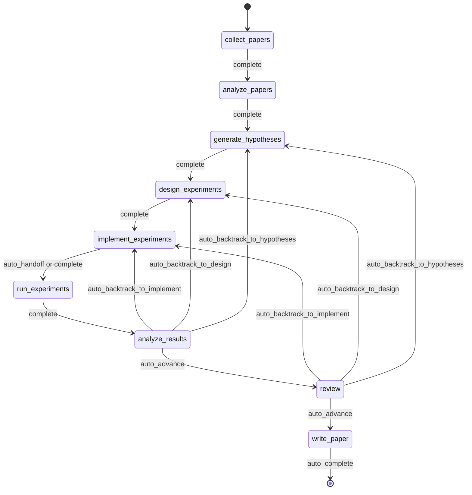
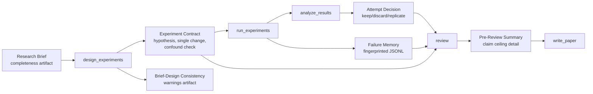
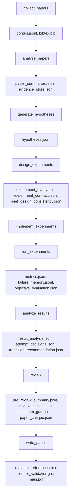
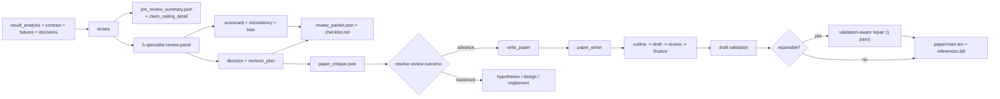
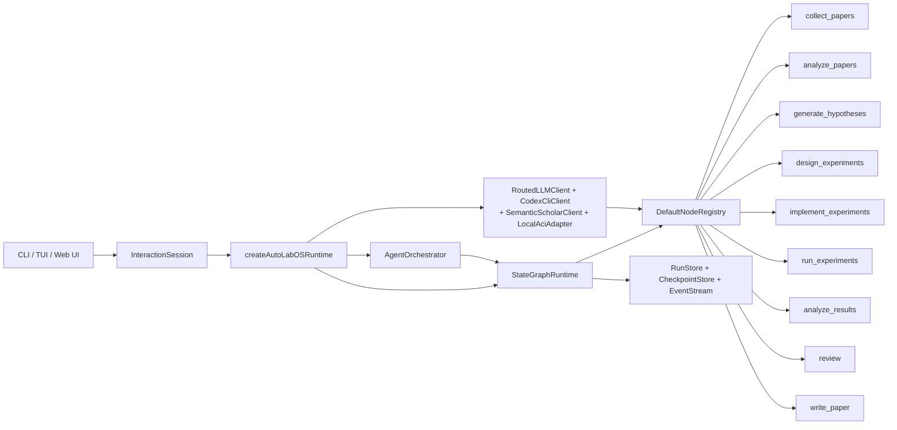

<div align="center">

  <br/>

  

  <h1>Un sistema operativo para la investigación autónoma</h1>

  <p><strong>Ejecución autónoma de investigación, no solo generación de texto para investigación.</strong><br/>
  De la literatura al manuscrito, dentro de un bucle gobernado, con checkpoints y capacidad de inspección.</p>

  <p>
    <a href="../README.md"><strong>English</strong></a>
    &nbsp;&middot;&nbsp;
    <a href="./README.ko.md"><strong>한국어</strong></a>
    &nbsp;&middot;&nbsp;
    <a href="./README.ja.md"><strong>日本語</strong></a>
    &nbsp;&middot;&nbsp;
    <a href="./README.zh-CN.md"><strong>简体中文</strong></a>
    &nbsp;&middot;&nbsp;
    <a href="./README.zh-TW.md"><strong>繁體中文</strong></a>
    &nbsp;&middot;&nbsp;
    <a href="./README.es.md"><strong>Español</strong></a>
    &nbsp;&middot;&nbsp;
    <a href="./README.fr.md"><strong>Français</strong></a>
    &nbsp;&middot;&nbsp;
    <a href="./README.de.md"><strong>Deutsch</strong></a>
    &nbsp;&middot;&nbsp;
    <a href="./README.pt.md"><strong>Português</strong></a>
    &nbsp;&middot;&nbsp;
    <a href="./README.ru.md"><strong>Русский</strong></a>
  </p>

  <p><sub>Los archivos README en otros idiomas son traducciones mantenidas de este documento. Para la redacción normativa y las últimas ediciones, utiliza el README en inglés como referencia canónica.</sub></p>

  <!-- CI & Quality -->
  <p>
    <a href="https://github.com/lhy0718/AutoLabOS/actions/workflows/ci.yml">
      
    </a>
    <a href="https://github.com/lhy0718/AutoLabOS/actions/workflows/smoke.yml">
      
    </a>
    
  </p>

  <!-- Tech stack -->
  <p>
    
    
    
  </p>

  <!-- Core features -->
  <p>
    
    
    
    
  </p>

  <!-- Integrations -->
  <p>
    
    
    
    
  </p>

  <!-- Community -->
  <p>
    <a href="https://github.com/lhy0718/AutoLabOS/stargazers">
      
    </a>
    <a href="https://github.com/lhy0718/AutoLabOS/commits/main">
      
    </a>
  </p>

</div>

---

La mayoría de las herramientas que dicen automatizar la investigación en realidad automatizan la **generación de texto**. Producen resultados con apariencia pulida a partir de razonamiento superficial, sin gobernanza experimental, sin seguimiento de evidencia y sin una contabilidad honesta de lo que la evidencia realmente respalda.

AutoLabOS adopta una posición distinta: **la parte difícil de la investigación no es escribir, sino la disciplina entre la pregunta y el borrador.** El anclaje en la literatura, la prueba de hipótesis, la gobernanza experimental, el seguimiento de fallos, el acotamiento de afirmaciones y los mecanismos de revisión ocurren dentro de un grafo de estado fijo de 9 nodos. Cada nodo produce artefactos auditables. Cada transición queda registrada como checkpoint. Cada afirmación tiene un techo de evidencia.

La salida no es solo un paper. Es un estado de investigación gobernado que puedes inspeccionar, reanudar y defender.

> **La evidencia primero. Las afirmaciones después.**
>
> **Ejecuciones que puedes inspeccionar, reanudar y defender.**
>
> **Un sistema operativo de investigación, no un paquete de prompts.**
>
> **Tu laboratorio no debería repetir el mismo experimento fallido dos veces.**
>
> **La revisión es un gate estructural, no una pasada de pulido.**

---

## Qué obtienes después de una ejecución

AutoLabOS no solo produce un PDF. Produce un estado de investigación completo y trazable:

| Salida | Qué contiene |
|---|---|
| **Corpus de literatura** | Papers recopilados, BibTeX y almacén de evidencia extraída |
| **Hipótesis** | Hipótesis fundamentadas en la literatura con revisión escéptica |
| **Plan experimental** | Diseño gobernado con contrato, bloqueo de baseline y comprobaciones de consistencia |
| **Resultados ejecutados** | Métricas, evaluación objetiva y registro de memoria de fallos |
| **Análisis de resultados** | Análisis estadístico, decisiones por intento y razonamiento de transición |
| **Paquete de revisión** | Tarjeta de puntuación del panel de 5 especialistas, techo de claims y crítica previa al borrador |
| **Manuscrito** | Borrador LaTeX con enlaces a evidencia, validación científica y PDF opcional |
| **Checkpoints** | Instantáneas completas del estado en cada límite de nodo; reanuda en cualquier momento |

Todo vive bajo `.autolabos/runs/<run_id>/`, con salidas públicas reflejadas en `outputs/`.

---

## ¿Por qué AutoLabOS?

La mayoría de las herramientas de investigación con IA optimizan la **apariencia del resultado**. AutoLabOS optimiza la **ejecución gobernada**.

| | Herramientas típicas de investigación | AutoLabOS |
|---|---|---|
| Flujo de trabajo | Deriva abierta de agentes | Grafo fijo de 9 nodos con transiciones acotadas |
| Diseño experimental | No estructurado | Contratos con regla de cambio único y detección de confusores |
| Experimentos fallidos | Se olvidan y se repiten | Se registran por huella en la memoria de fallos y no se repiten |
| Afirmaciones | Tan fuertes como el LLM quiera generar | Limitadas por un techo de afirmaciones ligado a la evidencia real |
| Revisión | Paso opcional de limpieza | Puerta estructural: bloquea la escritura si la evidencia es insuficiente |
| Evaluación del paper | Un único chequeo "se ve bien" de un LLM | Puerta de dos capas: mínimo determinista + evaluador LLM de calidad |
| Estado | Efímero | Con checkpoints, reanudable e inspeccionable |

---

## Inicio rápido

```bash
# 1. Instala y compila
npm install && npm run build && npm link

# 2. Ve a tu workspace de investigación
cd /path/to/your-research-project

# 3. Lanza (elige uno)
autolabos web    # UI en navegador: onboarding, dashboard, explorador de artefactos
autolabos        # Flujo de trabajo por terminal con comandos slash
```

> **¿Primera ejecución?** Ambas interfaces te guían por el onboarding si todavía no existe `.autolabos/config.yaml`.

### Requisitos previos

| Elemento | Cuándo se necesita | Notas |
|---|---|---|
| `SEMANTIC_SCHOLAR_API_KEY` | Siempre | Descubrimiento de papers y metadatos |
| `OPENAI_API_KEY` | Cuando el provider o el modo PDF es `api` | Ejecución de modelos OpenAI API |
| Inicio de sesión en Codex CLI | Cuando el provider o el modo PDF es `codex` | Usa tu sesión local de Codex |

---

## El flujo de trabajo de 9 nodos

Un grafo fijo. No es una sugerencia, es un contrato.



`collect_papers` → `analyze_papers` → `generate_hypotheses` → `design_experiments` → `implement_experiments` → `run_experiments` → `analyze_results` → `review` → `write_paper`

El backtracking está integrado. Si los resultados son débiles, el grafo vuelve a hipótesis o diseño, no avanza hacia escritura ilusoria. Toda la automatización vive dentro de bucles internos acotados por nodo.

---

## Propiedades principales

### Gobernanza experimental

Cada ejecución de experimento pasa por un contrato estructurado:

- **Contrato experimental** — bloquea hipótesis, mecanismo causal, regla de cambio único, condición de aborto y criterios de conservar/descartar
- **Detección de confusores** — detecta cambios conjuntos, intervenciones tipo lista y desajustes entre mecanismo y cambio
- **Consistencia brief-diseño** — señala cuando el diseño se desvía del research brief original
- **Bloqueo de baseline** — el contrato de comparación congela la métrica objetiva y el baseline antes de la ejecución

### Techo de afirmaciones

El sistema no permite que las afirmaciones superen la evidencia.

El nodo `review` produce un `pre_review_summary` que contiene la **afirmación más fuerte que puede defenderse**, una lista de **afirmaciones más fuertes bloqueadas** con sus razones y las **brechas de evidencia** que habría que cubrir para desbloquearlas. Este techo pasa directamente a la generación del manuscrito.

### Memoria de fallos

JSONL con alcance de ejecución que registra y deduplica patrones de fallo:

- **Fingerprinting de errores** — elimina timestamps, rutas y números para agrupar de forma estable
- **Corte por fallo equivalente** — 3 o más fingerprints idénticos agotan los reintentos de inmediato
- **Marcadores de no reintentar** — los fallos estructurales bloquean la reejecución hasta que el diseño cambie

Tu laboratorio aprende de sus propios fallos dentro de una ejecución.

### Evaluación de paper en dos capas

La preparación del paper no es una única decisión de un LLM.

- **Capa 1 — Gate mínimo determinista**: 7 comprobaciones de presencia de artefactos que bloquean categóricamente el trabajo subevidenciado antes de entrar en `write_paper`. Sin intervención de LLM. Se pasa o no.
- **Capa 2 — Evaluador LLM de calidad de paper**: crítica estructurada en 6 dimensiones — significancia de resultados, rigor metodológico, fuerza de la evidencia, estructura de la escritura, sustento de las afirmaciones y honestidad de las limitaciones. Produce problemas bloqueantes, problemas no bloqueantes y una clasificación del tipo de manuscrito.

Si la evidencia es insuficiente, el sistema recomienda backtracking, no pulido.

### Panel de revisión de 5 especialistas

El nodo `review` ejecuta cinco pases de especialistas independientes:

1. **Verificador de afirmaciones** — contrasta las afirmaciones con la evidencia
2. **Revisor metodológico** — valida el diseño experimental
3. **Revisor estadístico** — evalúa el rigor cuantitativo
4. **Preparación de escritura** — comprueba claridad y completitud
5. **Revisor de integridad** — identifica sesgos y conflictos

El panel produce una tarjeta de puntuación, una evaluación de consistencia y una decisión de puerta.

---

## Doble interfaz

Dos superficies de UI, un solo runtime. Los mismos artefactos, el mismo flujo de trabajo, los mismos checkpoints.

| | TUI | Web Ops UI |
|---|---|---|
| Lanzamiento | `autolabos` | `autolabos web` |
| Interacción | Comandos slash, lenguaje natural | Dashboard en navegador, composer |
| Vista del flujo | Progreso de nodos en tiempo real en terminal | Grafo visual de 9 nodos con acciones |
| Artefactos | Inspección por CLI | Vista previa inline (texto, imágenes, PDFs) |
| Ideal para | Iteración rápida, scripting | Monitoreo visual, exploración de artefactos |

---

## Modos de ejecución

AutoLabOS preserva el flujo de 9 nodos y todos los gates de seguridad en cada modo.

| Modo | Comando | Comportamiento |
|---|---|---|
| **Interactivo** | `autolabos` | TUI con comandos slash y gates de aprobación explícitos |
| **Aprobación mínima** | Config: `approval_mode: minimal` | Auto-aprueba transiciones seguras |
| **Nocturno** | `/agent overnight [run]` | Pase único sin supervisión, límite de 24 horas, backtracking conservador |
| **Autónomo** | `/agent autonomous [run]` | Exploración investigativa abierta, sin límite de tiempo |

### Modo autónomo

Diseñado para bucles sostenidos de hipótesis → experimento → análisis con mínima intervención. Ejecuta dos bucles internos en paralelo:

1. **Exploración de investigación** — genera hipótesis, diseña/ejecuta experimentos, analiza, deriva la siguiente hipótesis
2. **Mejora de calidad del paper** — identifica la rama más fuerte, ajusta baselines, fortalece los enlaces de evidencia

Se detiene por: parada explícita del usuario, límites de recursos, detección de estancamiento o fallo catastrófico. **No** se detiene solo porque un experimento fue negativo o la calidad del paper está temporalmente estancada.

---

## Sistema de research brief

Cada ejecución comienza desde un brief Markdown estructurado que define el alcance, las restricciones y las reglas de gobernanza.

```bash
/new                        # Crear un brief
/brief start --latest       # Validar, capturar instantánea, extraer, lanzar
```

Los briefs incluyen secciones **núcleo** (tema, métrica objetiva) y secciones de **gobernanza** (comparación objetivo, evidencia mínima, atajos prohibidos, techo de paper). AutoLabOS califica la completitud del brief y advierte cuando la cobertura de gobernanza es insuficiente para trabajo a escala de paper.

<details>
<summary><strong>Secciones del brief y calificación</strong></summary>

| Sección | Estado | Propósito |
|---|---|---|
| `## Topic` | Requerido | Pregunta de investigación en 1-3 oraciones |
| `## Objective Metric` | Requerido | Métrica principal de éxito |
| `## Constraints` | Recomendado | Presupuesto de cómputo, límites de dataset, reglas de reproducibilidad |
| `## Plan` | Recomendado | Plan experimental paso a paso |
| `## Target Comparison` | Gobernanza | Método propuesto vs. baseline explícito |
| `## Minimum Acceptable Evidence` | Gobernanza | Tamaño mínimo de efecto, cantidad de folds, frontera de decisión |
| `## Disallowed Shortcuts` | Gobernanza | Atajos que invalidan resultados |
| `## Paper Ceiling If Evidence Remains Weak` | Gobernanza | Clasificación máxima del paper si la evidencia es insuficiente |
| `## Manuscript Format` | Opcional | Cantidad de columnas, presupuesto de páginas, reglas de referencias/apéndices |

| Calificación | Significado | ¿Listo para escala de paper? |
|---|---|---|
| `complete` | Núcleo + 4 o más secciones de gobernanza sustantivas | Sí |
| `partial` | Núcleo completo + 2 o más de gobernanza | Proceder con advertencias |
| `minimal` | Solo secciones núcleo | No |

</details>

---

## Flujo de artefactos de gobernanza



---

## Flujo de artefactos

Cada nodo produce artefactos estructurados e inspeccionables.



<details>
<summary><strong>Bundle de salida pública</strong></summary>

```
outputs/
  ├── paper/           # Fuente TeX, PDF, referencias, log de compilación
  ├── experiment/      # Resumen de baseline, código del experimento
  ├── analysis/        # Tabla de resultados, análisis de evidencia
  ├── review/          # Crítica del paper, decisión de gate
  ├── results/         # Resúmenes cuantitativos compactos
  ├── reproduce/       # Scripts de reproducción, README
  ├── manifest.json    # Registro de secciones
  └── README.md        # Resumen legible de la ejecución
```

</details>

---

## Arquitectura de nodos

| Nodo | Rol(es) | Qué hace |
|---|---|---|
| `collect_papers` | recopilador, curador | Descubre y curadea el conjunto de papers candidatos mediante Semantic Scholar |
| `analyze_papers` | lector, extractor de evidencia | Extrae resúmenes y evidencia de los papers seleccionados |
| `generate_hypotheses` | agente de hipótesis + revisor escéptico | Sintetiza ideas desde la literatura y luego las somete a presión |
| `design_experiments` | diseñador + panel de viabilidad/estadístico/operaciones | Filtra planes por practicidad y redacta el contrato experimental |
| `implement_experiments` | implementador | Produce código y cambios en el workspace a través de acciones ACI |
| `run_experiments` | ejecutor + triager de fallos + planificador de reejecución | Conduce la ejecución, registra fallos y decide reejecuciones |
| `analyze_results` | analista + auditor de métricas + detector de confusores | Verifica la fiabilidad de los resultados y escribe las decisiones por intento |
| `review` | panel de 5 especialistas + techo de claims + gate de dos capas | Revisión estructural: bloquea la escritura si la evidencia es insuficiente |
| `write_paper` | escritor del paper + crítica del revisor | Redacta el manuscrito, ejecuta la crítica post-borrador y compila el PDF |

<details>
<summary><strong>Grafos de conexión fase por fase</strong></summary>

**Descubrimiento y lectura**

```mermaid
flowchart LR
    Topic["run topic + collect constraints"] --> CP["collect_papers"]
    CP --> CC["collector_curator"]
    CC --> SS["Semantic Scholar search"]
    SS --> Enrich["enrichment + BibTeX recovery"]
    Enrich --> Corpus["corpus.jsonl + bibtex.bib"]
    Corpus --> AP["analyze_papers"]
    AP --> Select["selection request + hybrid rerank"]
    Select --> Manifest["analysis_manifest resume / prune"]
    Manifest --> RE["reader_evidence_extractor"]
    RE --> Pdf["local text/image analysis or Responses API PDF"]
    Pdf --> ReviewLoop["extractor -> reviewer normalization"]
    ReviewLoop --> Evidence["paper_summaries.jsonl + evidence_store.jsonl"]
```



**Hipótesis y diseño experimental**

```mermaid
flowchart LR
    Evidence["paper_summaries.jsonl + evidence_store.jsonl"] --> GH["generate_hypotheses"]
    GH --> HA["hypothesis_agent"]
    HA --> Axes["evidence synthesizer -> evidence axes"]
    Axes --> ToT["ToT branch expansion"]
    ToT --> Drafts["mechanism / contradiction / intervention drafts"]
    Drafts --> Reviews["skeptical reviewer"]
    Reviews --> Select["diversity + evidence-quality top-k selection"]
    Select --> Hyp["hypotheses.jsonl + axes/reviews/llm_trace"]
    Hyp --> DE["design_experiments"]
    DE --> ED["experiment_designer"]
    ED --> Profiles["constraint profile + objective metric profile"]
    Profiles --> Plans["design candidates"]
    Plans --> Panel["designer + feasibility + statistical + ops-capacity panel"]
    Panel --> Choice["panel selection"]
    Choice --> Contract["experiment_contract.json + brief_design_consistency.json"]
```



**Implementación, ejecución y bucle de resultados**

```mermaid
flowchart LR
    PlanYaml["experiment_plan.yaml"] --> IE["implement_experiments"]
    IE --> IM["ImplementSessionManager"]
    IM --> Impl["implementer"]
    IM --> Codex["Codex CLI session"]
    Codex --> VerifyPatch["local verification"]
    VerifyPatch --> Handoff{"auto handoff?"}
    Handoff -->|yes| RX["run_experiments"]
    Handoff -->|no| Gate["approval boundary"]
    Gate --> RX
    RX --> Runner["runner"]
    Runner --> FailCheck["failure memory: check do-not-retry"]
    FailCheck --> ACI["ACI preflight/tests/command"]
    ACI --> Triage["failure triager + rerun planner"]
    Triage -->|retry once if transient| ACI
    ACI --> FailRecord["record to failure_memory.jsonl"]
    ACI --> Metrics["metrics.json + supplemental runs"]
    Metrics --> AR["analyze_results"]
    AR --> ResultPanel["metric auditor + robustness + confounder + calibrator"]
    ResultPanel --> AttemptDec["attempt_decisions.jsonl"]
    ResultPanel --> Synth["transition recommendation"]
    Synth -->|advance| RV["review"]
    Synth -->|backtrack| IE
```



**Revisión, escritura y presentación**



</details>

---

## Automatización acotada

Cada automatización interna tiene un límite explícito.

| Nodo | Automatización interna | Límite |
|---|---|---|
| `analyze_papers` | Expande automáticamente la ventana de evidencia cuando es demasiado escasa | ≤ 2 expansiones |
| `design_experiments` | Puntuación determinista del panel + contrato experimental | Se ejecuta una vez por diseño |
| `run_experiments` | Triaje de fallos + reejecución transitoria de un intento | Nunca reintenta fallos estructurales |
| `run_experiments` | Fingerprinting de memoria de fallos | ≥ 3 idénticos → agota reintentos |
| `analyze_results` | Rematching objetivo + calibración del panel de resultados | Un rematch antes de pausa humana |
| `write_paper` | Explorador de trabajo relacionado + reparación consciente de validación | Máximo 1 pasada de reparación |

---

## Comandos comunes

| Comando | Descripción |
|---|---|
| `/new` | Crear un research brief |
| `/brief start <path\|--latest>` | Iniciar investigación desde un brief |
| `/runs [query]` | Listar o buscar ejecuciones |
| `/resume <run>` | Reanudar una ejecución |
| `/agent run <node> [run]` | Ejecutar desde un nodo del grafo |
| `/agent status [run]` | Mostrar estados de los nodos |
| `/agent overnight [run]` | Ejecutar sin supervisión (límite 24 horas) |
| `/agent autonomous [run]` | Investigación autónoma abierta |
| `/model` | Cambiar modelo y esfuerzo de razonamiento |
| `/doctor` | Diagnóstico de entorno y workspace |

<details>
<summary><strong>Lista completa de comandos</strong></summary>

| Comando | Descripción |
|---|---|
| `/help` | Mostrar lista de comandos |
| `/new` | Crear archivo de research brief |
| `/brief start <path\|--latest>` | Iniciar investigación desde un archivo brief |
| `/doctor` | Diagnóstico de entorno y workspace |
| `/runs [query]` | Listar o buscar ejecuciones |
| `/run <run>` | Seleccionar ejecución |
| `/resume <run>` | Reanudar ejecución |
| `/agent list` | Listar nodos del grafo |
| `/agent run <node> [run]` | Ejecutar desde un nodo |
| `/agent status [run]` | Mostrar estados de los nodos |
| `/agent collect [query] [options]` | Recopilar papers |
| `/agent recollect <n> [run]` | Recopilar papers adicionales |
| `/agent focus <node>` | Mover el foco con safe jump |
| `/agent graph [run]` | Mostrar estado del grafo |
| `/agent resume [run] [checkpoint]` | Reanudar desde checkpoint |
| `/agent retry [node] [run]` | Reintentar nodo |
| `/agent jump <node> [run] [--force]` | Saltar nodo |
| `/agent overnight [run]` | Autonomía nocturna (24h) |
| `/agent autonomous [run]` | Investigación autónoma abierta |
| `/model` | Selector de modelo y razonamiento |
| `/approve` | Aprobar nodo pausado |
| `/retry` | Reintentar nodo actual |
| `/settings` | Ajustes de provider y modelo |
| `/quit` | Salir |

</details>

<details>
<summary><strong>Opciones de recolección y ejemplos</strong></summary>

```
--limit <n>          --last-years <n>      --year <spec>
--date-range <s:e>   --sort <relevance|citationCount|publicationDate>
--order <asc|desc>   --min-citations <n>   --open-access
--field <csv>        --venue <csv>         --type <csv>
--bibtex <generated|s2|hybrid>             --dry-run
--additional <n>     --run <run_id>
```

```bash
/agent collect --last-years 5 --sort relevance --limit 100
/agent collect "agent planning" --sort citationCount --min-citations 100
/agent collect --additional 200 --run <run_id>
```

</details>

---

## Web Ops UI

`autolabos web` inicia una UI local en el navegador en `http://127.0.0.1:4317`.

- **Onboarding** — misma configuración que la TUI, escribe `.autolabos/config.yaml`
- **Dashboard** — búsqueda de ejecuciones, vista del workflow de 9 nodos, acciones por nodo, logs en vivo
- **Artefactos** — navegar ejecuciones, previsualizar texto/imágenes/PDFs inline
- **Composer** — comandos slash y lenguaje natural, con control paso a paso del plan

```bash
autolabos web                              # Puerto por defecto 4317
autolabos web --host 0.0.0.0 --port 8080  # Bind personalizado
```

---

## Filosofía

AutoLabOS se construye alrededor de unas pocas restricciones duras:

- **Completar el workflow no equivale a paper-ready.** Una ejecución puede completar el grafo sin que la salida sea digna de publicación. El sistema rastrea esa diferencia.
- **Los claims no deben exceder la evidencia.** El techo de claims se hace cumplir estructuralmente, no insistiendo más en el prompt.
- **La revisión es un gate, no una sugerencia.** Si la evidencia es insuficiente, el nodo `review` bloquea `write_paper` y recomienda backtracking.
- **Los resultados negativos están permitidos.** Una hipótesis fallida es un resultado de investigación válido, pero debe enmarcarse honestamente.
- **La reproducibilidad es una propiedad de los artefactos.** Checkpoints, contratos experimentales, logs de fallos y almacenes de evidencia existen para que el razonamiento de una ejecución pueda rastrearse y cuestionarse.

---

## Desarrollo

```bash
npm install              # Instala dependencias (incluye subpaquete web)
npm run build            # Compila TypeScript + web UI
npm test                 # Ejecuta todos los tests unitarios (931+)
npm run test:watch       # Modo watch

# Archivo de test individual
npx vitest run tests/<name>.test.ts

# Smoke tests
npm run test:smoke:all                      # Bundle completo de smoke local
npm run test:smoke:natural-collect          # Recolección NL -> comando pendiente
npm run test:smoke:natural-collect-execute  # Recolección NL -> ejecutar -> verificar
npm run test:smoke:ci                       # Selección de smoke para CI
```

<details>
<summary><strong>Variables de entorno para smoke tests</strong></summary>

```bash
AUTOLABOS_FAKE_CODEX_RESPONSE=1              # Evitar llamadas reales a Codex
AUTOLABOS_FAKE_SEMANTIC_SCHOLAR_RESPONSE=1   # Evitar llamadas reales a S2
AUTOLABOS_SMOKE_VERBOSE=1                    # Imprimir logs completos de PTY
AUTOLABOS_SMOKE_MODE=<mode>                  # Selección de modo CI
```

</details>

<details>
<summary><strong>Internals del runtime</strong></summary>

### Políticas del grafo de estado

- Checkpoints: `.autolabos/runs/<run_id>/checkpoints/` — fases: `before | after | fail | jump | retry`
- Política de reintentos: `maxAttemptsPerNode = 3`
- Rollback automático: `maxAutoRollbacksPerNode = 2`
- Modos de jump: `safe` (actual o anterior) / `force` (hacia adelante, nodos omitidos quedan registrados)

### Patrones del runtime de agentes

- **ReAct** loop: `PLAN_CREATED → TOOL_CALLED → OBS_RECEIVED`
- **ReWOO** split (planner/worker): usado en nodos de alto costo
- **ToT** (Tree-of-Thoughts): usado en nodos de hipótesis y diseño
- **Reflexion**: episodios de fallo almacenados y reutilizados en reintentos

### Capas de memoria

| Capa | Alcance | Formato |
|---|---|---|
| Memoria de contexto de ejecución | Key/value por ejecución | `run_context.jsonl` |
| Almacén a largo plazo | Entre intentos | Resumen e índice JSONL |
| Memoria de episodios | Reflexion | Lecciones de fallo para reintentos |

### Acciones ACI

`implement_experiments` y `run_experiments` se ejecutan a través de:
`read_file` · `write_file` · `apply_patch` · `run_command` · `run_tests` · `tail_logs`

</details>

<details>
<summary><strong>Diagrama del runtime de agentes</strong></summary>



</details>

---

## Documentación

| Documento | Cobertura |
|---|---|
| `docs/architecture.md` | Arquitectura del sistema y decisiones de diseño |
| `docs/tui-live-validation.md` | Enfoque de validación y pruebas de la TUI |
| `docs/experiment-quality-bar.md` | Estándares de ejecución de experimentos |
| `docs/paper-quality-bar.md` | Requisitos de calidad del manuscrito |
| `docs/reproducibility.md` | Garantías de reproducibilidad |
| `docs/research-brief-template.md` | Plantilla completa de brief con todas las secciones de gobernanza |

---

## Estado

AutoLabOS está en desarrollo activo (v0.1.0). El flujo de trabajo, el sistema de gobernanza y el runtime central son funcionales y están probados. Las interfaces, la cobertura de artefactos y los modos de ejecución están bajo validación continua.

Las contribuciones y el feedback son bienvenidos. Consulta [Issues](https://github.com/lhy0718/AutoLabOS/issues).

---

<div align="center">
  <sub>Construido para investigadores que quieren sus experimentos gobernados y sus claims defendibles.</sub>
</div>
