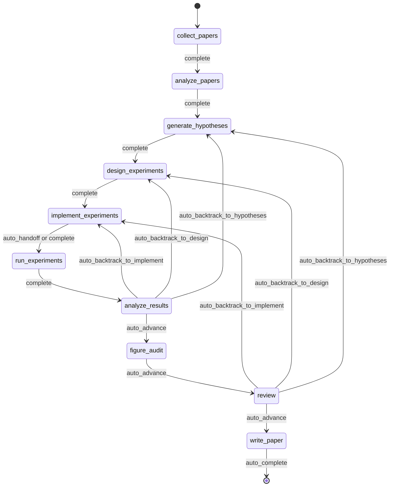

<div align="center">

  <br/>

  

  <h1>Un sistema operativo para investigación autónoma</h1>

  <p><strong>No generación de investigación, sino ejecución autónoma de investigación.</strong><br/>
  De un brief a un manuscrito, dentro de una ejecución governed, checkpointed e inspectable.</p>

  <p>
    <a href="../README.md"><strong>English</strong></a>
    &nbsp;&middot;&nbsp;
    <a href="./README.ko.md"><strong>한국어</strong></a>
    &nbsp;&middot;&nbsp;
    <a href="./README.ja.md"><strong>日本語</strong></a>
    &nbsp;&middot;&nbsp;
    <a href="./README.zh-CN.md"><strong>简体中文</strong></a>
    &nbsp;&middot;&nbsp;
    <a href="./README.zh-TW.md"><strong>繁體中文</strong></a>
    &nbsp;&middot;&nbsp;
    <a href="./README.es.md"><strong>Español</strong></a>
    &nbsp;&middot;&nbsp;
    <a href="./README.fr.md"><strong>Français</strong></a>
    &nbsp;&middot;&nbsp;
    <a href="./README.de.md"><strong>Deutsch</strong></a>
    &nbsp;&middot;&nbsp;
    <a href="./README.pt.md"><strong>Português</strong></a>
    &nbsp;&middot;&nbsp;
    <a href="./README.ru.md"><strong>Русский</strong></a>
  </p>

  <p><sub>Los README localizados son traducciones mantenidas de este documento. Para el texto normativo y las ediciones más recientes, usa el README en inglés como canonical reference.</sub></p>

  <p>
    <a href="https://github.com/lhy0718/AutoLabOS/actions/workflows/ci.yml">
      
    </a>
    <a href="https://github.com/lhy0718/AutoLabOS/actions/workflows/smoke.yml">
      
    </a>
    
  </p>

  <p>
    
    
    
  </p>

  <p>
    
    
    
    
  </p>

</div>

---

AutoLabOS es un sistema operativo para la ejecución governed de investigación. Trata una corrida como estado de investigación checkpointed, no como una generación puntual.

Todo el bucle central es inspectable. Recolección de literatura, formulación de hipótesis, diseño experimental, implementación, ejecución, análisis, figure audit, review y escritura del manuscrito dejan artifacts auditables. Las afirmaciones permanecen evidence-bounded bajo un claim ceiling. Review no es una etapa de pulido, sino un structural gate.

Los supuestos de calidad se convierten en checks explícitos. Importa más el comportamiento real que la apariencia a nivel de prompt. La reproducibilidad se refuerza mediante artifacts, checkpoints e inspectable transitions.

---

## Por qué existe AutoLabOS

Muchos sistemas de research agents están optimizados para producir texto. AutoLabOS está optimizado para ejecutar un proceso de investigación gobernado.

Esa diferencia importa cuando un proyecto necesita algo más que un borrador convincente.

- un research brief que funciona como contrato de ejecución
- workflow gates explícitos en lugar de deriva abierta de agentes
- checkpoints y artifacts que pueden inspeccionarse después
- review capaz de detener trabajo débil antes de generar el manuscrito
- failure memory para no repetir ciegamente el mismo experimento fallido
- evidence-bounded claims, no prose que supere a los datos

AutoLabOS está pensado para equipos que quieren autonomía sin renunciar a auditabilidad, backtracking y validation.

---

## Qué ocurre en una corrida

Una corrida governed sigue siempre el mismo arco de investigación.

`Brief.md` → literature → hypothesis → experiment design → implementation → execution → analysis → figure audit → review → manuscript

En la práctica:

1. `/new` crea o abre el research brief
2. `/brief start --latest` valida el brief, lo snapshot dentro de la corrida e inicia un run governed
3. el sistema avanza por el workflow fijo y checkpointa estado y artifacts en cada frontera
4. si la evidencia es débil, el sistema hace backtracking o downgrade en lugar de pulir el texto
5. solo si pasa el review gate, `write_paper` redacta el manuscrito a partir de evidencia acotada

El contrato histórico de 9 nodos sigue siendo la línea base arquitectónica. En el runtime actual, `figure_audit` es el checkpoint adicional aprobado entre `analyze_results` y `review`, para que la crítica de figuras pueda checkpointarse y reanudarse de forma independiente.



Toda la automatización dentro de ese flujo está acotada a bounded node-internal loops. Incluso en modos no atendidos, el workflow sigue siendo governed.

---

## Qué obtienes después de una corrida

AutoLabOS no produce solo un PDF. Produce un estado de investigación trazable.

| Salida | Qué contiene |
|---|---|
| **Corpus de literatura** | papers recolectados, BibTeX, evidence store extraído |
| **Hipótesis** | hypotheses basadas en literatura y skeptical review |
| **Plan experimental** | governed design con contract, baseline lock y checks de consistencia |
| **Resultados ejecutados** | metrics, objective evaluation, failure memory log |
| **Análisis de resultados** | análisis estadístico, attempt decisions, transition reasoning |
| **Figure audit** | figure lint, caption/reference consistency y vision critique opcional |
| **Review packet** | scorecard del panel de 5 especialistas, claim ceiling, critique previa al borrador |
| **Manuscrito** | borrador LaTeX con evidence links, scientific validation y PDF opcional |
| **Checkpoints** | snapshots completos del estado en cada frontera de nodo, reanudables |

Todo vive bajo `.autolabos/runs/<run_id>/`, con salidas públicas reflejadas en `outputs/`.

Ese es el modelo de reproducibilidad: no estado oculto, sino artifacts, checkpoints e inspectable transitions.

---

## Quick Start

```bash
# 1. Instalar y compilar
npm install
npm run build
npm link

# 2. Ir a tu workspace de investigación
cd /path/to/your-research-workspace

# 3. Lanzar una interfaz
autolabos        # TUI
autolabos web    # Web UI
```

Flujo típico de primer uso:

```bash
/new
/brief start --latest
/doctor
```

Notas:

- si `.autolabos/config.yaml` no existe, ambas interfaces te guían en el onboarding
- no ejecutes AutoLabOS desde la raíz del repositorio; usa un directorio de workspace separado para tu ejecución de investigación
- TUI y Web UI comparten el mismo runtime, los mismos artifacts y los mismos checkpoints

### Requisitos previos

| Elemento | Cuándo se necesita | Notas |
|---|---|---|
| `SEMANTIC_SCHOLAR_API_KEY` | Siempre | Descubrimiento de papers y metadata |
| `OPENAI_API_KEY` | Cuando el provider es `api` | Ejecución con modelos OpenAI API |
| Codex CLI login | Cuando el provider es `codex` | Usa tu sesión local de Codex |

---

## Sistema de Research Brief

El brief no es solo un documento de arranque. Es el governed contract de la corrida.

`/new` crea o abre `Brief.md`. `/brief start --latest` lo valida, lo snapshot dentro del run y arranca la ejecución a partir de ese snapshot. El run registra el source path del brief, el snapshot path y cualquier manuscript format parseado. Así, la provenance del run sigue siendo inspectable incluso si el brief del workspace cambia después.
`Appendix Preferences` ahora puede escribirse con la estructura `Prefer appendix for:` y `Keep in main body:` para que la intención de appendix routing quede explícita dentro del brief contract.

Es decir, el brief no es solo parte del prompt. Es parte del audit trail.

En el contrato actual, `.autolabos/config.yaml` guarda sobre todo valores por defecto de provider/runtime y workspace policy. La intención de investigación de cada run, los evidence bars, las expectativas de baseline, los objetivos de manuscript format y la ruta del manuscript template deben vivir en el Brief. Por eso, el config persistido puede omitir valores por defecto de `research` y algunos campos de manuscript-profile / paper-template.

```bash
/new
/brief start --latest
```

El brief debe cubrir tanto la intención de investigación como las restricciones de gobernanza: topic, objective metric, baseline o comparator, minimum acceptable evidence, disallowed shortcuts y el paper ceiling si la evidencia sigue siendo débil.

<details>
<summary><strong>Secciones del brief y grading</strong></summary>

| Sección | Estado | Propósito |
|---|---|---|
| `## Topic` | Requerida | Definir la pregunta de investigación en 1-3 frases |
| `## Objective Metric` | Requerida | Métrica principal de éxito |
| `## Constraints` | Recomendada | compute budget, límites de dataset, reglas de reproducibilidad |
| `## Plan` | Recomendada | Plan experimental paso a paso |
| `## Target Comparison` | Governance | Comparación frente a un baseline explícito |
| `## Minimum Acceptable Evidence` | Governance | Effect size mínimo, fold count, decision boundary |
| `## Disallowed Shortcuts` | Governance | Atajos que invalidan el resultado |
| `## Paper Ceiling If Evidence Remains Weak` | Governance | Máxima clasificación de paper si la evidencia sigue débil |
| `## Manuscript Format` | Opcional | Número de columnas, presupuesto de páginas, reglas de references / appendix |

| Grado | Significado | ¿Listo para paper-scale? |
|---|---|---|
| `complete` | Core + 4 o más secciones de governance sustantivas | Sí |
| `partial` | Core completo + 2 o más secciones de governance | Avanza con advertencias |
| `minimal` | Solo secciones core | No |

</details>

---

## Dos interfaces, un runtime

AutoLabOS ofrece dos front ends sobre el mismo runtime governed.

| | TUI | Web UI |
|---|---|---|
| Lanzamiento | `autolabos` | `autolabos web` |
| Interacción | slash commands, lenguaje natural | dashboard y composer en navegador |
| Vista de workflow | Progreso de nodos en tiempo real en terminal | governed workflow graph con acciones |
| Artifacts | Inspección por CLI | Inline preview de texto, imágenes y PDFs |
| Superficies operativas | `/watch`, `/queue`, `/explore`, `/doctor` | jobs queue, live watch cards, exploration status, diagnostics |
| Mejor para | Iteración rápida y control directo | Monitoreo visual y navegación de artifacts |

Lo importante es que ambas superficies ven los mismos checkpoints, los mismos runs y los mismos artifacts subyacentes.

---

## Qué hace diferente a AutoLabOS

AutoLabOS está diseñado alrededor de governed execution, no de prompt-only orchestration.

| | Herramientas típicas de investigación | AutoLabOS |
|---|---|---|
| Workflow | Deriva abierta de agentes | Governed fixed graph con review boundaries explícitos |
| State | Efímero | Checkpointed, resumable, inspectable |
| Claims | Tan fuertes como el modelo los escriba | Limitados por evidence y claim ceiling |
| Review | Cleanup pass opcional | Structural gate que puede bloquear la escritura |
| Failures | Se olvidan y se reintentan | Se registran con fingerprint en failure memory |
| Interfaces | Caminos de código separados | TUI y Web comparten un runtime |

Por eso este sistema se entiende mejor como research infrastructure que como paper generator.

---

## Garantías centrales

### Governed Workflow

El workflow es bounded y auditable. El backtracking forma parte del contract. Los resultados que no justifican avanzar se envían de vuelta a hypotheses, design o implementation en vez de convertirse en prose más fuerte.

### Checkpointed Research State

Cada frontera de nodo escribe state inspectable y resumable. La unidad de progreso no es solo el texto producido, sino un run con artifacts, transitions y recoverable state.

### Claim Ceiling

Las claims se mantienen bajo el strongest defensible evidence ceiling. El sistema registra las claims más fuertes que fueron bloqueadas y los evidence gaps necesarios para desbloquearlas.

### Review As A Structural Gate

`review` no es una etapa de limpieza cosmética. Es el structural gate donde se revisan readiness, sanidad metodológica, evidence linkage, writing discipline y reproducibility handoff antes de generar el manuscrito.

### Failure Memory

Los failure fingerprints se persisten para que errores estructurales o equivalent failures repetidos no se reintenten a ciegas.

### Reproducibility Through Artifacts

La reproducibilidad se impone mediante artifacts, checkpoints e inspectable transitions. Incluso los resúmenes públicos se basan en persisted run outputs, no en una segunda fuente de verdad.

---

## Validation y modelo de calidad orientado a harness

AutoLabOS trata las validation surfaces como first-class.

- `/doctor` comprueba environment y workspace readiness antes de iniciar un run

Paper readiness no es una sola impresión producida por un prompt.

- **Layer 1 - deterministic minimum gate** detiene under-evidenced work mediante artifact / evidence-integrity checks explícitos
- **Layer 2 - LLM paper-quality evaluator** añade crítica estructurada sobre methodology, evidence strength, writing structure, claim support y limitations honesty
- **Review packet + specialist panel** deciden si el camino del manuscrito debe advance, revise o backtrack

`paper_readiness.json` puede incluir `overall_score`. Debe leerse como una señal interna de calidad del run, no como un benchmark científico universal. Algunos caminos avanzados de evaluation / self-improvement usan esa señal para comparar runs o candidatos de prompt mutation.

---

## Capacidades avanzadas de Self-Improvement

AutoLabOS incluye caminos de self-improvement acotados, pero no se trata de blind autonomous rewriting. Están limitados por validation y rollback.

### `autolabos meta-harness`

`autolabos meta-harness` construye un context directory en `outputs/meta-harness/<timestamp>/` a partir de recent completed runs y evaluation history.

Puede incluir:

- run events filtrados
- node artifacts como `result_analysis.json` o `review/decision.json`
- `paper_readiness.json`
- `outputs/eval-harness/history.jsonl`
- archivos actuales de `node-prompts/` para el nodo objetivo

El LLM queda instruido por `TASK.md` para responder solo con `TARGET_FILE + unified diff`, y el target queda restringido a `node-prompts/`. En modo apply, el candidato debe pasar validation checks; si falla, se hace rollback y se escribe un audit log. `--no-apply` solo genera el context. `--dry-run` muestra el diff sin cambiar archivos.

### `autolabos evolve`

`autolabos evolve` ejecuta un bounded mutation-and-evaluation loop sobre `.codex` y `node-prompts`.

- soporta `--max-cycles`, `--target skills|prompts|all` y `--dry-run`
- toma la fitness del run desde `paper_readiness.overall_score`
- muta prompts y skills, ejecuta validation y compara fitness entre ciclos
- si aparece regresión, restaura `.codex` y `node-prompts` desde el último good git tag

Es una ruta de self-improvement, pero no una ruta de reescritura repo-wide sin límites.

### Harness Preset Layer

AutoLabOS también tiene built-in harness presets como `base`, `compact`, `failure-aware` y `review-heavy`. Ajustan artifact/context policy, énfasis en failure memory, prompt policy y compression strategy para evaluaciones comparativas, sin cambiar el governed production workflow.

---

## Comandos comunes

| Comando | Descripción |
|---|---|
| `/new` | Crear o abrir `Brief.md` |
| `/brief start <path\|--latest>` | Iniciar investigación desde un brief |
| `/runs [query]` | Listar o buscar runs |
| `/resume <run>` | Reanudar un run |
| `/agent run <node> [run]` | Ejecutar desde un nodo del graph |
| `/agent status [run]` | Mostrar estados de nodos |
| `/agent overnight [run]` | Ejecutar unattended dentro de límites conservadores |
| `/agent autonomous [run]` | Ejecutar bounded research exploration |
| `/watch` | Vista live watch de runs activos y background jobs |
| `/explore` | Mostrar el estado del exploration engine del run activo |
| `/queue` | Mostrar jobs running / waiting / stalled |
| `/doctor` | Diagnostics de environment y workspace |
| `/model` | Cambiar modelo y reasoning effort |

<details>
<summary><strong>Lista completa de comandos</strong></summary>

| Comando | Descripción |
|---|---|
| `/help` | Mostrar lista de comandos |
| `/new` | Crear o abrir `Brief.md` del workspace |
| `/brief start <path\|--latest>` | Iniciar investigación desde el `Brief.md` del workspace o desde un brief dado |
| `/doctor` | Diagnostics de environment + workspace |
| `/runs [query]` | Listar o buscar runs |
| `/run <run>` | Seleccionar run |
| `/resume <run>` | Reanudar run |
| `/agent list` | Listar nodos del graph |
| `/agent run <node> [run]` | Ejecutar desde un nodo |
| `/agent status [run]` | Mostrar estados de nodos |
| `/agent collect [query] [options]` | Recolectar papers |
| `/agent recollect <n> [run]` | Recolectar papers adicionales |
| `/agent focus <node>` | Mover el focus con safe jump |
| `/agent graph [run]` | Mostrar graph state |
| `/agent resume [run] [checkpoint]` | Reanudar desde checkpoint |
| `/agent retry [node] [run]` | Reintentar nodo |
| `/agent jump <node> [run] [--force]` | Saltar a un nodo |
| `/agent overnight [run]` | Overnight autonomy (24h) |
| `/agent autonomous [run]` | Open-ended autonomous research |
| `/model` | Selector de modelo y reasoning |
| `/approve` | Aprobar un nodo pausado |
| `/queue` | Mostrar jobs running / waiting / stalled |
| `/watch` | Live watch de runs activos |
| `/explore` | Mostrar estado del exploration engine |
| `/retry` | Reintentar el nodo actual |
| `/settings` | Configuración de provider y modelo |
| `/quit` | Salir |

</details>

---

## Para quién es / para quién no es

### Buen encaje

- equipos que quieren autonomía sin perder governed workflow
- trabajo de research engineering donde checkpoints y artifacts importan
- proyectos paper-scale o paper-adjacent que requieren disciplina de evidencia
- entornos donde review, traceability y resumability importan tanto como generation

### No es buen encaje

- usuarios que solo quieren un one-shot draft rápido
- workflows que no necesitan artifact trail ni review gates
- proyectos que prefieren free-form agent behavior frente a governed execution
- casos donde basta una simple herramienta de resumen de literatura

---

## Estado

AutoLabOS es un proyecto OSS activo de research engineering. Si necesitas más detalle, consulta los documentos del directorio docs.
