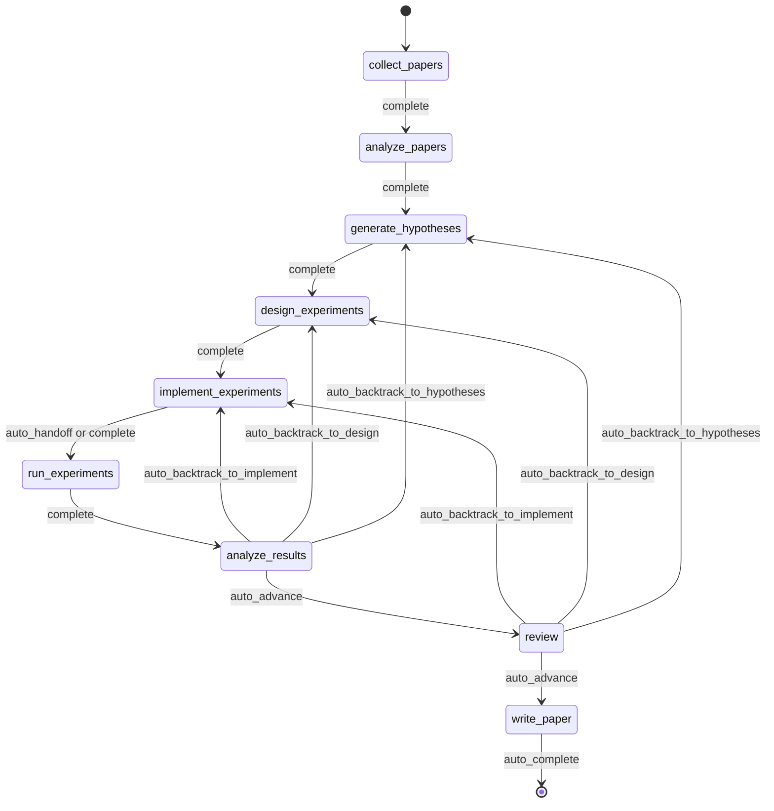
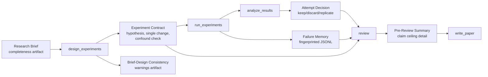
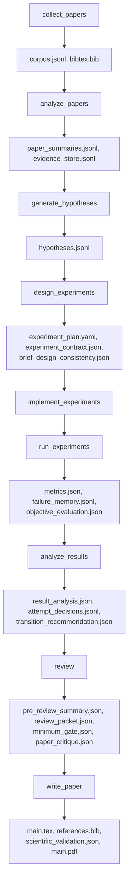
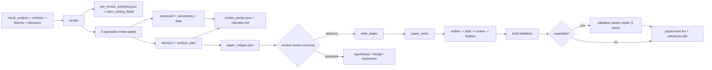
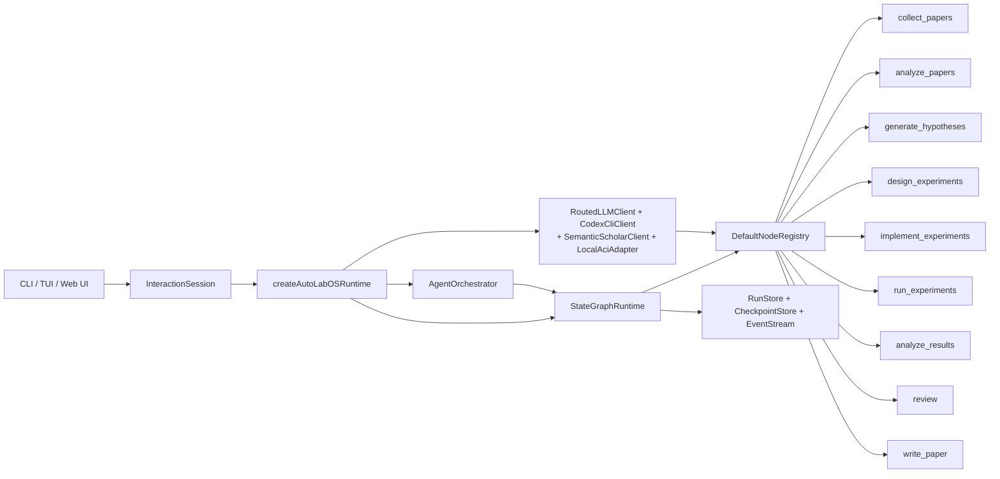

<div align="center">

  <br/>

  

  <h1>Un système d'exploitation pour la recherche autonome</h1>

  <p><strong>Exécution autonome de la recherche, pas seulement génération de texte pour la recherche.</strong><br/>
  De la littérature au manuscrit — dans une boucle gouvernée, jalonnée par des checkpoints et inspectable.</p>

  <p>
    <a href="../README.md"><strong>English</strong></a>
    &nbsp;&middot;&nbsp;
    <a href="./README.ko.md"><strong>한국어</strong></a>
    &nbsp;&middot;&nbsp;
    <a href="./README.ja.md"><strong>日本語</strong></a>
    &nbsp;&middot;&nbsp;
    <a href="./README.zh-CN.md"><strong>简体中文</strong></a>
    &nbsp;&middot;&nbsp;
    <a href="./README.zh-TW.md"><strong>繁體中文</strong></a>
    &nbsp;&middot;&nbsp;
    <a href="./README.es.md"><strong>Español</strong></a>
    &nbsp;&middot;&nbsp;
    <a href="./README.fr.md"><strong>Français</strong></a>
    &nbsp;&middot;&nbsp;
    <a href="./README.de.md"><strong>Deutsch</strong></a>
    &nbsp;&middot;&nbsp;
    <a href="./README.pt.md"><strong>Português</strong></a>
    &nbsp;&middot;&nbsp;
    <a href="./README.ru.md"><strong>Русский</strong></a>
  </p>

  <p><sub>Les fichiers README localisés sont des traductions maintenues de ce document. Pour le texte normatif et les dernières modifications, utilisez le README anglais comme référence canonique.</sub></p>

  <!-- CI & Quality -->
  <p>
    <a href="https://github.com/lhy0718/AutoLabOS/actions/workflows/ci.yml">
      
    </a>
    <a href="https://github.com/lhy0718/AutoLabOS/actions/workflows/smoke.yml">
      
    </a>
    
  </p>

  <!-- Tech stack -->
  <p>
    
    
    
  </p>

  <!-- Core features -->
  <p>
    
    
    
    
  </p>

  <!-- Integrations -->
  <p>
    
    
    
    
  </p>

  <!-- Community -->
  <p>
    <a href="https://github.com/lhy0718/AutoLabOS/stargazers">
      
    </a>
    <a href="https://github.com/lhy0718/AutoLabOS/commits/main">
      
    </a>
  </p>

</div>

---

La plupart des outils qui prétendent automatiser la recherche automatisent en réalité la **génération de texte**. Ils produisent des résultats d'apparence soignée à partir d'un raisonnement superficiel, sans gouvernance expérimentale, sans suivi des preuves et sans évaluation honnête de ce que les preuves soutiennent réellement.

AutoLabOS adopte une position différente : **la partie difficile de la recherche n'est pas l'écriture — c'est la discipline entre la question et le brouillon.** L'ancrage bibliographique, le test d'hypothèses, la gouvernance expérimentale, le suivi des échecs, le plafonnement des affirmations et les portes de revue se déroulent tous à l'intérieur d'un graphe d'état fixe à 9 nœuds. Chaque nœud produit des artefacts auditables. Chaque transition est enregistrée comme checkpoint. Chaque affirmation a un plafond d'évidence.

Le résultat n'est pas simplement un article. C'est un état de recherche gouverné que l'on peut inspecter, reprendre et défendre.

> **Les preuves d'abord. Les affirmations ensuite.**
>
> **Des exécutions que l'on peut inspecter, reprendre et défendre.**
>
> **Un système d'exploitation pour la recherche, pas un pack de prompts.**
>
> **Votre laboratoire ne devrait pas répéter deux fois la même expérience échouée.**
>
> **La revue est une porte structurelle, pas une simple passe de polissage.**

---

## Ce que vous obtenez après une exécution

AutoLabOS ne produit pas seulement un PDF. Il produit un état de recherche complet et traçable :

| Sortie | Contenu |
|---|---|
| **Corpus de littérature** | Articles collectés, BibTeX, magasin d'évidence extrait |
| **Hypothèses** | Hypothèses ancrées dans la littérature avec revue sceptique |
| **Plan expérimental** | Conception gouvernée avec contrat, verrouillage de baseline et contrôles de cohérence |
| **Résultats exécutés** | Métriques, évaluation objective, journal de mémoire des échecs |
| **Analyse des résultats** | Analyse statistique, décisions par tentative, raisonnement de transition |
| **Paquet de revue** | Tableau de scores du panel de 5 spécialistes, plafond des affirmations, critique pré-brouillon |
| **Manuscrit** | Brouillon LaTeX avec liens d'évidence, validation scientifique, PDF optionnel |
| **Checkpoints** | Instantanés complets de l'état à chaque frontière de nœud — reprise à tout moment |

Tout est stocké dans `.autolabos/runs/<run_id>/`, avec les sorties publiques miroitées vers `outputs/`.

---

## Pourquoi AutoLabOS ?

La plupart des outils IA pour la recherche optimisent l'**apparence des sorties**. AutoLabOS optimise l'**exécution gouvernée**.

| | Outils de recherche typiques | AutoLabOS |
|---|---|---|
| Workflow | Dérive ouverte d'agents | Graphe fixe à 9 nœuds avec transitions bornées |
| Conception expérimentale | Non structurée | Contrats avec règle de changement unique, détection de confusion |
| Expériences échouées | Oubliées puis relancées | Enregistrées par empreinte en mémoire d'échec, jamais répétées |
| Affirmations | Aussi fortes que le LLM veut bien générer | Bornées par un plafond lié à l'évidence réelle |
| Revue | Passe de nettoyage optionnelle | Porte structurelle — bloque l'écriture si l'évidence est insuffisante |
| Évaluation de l'article | Un seul LLM qui dit « ça a l'air bien » | Porte à deux couches : minimum déterministe + évaluateur LLM de qualité |
| État | Éphémère | Avec checkpoints, reprenable et inspectable |

---

## Démarrage rapide

```bash
# 1. Installation et build
npm install && npm run build && npm link

# 2. Se déplacer vers votre espace de travail de recherche
cd /path/to/your-research-project

# 3. Lancer (choisir l'un des deux)
autolabos web    # Interface navigateur — onboarding, tableau de bord, explorateur d'artefacts
autolabos        # Workflow terminal avec commandes slash
```

> **Première exécution ?** Les deux interfaces vous guident à travers l'onboarding si `.autolabos/config.yaml` n'existe pas encore.

### Prérequis

| Élément | Quand nécessaire | Notes |
|---|---|---|
| `SEMANTIC_SCHOLAR_API_KEY` | Toujours | Découverte d'articles et métadonnées |
| `OPENAI_API_KEY` | Quand le provider est `api` | Exécution de modèle via l'API OpenAI |
| Connexion Codex CLI | Quand le provider est `codex` | Utilise votre session Codex locale |

---

## Le workflow à 9 nœuds

Un graphe fixe. Pas une suggestion — un contrat.



`collect_papers` → `analyze_papers` → `generate_hypotheses` → `design_experiments` → `implement_experiments` → `run_experiments` → `analyze_results` → `review` → `write_paper`

Le backtracking est intégré. Si les résultats sont faibles, le graphe revient vers les hypothèses ou la conception — au lieu d'avancer vers une rédaction optimiste. Toute l'automatisation se déroule dans des boucles internes aux nœuds, avec des limites explicites.

---

## Propriétés fondamentales

### Gouvernance expérimentale

Chaque exécution d'expérience passe par un contrat structuré :

- **Contrat d'expérience** — verrouille l'hypothèse, le mécanisme causal, la règle de changement unique, la condition d'abandon et les critères de conservation/rejet
- **Détection de confusion** — détecte les changements conjoints, les interventions sous forme de liste et les incohérences mécanisme-changement
- **Cohérence brief-conception** — signale quand la conception s'éloigne du brief de recherche original
- **Verrouillage de baseline** — le contrat de comparaison fige la métrique objective et la baseline avant l'exécution

### Plafonnement des affirmations

Le système ne laisse pas les affirmations dépasser les preuves.

Le nœud `review` produit un `pre_review_summary` contenant l'**affirmation défendable la plus forte**, une liste d'**affirmations plus fortes bloquées** avec leurs raisons, et les **lacunes d'évidence** qu'il faudrait combler pour les débloquer. Ce plafond alimente directement la génération du manuscrit.

### Mémoire des échecs

Un fichier JSONL à portée d'exécution qui enregistre et déduplique les motifs d'échec :

- **Empreintes d'erreurs** — supprime les horodatages, chemins et nombres pour un regroupement stable
- **Arrêt des échecs équivalents** — 3 empreintes identiques ou plus épuisent immédiatement les tentatives
- **Marqueurs de non-réessai** — les échecs structurels bloquent la ré-exécution jusqu'au changement de conception

Votre laboratoire apprend de ses propres échecs au sein d'une même exécution.

### Évaluation de l'article en deux couches

La préparation de l'article ne repose pas sur un seul jugement de LLM.

- **Couche 1 — Porte déterministe minimale** : 7 vérifications de présence d'artefacts qui bloquent catégoriquement les travaux sous-étayés avant l'entrée dans `write_paper`. Aucun LLM impliqué. Réussite ou échec.
- **Couche 2 — Évaluateur LLM de qualité d'article** : critique structurée sur 6 dimensions — importance des résultats, rigueur méthodologique, solidité des preuves, structure rédactionnelle, soutien des affirmations et honnêteté des limitations. Produit des problèmes bloquants, des problèmes non bloquants et une classification du type de manuscrit.

Si les preuves sont insuffisantes, le système recommande le backtracking — pas le polissage.

### Panel de revue à 5 spécialistes

Le nœud `review` exécute cinq passes de spécialistes indépendants :

1. **Vérificateur d'affirmations** — vérifie les affirmations par rapport aux preuves
2. **Réviseur de méthodologie** — valide la conception expérimentale
3. **Réviseur de statistiques** — évalue la rigueur quantitative
4. **Réviseur de préparation rédactionnelle** — vérifie la clarté et la complétude
5. **Réviseur d'intégrité** — identifie les biais et les conflits

Le panel produit un tableau de scores, une évaluation de cohérence et une décision de porte.

---

## Double interface

Deux surfaces d'interface, un seul runtime. Mêmes artefacts, même workflow, mêmes checkpoints.

| | TUI | Web Ops UI |
|---|---|---|
| Lancement | `autolabos` | `autolabos web` |
| Interaction | Commandes slash, langage naturel | Tableau de bord navigateur, compositeur |
| Vue du workflow | Progression des nœuds en temps réel dans le terminal | Graphe visuel à 9 nœuds avec actions |
| Artefacts | Inspection CLI | Prévisualisation inline (texte, images, PDF) |
| Idéal pour | Itération rapide, scripting | Surveillance visuelle, exploration d'artefacts |

---

## Modes d'exécution

AutoLabOS préserve le workflow à 9 nœuds et toutes les portes de sécurité dans chaque mode.

| Mode | Commande | Comportement |
|---|---|---|
| **Interactif** | `autolabos` | TUI avec commandes slash et portes d'approbation explicites |
| **Approbation minimale** | Config : `approval_mode: minimal` | Approuve automatiquement les transitions sûres |
| **Overnight** | `/agent overnight [run]` | Passe unique sans surveillance, limite de 24 heures, backtracking conservateur |
| **Autonome** | `/agent autonomous [run]` | Exploration de recherche ouverte, sans limite de temps |

### Mode autonome

Conçu pour des boucles soutenues hypothèse → expérience → analyse avec un minimum d'intervention. Exécute deux boucles internes en parallèle :

1. **Exploration de recherche** — génération d'hypothèses, conception/exécution d'expériences, analyse, dérivation de l'hypothèse suivante
2. **Amélioration de la qualité de l'article** — identification de la branche la plus forte, resserrement des baselines, renforcement des liens d'évidence

S'arrête sur : arrêt explicite de l'utilisateur, limites de ressources, détection de stagnation ou défaillance catastrophique. Ne s'arrête **pas** simplement parce qu'une expérience a donné un résultat négatif ou que la qualité de l'article est temporairement en plateau.

---

## Système de brief de recherche

Chaque exécution commence par un brief Markdown structuré qui définit la portée, les contraintes et les règles de gouvernance.

```bash
/new                        # Créer un brief
/brief start --latest       # Valider, capturer, extraire, lancer
```

Les briefs comprennent des sections **principales** (sujet, métrique objective) et des sections de **gouvernance** (comparaison cible, évidence minimale, raccourcis interdits, plafond d'article). AutoLabOS évalue la complétude du brief et avertit quand la couverture de gouvernance est insuffisante pour un travail à l'échelle d'un article.

<details>
<summary><strong>Sections du brief et notation</strong></summary>

| Section | Statut | Objectif |
|---|---|---|
| `## Topic` | Requis | Question de recherche en 1 à 3 phrases |
| `## Objective Metric` | Requis | Métrique de succès principale |
| `## Constraints` | Recommandé | Budget de calcul, limites de jeu de données, règles de reproductibilité |
| `## Plan` | Recommandé | Plan d'expérience étape par étape |
| `## Target Comparison` | Gouvernance | Méthode proposée vs. baseline explicite |
| `## Minimum Acceptable Evidence` | Gouvernance | Taille d'effet minimale, nombre de plis, seuil de décision |
| `## Disallowed Shortcuts` | Gouvernance | Raccourcis qui invalident les résultats |
| `## Paper Ceiling If Evidence Remains Weak` | Gouvernance | Classification maximale de l'article si les preuves sont insuffisantes |
| `## Manuscript Format` | Optionnel | Nombre de colonnes, budget de pages, règles de références/annexes |

| Note | Signification | Prêt pour un article ? |
|---|---|---|
| `complete` | Sections principales + 4 sections de gouvernance ou plus substantielles | Oui |
| `partial` | Sections principales complètes + 2 sections de gouvernance ou plus | Procéder avec avertissements |
| `minimal` | Sections principales uniquement | Non |

</details>

---

## Flux d'artefacts de gouvernance



---

## Flux d'artefacts

Chaque nœud produit des artefacts structurés et inspectables.



<details>
<summary><strong>Bundle de sortie publique</strong></summary>

```
outputs/
  ├── paper/           # Source TeX, PDF, références, journal de build
  ├── experiment/      # Résumé de baseline, code d'expérience
  ├── analysis/        # Tableau de résultats, analyse d'évidence
  ├── review/          # Critique de l'article, décision de porte
  ├── results/         # Résumés quantitatifs compacts
  ├── reproduce/       # Scripts de reproduction, README
  ├── manifest.json    # Registre de sections
  └── README.md        # Résumé lisible de l'exécution
```

</details>

---

## Architecture des nœuds

| Nœud | Rôle(s) | Ce qu'il fait |
|---|---|---|
| `collect_papers` | collecteur, curateur | Découvre et organise l'ensemble de candidats d'articles via Semantic Scholar |
| `analyze_papers` | lecteur, extracteur d'évidence | Extrait des résumés et de l'évidence à partir des articles sélectionnés |
| `generate_hypotheses` | agent d'hypothèses + réviseur sceptique | Synthétise des idées depuis la littérature, puis les soumet à un examen critique |
| `design_experiments` | concepteur + panel de faisabilité/statistique/opérations | Filtre les plans pour la praticabilité, rédige le contrat d'expérience |
| `implement_experiments` | implémenteur | Produit du code et des modifications de workspace via des actions ACI |
| `run_experiments` | exécuteur + trieur d'échecs + planificateur de ré-exécution | Pilote l'exécution, enregistre les échecs, décide des ré-exécutions |
| `analyze_results` | analyste + auditeur de métriques + détecteur de confusion | Vérifie la fiabilité des résultats, rédige les décisions par tentative |
| `review` | panel de 5 spécialistes + plafond d'affirmations + porte à deux couches | Revue structurelle — bloque l'écriture si l'évidence est insuffisante |
| `write_paper` | rédacteur d'article + critique du réviseur | Rédige le manuscrit, exécute la critique post-brouillon, construit le PDF |

<details>
<summary><strong>Graphes de connexion phase par phase</strong></summary>

**Découverte et lecture**

```mermaid
flowchart LR
    Topic["run topic + collect constraints"] --> CP["collect_papers"]
    CP --> CC["collector_curator"]
    CC --> SS["Semantic Scholar search"]
    SS --> Enrich["enrichment + BibTeX recovery"]
    Enrich --> Corpus["corpus.jsonl + bibtex.bib"]
    Corpus --> AP["analyze_papers"]
    AP --> Select["selection request + hybrid rerank"]
    Select --> Manifest["analysis_manifest resume / prune"]
    Manifest --> RE["reader_evidence_extractor"]
    RE --> Pdf["local text/image analysis or Responses API PDF"]
    Pdf --> ReviewLoop["extractor -> reviewer normalization"]
    ReviewLoop --> Evidence["paper_summaries.jsonl + evidence_store.jsonl"]
```



**Hypothèses et conception expérimentale**

```mermaid
flowchart LR
    Evidence["paper_summaries.jsonl + evidence_store.jsonl"] --> GH["generate_hypotheses"]
    GH --> HA["hypothesis_agent"]
    HA --> Axes["evidence synthesizer -> evidence axes"]
    Axes --> ToT["ToT branch expansion"]
    ToT --> Drafts["mechanism / contradiction / intervention drafts"]
    Drafts --> Reviews["skeptical reviewer"]
    Reviews --> Select["diversity + evidence-quality top-k selection"]
    Select --> Hyp["hypotheses.jsonl + axes/reviews/llm_trace"]
    Hyp --> DE["design_experiments"]
    DE --> ED["experiment_designer"]
    ED --> Profiles["constraint profile + objective metric profile"]
    Profiles --> Plans["design candidates"]
    Plans --> Panel["designer + feasibility + statistical + ops-capacity panel"]
    Panel --> Choice["panel selection"]
    Choice --> Contract["experiment_contract.json + brief_design_consistency.json"]
```



**Implémentation, exécution et boucle de résultats**

```mermaid
flowchart LR
    PlanYaml["experiment_plan.yaml"] --> IE["implement_experiments"]
    IE --> IM["ImplementSessionManager"]
    IM --> Impl["implementer"]
    IM --> Codex["Codex CLI session"]
    Codex --> VerifyPatch["local verification"]
    VerifyPatch --> Handoff{"auto handoff?"}
    Handoff -->|yes| RX["run_experiments"]
    Handoff -->|no| Gate["approval boundary"]
    Gate --> RX
    RX --> Runner["runner"]
    Runner --> FailCheck["failure memory: check do-not-retry"]
    FailCheck --> ACI["ACI preflight/tests/command"]
    ACI --> Triage["failure triager + rerun planner"]
    Triage -->|retry once if transient| ACI
    ACI --> FailRecord["record to failure_memory.jsonl"]
    ACI --> Metrics["metrics.json + supplemental runs"]
    Metrics --> AR["analyze_results"]
    AR --> ResultPanel["metric auditor + robustness + confounder + calibrator"]
    ResultPanel --> AttemptDec["attempt_decisions.jsonl"]
    ResultPanel --> Synth["transition recommendation"]
    Synth -->|advance| RV["review"]
    Synth -->|backtrack| IE
```



**Revue, rédaction et exposition des résultats**



</details>

---

## Automatisation bornée

Chaque automatisation interne a une limite explicite.

| Nœud | Automatisation interne | Limite |
|---|---|---|
| `analyze_papers` | Extension automatique de la fenêtre d'évidence quand trop clairsemée | 2 extensions max |
| `design_experiments` | Scoring déterministe par panel + contrat d'expérience | S'exécute une fois par conception |
| `run_experiments` | Triage d'échecs + ré-exécution unique pour erreurs transitoires | Ne réessaie jamais les échecs structurels |
| `run_experiments` | Fingerprinting de la mémoire des échecs | 3 identiques ou plus → tentatives épuisées |
| `analyze_results` | Re-matching objectif + calibration du panel de résultats | Un re-matching avant pause humaine |
| `write_paper` | Éclaireur d'état de l'art + réparation guidée par la validation | 1 passe de réparation max |

---

## Commandes courantes

| Commande | Description |
|---|---|
| `/new` | Créer un brief de recherche |
| `/brief start <path\|--latest>` | Démarrer une recherche depuis un brief |
| `/runs [query]` | Lister ou rechercher des exécutions |
| `/resume <run>` | Reprendre une exécution |
| `/agent run <node> [run]` | Exécuter depuis un nœud du graphe |
| `/agent status [run]` | Afficher les statuts des nœuds |
| `/agent overnight [run]` | Exécuter sans surveillance (limite 24 h) |
| `/agent autonomous [run]` | Recherche autonome ouverte |
| `/model` | Changer de modèle et d'effort de raisonnement |
| `/doctor` | Diagnostics d'environnement + espace de travail |

<details>
<summary><strong>Liste complète des commandes</strong></summary>

| Commande | Description |
|---|---|
| `/help` | Afficher la liste des commandes |
| `/new` | Créer un fichier de brief de recherche |
| `/brief start <path\|--latest>` | Démarrer une recherche depuis un fichier brief |
| `/doctor` | Diagnostics d'environnement + espace de travail |
| `/runs [query]` | Lister ou rechercher des exécutions |
| `/run <run>` | Sélectionner une exécution |
| `/resume <run>` | Reprendre une exécution |
| `/agent list` | Lister les nœuds du graphe |
| `/agent run <node> [run]` | Exécuter depuis un nœud |
| `/agent status [run]` | Afficher les statuts des nœuds |
| `/agent collect [query] [options]` | Collecter des articles |
| `/agent recollect <n> [run]` | Collecter des articles supplémentaires |
| `/agent focus <node>` | Déplacer le focus avec un saut sûr |
| `/agent graph [run]` | Afficher l'état du graphe |
| `/agent resume [run] [checkpoint]` | Reprendre depuis un checkpoint |
| `/agent retry [node] [run]` | Réessayer un nœud |
| `/agent jump <node> [run] [--force]` | Sauter vers un nœud |
| `/agent overnight [run]` | Autonomie overnight (24 h) |
| `/agent autonomous [run]` | Recherche autonome ouverte |
| `/model` | Sélecteur de modèle et de raisonnement |
| `/approve` | Approuver un nœud en pause |
| `/retry` | Réessayer le nœud courant |
| `/settings` | Réglages de provider et de modèle |
| `/quit` | Quitter |

</details>

<details>
<summary><strong>Options de collecte et exemples</strong></summary>

```
--limit <n>          --last-years <n>      --year <spec>
--date-range <s:e>   --sort <relevance|citationCount|publicationDate>
--order <asc|desc>   --min-citations <n>   --open-access
--field <csv>        --venue <csv>         --type <csv>
--bibtex <generated|s2|hybrid>             --dry-run
--additional <n>     --run <run_id>
```

```bash
/agent collect --last-years 5 --sort relevance --limit 100
/agent collect "agent planning" --sort citationCount --min-citations 100
/agent collect --additional 200 --run <run_id>
```

</details>

---

## Web Ops UI

`autolabos web` démarre une interface navigateur locale à `http://127.0.0.1:4317`.

- **Onboarding** — même configuration que le TUI, écrit `.autolabos/config.yaml`
- **Tableau de bord** — recherche d'exécutions, vue du workflow à 9 nœuds, actions par nœud, journaux en direct
- **Artefacts** — parcourir les exécutions, prévisualiser texte/images/PDF en ligne
- **Compositeur** — commandes slash et langage naturel, avec contrôle du plan étape par étape

```bash
autolabos web                              # Port par défaut 4317
autolabos web --host 0.0.0.0 --port 8080  # Liaison personnalisée
```

---

## Philosophie

AutoLabOS est construit autour de quelques contraintes fortes :

- **L'achèvement du workflow n'est pas la préparation de l'article.** Une exécution peut compléter le graphe sans que le résultat soit digne d'un article. Le système suit la différence.
- **Les affirmations ne doivent pas dépasser les preuves.** Le plafond des affirmations est appliqué structurellement, pas en forçant le prompting.
- **La revue est une porte, pas une suggestion.** Si l'évidence est insuffisante, le nœud `review` bloque `write_paper` et recommande le backtracking.
- **Les résultats négatifs sont autorisés.** Une hypothèse infirmée est un résultat de recherche valide — mais elle doit être présentée honnêtement.
- **La reproductibilité est une propriété des artefacts.** Les checkpoints, les contrats d'expérience, les journaux d'échecs et les magasins d'évidence existent pour que le raisonnement d'une exécution puisse être tracé et contesté.

---

## Développement

```bash
npm install              # Installer les dépendances (installe aussi le sous-paquet web)
npm run build            # Build TypeScript + web UI
npm test                 # Exécuter tous les tests unitaires (931+)
npm run test:watch       # Mode watch

# Fichier de test unique
npx vitest run tests/<name>.test.ts

# Smoke tests
npm run test:smoke:all                      # Bundle smoke local complet
npm run test:smoke:natural-collect          # Collecte NL -> commande pending
npm run test:smoke:natural-collect-execute  # Collecte NL -> exécution -> vérification
npm run test:smoke:ci                       # Sélection smoke CI
```

<details>
<summary><strong>Variables d'environnement pour les smoke tests</strong></summary>

```bash
AUTOLABOS_FAKE_CODEX_RESPONSE=1              # Éviter les appels Codex en live
AUTOLABOS_FAKE_SEMANTIC_SCHOLAR_RESPONSE=1   # Éviter les appels S2 en live
AUTOLABOS_SMOKE_VERBOSE=1                    # Afficher les journaux PTY complets
AUTOLABOS_SMOKE_MODE=<mode>                  # Sélection du mode CI
```

</details>

<details>
<summary><strong>Internes du runtime</strong></summary>

### Politiques du graphe d'état

- Checkpoints : `.autolabos/runs/<run_id>/checkpoints/` — phases : `before | after | fail | jump | retry`
- Politique de réessai : `maxAttemptsPerNode = 3`
- Rollback automatique : `maxAutoRollbacksPerNode = 2`
- Modes de saut : `safe` (courant ou précédent) / `force` (en avant, nœuds sautés enregistrés)

### Patterns du runtime d'agents

- **ReAct** : boucle `PLAN_CREATED → TOOL_CALLED → OBS_RECEIVED`
- **ReWOO** : séparation planner/worker, utilisé pour les nœuds coûteux
- **ToT** (Tree-of-Thoughts) : utilisé dans les nœuds d'hypothèses et de conception
- **Reflexion** : épisodes d'échec stockés et réutilisés lors des réessais

### Couches de mémoire

| Couche | Portée | Format |
|---|---|---|
| Mémoire de contexte d'exécution | Clé/valeur par exécution | `run_context.jsonl` |
| Magasin à long terme | Inter-tentatives | Résumé et index JSONL |
| Mémoire d'épisode | Reflexion | Leçons d'échec pour les réessais |

### Actions ACI

`implement_experiments` et `run_experiments` s'exécutent via :
`read_file` · `write_file` · `apply_patch` · `run_command` · `run_tests` · `tail_logs`

</details>

<details>
<summary><strong>Diagramme du runtime d'agents</strong></summary>



</details>

---

## Documentation

| Document | Couverture |
|---|---|
| `docs/architecture.md` | Architecture du système et décisions de conception |
| `docs/tui-live-validation.md` | Validation TUI et approche de test |
| `docs/experiment-quality-bar.md` | Standards d'exécution des expériences |
| `docs/paper-quality-bar.md` | Exigences de qualité du manuscrit |
| `docs/reproducibility.md` | Garanties de reproductibilité |
| `docs/research-brief-template.md` | Modèle complet de brief avec toutes les sections de gouvernance |

---

## Statut

AutoLabOS est en développement actif (v0.1.0). Le workflow, le système de gouvernance et le runtime principal sont fonctionnels et testés. Les interfaces, la couverture d'artefacts et les modes d'exécution font l'objet d'une validation continue.

Les contributions et les retours sont les bienvenus — voir [Issues](https://github.com/lhy0718/AutoLabOS/issues).

---

<div align="center">
  <sub>Construit pour les chercheurs qui veulent des expériences gouvernées et des affirmations défendables.</sub>
</div>
