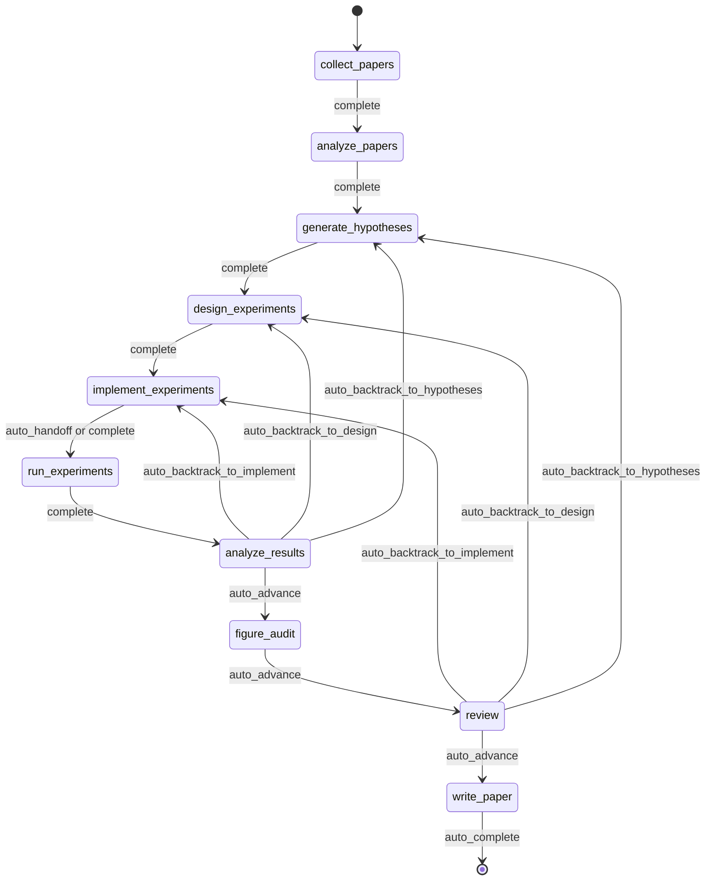
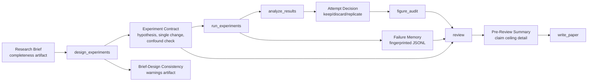
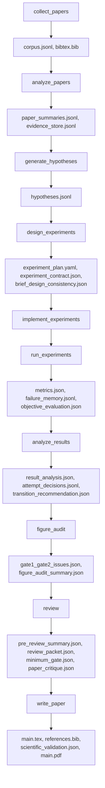

<div align="center">

  <br/>

  

  <h1>Un système d’exploitation pour la recherche autonome</h1>

  <p><strong>Pas la génération de recherche, mais l’exécution autonome de la recherche.</strong><br/>
  Du brief au manuscrit, dans une exécution governed, checkpointed et inspectable.</p>

  <p>
    <a href="../README.md"><strong>English</strong></a>
    &nbsp;&middot;&nbsp;
    <a href="./README.ko.md"><strong>한국어</strong></a>
    &nbsp;&middot;&nbsp;
    <a href="./README.ja.md"><strong>日本語</strong></a>
    &nbsp;&middot;&nbsp;
    <a href="./README.zh-CN.md"><strong>简体中文</strong></a>
    &nbsp;&middot;&nbsp;
    <a href="./README.zh-TW.md"><strong>繁體中文</strong></a>
    &nbsp;&middot;&nbsp;
    <a href="./README.es.md"><strong>Español</strong></a>
    &nbsp;&middot;&nbsp;
    <a href="./README.fr.md"><strong>Français</strong></a>
    &nbsp;&middot;&nbsp;
    <a href="./README.de.md"><strong>Deutsch</strong></a>
    &nbsp;&middot;&nbsp;
    <a href="./README.pt.md"><strong>Português</strong></a>
    &nbsp;&middot;&nbsp;
    <a href="./README.ru.md"><strong>Русский</strong></a>
  </p>

  <p><sub>Les README localisés sont des traductions maintenues de ce document. Pour le libellé normatif et les mises à jour les plus récentes, utilisez le README anglais comme canonical reference.</sub></p>

  <p>
    <a href="https://github.com/lhy0718/AutoLabOS/actions/workflows/ci.yml">
      
    </a>
    <a href="https://github.com/lhy0718/AutoLabOS/actions/workflows/smoke.yml">
      
    </a>
    
  </p>

  <p>
    
    
    
  </p>

  <p>
    
    
    
    
  </p>

</div>

---

AutoLabOS est un système d’exploitation pour l’exécution de recherche gouvernée. Il traite un run comme un état de recherche checkpointé, pas comme une simple étape de génération.

Toute la boucle centrale est inspectable. La collecte de littérature, la formulation d’hypothèses, la conception expérimentale, l’implémentation, l’exécution, l’analyse, le figure audit, la review et la rédaction du manuscrit produisent tous des artefacts auditables. Les affirmations restent evidence-bounded sous un claim ceiling. La review n’est pas une étape de polissage, mais un structural gate.

Les hypothèses de qualité sont transformées en checks explicites. Le comportement réel compte davantage que l’apparence au niveau du prompt. La reproductibilité est assurée par les artefacts, les checkpoints et des transitions inspectables.

---

## Pourquoi AutoLabOS existe

Beaucoup de systèmes de research agents sont optimisés pour produire du texte. AutoLabOS est optimisé pour exécuter un processus de recherche gouverné.

Cette différence compte lorsqu’un projet a besoin de plus qu’un brouillon convaincant.

- un research brief qui agit comme contrat d’exécution
- des workflow gates explicites au lieu d’une dérive libre des agents
- des checkpoints et des artefacts inspectables après coup
- une review capable d’arrêter un travail faible avant la génération du manuscrit
- une failure memory pour éviter de répéter aveuglément la même expérience ratée
- des evidence-bounded claims au lieu d’une prose qui dépasse les données

AutoLabOS s’adresse aux équipes qui veulent de l’autonomie sans abandonner l’auditabilité, le backtracking et la validation.

---

## Ce qui se passe pendant un run

Un run governed suit toujours le même arc de recherche.

`Brief.md` → literature → hypothesis → experiment design → implementation → execution → analysis → figure audit → review → manuscript

En pratique :

1. `/new` crée ou ouvre le research brief
2. `/brief start --latest` valide le brief, le snapshot dans le run et lance un run governed
3. le système avance dans le workflow fixe et checkpoint l’état et les artefacts à chaque frontière
4. si l’evidence est faible, le système choisit le backtracking ou le downgrade plutôt qu’un polissage automatique
5. seulement après le passage du review gate, `write_paper` rédige un manuscrit à partir d’une evidence bornée

Le contrat historique à 9 nœuds reste la base architecturale. Dans le runtime actuel, `figure_audit` est le checkpoint supplémentaire approuvé entre `analyze_results` et `review`, afin que la critique des figures puisse être checkpointée et reprise indépendamment.



Toute l’automatisation dans ce flux reste bornée à des bounded node-internal loops. Même en mode non supervisé, le workflow reste governed.

---

## Ce que vous obtenez après un run

AutoLabOS ne produit pas seulement un PDF. Il produit un état de recherche traçable.

| Sortie | Contenu |
|---|---|
| **Corpus de littérature** | papers collectés, BibTeX, evidence store extrait |
| **Hypothèses** | hypotheses fondées sur la littérature et skeptical review |
| **Plan expérimental** | governed design avec contract, baseline lock et checks de cohérence |
| **Résultats exécutés** | metrics, objective evaluation, failure memory log |
| **Analyse des résultats** | analyse statistique, attempt decisions, transition reasoning |
| **Figure audit** | figure lint, caption/reference consistency, vision critique optionnelle |
| **Review packet** | scorecard du panel de 5 spécialistes, claim ceiling, critique pré-brouillon |
| **Manuscrit** | brouillon LaTeX avec evidence links, scientific validation et PDF optionnel |
| **Checkpoints** | snapshots complets de l’état à chaque frontière de nœud, reprise possible à tout moment |

Tout est stocké sous `.autolabos/runs/<run_id>/`, avec une copie des sorties publiques sous `outputs/`.

C’est le modèle de reproductibilité du système : non pas un état caché, mais des artefacts, des checkpoints et des transitions inspectables.

---

## Démarrage rapide

```bash
# 1. Installer et construire
npm install
npm run build
npm link

# 2. Aller dans votre workspace de recherche
cd /path/to/your-research-workspace

# 3. Lancer une interface
autolabos        # TUI
autolabos web    # Web UI
```

Flux typique au premier usage :

```bash
/new
/brief start --latest
/doctor
```

Notes :

- si `.autolabos/config.yaml` n’existe pas, les deux interfaces guident l’onboarding
- n’exécutez pas AutoLabOS depuis la racine du dépôt ; utilisez `test/` ou votre propre workspace
- le TUI et le Web UI partagent le même runtime, les mêmes artefacts et les mêmes checkpoints

### Prérequis

| Élément | Quand c’est nécessaire | Notes |
|---|---|---|
| `SEMANTIC_SCHOLAR_API_KEY` | Toujours | Découverte de papers et metadata |
| `OPENAI_API_KEY` | Quand le provider est `api` | Exécution via modèles OpenAI API |
| Connexion Codex CLI | Quand le provider est `codex` | Utilise votre session Codex locale |

---

## Système de Research Brief

Le brief n’est pas seulement un document de départ. C’est le governed contract du run.

`/new` crée ou ouvre `Brief.md`. `/brief start --latest` le valide, le snapshot dans le run, puis lance l’exécution à partir de ce snapshot. Le run enregistre le source path du brief, le snapshot path, ainsi que tout manuscript format analysé. Ainsi, la provenance du run reste inspectable même si le brief du workspace change ensuite.

En d’autres termes, le brief n’est pas seulement une partie du prompt. Il fait partie de l’audit trail.

Dans le contrat actuel, `.autolabos/config.yaml` sert surtout à stocker les valeurs par défaut du provider/runtime et la workspace policy. L’intention de recherche propre à chaque run, les evidence bars, les attentes de baseline, les objectifs de manuscript format et le chemin du manuscript template doivent vivre dans le Brief. Le config persisté peut donc omettre les valeurs par défaut de `research` ainsi que certains champs de manuscript-profile / paper-template.

```bash
/new
/brief start --latest
```

Le brief doit couvrir à la fois l’intention de recherche et les contraintes de gouvernance : topic, objective metric, baseline ou comparator, minimum acceptable evidence, disallowed shortcuts et le paper ceiling si l’evidence reste faible.

<details>
<summary><strong>Sections du brief et grading</strong></summary>

| Section | Statut | Rôle |
|---|---|---|
| `## Topic` | Requise | Définir la question de recherche en 1-3 phrases |
| `## Objective Metric` | Requise | Indicateur principal de réussite |
| `## Constraints` | Recommandée | compute budget, limites de dataset, règles de reproductibilité |
| `## Plan` | Recommandée | Plan expérimental étape par étape |
| `## Target Comparison` | Governance | Comparaison avec un baseline explicite |
| `## Minimum Acceptable Evidence` | Governance | Effect size minimal, fold count, decision boundary |
| `## Disallowed Shortcuts` | Governance | Raccourcis qui invalident le résultat |
| `## Paper Ceiling If Evidence Remains Weak` | Governance | Classification maximale du paper si l’evidence reste faible |
| `## Manuscript Format` | Optionnelle | Nombre de colonnes, budget de pages, règles de references / appendix |

| Grade | Signification | Prêt pour paper-scale ? |
|---|---|---|
| `complete` | core + 4 sections de governance substantielles ou plus | Oui |
| `partial` | core complet + 2 sections de governance ou plus | Avance avec avertissements |
| `minimal` | seulement les sections core | Non |

</details>

---

## Deux interfaces, un runtime

AutoLabOS propose deux front ends sur le même runtime governed.

| | TUI | Web UI |
|---|---|---|
| Lancement | `autolabos` | `autolabos web` |
| Interaction | slash commands, langage naturel | dashboard et composer dans le navigateur |
| Vue du workflow | progression des nœuds en temps réel dans le terminal | governed workflow graph avec actions |
| Artefacts | inspection via CLI | preview inline du texte, des images et des PDFs |
| Surfaces opératoires | `/watch`, `/queue`, `/explore`, `/doctor` | jobs queue, live watch cards, exploration status, diagnostics |
| Idéal pour | itération rapide et contrôle direct | monitoring visuel et navigation des artefacts |

Le point important est que les deux surfaces voient les mêmes checkpoints, les mêmes runs et les mêmes artefacts sous-jacents.

---

## Ce qui distingue AutoLabOS

AutoLabOS est conçu autour de la governed execution, pas d’une prompt-only orchestration.

| | Outils de recherche typiques | AutoLabOS |
|---|---|---|
| Workflow | dérive ouverte d’agents | governed fixed graph avec review boundaries explicites |
| State | éphémère | checkpointed, resumable, inspectable |
| Claims | aussi fortes que le modèle les écrit | limitées par l’evidence et le claim ceiling |
| Review | cleanup pass optionnel | structural gate capable de bloquer l’écriture |
| Failures | oubliés puis réessayés | enregistrés avec fingerprint dans la failure memory |
| Validation | secondaire | `/doctor`, harnesses, smoke et live validation sont first-class |
| Interfaces | chemins de code séparés | TUI et Web partagent un seul runtime |

Le système se lit donc davantage comme une research infrastructure que comme un paper generator.

---

## Garanties de base

### Governed Workflow

Le workflow est borné et auditable. Le backtracking fait partie du contract. Les résultats qui ne justifient pas la progression repartent vers hypotheses, design ou implementation au lieu d’être transformés en prose plus forte.

### Checkpointed Research State

Chaque frontière de nœud écrit un state inspectable et resumable. L’unité de progression n’est pas seulement un texte produit, mais un run avec artifacts, transitions et recoverable state.

### Claim Ceiling

Les claims restent sous le strongest defensible evidence ceiling. Le système enregistre les claims plus fortes qui ont été bloquées et les evidence gaps nécessaires pour les débloquer.

### Review As A Structural Gate

`review` n’est pas une étape de nettoyage cosmétique. C’est le structural gate où readiness, méthodologie, evidence linkage, writing discipline et reproducibility handoff sont vérifiés avant la génération du manuscrit.

### Failure Memory

Les failure fingerprints sont persistés afin que les erreurs structurelles et les equivalent failures répétées ne soient pas relancées aveuglément.

### Reproducibility Through Artifacts

La reproductibilité est imposée par les artefacts, les checkpoints et les transitions inspectables. Même les résumés publics se basent sur les persisted run outputs plutôt que sur une seconde source de vérité.

---

## Validation et modèle de qualité orienté harness

AutoLabOS traite les validation surfaces comme first-class.

- `/doctor` vérifie l’environnement et la readiness du workspace avant le démarrage d’un run
- la harness validation protège les workflow, artifact et governance contracts
- les targeted smoke checks fournissent une couverture diagnostique de régression
- quand le comportement interactif compte, on utilise la live validation

Le paper readiness n’est pas une simple impression produite par un prompt.

- **Layer 1 - deterministic minimum gate** arrête le under-evidenced work via des artifact / evidence-integrity checks explicites
- **Layer 2 - LLM paper-quality evaluator** ajoute une critique structurée sur la methodology, l’evidence strength, la writing structure, le claim support et la limitations honesty
- **Review packet + specialist panel** décident si le chemin du manuscrit doit advance, revise ou backtrack

`paper_readiness.json` peut inclure un `overall_score`. Cette valeur doit être comprise comme un signal interne de qualité du run, pas comme un benchmark scientifique universel. Certains chemins avancés d’evaluation / self-improvement utilisent ce signal pour comparer des runs ou des candidats de prompt mutation.

<details>
<summary><strong>Pourquoi ce modèle de validation est important</strong></summary>

Les hypothèses de qualité sont transformées en checks explicites. Le comportement réel compte davantage que l’apparence au niveau du prompt. Le but n’est pas « le modèle a écrit quelque chose de convaincant », mais « ce run peut être inspecté et défendu ».

</details>

---

## Capacités avancées de Self-Improvement

AutoLabOS inclut des chemins de self-improvement bornés, mais il ne s’agit pas de blind autonomous rewriting. Ils restent contraints par la validation et le rollback.

### `autolabos meta-harness`

`autolabos meta-harness` construit un context directory dans `outputs/meta-harness/<timestamp>/` à partir de recent completed runs et de l’historique d’évaluation.

Il peut inclure :

- des run events filtrés
- des node artifacts comme `result_analysis.json` ou `review/decision.json`
- `paper_readiness.json`
- `outputs/eval-harness/history.jsonl`
- les fichiers `node-prompts/` actuels pour le nœud ciblé

Le LLM est contraint par `TASK.md` à répondre uniquement avec `TARGET_FILE + unified diff`, et la cible est restreinte à `node-prompts/`. En mode apply, la proposition doit passer `validate:harness`; sinon elle est rollbackée et un audit log est écrit. `--no-apply` ne construit que le context. `--dry-run` affiche le diff sans modifier les fichiers.

### `autolabos evolve`

`autolabos evolve` exécute une boucle bornée de mutation et d’évaluation sur `.codex` et `node-prompts`.

- supporte `--max-cycles`, `--target skills|prompts|all` et `--dry-run`
- lit la fitness du run depuis `paper_readiness.overall_score`
- mute prompts et skills, exécute la validation et compare la fitness entre cycles
- en cas de régression, restaure `.codex` et `node-prompts` depuis le dernier good git tag

C’est un chemin de self-improvement, mais pas une réécriture repo-wide sans limites.

### Harness Preset Layer

AutoLabOS fournit aussi des built-in harness presets comme `base`, `compact`, `failure-aware` et `review-heavy`. Ils ajustent l’artifact/context policy, l’emphase sur la failure memory, la prompt policy et la compression strategy pour l’évaluation comparative, sans modifier le governed production workflow.

---

## Commandes courantes

| Commande | Description |
|---|---|
| `/new` | Créer ou ouvrir `Brief.md` |
| `/brief start <path\|--latest>` | Démarrer la recherche à partir d’un brief |
| `/runs [query]` | Lister ou rechercher des runs |
| `/resume <run>` | Reprendre un run |
| `/agent run <node> [run]` | Exécuter depuis un nœud du graph |
| `/agent status [run]` | Afficher les états des nœuds |
| `/agent overnight [run]` | Exécuter un run unattended sous contraintes conservatrices |
| `/agent autonomous [run]` | Exécuter une bounded research exploration |
| `/watch` | Vue live watch des runs actifs et background jobs |
| `/explore` | Afficher l’état de l’exploration engine du run actif |
| `/queue` | Afficher les jobs running / waiting / stalled |
| `/doctor` | Diagnostics de l’environnement et du workspace |
| `/model` | Changer le modèle et le reasoning effort |

<details>
<summary><strong>Liste complète des commandes</strong></summary>

| Commande | Description |
|---|---|
| `/help` | Afficher la liste des commandes |
| `/new` | Créer ou ouvrir le `Brief.md` du workspace |
| `/brief start <path\|--latest>` | Démarrer la recherche depuis le `Brief.md` du workspace ou un brief donné |
| `/doctor` | Diagnostics environment + workspace |
| `/runs [query]` | Lister ou rechercher des runs |
| `/run <run>` | Sélectionner un run |
| `/resume <run>` | Reprendre un run |
| `/agent list` | Lister les nœuds du graph |
| `/agent run <node> [run]` | Exécuter depuis un nœud |
| `/agent status [run]` | Afficher les états des nœuds |
| `/agent collect [query] [options]` | Collecter des papers |
| `/agent recollect <n> [run]` | Collecter des papers supplémentaires |
| `/agent focus <node>` | Déplacer le focus via safe jump |
| `/agent graph [run]` | Afficher l’état du graph |
| `/agent resume [run] [checkpoint]` | Reprendre depuis un checkpoint |
| `/agent retry [node] [run]` | Réessayer un nœud |
| `/agent jump <node> [run] [--force]` | Sauter vers un nœud |
| `/agent overnight [run]` | Overnight autonomy (24h) |
| `/agent autonomous [run]` | Open-ended autonomous research |
| `/model` | Sélecteur de modèle et de reasoning |
| `/approve` | Approuver un nœud en pause |
| `/queue` | Afficher les jobs running / waiting / stalled |
| `/watch` | Live watch des runs actifs |
| `/explore` | Afficher l’état de l’exploration engine |
| `/retry` | Réessayer le nœud courant |
| `/settings` | Paramètres provider et modèle |
| `/quit` | Quitter |

</details>

---

## Pour qui / pour qui ce n’est pas

### Bon choix si

- vous voulez de l’autonomie sans renoncer à un governed workflow
- vous faites du research engineering où checkpoints et artifacts comptent
- vous travaillez sur des projets paper-scale ou paper-adjacent nécessitant une discipline d’evidence
- votre environnement valorise autant review, traceability et resumability que generation

### Moins adapté si

- vous voulez seulement un one-shot draft rapide
- votre workflow n’a pas besoin d’artifact trail ni de review gate
- vous préférez un free-form agent behavior à la governed execution
- un simple outil de synthèse de littérature vous suffit

---

## Développement

```bash
npm install
npm run build
npm test
npm run test:web
npm run validate:harness
```

Choisissez le plus petit ensemble de validation qui couvre honnêtement le changement. Pour un defect interactif, si l’environnement le permet, ne vous contentez pas des tests : relancez le même flux TUI / Web.

Commandes utiles :

```bash
npm run test:watch
npm run test:smoke:natural-collect
npm run test:smoke:natural-collect-execute
npm run test:smoke:all
```

---

## Advanced Details

<details>
<summary><strong>Modes d’exécution</strong></summary>

AutoLabOS conserve le governed workflow et les safety gates dans tous les modes.

| Mode | Commande | Comportement |
|---|---|---|
| **Interactive** | `autolabos` | TUI à slash commands avec approval gates explicites |
| **Minimal approval** | Config : `approval_mode: minimal` | Auto-approuve les transitions sûres |
| **Hybrid approval** | Config : `approval_mode: hybrid` | Fait avancer automatiquement les transitions fortes et peu risquées ; met en pause les transitions risquées ou peu confiantes |
| **Overnight** | `/agent overnight [run]` | Exécution unattended en une passe, limite de 24 h, backtracking conservateur |
| **Autonomous** | `/agent autonomous [run]` | Open-ended bounded research exploration |

</details>

<details>
<summary><strong>Governance artifact flow</strong></summary>



</details>

<details>
<summary><strong>Artifact flow</strong></summary>



</details>

<details>
<summary><strong>Architecture des nœuds</strong></summary>

| Nœud | Rôle | Fonction |
|---|---|---|
| `collect_papers` | collector, curator | Découvre et trie les candidate paper sets via Semantic Scholar |
| `analyze_papers` | reader, evidence extractor | Extrait summaries et evidence des papers sélectionnés |
| `generate_hypotheses` | hypothesis agent + skeptical reviewer | Synthétise des idées à partir de la littérature puis les pressure-test |
| `design_experiments` | designer + feasibility/statistical/ops panel | Filtre les plans selon leur faisabilité et rédige l’experiment contract |
| `implement_experiments` | implementer | Produit des changements de code et de workspace via ACI actions |
| `run_experiments` | runner + failure triager + rerun planner | Pilote l’exécution, enregistre les failures et décide des reruns |
| `analyze_results` | analyst + metric auditor + confounder detector | Vérifie la fiabilité des résultats et écrit les attempt decisions |
| `figure_audit` | figure auditor + optional vision critique | Vérifie l’evidence alignment, les captions / references et la publication readiness |
| `review` | 5-specialist panel + claim ceiling + two-layer gate | Réalise une structural review et bloque l’écriture si l’evidence est insuffisante |
| `write_paper` | paper writer + reviewer critique | Rédige le manuscrit, exécute la post-draft critique et construit le PDF |

</details>

<details>
<summary><strong>Bounded automation</strong></summary>

| Nœud | Automatisation interne | Limite |
|---|---|---|
| `analyze_papers` | Auto-extension de l’evidence window quand l’evidence est trop faible | <= 2 extensions |
| `design_experiments` | Deterministic panel scoring + experiment contract | Une fois par design |
| `run_experiments` | Failure triage + une relance transitoire | Ne réessaie jamais les structural failures |
| `run_experiments` | Failure memory fingerprinting | >= 3 failures identiques épuisent les retries |
| `analyze_results` | Objective rematching + result panel calibration | Un rematch avant pause humaine |
| `figure_audit` | Gate 3 figure critique + summary aggregation | La vision critique reste résumable indépendamment |
| `write_paper` | Related-work scout + validation-aware repair | 1 repair maximum |

</details>

<details>
<summary><strong>Public output bundle</strong></summary>

```
outputs/<title-slug>-<run_id_prefix>/
  ├── paper/
  ├── experiment/
  ├── analysis/
  ├── review/
  ├── results/
  ├── reproduce/
  ├── manifest.json
  └── README.md
```

</details>

---

## Status

AutoLabOS est un projet OSS actif de research engineering. Les références canoniques pour le comportement et les contracts se trouvent dans `docs/`, en particulier :

- `docs/architecture.md`
- `docs/tui-live-validation.md`
- `docs/experiment-quality-bar.md`
- `docs/paper-quality-bar.md`
- `docs/reproducibility.md`
- `docs/research-brief-template.md`

Si vous modifiez le comportement du runtime, traitez ces documents, les tests publiés et les observable artifacts comme source of truth.
