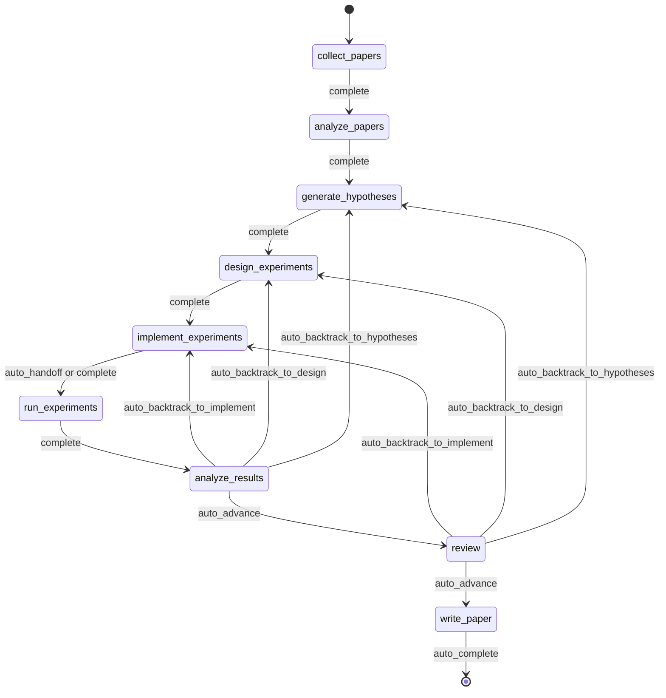
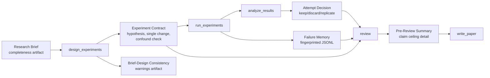
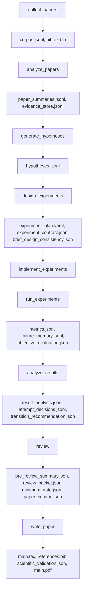
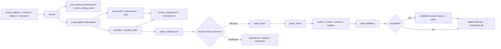
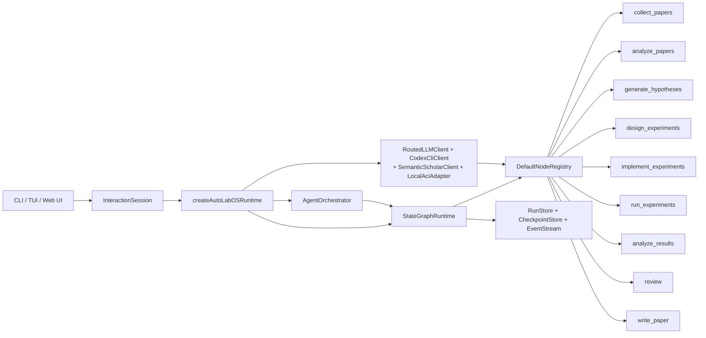

<div align="center">

  <br/>

  

  <h1>自律研究のためのオペレーティングシステム</h1>

  <p><strong>研究生成ではなく、自律研究の実行。</strong><br/>
  文献調査から原稿作成までを、統制され、チェックポイントされ、検査可能なループの中で進めます。</p>

  <p>
    <a href="../README.md"><strong>English</strong></a>
    &nbsp;&middot;&nbsp;
    <a href="./README.ko.md"><strong>한국어</strong></a>
    &nbsp;&middot;&nbsp;
    <a href="./README.ja.md"><strong>日本語</strong></a>
    &nbsp;&middot;&nbsp;
    <a href="./README.zh-CN.md"><strong>简体中文</strong></a>
    &nbsp;&middot;&nbsp;
    <a href="./README.zh-TW.md"><strong>繁體中文</strong></a>
    &nbsp;&middot;&nbsp;
    <a href="./README.es.md"><strong>Español</strong></a>
    &nbsp;&middot;&nbsp;
    <a href="./README.fr.md"><strong>Français</strong></a>
    &nbsp;&middot;&nbsp;
    <a href="./README.de.md"><strong>Deutsch</strong></a>
    &nbsp;&middot;&nbsp;
    <a href="./README.pt.md"><strong>Português</strong></a>
    &nbsp;&middot;&nbsp;
    <a href="./README.ru.md"><strong>Русский</strong></a>
  </p>

  <p><sub>この README は英語版 README 全体を元にした翻訳版です。技術的な基準文書は英語 README です。</sub></p>

  <p>
    <a href="https://github.com/lhy0718/AutoLabOS/actions/workflows/ci.yml">
      
    </a>
    <a href="https://github.com/lhy0718/AutoLabOS/actions/workflows/smoke.yml">
      
    </a>
    
  </p>

  <p>
    
    
    
  </p>

  <p>
    
    
    
    
  </p>

  <p>
    
    
    
    
  </p>

  <p>
    <a href="https://github.com/lhy0718/AutoLabOS/stargazers">
      
    </a>
    <a href="https://github.com/lhy0718/AutoLabOS/commits/main">
      
    </a>
  </p>

</div>

---

研究の自動化をうたうほとんどのツールは、実際には **テキスト生成** を自動化しているだけです。見た目の整った成果物は出せても、実験ガバナンスも、証拠追跡も、証拠が実際にどこまで主張を支えているのかに関する誠実な説明もありません。

AutoLabOS は別の立場を取ります。**研究で本当に難しいのは書くことではなく、問いとドラフトの間に必要な規律です。** 文献による基礎付け、仮説検証、実験ガバナンス、失敗追跡、主張の上限設定、レビューゲーティングはすべて固定の 9 ノード状態グラフの中で行われます。すべてのノードは監査可能なアーティファクトを生成します。すべての遷移はチェックポイントされます。すべての主張には証拠の上限があります。

出力は単なる論文ではありません。確認でき、再開でき、擁護できる、統制された研究状態です。

> **証拠が先。主張はその後。**
>
> **確認し、再開し、擁護できる実行。**
>
> **プロンプト集ではなく、研究オペレーティングシステム。**
>
> **研究室は同じ失敗した実験を二度繰り返すべきではない。**
>
> **レビューは磨き上げの工程ではなく、構造的ゲートである。**

---

## 実行後に得られるもの

AutoLabOS は PDF だけを生成するわけではありません。完全に追跡可能な研究状態全体を生成します。

| 出力 | 含まれるもの |
|---|---|
| **文献コーパス** | 収集された論文、BibTeX、抽出された証拠ストア |
| **仮説** | 文献に基づく仮説と懐疑的レビュー |
| **実験計画** | 契約、ベースライン固定、一貫性チェックを備えた統制された設計 |
| **実行結果** | 指標、客観評価、失敗メモリログ |
| **結果分析** | 統計分析、試行ごとの判断、遷移の推論 |
| **レビューパケット** | 5 人の専門家パネルのスコアカード、主張上限、ドラフト前批評 |
| **原稿** | 証拠リンク、科学的検証、任意の PDF を含む LaTeX 草稿 |
| **チェックポイント** | 各ノード境界での完全な状態スナップショット。いつでも再開可能 |

すべては `.autolabos/runs/<run_id>/` に保存され、公開向け出力は `outputs/` にミラーされます。

---

## なぜ AutoLabOS なのか

多くの AI 研究ツールは **出力の見栄え** を最適化します。AutoLabOS は **統制された実行** を最適化します。

| | 一般的な研究ツール | AutoLabOS |
|---|---|---|
| ワークフロー | 境界のないエージェントの漂流 | 遷移が制限された固定 9 ノードグラフ |
| 実験設計 | 非構造的 | 単一変更ルールと交絡検知を備えた契約 |
| 失敗した実験 | 忘れられて再試行される | 失敗メモリに指紋化され、繰り返されない |
| 主張 | LLM が生成するだけ強くなる | 実際の証拠に結び付いた主張上限で制限 |
| レビュー | 任意の後処理 | 構造的ゲート。証拠不足なら執筆を止める |
| 論文評価 | 単一 LLM の「よさそう」判定 | 2 層ゲート: 決定的最小基準 + LLM 品質評価 |
| 状態 | 一時的 | チェックポイント可能、再開可能、検査可能 |

---

## クイックスタート

```bash
# 1. インストールとビルド
npm install && npm run build && npm link

# 2. 研究ワークスペースへ移動
cd /path/to/your-research-project

# 3. 起動（どちらか一方）
autolabos web    # ブラウザ UI: オンボーディング、ダッシュボード、アーティファクトブラウザ
autolabos        # ターミナル中心のスラッシュコマンドワークフロー
```

> **初回実行ですか。** `.autolabos/config.yaml` がまだなければ、両 UI がオンボーディングを案内します。

### 前提条件

| 項目 | 必要な場合 | 備考 |
|---|---|---|
| `SEMANTIC_SCHOLAR_API_KEY` | 常に | 論文探索とメタデータ取得 |
| `OPENAI_API_KEY` | provider が `api` のとき | OpenAI API モデル実行 |
| Codex CLI ログイン | provider が `codex` のとき | ローカル Codex セッションを使用 |

---

## 9 ノードワークフロー

固定グラフです。提案ではなく契約です。



`collect_papers` → `analyze_papers` → `generate_hypotheses` → `design_experiments` → `implement_experiments` → `run_experiments` → `analyze_results` → `review` → `write_paper`

バックトラックは組み込み済みです。結果が弱ければ、グラフは希望的観測のまま前進せず、仮説や設計へ戻ります。すべての自動化は境界づけられたノード内部ループの中にあります。

---

## コア特性

### 実験ガバナンス

すべての実験実行は構造化された契約を通過します。

- **実験契約**: 仮説、因果メカニズム、単一変更ルール、中止条件、保持/破棄基準を固定
- **交絡検知**: 複合変更、列挙型介入、メカニズムと変更内容の不一致を検出
- **ブリーフ設計整合性**: 設計が元の研究ブリーフから逸脱したときに警告
- **ベースライン固定**: 比較契約が実行前に客観指標とベースラインを固定

### 主張上限の強制

システムは主張が証拠を追い越すことを許しません。

`review` ノードは `pre_review_summary` を生成します。そこには **擁護可能な最も強い主張**、理由付きで **阻止されたより強い主張** の一覧、そしてそれらを解除するために必要な **証拠ギャップ** が含まれます。この上限はそのまま原稿生成に流れ込みます。

### 失敗メモリ

実行スコープの JSONL で失敗パターンを記録し、重複排除します。

- **エラー指紋化**: タイムスタンプ、パス、数値を取り除き安定したクラスタリングを実現
- **同等失敗の停止**: 同一指紋が 3 回以上出た時点で再試行を即時打ち切り
- **再試行禁止マーカー**: 構造的失敗は設計が変わるまで再実行を禁止

研究室は 1 回の実行の中でも、自分自身の失敗から学びます。

### 2 層の論文評価

論文準備度は単一の LLM 判断には委ねません。

- **第 1 層, 決定的最小ゲート**: 証拠不足の作業が `write_paper` に入らないようにする 7 つのアーティファクト存在チェック。LLM は関与しません。結果は合格か不合格です。
- **第 2 層, LLM 論文品質評価**: 結果の重要性、方法論の厳密さ、証拠の強さ、文章構造、主張支持、限界の誠実さという 6 軸で構造化された批評を生成。ブロッキング課題、非ブロッキング課題、原稿タイプ分類を出力します。

証拠が不足していれば、システムは磨き上げではなくバックトラックを勧めます。

### 5 人の専門家レビューパネル

`review` ノードは 5 つの独立した専門家パスを実行します。

1. **主張検証者**: 主張を証拠と照合
2. **方法論レビュアー**: 実験設計を検証
3. **統計レビュアー**: 定量的厳密さを評価
4. **執筆準備度レビュアー**: 明瞭さと完全性を点検
5. **インテグリティレビュアー**: バイアスと衝突を特定

このパネルはスコアカード、一貫性評価、ゲート判断を生成します。

---

## デュアルインターフェース

2 つの UI、1 つのランタイム。同じアーティファクト、同じワークフロー、同じチェックポイントです。

| | TUI | Web Ops UI |
|---|---|---|
| 起動 | `autolabos` | `autolabos web` |
| 操作 | スラッシュコマンド、自然言語 | ブラウザダッシュボード、コンポーザー |
| ワークフロー表示 | ターミナル上のリアルタイム進行 | アクション可能な 9 ノード視覚グラフ |
| アーティファクト | CLI 検査 | テキスト、画像、PDF のインライン表示 |
| 向いている用途 | 高速反復、スクリプト化 | 視覚監視、アーティファクト閲覧 |

---

## 実行モード

AutoLabOS はどのモードでも 9 ノードワークフローと安全ゲートを維持します。

| モード | コマンド | 挙動 |
|---|---|---|
| **Interactive** | `autolabos` | 明示的承認ゲート付きのスラッシュコマンド TUI |
| **Minimal approval** | 設定: `approval_mode: minimal` | 安全な遷移を自動承認 |
| **Overnight** | `/agent overnight [run]` | 無人の単一パス、24 時間制限、保守的バックトラック |
| **Autonomous** | `/agent autonomous [run]` | 時間制限なしのオープンエンド研究探索 |

### Autonomous モード

最小限の介入で、仮説 → 実験 → 分析ループを継続するよう設計されています。内部では 2 つの並列ループが動作します。

1. **研究探索**: 仮説生成、実験設計/実行、分析、次の仮説導出
2. **論文品質改善**: 最も強い分岐を選び、ベースラインを強化し、証拠リンクを改善

停止条件は、明示的なユーザー停止、資源制限、停滞検知、致命的失敗です。単一の実験が否定的だった、あるいは論文品質が一時的に横ばいだったという理由だけでは **停止しません**。

---

## 研究ブリーフシステム

すべての実行は、範囲、制約、ガバナンス規則を定義する構造化 Markdown ブリーフから始まります。

```bash
/new                        # ブリーフ作成
/brief start --latest       # 検証、スナップショット、抽出、実行開始
```

ブリーフには **コア** セクション（トピック、客観指標）と **ガバナンス** セクション（比較対象、最小証拠、禁止ショートカット、論文上限）が含まれます。AutoLabOS はブリーフの完成度を採点し、論文規模の作業に対してガバナンスが不足している場合は警告します。

<details>
<summary><strong>ブリーフのセクションと評価</strong></summary>

| セクション | 状態 | 目的 |
|---|---|---|
| `## Topic` | 必須 | 研究質問を 1〜3 文で定義 |
| `## Objective Metric` | 必須 | 主要成功指標 |
| `## Constraints` | 推奨 | 計算予算、データセット制約、再現規則 |
| `## Plan` | 推奨 | ステップごとの実験計画 |
| `## Target Comparison` | ガバナンス | 提案手法と明示的ベースラインの比較 |
| `## Minimum Acceptable Evidence` | ガバナンス | 最小効果量、fold 数、判断境界 |
| `## Disallowed Shortcuts` | ガバナンス | 結果を無効化する近道 |
| `## Paper Ceiling If Evidence Remains Weak` | ガバナンス | 証拠が弱い場合の最大論文分類 |
| `## Manuscript Format` | 任意 | カラム数、ページ予算、参考文献/付録規則 |

| グレード | 意味 | 論文規模に十分か |
|---|---|---|
| `complete` | コア + 実質的なガバナンス 4 項目以上 | はい |
| `partial` | コア完成 + ガバナンス 2 項目以上 | 警告付きで進行 |
| `minimal` | コアのみ | いいえ |

</details>

---

## ガバナンスアーティファクトの流れ



---

## アーティファクトの流れ

すべてのノードは構造化され、検査可能なアーティファクトを生成します。



<details>
<summary><strong>公開出力バンドル</strong></summary>

```
outputs/
  ├── paper/           # TeX ソース、PDF、参考文献、ビルドログ
  ├── experiment/      # ベースライン要約、実験コード
  ├── analysis/        # 結果表、証拠分析
  ├── review/          # 論文批評、ゲート判断
  ├── results/         # コンパクトな定量要約
  ├── reproduce/       # 再現スクリプト、README
  ├── manifest.json    # セクションレジストリ
  └── README.md        # 人が読める実行要約
```

</details>

---

## ノードアーキテクチャ

| ノード | 役割 | 実施内容 |
|---|---|---|
| `collect_papers` | collector, curator | Semantic Scholar を通じて候補論文集合を発見し整理 |
| `analyze_papers` | reader, evidence extractor | 選択論文から要約と証拠を抽出 |
| `generate_hypotheses` | hypothesis agent + skeptical reviewer | 文献からアイデアを合成し、圧力試験を行う |
| `design_experiments` | designer + feasibility/statistical/ops panel | 実行可能性で計画を絞り込み、実験契約を書く |
| `implement_experiments` | implementer | ACI アクションを通じてコードとワークスペース変更を生成 |
| `run_experiments` | runner + failure triager + rerun planner | 実行を駆動し、失敗を記録し、再実行を決める |
| `analyze_results` | analyst + metric auditor + confounder detector | 結果信頼性を確認し、試行判断を書く |
| `review` | 5-specialist panel + claim ceiling + two-layer gate | 構造レビュー。証拠不足なら執筆を止める |
| `write_paper` | paper writer + reviewer critique | 原稿を作成し、ドラフト後批評を実行し、PDF をビルド |

<details>
<summary><strong>段階別接続グラフ</strong></summary>

**探索と読解**

```mermaid
flowchart LR
    Topic["run topic + collect constraints"] --> CP["collect_papers"]
    CP --> CC["collector_curator"]
    CC --> SS["Semantic Scholar search"]
    SS --> Enrich["enrichment + BibTeX recovery"]
    Enrich --> Corpus["corpus.jsonl + bibtex.bib"]
    Corpus --> AP["analyze_papers"]
    AP --> Select["selection request + hybrid rerank"]
    Select --> Manifest["analysis_manifest resume / prune"]
    Manifest --> RE["reader_evidence_extractor"]
    RE --> Pdf["local text/image analysis or Responses API PDF"]
    Pdf --> ReviewLoop["extractor -> reviewer normalization"]
    ReviewLoop --> Evidence["paper_summaries.jsonl + evidence_store.jsonl"]
```



**仮説と実験設計**

```mermaid
flowchart LR
    Evidence["paper_summaries.jsonl + evidence_store.jsonl"] --> GH["generate_hypotheses"]
    GH --> HA["hypothesis_agent"]
    HA --> Axes["evidence synthesizer -> evidence axes"]
    Axes --> ToT["ToT branch expansion"]
    ToT --> Drafts["mechanism / contradiction / intervention drafts"]
    Drafts --> Reviews["skeptical reviewer"]
    Reviews --> Select["diversity + evidence-quality top-k selection"]
    Select --> Hyp["hypotheses.jsonl + axes/reviews/llm_trace"]
    Hyp --> DE["design_experiments"]
    DE --> ED["experiment_designer"]
    ED --> Profiles["constraint profile + objective metric profile"]
    Profiles --> Plans["design candidates"]
    Plans --> Panel["designer + feasibility + statistical + ops-capacity panel"]
    Panel --> Choice["panel selection"]
    Choice --> Contract["experiment_contract.json + brief_design_consistency.json"]
```



**実装、実行、結果ループ**

```mermaid
flowchart LR
    PlanYaml["experiment_plan.yaml"] --> IE["implement_experiments"]
    IE --> IM["ImplementSessionManager"]
    IM --> Impl["implementer"]
    IM --> Codex["Codex CLI session"]
    Codex --> VerifyPatch["local verification"]
    VerifyPatch --> Handoff{"auto handoff?"}
    Handoff -->|yes| RX["run_experiments"]
    Handoff -->|no| Gate["approval boundary"]
    Gate --> RX
    RX --> Runner["runner"]
    Runner --> FailCheck["failure memory: check do-not-retry"]
    FailCheck --> ACI["ACI preflight/tests/command"]
    ACI --> Triage["failure triager + rerun planner"]
    Triage -->|retry once if transient| ACI
    ACI --> FailRecord["record to failure_memory.jsonl"]
    ACI --> Metrics["metrics.json + supplemental runs"]
    Metrics --> AR["analyze_results"]
    AR --> ResultPanel["metric auditor + robustness + confounder + calibrator"]
    ResultPanel --> AttemptDec["attempt_decisions.jsonl"]
    ResultPanel --> Synth["transition recommendation"]
    Synth -->|advance| RV["review"]
    Synth -->|backtrack| IE
```



**レビュー、執筆、公開面**



</details>

---

## 境界づけられた自動化

すべての内部自動化には明示的な上限があります。

| ノード | 内部自動化 | 上限 |
|---|---|---|
| `analyze_papers` | 証拠が疎な場合に証拠ウィンドウを自動拡張 | 最大 2 回 |
| `design_experiments` | 決定的パネル採点 + 実験契約 | 設計ごとに 1 回 |
| `run_experiments` | 失敗トリアージ + 一度だけの一時的再実行 | 構造的失敗は再試行しない |
| `run_experiments` | 失敗メモリ指紋化 | 同一 3 回以上で再試行打ち切り |
| `analyze_results` | 客観再マッチ + 結果パネル補正 | 人間停止前に 1 回 |
| `write_paper` | 関連研究スカウト + 検証 aware 修復 | 修復は 1 回のみ |

---

## よく使うコマンド

| コマンド | 説明 |
|---|---|
| `/new` | 研究ブリーフ作成 |
| `/brief start <path\|--latest>` | ブリーフから研究開始 |
| `/runs [query]` | 実行一覧表示または検索 |
| `/resume <run>` | 実行再開 |
| `/agent run <node> [run]` | グラフノードから実行 |
| `/agent status [run]` | ノード状態表示 |
| `/agent overnight [run]` | 無人実行（24 時間制限） |
| `/agent autonomous [run]` | オープンエンド自律研究 |
| `/model` | モデルと推論強度の切り替え |
| `/doctor` | 環境 + ワークスペース診断 |

<details>
<summary><strong>全コマンド一覧</strong></summary>

| コマンド | 説明 |
|---|---|
| `/help` | コマンド一覧表示 |
| `/new` | 研究ブリーフファイル作成 |
| `/brief start <path\|--latest>` | ブリーフファイルから研究開始 |
| `/doctor` | 環境 + ワークスペース診断 |
| `/runs [query]` | 実行一覧または検索 |
| `/run <run>` | 実行選択 |
| `/resume <run>` | 実行再開 |
| `/agent list` | グラフノード一覧 |
| `/agent run <node> [run]` | ノードから実行 |
| `/agent status [run]` | ノード状態表示 |
| `/agent collect [query] [options]` | 論文収集 |
| `/agent recollect <n> [run]` | 追加論文収集 |
| `/agent focus <node>` | 安全ジャンプでフォーカス移動 |
| `/agent graph [run]` | グラフ状態表示 |
| `/agent resume [run] [checkpoint]` | チェックポイントから再開 |
| `/agent retry [node] [run]` | ノード再試行 |
| `/agent jump <node> [run] [--force]` | ノードジャンプ |
| `/agent overnight [run]` | オーバーナイト自律実行（24 時間） |
| `/agent autonomous [run]` | オープンエンド自律研究 |
| `/model` | モデルと推論セレクタ |
| `/approve` | 一時停止ノード承認 |
| `/retry` | 現在ノード再試行 |
| `/settings` | provider と model 設定 |
| `/quit` | 終了 |

</details>

<details>
<summary><strong>収集オプションと例</strong></summary>

```
--limit <n>          --last-years <n>      --year <spec>
--date-range <s:e>   --sort <relevance|citationCount|publicationDate>
--order <asc|desc>   --min-citations <n>   --open-access
--field <csv>        --venue <csv>         --type <csv>
--bibtex <generated|s2|hybrid>             --dry-run
--additional <n>     --run <run_id>
```

```bash
/agent collect --last-years 5 --sort relevance --limit 100
/agent collect "agent planning" --sort citationCount --min-citations 100
/agent collect --additional 200 --run <run_id>
```

</details>

---

## Web Ops UI

`autolabos web` は `http://127.0.0.1:4317` でローカルブラウザ UI を起動します。

- **オンボーディング**: TUI と同じ設定を行い `.autolabos/config.yaml` を作成
- **ダッシュボード**: 実行検索、9 ノードビュー、ノード操作、ライブログ
- **アーティファクト**: 実行閲覧、テキスト/画像/PDF のインライン表示
- **コンポーザー**: スラッシュコマンドと自然言語、段階的な計画制御

```bash
autolabos web                              # デフォルトポート 4317
autolabos web --host 0.0.0.0 --port 8080  # カスタムバインド
```

---

## 哲学

AutoLabOS はいくつかの厳しい制約を中心に設計されています。

- **ワークフロー完了 ≠ 論文準備完了。** グラフを完走しても成果が論文級とは限りません。システムはその差を追跡します。
- **主張は証拠を超えてはならない。** 主張上限は強いプロンプトではなく構造で強制されます。
- **レビューは提案ではなくゲートである。** 証拠が足りなければ `review` が `write_paper` を止め、バックトラックを勧告します。
- **否定的結果も許容される。** 仮説失敗も有効な研究成果ですが、誠実に位置づけなければなりません。
- **再現性はアーティファクトの属性である。** チェックポイント、実験契約、失敗ログ、証拠ストアは、実行の推論をたどり、異議を唱えられるようにするために存在します。

---

## 開発

```bash
npm install              # 依存関係をインストール（web サブパッケージ含む）
npm run build            # TypeScript + web UI をビルド
npm test                 # 全ユニットテスト実行（931+）
npm run test:watch       # watch モード

# 単一テストファイル
npx vitest run tests/<name>.test.ts

# スモークテスト
npm run test:smoke:all
npm run test:smoke:natural-collect
npm run test:smoke:natural-collect-execute
npm run test:smoke:ci
```

<details>
<summary><strong>スモークテスト環境変数</strong></summary>

```bash
AUTOLABOS_FAKE_CODEX_RESPONSE=1
AUTOLABOS_FAKE_SEMANTIC_SCHOLAR_RESPONSE=1
AUTOLABOS_SMOKE_VERBOSE=1
AUTOLABOS_SMOKE_MODE=<mode>
```

</details>

<details>
<summary><strong>ランタイム内部</strong></summary>

### 状態グラフポリシー

- チェックポイント: `.autolabos/runs/<run_id>/checkpoints/`、phase は `before | after | fail | jump | retry`
- 再試行ポリシー: `maxAttemptsPerNode = 3`
- 自動ロールバック: `maxAutoRollbacksPerNode = 2`
- ジャンプモード: `safe`（現在または以前） / `force`（前方、スキップ記録）

### エージェントランタイムパターン

- **ReAct** ループ: `PLAN_CREATED → TOOL_CALLED → OBS_RECEIVED`
- **ReWOO** 分離（planner/worker）: 高コストノードで使用
- **ToT**: 仮説/設計ノードで使用
- **Reflexion**: 失敗エピソードを保存し再試行時に再利用

### メモリ層

| 層 | 範囲 | 形式 |
|---|---|---|
| Run context memory | 実行ごとの key/value | `run_context.jsonl` |
| Long-term store | 試行横断 | JSONL 要約とインデックス |
| Episode memory | Reflexion | 再試行のための失敗教訓 |

### ACI アクション

`implement_experiments` と `run_experiments` は次のアクションを通じて実行されます。
`read_file` · `write_file` · `apply_patch` · `run_command` · `run_tests` · `tail_logs`

</details>

<details>
<summary><strong>エージェントランタイム図</strong></summary>



</details>

---

## ドキュメント

| ドキュメント | 対象範囲 |
|---|---|
| `docs/architecture.md` | システムアーキテクチャと設計判断 |
| `docs/tui-live-validation.md` | TUI 検証とテスト方針 |
| `docs/experiment-quality-bar.md` | 実験実行基準 |
| `docs/paper-quality-bar.md` | 原稿品質要件 |
| `docs/reproducibility.md` | 再現性保証 |
| `docs/research-brief-template.md` | すべてのガバナンスセクションを含むブリーフテンプレート |

---

## 状態

AutoLabOS は活発に開発中です（v0.1.0）。ワークフロー、ガバナンスシステム、コアランタイムは機能しており、テストされています。インターフェース、アーティファクト範囲、実行モードは継続的に検証中です。

貢献とフィードバックを歓迎します。 [Issues](https://github.com/lhy0718/AutoLabOS/issues) を参照してください。

---

<div align="center">
  <sub>実験は統制され、主張は擁護可能であるべきだと考える研究者のために。</sub>
</div>
