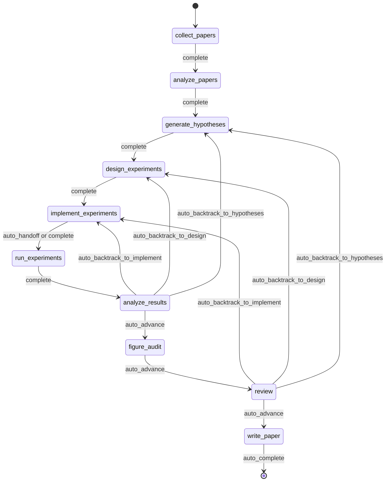
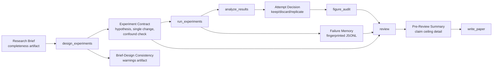
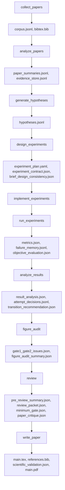

<div align="center">

  <br/>

  

  <h1>自律研究のためのオペレーティングシステム</h1>

  <p><strong>研究生成ではなく、自律的な研究実行。</strong><br/>
  ブリーフから原稿まで、governed・checkpointed・inspectable な研究実行。</p>

  <p>
    <a href="../README.md"><strong>English</strong></a>
    &nbsp;&middot;&nbsp;
    <a href="./README.ko.md"><strong>한국어</strong></a>
    &nbsp;&middot;&nbsp;
    <a href="./README.ja.md"><strong>日本語</strong></a>
    &nbsp;&middot;&nbsp;
    <a href="./README.zh-CN.md"><strong>简体中文</strong></a>
    &nbsp;&middot;&nbsp;
    <a href="./README.zh-TW.md"><strong>繁體中文</strong></a>
    &nbsp;&middot;&nbsp;
    <a href="./README.es.md"><strong>Español</strong></a>
    &nbsp;&middot;&nbsp;
    <a href="./README.fr.md"><strong>Français</strong></a>
    &nbsp;&middot;&nbsp;
    <a href="./README.de.md"><strong>Deutsch</strong></a>
    &nbsp;&middot;&nbsp;
    <a href="./README.pt.md"><strong>Português</strong></a>
    &nbsp;&middot;&nbsp;
    <a href="./README.ru.md"><strong>Русский</strong></a>
  </p>

  <p><sub>各言語版 README はこの文書を基準に保守される翻訳です。規範表現と最新の更新については English README を canonical reference としてください。</sub></p>

  <p>
    <a href="https://github.com/lhy0718/AutoLabOS/actions/workflows/ci.yml">
      
    </a>
    <a href="https://github.com/lhy0718/AutoLabOS/actions/workflows/smoke.yml">
      
    </a>
    
  </p>

  <p>
    
    
    
  </p>

  <p>
    
    
    
    
  </p>

</div>

---

AutoLabOS は、governed な研究実行のためのオペレーティングシステムです。1 回の run を単発の生成処理ではなく、checkpoint 可能な研究状態として扱います。

コアループ全体が inspectable です。文献収集、仮説形成、実験設計、実装、実行、分析、figure audit、review、原稿作成の各段階が監査可能な artifacts を残します。主張は claim ceiling の下で evidence-bounded に保たれます。review は polish のための段階ではなく structural gate です。

品質に関する前提は明示的な checks に変換されます。prompt レベルの見栄えよりも実際の挙動が重視されます。再現性は artifacts、checkpoints、inspectable transitions によって担保されます。

---

## なぜ AutoLabOS が必要か

多くの research-agent システムは、テキスト生成に最適化されています。AutoLabOS は、governed な研究プロセスの実行に最適化されています。

この違いは、もっともらしい草稿以上のものが必要なプロジェクトで重要です。

- 実行契約として機能する research brief
- 自由に漂流する agent ではなく、明示的な workflow gate
- 事後に inspection できる checkpoints と artifacts
- manuscript generation の前に弱い仕事を止められる review
- 同じ失敗した実験を盲目的に繰り返さないための failure memory
- データを超える prose ではなく、evidence-bounded claims

AutoLabOS は、自律性を求めつつ auditability、backtracking、validation を手放したくないチーム向けのシステムです。

---

## 1 回の run で何が起こるか

1 回の governed run は、常に同じ研究フローに従います。

`Brief.md` → literature → hypothesis → experiment design → implementation → execution → analysis → figure audit → review → manuscript

実際には次のように進みます。

1. `/new` で research brief を作成または開く
2. `/brief start --latest` で brief を検証し、run に snapshot して governed run を開始する
3. 固定された research workflow に沿って、各境界で state と artifacts を checkpoint する
4. evidence が弱い場合は polishing ではなく backtracking または downgrade を選ぶ
5. review gate を通過した場合のみ `write_paper` が bounded evidence に基づいて原稿を書く

歴史的な 9-node contract は、今もアーキテクチャ上の基準線です。現在の runtime では `analyze_results` と `review` の間に `figure_audit` が追加されており、figure-quality critique を独立に checkpoint / resume できるようになっています。



この流れの内部自動化はすべて bounded node-internal loop に限定されます。無人モードでも workflow 自体は governed なまま維持されます。

---

## run の後に得られるもの

AutoLabOS は PDF だけを出力しません。追跡可能な研究状態を残します。

| 出力 | 含まれる内容 |
|---|---|
| **文献 corpus** | 収集された papers、BibTeX、抽出された evidence store |
| **仮説** | 文献に基づく hypotheses と skeptical review |
| **実験計画** | contract、baseline lock、一貫性チェックを含む governed design |
| **実行結果** | metrics、objective evaluation、failure memory log |
| **結果分析** | 統計分析、attempt decision、transition reasoning |
| **Figure audit** | figure lint、caption/reference consistency、任意の vision critique summary |
| **Review packet** | 5 人の specialist panel scorecard、claim ceiling、ドラフト前 critique |
| **原稿** | evidence links、scientific validation、任意の PDF を含む LaTeX draft |
| **Checkpoints** | 各 node 境界での state snapshot。いつでも resume 可能 |

すべては `.autolabos/runs/<run_id>/` の下に保存され、public-facing output は `outputs/` に mirror されます。

これが再現性モデルです。隠れた state ではなく、artifacts、checkpoints、inspectable transitions によって追跡します。

---

## クイックスタート

```bash
# 1. インストールとビルド
npm install
npm run build
npm link

# 2. 研究ワークスペースへ移動
cd /path/to/your-research-workspace

# 3. いずれかのインターフェースを起動
autolabos        # TUI
autolabos web    # Web UI
```

最初に使うときの基本フロー:

```bash
/new
/brief start --latest
/doctor
```

注意:

- `.autolabos/config.yaml` がない場合、両 UI が onboarding を案内します
- TUI と Web UI は同じ runtime、同じ artifacts、同じ checkpoints を共有します

### 前提条件

| 項目 | 必要な場合 | 備考 |
|---|---|---|
| `SEMANTIC_SCHOLAR_API_KEY` | 常時 | paper discovery と metadata |
| `OPENAI_API_KEY` | provider が `api` の場合 | OpenAI API model 実行 |
| Codex CLI login | provider が `codex` の場合 | ローカル Codex session を使用 |

---

## Research Brief システム

Brief は単なる開始文書ではありません。run の governed contract です。

`/new` は `Brief.md` を作成または開きます。`/brief start --latest` はそれを検証し、run に snapshot したうえで、その snapshot を基準に execution を開始します。run には brief source path、snapshot path、そして解析された manuscript format があればそれも記録されます。workspace の brief が後から変わっても、その run の provenance は inspectable のまま残ります。
`Appendix Preferences` は `Prefer appendix for:` と `Keep in main body:` の構造で書けるため、appendix routing の意図を brief 契約の中でより明示的にできます。

つまり brief は prompt の一部ではなく、audit trail の一部です。

現在の契約では、`.autolabos/config.yaml` は主に provider/runtime の既定値と workspace policy を保持します。run ごとの research intent、evidence bar、baseline expectation、manuscript format target、manuscript template path は Brief 側で定義するのが原則です。そのため、persisted config では `research` の既定値や一部の manuscript-profile / paper-template フィールドが省略されることがあります。

```bash
/new
/brief start --latest
```

Brief には research intent と governance constraints の両方が必要です。topic、objective metric、baseline または comparator、minimum acceptable evidence、disallowed shortcuts、evidence が弱い場合の paper ceiling を含める想定です。

<details>
<summary><strong>Brief のセクションと grading</strong></summary>

| セクション | 状態 | 目的 |
|---|---|---|
| `## Topic` | 必須 | 研究質問を 1-3 文で定義 |
| `## Objective Metric` | 必須 | 主要な成功指標 |
| `## Constraints` | 推奨 | compute budget、dataset 制限、reproducibility 規則 |
| `## Plan` | 推奨 | ステップごとの実験計画 |
| `## Target Comparison` | Governance | 提案手法と明示的 baseline の比較 |
| `## Minimum Acceptable Evidence` | Governance | 最小 effect size、fold count、decision boundary |
| `## Disallowed Shortcuts` | Governance | 結果を無効化する shortcuts |
| `## Paper Ceiling If Evidence Remains Weak` | Governance | evidence が弱いときの最大 paper classification |
| `## Manuscript Format` | 任意 | カラム数、ページ budget、references / appendix 規則 |

| 等級 | 意味 | paper-scale ready か |
|---|---|---|
| `complete` | core + 実質的な governance セクション 4 つ以上 | はい |
| `partial` | core 完成 + governance 2 つ以上 | 警告付きで進行 |
| `minimal` | core セクションのみ | いいえ |

</details>

---

## 2 つのインターフェース、1 つの runtime

AutoLabOS は同じ governed runtime 上に 2 つの front end を提供します。

| | TUI | Web UI |
|---|---|---|
| 起動 | `autolabos` | `autolabos web` |
| 操作 | slash commands、自然言語 | ブラウザ dashboard と composer |
| Workflow view | ターミナルでのリアルタイム node progress | action 可能な governed workflow graph |
| Artifacts | CLI inspection | テキスト、画像、PDF の inline preview |
| 運用 surface | `/watch`, `/queue`, `/explore`, `/doctor` | jobs queue、live watch card、exploration status、diagnostics |
| 向いている用途 | 高速な反復と直接制御 | 視覚的監視と artifact 閲覧 |

重要なのは、両方の surface が同じ checkpoints、同じ runs、同じ underlying artifacts を見ていることです。

---

## AutoLabOS が異なる点

AutoLabOS は prompt-only orchestration ではなく governed execution を中心に設計されています。

| | 一般的な研究ツール | AutoLabOS |
|---|---|---|
| Workflow | 開いた agent drift | 明示的な review boundary を持つ governed fixed graph |
| State | 一時的 | checkpointed、resumable、inspectable |
| Claims | model が生成するだけ強くなる | evidence と claim ceiling によって制限 |
| Review | 任意の cleanup pass | 執筆を止められる structural gate |
| Failures | 忘れられて再試行される | failure memory に fingerprint として記録 |
| Interfaces | 別々のコードパス | TUI と Web が 1 つの runtime を共有 |

そのため、このシステムは paper generator よりも research infrastructure として理解されるべきです。

---

## コア保証

### Governed Workflow

workflow は bounded で auditable です。backtracking は contract の一部です。前進を正当化できない結果は polishing ではなく hypotheses、design、implementation に戻されます。

### Checkpointed Research State

各 node boundary は inspectable かつ resumable な state を記録します。進捗の単位はテキスト出力だけではなく、artifacts、transitions、recoverable state を持つ run です。

### Claim Ceiling

claims は strongest defensible evidence ceiling の下に保たれます。システムは blocked されたより強い claims と、それを解放するために必要な evidence gap を記録します。

### Review As A Structural Gate

`review` は cosmetic cleanup の段階ではありません。readiness、方法論の sanity、evidence linkage、writing discipline、reproducibility handoff を manuscript generation 前に確認する structural gate です。

### Failure Memory

failure fingerprint は persistence され、構造的なエラーや繰り返される equivalent failure が盲目的に再試行されないようにします。

### Reproducibility Through Artifacts

再現性は artifacts、checkpoints、inspectable transitions によって担保されます。public-facing summary も persisted run output を基準にし、別の truth source を作りません。

---

## Validation と Harness 중심の品質モデル

AutoLabOS は validation surface を first-class として扱います。

- `/doctor` は run 開始前に environment と workspace readiness を検査します

paper readiness は単一の prompt による感想ではありません。

- **Layer 1 - deterministic minimum gate** は明示的な artifact / evidence-integrity check により under-evidenced work を止めます
- **Layer 2 - LLM paper-quality evaluator** は methodology、evidence strength、writing structure、claim support、limitations honesty を構造化して批評します
- **Review packet + specialist panel** は manuscript path が advance、revise、backtrack のどれになるべきかを決めます

`paper_readiness.json` には `overall_score` が入ることがあります。この値は system 内部での run-quality signal として読むべきであり、普遍的な scientific benchmark とみなすべきではありません。一部の高度な evaluation / self-improvement path では、この score を runs や prompt mutation 候補の比較に使います。

---

## 高度な Self-Improvement 機能

AutoLabOS には bounded self-improvement path がありますが、blind autonomous rewriting ではなく validation と rollback によって制御されます。

### `autolabos meta-harness`

`autolabos meta-harness` は recent completed runs と evaluation history をもとに、`outputs/meta-harness/<timestamp>/` の下に context directory を作ります。

含まれるもの:

- フィルタ済みの run events
- `result_analysis.json` や `review/decision.json` などの node artifacts
- `paper_readiness.json`
- `outputs/eval-harness/history.jsonl`
- 対象 node 用の現在の `node-prompts/` ファイル

LLM は `TASK.md` により `TARGET_FILE + unified diff` だけを返すように制限され、target は `node-prompts/` 内に限定されます。apply mode では候補が validation checks を通過しなければならず、失敗した場合は rollback され audit log が残ります。`--no-apply` は context だけを作成し、`--dry-run` はファイルを変えず diff だけを表示します。

### `autolabos evolve`

`autolabos evolve` は `.codex` と `node-prompts` を対象に bounded な mutation-and-evaluation loop を実行します。

- `--max-cycles`, `--target skills|prompts|all`, `--dry-run` をサポート
- run fitness は `paper_readiness.overall_score` から読み取る
- prompts と skills を mutation し、validation を実行し、cycle 間で fitness を比較する
- regression が出た場合は最後の good git tag を基準に `.codex` と `node-prompts` を復元する

これは self-improvement path ですが、制約のない repo-wide rewrite path ではありません。

### Harness Preset Layer

AutoLabOS には `base`, `compact`, `failure-aware`, `review-heavy` などの built-in harness preset もあります。これらは artifact/context policy、failure-memory emphasis、prompt policy、compression strategy を調整して comparative evaluation を行うためのものであり、governed production workflow 自体は変更しません。

---

## よく使うコマンド

| コマンド | 説明 |
|---|---|
| `/new` | `Brief.md` を作成または開く |
| `/brief start <path\|--latest>` | brief から研究を開始 |
| `/runs [query]` | run 一覧の表示または検索 |
| `/resume <run>` | run を再開 |
| `/agent run <node> [run]` | グラフ node から実行 |
| `/agent status [run]` | node status を表示 |
| `/agent overnight [run]` | 保守的に bounded された unattended run |
| `/agent autonomous [run]` | bounded research exploration を実行 |
| `/watch` | active run と background jobs の live watch view |
| `/explore` | 現在 run の exploration-engine status を表示 |
| `/queue` | running / waiting / stalled jobs を表示 |
| `/doctor` | environment と workspace diagnostics |
| `/model` | model と reasoning effort を切り替え |

<details>
<summary><strong>フルコマンド一覧</strong></summary>

| コマンド | 説明 |
|---|---|
| `/help` | コマンド一覧を表示 |
| `/new` | workspace `Brief.md` を作成または開く |
| `/brief start <path\|--latest>` | workspace `Brief.md` または指定 brief から研究開始 |
| `/doctor` | environment + workspace diagnostics |
| `/runs [query]` | run 一覧の表示または検索 |
| `/run <run>` | run を選択 |
| `/resume <run>` | run を再開 |
| `/agent list` | graph node 一覧 |
| `/agent run <node> [run]` | node から実行 |
| `/agent status [run]` | node status を表示 |
| `/agent collect [query] [options]` | papers を収集 |
| `/agent recollect <n> [run]` | papers を追加収集 |
| `/agent focus <node>` | safe jump で focus を移動 |
| `/agent graph [run]` | graph state を表示 |
| `/agent resume [run] [checkpoint]` | checkpoint から再開 |
| `/agent retry [node] [run]` | node を再試行 |
| `/agent jump <node> [run] [--force]` | node へ jump |
| `/agent overnight [run]` | overnight autonomy (24h) |
| `/agent autonomous [run]` | open-ended autonomous research |
| `/model` | model と reasoning selector |
| `/approve` | 一時停止した node を承認 |
| `/queue` | running / waiting / stalled jobs を表示 |
| `/watch` | active run の live watch view |
| `/explore` | exploration-engine status を表示 |
| `/retry` | 現在 node を再試行 |
| `/settings` | provider と model 設定 |
| `/quit` | 終了 |

</details>

---

## 向いている人 / 向いていない人

### 向いているケース

- 自律性を求めつつ governed workflow も必要なチーム
- checkpoints と artifacts が重要な research engineering の仕事
- evidence discipline が必要な paper-scale または paper-adjacent project
- generation と同じくらい review、traceability、resumability が重要な環境

### 向いていないケース

- 速い one-shot draft だけが欲しい場合
- artifact trail や review gate を必要としない workflow
- governed execution より free-form agent behavior を重視する project
- 単純な literature summary tool で十分な場合

---

## Advanced Details

<details>
<summary><strong>実行モード</strong></summary>

AutoLabOS はすべてのモードで governed workflow と safety gates を維持します。

| モード | コマンド | 挙動 |
|---|---|---|
| **Interactive** | `autolabos` | 明示的な approval gate を持つ slash-command TUI |
| **Minimal approval** | 設定: `approval_mode: minimal` | 安全な遷移を自動承認 |
| **Hybrid approval** | 設定: `approval_mode: hybrid` | 強く低リスクな遷移は自動進行、危険または低信頼な遷移は pause |
| **Overnight** | `/agent overnight [run]` | unattended single pass、24 時間制限、保守的 backtracking |
| **Autonomous** | `/agent autonomous [run]` | open-ended bounded research exploration |

</details>

<details>
<summary><strong>Governance artifact flow</strong></summary>



</details>

<details>
<summary><strong>Artifact flow</strong></summary>



</details>

<details>
<summary><strong>Node architecture</strong></summary>

| Node | 役割 | 内容 |
|---|---|---|
| `collect_papers` | collector, curator | Semantic Scholar を使って candidate paper set を発見・選別 |
| `analyze_papers` | reader, evidence extractor | 選択された papers から summaries と evidence を抽出 |
| `generate_hypotheses` | hypothesis agent + skeptical reviewer | literature から ideas を合成し pressure-test する |
| `design_experiments` | designer + feasibility/statistical/ops panel | plans の実現可能性を選別し experiment contract を作成 |
| `implement_experiments` | implementer | ACI actions により code と workspace changes を作る |
| `run_experiments` | runner + failure triager + rerun planner | execution を駆動し、failures を記録し、rerun を判断 |
| `analyze_results` | analyst + metric auditor + confounder detector | results の信頼性を確認し attempt decisions を記録 |
| `figure_audit` | figure auditor + optional vision critique | evidence alignment、captions / references、publication readiness を確認 |
| `review` | 5-specialist panel + claim ceiling + two-layer gate | structural review を行い、evidence が不足なら執筆を止める |
| `write_paper` | paper writer + reviewer critique | manuscript を作成し post-draft critique を行い PDF をビルド |

</details>

<details>
<summary><strong>Bounded automation</strong></summary>

| Node | 内部自動化 | 上限 |
|---|---|---|
| `analyze_papers` | evidence が疎なときの自動 window 拡張 | <= 2 回 |
| `design_experiments` | deterministic panel scoring + experiment contract | design ごとに 1 回 |
| `run_experiments` | failure triage + 一時的 failure の 1 回再実行 | structural failure は再試行しない |
| `run_experiments` | failure memory fingerprinting | >= 3 回同一なら retries を使い切る |
| `analyze_results` | objective rematching + result panel calibration | human pause 前に 1 回 rematch |
| `figure_audit` | Gate 3 figure critique + summary aggregation | vision critique を独立に resume 可能 |
| `write_paper` | related-work scout + validation-aware repair | repair は最大 1 回 |

</details>

<details>
<summary><strong>Public output bundle</strong></summary>

```
outputs/<title-slug>-<run_id_prefix>/
  ├── paper/
  ├── experiment/
  ├── analysis/
  ├── review/
  ├── results/
  ├── reproduce/
  ├── manifest.json
  └── README.md
```

</details>

---

## Status

AutoLabOS はアクティブに開発されている OSS の research-engineering project です。挙動と contract の canonical reference は repository の `docs/` 以下、特に次の文書です。

- `docs/architecture.md`
- `docs/experiment-quality-bar.md`
- `docs/paper-quality-bar.md`
- `docs/reproducibility.md`
- `docs/research-brief-template.md`

