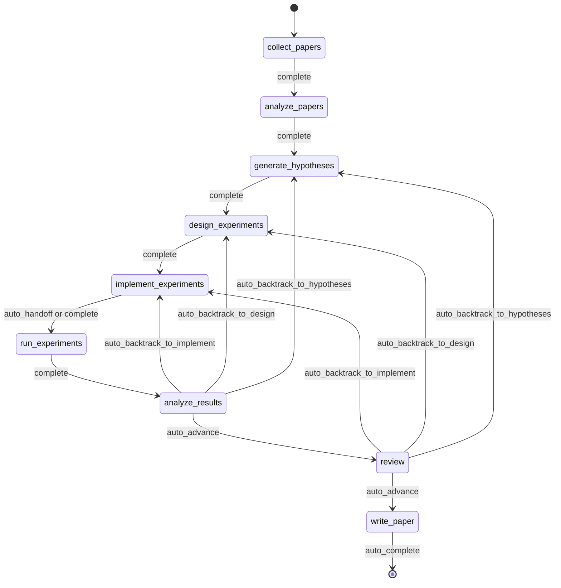
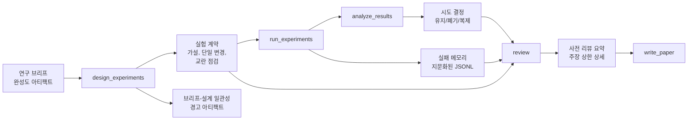
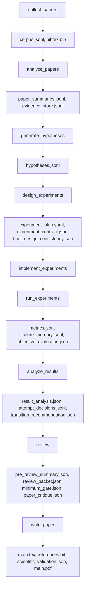
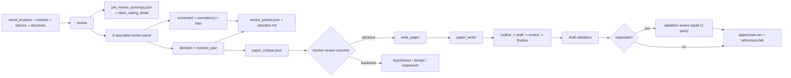
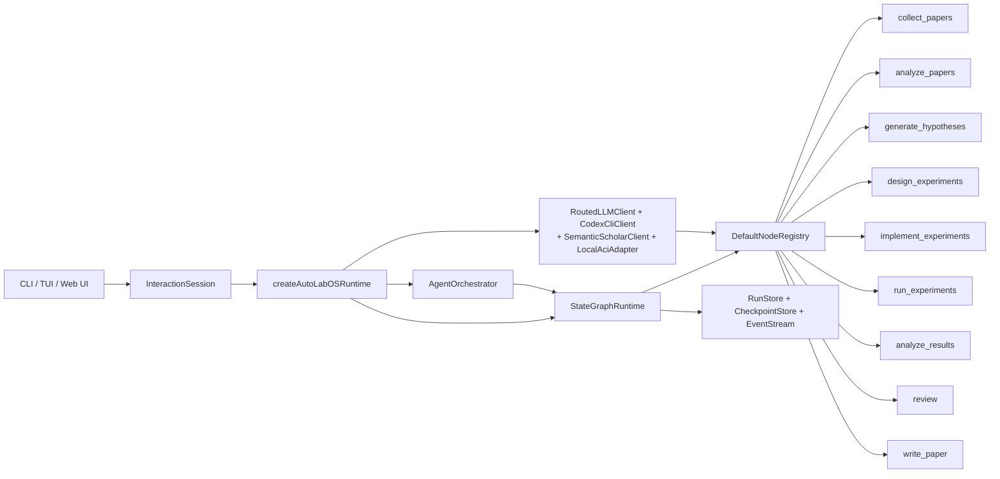

<div align="center">

  <br/>

  

  <h1>자율 연구를 위한 운영 체제</h1>

  <p><strong>연구 생성이 아니라, 자율 연구 실행.</strong><br/>
  문헌 조사에서 원고 작성까지, 통제되고 체크포인트되며 검토 가능한 루프 안에서 진행합니다.</p>

  <p>
    <a href="../README.md"><strong>English</strong></a>
    &nbsp;&middot;&nbsp;
    <a href="./README.ko.md"><strong>한국어</strong></a>
    &nbsp;&middot;&nbsp;
    <a href="./README.ja.md"><strong>日本語</strong></a>
    &nbsp;&middot;&nbsp;
    <a href="./README.zh-CN.md"><strong>简体中文</strong></a>
    &nbsp;&middot;&nbsp;
    <a href="./README.zh-TW.md"><strong>繁體中文</strong></a>
    &nbsp;&middot;&nbsp;
    <a href="./README.es.md"><strong>Español</strong></a>
    &nbsp;&middot;&nbsp;
    <a href="./README.fr.md"><strong>Français</strong></a>
    &nbsp;&middot;&nbsp;
    <a href="./README.de.md"><strong>Deutsch</strong></a>
    &nbsp;&middot;&nbsp;
    <a href="./README.pt.md"><strong>Português</strong></a>
    &nbsp;&middot;&nbsp;
    <a href="./README.ru.md"><strong>Русский</strong></a>
  </p>

  <p><sub>다른 언어 README도 이 문서를 기준으로 관리되는 번역본입니다. 규범 문구와 최신 변경 기준은 영어 README입니다.</sub></p>

  <!-- CI & Quality -->
  <p>
    <a href="https://github.com/lhy0718/AutoLabOS/actions/workflows/ci.yml">
      
    </a>
    <a href="https://github.com/lhy0718/AutoLabOS/actions/workflows/smoke.yml">
      
    </a>
    
  </p>

  <!-- Tech stack -->
  <p>
    
    
    
  </p>

  <!-- Core features -->
  <p>
    
    
    
    
  </p>

  <!-- Integrations -->
  <p>
    
    
    
    
  </p>

  <!-- Community -->
  <p>
    <a href="https://github.com/lhy0718/AutoLabOS/stargazers">
      
    </a>
    <a href="https://github.com/lhy0718/AutoLabOS/commits/main">
      
    </a>
  </p>

</div>

---

연구를 자동화한다고 주장하는 대부분의 도구는 실제로는 **텍스트 생성**을 자동화합니다. 겉보기에는 그럴듯한 결과물을 내놓지만, 실험 거버넌스도 없고, 증거 추적도 없으며, 실제 증거가 어디까지 뒷받침하는지에 대한 정직한 설명도 없습니다.

AutoLabOS는 다른 입장을 취합니다. **연구에서 어려운 부분은 글쓰기가 아니라, 질문과 초안 사이를 지탱하는 규율입니다.** 문헌 기반 정립, 가설 검증, 실험 거버넌스, 실패 추적, 주장 상한 설정, 리뷰 게이팅이 모두 고정된 9노드 상태 그래프 안에서 이루어집니다. 모든 노드는 감사를 견딜 수 있는 아티팩트를 남깁니다. 모든 전이는 체크포인트됩니다. 모든 주장에는 증거 상한이 있습니다.

산출물은 단순한 논문이 아닙니다. 들여다보고, 재개하고, 방어할 수 있는 통제된 연구 상태입니다.

> **증거가 먼저, 주장은 그 다음.**
>
> **들여다보고, 재개하고, 방어할 수 있는 실행.**
>
> **프롬프트 모음이 아니라 연구 운영 체제.**
>
> **같은 실패한 실험을 연구실이 두 번 반복해서는 안 됩니다.**
>
> **리뷰는 다듬기 단계가 아니라 구조적 게이트입니다.**

---

## 실행 후 얻게 되는 것

AutoLabOS는 PDF만 만들어내지 않습니다. 완전히 추적 가능한 연구 상태 전체를 생성합니다.

| 산출물 | 포함 내용 |
|---|---|
| **문헌 코퍼스** | 수집된 논문, BibTeX, 추출된 증거 저장소 |
| **가설** | 문헌에 근거한 가설과 이에 대한 회의적 검토 |
| **실험 계획** | 계약, 베이스라인 잠금, 일관성 검사가 포함된 통제된 설계 |
| **실행 결과** | 지표, 객관적 평가, 실패 메모리 로그 |
| **결과 분석** | 통계 분석, 시도별 결정, 전이 추론 |
| **리뷰 패킷** | 5인 전문가 패널 점수표, 주장 상한, 초안 전 비평 |
| **원고** | 증거 링크, 과학적 검증, 선택적 PDF가 포함된 LaTeX 초안 |
| **체크포인트** | 모든 노드 경계에서의 전체 상태 스냅샷, 언제든 재개 가능 |

모든 것은 `.autolabos/runs/<run_id>/` 아래에 저장되며, 대외 공유용 산출물은 `outputs/`에 미러링됩니다.

---

## 왜 AutoLabOS인가

대부분의 AI 연구 도구는 **출력의 겉모습**을 최적화합니다. AutoLabOS는 **통제된 실행**을 최적화합니다.

| | 일반적인 연구 도구 | AutoLabOS |
|---|---|---|
| 워크플로 | 경계 없는 에이전트 표류 | 전이가 제한된 고정 9노드 그래프 |
| 실험 설계 | 비구조적 | 단일 변경 강제, 교란 탐지가 포함된 계약 |
| 실패한 실험 | 잊히고 다시 시도됨 | 실패 메모리에 지문으로 기록되어 반복되지 않음 |
| 주장 | LLM이 만들어내는 만큼 강함 | 실제 증거에 연결된 주장 상한으로 제한 |
| 리뷰 | 선택적 정리 단계 | 구조적 게이트, 증거가 부족하면 집필 차단 |
| 논문 평가 | 단일 LLM의 "좋아 보인다" 판정 | 2계층 게이트: 결정적 최소 기준 + LLM 품질 평가기 |
| 상태 | 일시적 | 체크포인트 가능, 재개 가능, 검토 가능 |

---

## 빠른 시작

```bash
# 1. 설치 및 빌드
npm install && npm run build && npm link

# 2. 연구 워크스페이스로 이동
cd /path/to/your-research-project

# 3. 실행(하나 선택)
autolabos web    # 브라우저 UI: 온보딩, 대시보드, 아티팩트 브라우저
autolabos        # 터미널 중심 슬래시 명령 워크플로
```

> **첫 실행인가요?** `.autolabos/config.yaml`이 아직 없으면 두 UI 모두 온보딩을 안내합니다.

### 사전 준비

| 항목 | 필요한 경우 | 비고 |
|---|---|---|
| `SEMANTIC_SCHOLAR_API_KEY` | 항상 | 논문 탐색 및 메타데이터 수집 |
| `OPENAI_API_KEY` | provider가 `api`일 때 | OpenAI API 모델 실행 |
| Codex CLI 로그인 | provider가 `codex`일 때 | 로컬 Codex 세션 사용 |

---

## 9노드 워크플로

고정된 그래프입니다. 제안이 아니라 계약입니다.



`collect_papers` → `analyze_papers` → `generate_hypotheses` → `design_experiments` → `implement_experiments` → `run_experiments` → `analyze_results` → `review` → `write_paper`

백트래킹이 내장되어 있습니다. 결과가 약하면 그래프는 집필 쪽으로 밀어붙이지 않고, 가설이나 설계 단계로 되돌립니다. 모든 자동화는 경계가 정해진 노드 내부 루프 안에서만 일어납니다.

---

## 핵심 속성

### 실험 거버넌스

모든 실험 실행은 구조화된 계약을 거칩니다.

- **실험 계약**: 가설, 인과 메커니즘, 단일 변경 규칙, 중단 조건, 유지/폐기 기준을 잠급니다.
- **교란 탐지**: 결합 변경, 목록형 개입, 메커니즘-변경 불일치를 포착합니다.
- **브리프-설계 일관성**: 설계가 원래 연구 브리프에서 벗어나면 경고합니다.
- **베이스라인 잠금**: 비교 계약이 실행 전에 객관적 지표와 베이스라인을 고정합니다.

### 주장 상한 강제

시스템은 주장이 증거를 앞질러 가는 것을 허용하지 않습니다.

`review` 노드는 `pre_review_summary`를 생성하며, 여기에는 **방어 가능한 가장 강한 주장**, 그보다 강한 주장이 왜 막혔는지를 설명하는 **차단된 주장 목록**, 그리고 그 주장을 해제하려면 무엇이 더 필요한지를 보여주는 **증거 공백**이 담깁니다. 이 상한은 그대로 원고 생성에 반영됩니다.

### 실패 메모리

실행 범위의 JSONL로 실패 패턴을 기록하고 중복 제거합니다.

- **오류 지문 생성**: 타임스탬프, 경로, 숫자를 제거해 안정적으로 군집화합니다.
- **동등 실패 중단**: 같은 지문이 3회 이상 나오면 재시도를 즉시 소진합니다.
- **재시도 금지 마커**: 구조적 실패는 설계가 바뀌기 전까지 재실행을 막습니다.

연구실은 단일 실행 안에서도 자기 실패로부터 학습합니다.

### 2계층 논문 평가

논문 준비도는 단일 LLM의 감각적 판단에 맡기지 않습니다.

- **1계층, 결정적 최소 게이트**: 증거가 부족한 작업이 `write_paper`에 진입하지 못하도록 7개 아티팩트 존재 여부를 검사합니다. LLM은 관여하지 않습니다. 결과는 통과 또는 실패입니다.
- **2계층, LLM 논문 품질 평가기**: 결과의 중요성, 방법론의 엄밀성, 증거 강도, 글의 구조, 주장 뒷받침 정도, 한계 서술의 정직성 등 6개 차원에 대해 구조화된 비평을 수행합니다. 차단 이슈, 비차단 이슈, 원고 유형 분류를 산출합니다.

증거가 부족하면 시스템은 다듬기를 권하는 대신 백트래킹을 권고합니다.

### 5인 전문가 리뷰 패널

`review` 노드는 다섯 개의 독립적인 전문가 패스를 실행합니다.

1. **주장 검증자**: 주장을 증거와 대조합니다.
2. **방법론 리뷰어**: 실험 설계를 검증합니다.
3. **통계 리뷰어**: 정량적 엄밀성을 평가합니다.
4. **집필 준비도 리뷰어**: 명확성과 완성도를 점검합니다.
5. **무결성 리뷰어**: 편향과 충돌을 식별합니다.

이 패널은 점수표, 일관성 평가, 게이트 결정을 생성합니다.

---

## 듀얼 인터페이스

두 개의 UI 표면, 하나의 런타임입니다. 아티팩트도, 워크플로도, 체크포인트도 동일합니다.

| | TUI | Web Ops UI |
|---|---|---|
| 실행 | `autolabos` | `autolabos web` |
| 상호작용 | 슬래시 명령, 자연어 | 브라우저 대시보드, 컴포저 |
| 워크플로 뷰 | 터미널에서 실시간 노드 진행 | 동작 가능한 9노드 시각 그래프 |
| 아티팩트 | CLI 검사 | 텍스트, 이미지, PDF 인라인 미리보기 |
| 적합한 용도 | 빠른 반복, 스크립팅 | 시각적 모니터링, 아티팩트 탐색 |

---

## 실행 모드

AutoLabOS는 어떤 모드에서도 9노드 워크플로와 모든 안전 게이트를 유지합니다.

| 모드 | 명령 | 동작 |
|---|---|---|
| **인터랙티브** | `autolabos` | 명시적 승인 게이트가 있는 슬래시 명령 TUI |
| **최소 승인** | 설정: `approval_mode: minimal` | 안전한 전이를 자동 승인 |
| **오버나이트** | `/agent overnight [run]` | 무인 단일 패스, 24시간 제한, 보수적 백트래킹 |
| **자율** | `/agent autonomous [run]` | 개방형 연구 탐색, 시간 제한 없음 |

### 자율 모드

최소한의 개입으로 가설 → 실험 → 분석 루프를 오래 지속하도록 설계되어 있으며, 내부적으로 두 개의 병렬 루프를 운영합니다.

1. **연구 탐색**: 가설 생성, 실험 설계/실행, 분석, 다음 가설 도출
2. **논문 품질 개선**: 가장 강한 분기를 식별하고, 베이스라인을 정교화하며, 증거 연결을 강화

정지 조건은 다음과 같습니다. 명시적 사용자 중단, 자원 한계, 정체 감지, 치명적 실패. 한 번의 실험이 부정적이거나 논문 품질이 일시적으로 정체되었다는 이유만으로는 **멈추지 않습니다**.

---

## 연구 브리프 시스템

모든 실행은 범위, 제약, 거버넌스 규칙을 정의하는 구조화된 Markdown 브리프로 시작합니다.

```bash
/new                        # 브리프 생성
/brief start --latest       # 검증, 스냅샷, 추출, 실행 시작
```

브리프에는 **핵심** 섹션(주제, 객관적 지표)과 **거버넌스** 섹션(목표 비교, 최소 증거, 금지된 지름길, 논문 상한)이 함께 들어갑니다. AutoLabOS는 브리프 완성도를 평가하고, 논문 규모의 작업을 수행하기에 거버넌스 범위가 부족하면 경고를 표시합니다.

<details>
<summary><strong>브리프 섹션과 등급</strong></summary>

| 섹션 | 상태 | 목적 |
|---|---|---|
| `## Topic` | 필수 | 연구 질문을 1~3문장으로 정의 |
| `## Objective Metric` | 필수 | 핵심 성공 지표 |
| `## Constraints` | 권장 | 컴퓨팅 예산, 데이터셋 제한, 재현 규칙 |
| `## Plan` | 권장 | 단계별 실험 계획 |
| `## Target Comparison` | 거버넌스 | 제안 방법과 명시적 베이스라인의 비교 |
| `## Minimum Acceptable Evidence` | 거버넌스 | 최소 효과 크기, 폴드 수, 결정 경계 |
| `## Disallowed Shortcuts` | 거버넌스 | 결과를 무효화하는 지름길 |
| `## Paper Ceiling If Evidence Remains Weak` | 거버넌스 | 증거가 약할 때 허용되는 최대 논문 분류 |
| `## Manuscript Format` | 선택 | 컬럼 수, 페이지 예산, 참고문헌/부록 규칙 |

| 등급 | 의미 | 논문 규모 준비 여부 |
|---|---|---|
| `complete` | 핵심 + 실질적인 거버넌스 섹션 4개 이상 | 예 |
| `partial` | 핵심 완성 + 거버넌스 2개 이상 | 경고와 함께 진행 |
| `minimal` | 핵심 섹션만 존재 | 아니오 |

</details>

---

## 거버넌스 아티팩트 흐름



---

## 아티팩트 흐름

모든 노드는 구조화되고 검토 가능한 아티팩트를 생성합니다.



<details>
<summary><strong>공개 산출물 번들</strong></summary>

```
outputs/
  ├── paper/           # TeX 소스, PDF, 참고문헌, 빌드 로그
  ├── experiment/      # 베이스라인 요약, 실험 코드
  ├── analysis/        # 결과 테이블, 증거 분석
  ├── review/          # 논문 비평, 게이트 결정
  ├── results/         # 압축된 정량 요약
  ├── reproduce/       # 재현 스크립트, README
  ├── manifest.json    # 섹션 레지스트리
  └── README.md        # 사람이 읽을 수 있는 실행 요약
```

</details>

---

## 노드 아키텍처

| 노드 | 역할 | 수행 내용 |
|---|---|---|
| `collect_papers` | 수집자, 큐레이터 | Semantic Scholar를 통해 후보 논문 집합을 찾고 선별합니다. |
| `analyze_papers` | 리더, 증거 추출기 | 선택된 논문에서 요약과 증거를 추출합니다. |
| `generate_hypotheses` | 가설 에이전트 + 회의적 리뷰어 | 문헌에서 아이디어를 합성한 뒤 압박 검증합니다. |
| `design_experiments` | 설계자 + 실현 가능성/통계/운영 패널 | 계획의 실현 가능성을 걸러내고 실험 계약을 작성합니다. |
| `implement_experiments` | 구현자 | ACI 액션을 통해 코드와 워크스페이스 변경을 만듭니다. |
| `run_experiments` | 실행자 + 실패 분류자 + 재실행 계획자 | 실행을 구동하고, 실패를 기록하며, 재실행 여부를 결정합니다. |
| `analyze_results` | 분석가 + 지표 감사자 + 교란 탐지자 | 결과의 신뢰도를 점검하고 시도별 결정을 기록합니다. |
| `review` | 5인 전문가 패널 + 주장 상한 + 2계층 게이트 | 구조적 리뷰를 수행하며 증거가 부족하면 집필을 차단합니다. |
| `write_paper` | 논문 작성자 + 리뷰어 비평 | 원고를 작성하고, 초안 후 비평을 수행하며, PDF를 빌드합니다. |

<details>
<summary><strong>단계별 연결 그래프</strong></summary>

**탐색과 읽기**

```mermaid
flowchart LR
    Topic["run topic + collect constraints"] --> CP["collect_papers"]
    CP --> CC["collector_curator"]
    CC --> SS["Semantic Scholar search"]
    SS --> Enrich["enrichment + BibTeX recovery"]
    Enrich --> Corpus["corpus.jsonl + bibtex.bib"]
    Corpus --> AP["analyze_papers"]
    AP --> Select["selection request + hybrid rerank"]
    Select --> Manifest["analysis_manifest resume / prune"]
    Manifest --> RE["reader_evidence_extractor"]
    RE --> Pdf["local text/image analysis or Responses API PDF"]
    Pdf --> ReviewLoop["extractor -> reviewer normalization"]
    ReviewLoop --> Evidence["paper_summaries.jsonl + evidence_store.jsonl"]
```



**가설과 실험 설계**

```mermaid
flowchart LR
    Evidence["paper_summaries.jsonl + evidence_store.jsonl"] --> GH["generate_hypotheses"]
    GH --> HA["hypothesis_agent"]
    HA --> Axes["evidence synthesizer -> evidence axes"]
    Axes --> ToT["ToT branch expansion"]
    ToT --> Drafts["mechanism / contradiction / intervention drafts"]
    Drafts --> Reviews["skeptical reviewer"]
    Reviews --> Select["diversity + evidence-quality top-k selection"]
    Select --> Hyp["hypotheses.jsonl + axes/reviews/llm_trace"]
    Hyp --> DE["design_experiments"]
    DE --> ED["experiment_designer"]
    ED --> Profiles["constraint profile + objective metric profile"]
    Profiles --> Plans["design candidates"]
    Plans --> Panel["designer + feasibility + statistical + ops-capacity panel"]
    Panel --> Choice["panel selection"]
    Choice --> Contract["experiment_contract.json + brief_design_consistency.json"]
```



**구현, 실행, 결과 루프**

```mermaid
flowchart LR
    PlanYaml["experiment_plan.yaml"] --> IE["implement_experiments"]
    IE --> IM["ImplementSessionManager"]
    IM --> Impl["implementer"]
    IM --> Codex["Codex CLI session"]
    Codex --> VerifyPatch["local verification"]
    VerifyPatch --> Handoff{"auto handoff?"}
    Handoff -->|yes| RX["run_experiments"]
    Handoff -->|no| Gate["approval boundary"]
    Gate --> RX
    RX --> Runner["runner"]
    Runner --> FailCheck["failure memory: check do-not-retry"]
    FailCheck --> ACI["ACI preflight/tests/command"]
    ACI --> Triage["failure triager + rerun planner"]
    Triage -->|retry once if transient| ACI
    ACI --> FailRecord["record to failure_memory.jsonl"]
    ACI --> Metrics["metrics.json + supplemental runs"]
    Metrics --> AR["analyze_results"]
    AR --> ResultPanel["metric auditor + robustness + confounder + calibrator"]
    ResultPanel --> AttemptDec["attempt_decisions.jsonl"]
    ResultPanel --> Synth["transition recommendation"]
    Synth -->|advance| RV["review"]
    Synth -->|backtrack| IE
```



**리뷰, 집필, 결과 표면화**



</details>

---

## 경계가 있는 자동화

모든 내부 자동화에는 명시적인 상한이 있습니다.

| 노드 | 내부 자동화 | 상한 |
|---|---|---|
| `analyze_papers` | 증거가 너무 희소할 때 증거 윈도 자동 확장 | 최대 2회 확장 |
| `design_experiments` | 결정적 패널 점수화 + 실험 계약 | 설계마다 1회 실행 |
| `run_experiments` | 실패 분류 + 일시적 오류 1회 재실행 | 구조적 실패는 재시도하지 않음 |
| `run_experiments` | 실패 메모리 지문화 | 동일 지문 3회 이상이면 재시도 소진 |
| `analyze_results` | 객관적 재매칭 + 결과 패널 보정 | 사람 개입 전 1회 재매칭 |
| `write_paper` | 관련 연구 스카우트 + 검증 인지형 복구 | 복구 최대 1회 |

---

## 주요 명령

| 명령 | 설명 |
|---|---|
| `/new` | 연구 브리프 생성 |
| `/brief start <path\|--latest>` | 브리프에서 연구 시작 |
| `/runs [query]` | 실행 목록 조회 또는 검색 |
| `/resume <run>` | 실행 재개 |
| `/agent run <node> [run]` | 그래프 노드부터 실행 |
| `/agent status [run]` | 노드 상태 표시 |
| `/agent overnight [run]` | 무인 실행(24시간 제한) |
| `/agent autonomous [run]` | 개방형 자율 연구 |
| `/model` | 모델과 추론 강도 전환 |
| `/doctor` | 환경 + 워크스페이스 진단 |

<details>
<summary><strong>전체 명령 목록</strong></summary>

| 명령 | 설명 |
|---|---|
| `/help` | 명령 목록 표시 |
| `/new` | 연구 브리프 파일 생성 |
| `/brief start <path\|--latest>` | 브리프 파일에서 연구 시작 |
| `/doctor` | 환경 + 워크스페이스 진단 |
| `/runs [query]` | 실행 목록 조회 또는 검색 |
| `/run <run>` | 실행 선택 |
| `/resume <run>` | 실행 재개 |
| `/agent list` | 그래프 노드 목록 |
| `/agent run <node> [run]` | 노드부터 실행 |
| `/agent status [run]` | 노드 상태 표시 |
| `/agent collect [query] [options]` | 논문 수집 |
| `/agent recollect <n> [run]` | 추가 논문 수집 |
| `/agent focus <node>` | 안전 점프로 포커스 이동 |
| `/agent graph [run]` | 그래프 상태 표시 |
| `/agent resume [run] [checkpoint]` | 체크포인트에서 재개 |
| `/agent retry [node] [run]` | 노드 재시도 |
| `/agent jump <node> [run] [--force]` | 노드 점프 |
| `/agent overnight [run]` | 오버나이트 자율 실행(24시간) |
| `/agent autonomous [run]` | 개방형 자율 연구 |
| `/model` | 모델 및 추론 선택기 |
| `/approve` | 일시정지된 노드 승인 |
| `/retry` | 현재 노드 재시도 |
| `/settings` | provider 및 모델 설정 |
| `/quit` | 종료 |

</details>

<details>
<summary><strong>수집 옵션과 예시</strong></summary>

```
--limit <n>          --last-years <n>      --year <spec>
--date-range <s:e>   --sort <relevance|citationCount|publicationDate>
--order <asc|desc>   --min-citations <n>   --open-access
--field <csv>        --venue <csv>         --type <csv>
--bibtex <generated|s2|hybrid>             --dry-run
--additional <n>     --run <run_id>
```

```bash
/agent collect --last-years 5 --sort relevance --limit 100
/agent collect "agent planning" --sort citationCount --min-citations 100
/agent collect --additional 200 --run <run_id>
```

</details>

---

## Web Ops UI

`autolabos web`은 `http://127.0.0.1:4317`에서 로컬 브라우저 UI를 시작합니다.

- **온보딩**: TUI와 동일한 설정을 수행하고, 선택한 provider의 모델 슬롯만 보여 주며 `.autolabos/config.yaml`을 작성합니다.
- **대시보드**: 실행 검색, 9노드 워크플로 뷰, 노드 액션, 실시간 로그를 제공합니다.
- **아티팩트**: 실행을 둘러보고 텍스트, 이미지, PDF를 인라인으로 미리 봅니다.
- **컴포저**: 슬래시 명령과 자연어를 모두 지원하며 단계별 계획 제어가 가능합니다.

```bash
autolabos web                              # 기본 포트 4317
autolabos web --host 0.0.0.0 --port 8080  # 사용자 지정 바인드
```

---

## 철학

AutoLabOS는 몇 가지 단단한 제약을 중심에 두고 설계되었습니다.

- **워크플로 완료는 논문 준비 완료와 다릅니다.** 그래프를 끝까지 실행해도 결과물이 논문감이 아닐 수 있습니다. 시스템은 그 차이를 추적합니다.
- **주장은 증거를 넘어가면 안 됩니다.** 주장 상한은 더 강한 프롬프팅이 아니라 구조로 강제됩니다.
- **리뷰는 제안이 아니라 게이트입니다.** 증거가 부족하면 `review` 노드가 `write_paper`를 차단하고 백트래킹을 권고합니다.
- **부정적 결과도 허용됩니다.** 실패한 가설도 유효한 연구 결과일 수 있지만, 정직하게 서술되어야 합니다.
- **재현성은 아티팩트의 속성입니다.** 체크포인트, 실험 계약, 실패 로그, 증거 저장소는 실행의 추론 과정을 추적하고 반박할 수 있게 하기 위해 존재합니다.

---

## 개발

```bash
npm install              # 의존성 설치(web 하위 패키지 포함)
npm run build            # TypeScript + web UI 빌드
npm test                 # 전체 단위 테스트 실행(931+)
npm run test:watch       # watch 모드

# 단일 테스트 파일
npx vitest run tests/<name>.test.ts

# 스모크 테스트
npm run test:smoke:all                      # 전체 로컬 스모크 번들
npm run test:smoke:natural-collect          # 자연어 수집 -> pending 명령
npm run test:smoke:natural-collect-execute  # 자연어 수집 -> 실행 -> 검증
npm run test:smoke:ci                       # CI용 스모크 선택
```

<details>
<summary><strong>스모크 테스트 환경 변수</strong></summary>

```bash
AUTOLABOS_FAKE_CODEX_RESPONSE=1              # 실제 Codex 호출 방지
AUTOLABOS_FAKE_SEMANTIC_SCHOLAR_RESPONSE=1   # 실제 S2 호출 방지
AUTOLABOS_SMOKE_VERBOSE=1                    # 전체 PTY 로그 출력
AUTOLABOS_SMOKE_MODE=<mode>                  # CI 모드 선택
```

</details>

<details>
<summary><strong>런타임 내부 구조</strong></summary>

### 상태 그래프 정책

- 체크포인트: `.autolabos/runs/<run_id>/checkpoints/`, 단계는 `before | after | fail | jump | retry`
- 재시도 정책: `maxAttemptsPerNode = 3`
- 자동 롤백: `maxAutoRollbacksPerNode = 2`
- 점프 모드: `safe`(현재 또는 이전), `force`(앞으로 이동하며 건너뛴 노드 기록)

### 에이전트 런타임 패턴

- **ReAct** 루프: `PLAN_CREATED → TOOL_CALLED → OBS_RECEIVED`
- **ReWOO** 분리(planner/worker): 고비용 노드에 사용
- **ToT**(Tree-of-Thoughts): 가설 및 설계 노드에서 사용
- **Reflexion**: 실패 에피소드를 저장하고 재시도 시 재사용

### 메모리 계층

| 계층 | 범위 | 형식 |
|---|---|---|
| 실행 컨텍스트 메모리 | 실행별 key/value | `run_context.jsonl` |
| 장기 저장소 | 시도 간 | JSONL 요약 및 인덱스 |
| 에피소드 메모리 | Reflexion | 재시도를 위한 실패 교훈 |

### ACI 액션

`implement_experiments`와 `run_experiments`는 다음 액션을 통해 실행됩니다.
`read_file` · `write_file` · `apply_patch` · `run_command` · `run_tests` · `tail_logs`

</details>

<details>
<summary><strong>에이전트 런타임 다이어그램</strong></summary>



</details>

---

## 문서

| 문서 | 범위 |
|---|---|
| `docs/architecture.md` | 시스템 아키텍처와 설계 결정 |
| `docs/tui-live-validation.md` | TUI 검증 및 테스트 접근 방식 |
| `docs/experiment-quality-bar.md` | 실험 실행 기준 |
| `docs/paper-quality-bar.md` | 원고 품질 요구사항 |
| `docs/reproducibility.md` | 재현성 보장 |
| `docs/research-brief-template.md` | 모든 거버넌스 섹션을 포함한 전체 브리프 템플릿 |

---

## 상태

AutoLabOS는 활발히 개발 중인 상태(v0.1.0)입니다. 워크플로, 거버넌스 시스템, 핵심 런타임은 동작하며 테스트되어 있습니다. 인터페이스, 아티팩트 범위, 실행 모드는 계속해서 검증 중입니다.

기여와 피드백은 언제나 환영합니다. [Issues](https://github.com/lhy0718/AutoLabOS/issues)를 참고하세요.

---

<div align="center">
  <sub>실험은 통제되고, 주장은 방어 가능해야 한다고 믿는 연구자를 위해 만들었습니다.</sub>
</div>
