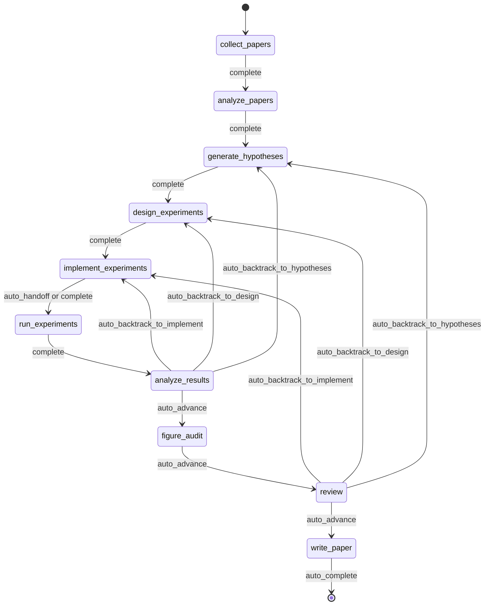
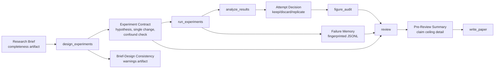
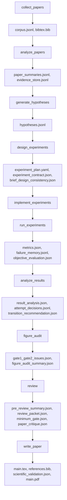

<div align="center">

  <br/>

  

  <h1>자율 연구를 위한 운영 체제</h1>

  <p><strong>연구 생성이 아니라, 자율 연구 실행.</strong><br/>
  브리프에서 원고까지, 통제되고 체크포인트되며 검토 가능한 연구 실행.</p>

  <p>
    <a href="../README.md"><strong>English</strong></a>
    &nbsp;&middot;&nbsp;
    <a href="./README.ko.md"><strong>한국어</strong></a>
    &nbsp;&middot;&nbsp;
    <a href="./README.ja.md"><strong>日本語</strong></a>
    &nbsp;&middot;&nbsp;
    <a href="./README.zh-CN.md"><strong>简体中文</strong></a>
    &nbsp;&middot;&nbsp;
    <a href="./README.zh-TW.md"><strong>繁體中文</strong></a>
    &nbsp;&middot;&nbsp;
    <a href="./README.es.md"><strong>Español</strong></a>
    &nbsp;&middot;&nbsp;
    <a href="./README.fr.md"><strong>Français</strong></a>
    &nbsp;&middot;&nbsp;
    <a href="./README.de.md"><strong>Deutsch</strong></a>
    &nbsp;&middot;&nbsp;
    <a href="./README.pt.md"><strong>Português</strong></a>
    &nbsp;&middot;&nbsp;
    <a href="./README.ru.md"><strong>Русский</strong></a>
  </p>

  <p><sub>다른 언어 README는 이 문서를 기준으로 유지되는 번역본입니다. 규범 문구와 최신 변경 기준은 영어 README를 따릅니다.</sub></p>

  <p>
    <a href="https://github.com/lhy0718/AutoLabOS/actions/workflows/ci.yml">
      
    </a>
    <a href="https://github.com/lhy0718/AutoLabOS/actions/workflows/smoke.yml">
      
    </a>
    
  </p>

  <p>
    
    
    
  </p>

  <p>
    
    
    
    
  </p>

</div>

---

AutoLabOS는 통제된 연구 실행을 위한 운영 체제입니다. 한 번의 실행을 단순 생성 작업이 아니라, 체크포인트 가능한 연구 상태로 다룹니다.

핵심 루프는 처음부터 끝까지 검토 가능합니다. 문헌 수집, 가설 형성, 실험 설계, 실행, 분석, figure audit, 리뷰, 원고 작성이 모두 감사 가능한 아티팩트를 남깁니다. 주장은 claim ceiling 아래에서 evidence-bounded 상태로 유지됩니다. 리뷰는 다듬기 단계가 아니라 구조적 게이트입니다.

품질 가정은 명시적인 검사로 바뀝니다. 프롬프트 수준의 그럴듯함보다 실제 동작이 더 중요합니다. 재현성은 아티팩트, 체크포인트, 검토 가능한 전이로 강제됩니다.

---

## 왜 AutoLabOS가 필요한가

많은 연구 에이전트 시스템은 텍스트를 만들어내는 데 최적화되어 있습니다. AutoLabOS는 통제된 연구 과정을 실행하는 데 최적화되어 있습니다.

이 차이는, 그럴듯한 초안 이상이 필요한 프로젝트에서 중요합니다.

- 실행 계약으로 작동하는 research brief
- 자유 표류 대신 명시적인 워크플로 게이트
- 사후 검토 가능한 체크포인트와 아티팩트
- 원고 생성 전에 약한 작업을 멈출 수 있는 리뷰
- 같은 실패한 실험을 맹목적으로 반복하지 않게 하는 failure memory
- 데이터보다 강한 prose가 아니라 evidence-bounded claims

AutoLabOS는 자율성을 원하지만, 감사 가능성이나 백트래킹, validation을 포기하고 싶지 않은 팀을 위한 도구입니다.

---

## 한 번의 run에서 무슨 일이 일어나는가

한 번의 governed run은 항상 같은 연구 흐름을 따릅니다.

`Brief.md` → literature → hypothesis → experiment design → implementation → execution → analysis → figure audit → review → manuscript

실제로는 다음과 같습니다.

1. `/new`가 research brief를 만들거나 엽니다.
2. `/brief start --latest`가 brief를 검증하고, run에 snapshot한 뒤, governed run을 시작합니다.
3. 시스템은 고정된 연구 workflow를 따라가며 각 경계마다 상태와 아티팩트를 checkpoint합니다.
4. 증거가 약하면 자동으로 문장을 다듬는 대신 backtracking 또는 downgrade를 선택합니다.
5. review gate를 통과하면 `write_paper`가 bounded evidence를 바탕으로 원고를 작성합니다.

역사적인 9-node 계약은 여전히 아키텍처의 기준선입니다. 현재 런타임에서는 `analyze_results`와 `review` 사이에 `figure_audit`가 승인된 추가 체크포인트로 들어가 있으며, 그림 품질 비평을 독립적으로 checkpoint하고 resume할 수 있게 합니다.



이 흐름 안의 모든 자동화는 bounded node-internal loop 안에서만 실행됩니다. 무인 모드에서도 workflow 자체는 governed 상태를 유지합니다.

---

## 실행 후 얻게 되는 것

AutoLabOS는 PDF만 내놓지 않습니다. 추적 가능한 연구 상태를 남깁니다.

| 산출물 | 포함 내용 |
|---|---|
| **문헌 코퍼스** | 수집된 논문, BibTeX, 추출된 evidence store |
| **가설** | 문헌에 근거한 가설과 회의적 검토 |
| **실험 계획** | 계약, baseline lock, 일관성 검사가 포함된 governed design |
| **실행 결과** | metrics, objective evaluation, failure memory log |
| **결과 분석** | 통계 분석, 시도별 결정, 전이 추론 |
| **Figure audit** | figure lint, caption/reference consistency, 선택적 vision critique 요약 |
| **Review packet** | 5인 specialist panel scorecard, claim ceiling, 초안 전 critique |
| **원고** | evidence links, scientific validation, 선택적 PDF가 포함된 LaTeX 초안 |
| **체크포인트** | 모든 노드 경계에서의 전체 상태 스냅샷, 언제든 resume 가능 |

모든 것은 `.autolabos/runs/<run_id>/` 아래에 저장되며, public-facing output은 `outputs/`로 미러링됩니다.

이것이 재현성 모델입니다. 숨겨진 상태가 아니라, 아티팩트와 체크포인트, 검토 가능한 전이로 추적합니다.

---

## 빠른 시작

```bash
# 1. 설치 및 빌드
npm install
npm run build
npm link

# 2. 연구 워크스페이스로 이동
cd /path/to/your-research-workspace

# 3. 인터페이스 하나 실행
autolabos        # TUI
autolabos web    # Web UI
```

처음 쓸 때 자주 쓰는 흐름:

```bash
/new
/brief start --latest
/doctor
```

참고:

- `.autolabos/config.yaml`이 없으면 두 UI 모두 온보딩을 안내합니다.
- 저장소 루트에서 바로 실행하지 마세요. `test/` 같은 workspace나 별도의 연구 workspace를 사용하세요.
- TUI와 Web UI는 같은 runtime, 같은 artifacts, 같은 checkpoints를 공유합니다.

### 사전 준비

| 항목 | 필요한 경우 | 비고 |
|---|---|---|
| `SEMANTIC_SCHOLAR_API_KEY` | 항상 | 논문 탐색 및 메타데이터 수집 |
| `OPENAI_API_KEY` | provider가 `api`일 때 | OpenAI API 모델 실행 |
| Codex CLI 로그인 | provider가 `codex`일 때 | 로컬 Codex 세션 사용 |

---

## Research Brief 시스템

Brief는 단순한 시작 문서가 아닙니다. 한 run의 governed contract입니다.

`/new`는 `Brief.md`를 만들거나 엽니다. `/brief start --latest`는 이를 검증하고, run 안에 snapshot한 뒤, 그 snapshot을 기준으로 실행을 시작합니다. run은 brief source path, snapshot path, 그리고 파싱된 manuscript format이 있으면 그것까지 함께 기록합니다. 그래서 workspace의 brief가 나중에 바뀌더라도, 해당 run의 provenance는 계속 inspectable합니다.

즉, brief는 prompt 일부가 아니라 audit trail의 일부입니다.

현재 계약에서 `.autolabos/config.yaml`은 주로 provider/runtime 기본값과 workspace 정책을 담습니다. run별 연구 의도, evidence 기준, baseline 기대치, manuscript format 목표는 Brief에 두는 것이 원칙입니다. 그래서 persisted config에서는 `research` 기본값이나 일부 manuscript-profile 필드가 생략될 수 있습니다.

```bash
/new
/brief start --latest
```

Brief에는 연구 의도와 거버넌스 제약이 함께 들어가야 합니다. topic, objective metric, baseline 또는 comparator, minimum acceptable evidence, disallowed shortcuts, evidence가 약할 때의 paper ceiling이 여기에 포함됩니다.

<details>
<summary><strong>Brief 섹션과 grading</strong></summary>

| 섹션 | 상태 | 목적 |
|---|---|---|
| `## Topic` | 필수 | 연구 질문을 1-3문장으로 정의 |
| `## Objective Metric` | 필수 | 핵심 성공 지표 |
| `## Constraints` | 권장 | compute budget, dataset 제한, reproducibility 규칙 |
| `## Plan` | 권장 | 단계별 실험 계획 |
| `## Target Comparison` | Governance | 제안 방법과 명시적 baseline 비교 |
| `## Minimum Acceptable Evidence` | Governance | 최소 effect size, fold count, decision boundary |
| `## Disallowed Shortcuts` | Governance | 결과를 무효화하는 지름길 |
| `## Paper Ceiling If Evidence Remains Weak` | Governance | evidence가 약할 때 허용되는 최대 논문 분류 |
| `## Manuscript Format` | 선택 | 컬럼 수, 페이지 예산, 참고문헌/부록 규칙 |

| 등급 | 의미 | paper-scale ready 여부 |
|---|---|---|
| `complete` | core + 실질적인 governance 섹션 4개 이상 | 예 |
| `partial` | core 완성 + governance 2개 이상 | 경고와 함께 진행 |
| `minimal` | core 섹션만 존재 | 아니오 |

</details>

---

## 두 개의 인터페이스, 하나의 런타임

AutoLabOS는 같은 governed runtime 위에 두 개의 front end를 제공합니다.

| | TUI | Web UI |
|---|---|---|
| 실행 | `autolabos` | `autolabos web` |
| 상호작용 | 슬래시 명령, 자연어 | 브라우저 대시보드와 composer |
| 워크플로 뷰 | 터미널에서 실시간 노드 진행 | 액션이 있는 governed workflow graph |
| 아티팩트 | CLI inspection | 텍스트, 이미지, PDF inline preview |
| 운영 surface | `/watch`, `/queue`, `/explore`, `/doctor` | jobs queue, live watch card, exploration status, diagnostics |
| 적합한 용도 | 빠른 반복과 직접 제어 | 시각적 모니터링과 artifact 탐색 |

중요한 점은 두 표면이 같은 checkpoint, 같은 run, 같은 underlying artifact를 본다는 것입니다.

---

## AutoLabOS를 다르게 만드는 점

AutoLabOS는 prompt-only orchestration이 아니라 governed execution을 중심에 둡니다.

| | 일반적인 연구 도구 | AutoLabOS |
|---|---|---|
| 워크플로 | 열린 에이전트 표류 | 명시적 review boundary가 있는 governed fixed graph |
| 상태 | 일시적 | checkpointed, resumable, inspectable |
| 주장 | 모델이 생성하는 만큼 강해짐 | evidence와 claim ceiling에 의해 제한 |
| 리뷰 | 선택적 cleanup pass | 집필을 막을 수 있는 structural gate |
| 실패 | 잊히고 재시도됨 | failure memory에 fingerprint로 기록 |
| 검증 | 부차적 | `/doctor`, harness, smoke, live validation이 first-class |
| 인터페이스 | 각기 다른 코드 경로 | TUI와 Web이 하나의 runtime 공유 |

그래서 이 시스템은 논문 생성기보다는 연구 인프라에 가깝게 읽혀야 합니다.

---

## 핵심 보장

### Governed Workflow

워크플로는 bounded되고 auditable합니다. Backtracking은 계약의 일부입니다. 앞으로 갈 근거가 부족한 결과는 문장을 다듬는 대신 hypothesis, design, implement 단계로 되돌아갑니다.

### Checkpointed Research State

모든 노드 경계는 inspectable하고 resume 가능한 상태를 기록합니다. 진척의 단위는 텍스트 출력만이 아니라, 아티팩트와 전이, 복구 가능한 상태를 가진 run입니다.

### Claim Ceiling

주장은 strongest defensible evidence ceiling 아래에서 유지됩니다. 시스템은 차단된 더 강한 주장과, 그것을 풀기 위해 필요한 evidence gap을 함께 기록합니다.

### Review As A Structural Gate

`review`는 cosmetic cleanup 단계가 아닙니다. readiness, 방법론 sanity, evidence linkage, writing discipline, reproducibility handoff를 manuscript generation 전에 점검하는 구조적 게이트입니다.

### Failure Memory

failure fingerprint는 persisted되어, 구조적 오류나 반복되는 equivalent failure가 맹목적으로 재시도되지 않게 합니다.

### Reproducibility Through Artifacts

재현성은 artifacts, checkpoints, inspectable transitions로 강제됩니다. public-facing summary도 persisted run output을 기반으로 하며, 별도의 두 번째 truth source를 만들지 않습니다.

---

## Validation과 Harness 중심의 품질 모델

AutoLabOS는 validation surface를 first-class로 다룹니다.

- `/doctor`는 run 시작 전에 환경과 workspace readiness를 검사합니다.
- harness validation은 workflow, artifact, governance contract를 보호합니다.
- targeted smoke check는 진단용 회귀 커버리지를 제공합니다.
- interactive behavior가 중요할 때는 live validation을 사용합니다.

논문 준비도는 단일한 프롬프트 감상이 아닙니다.

- **Layer 1 - deterministic minimum gate**는 명시적인 artifact 및 evidence-integrity 검사로 under-evidenced work를 차단합니다.
- **Layer 2 - LLM paper-quality evaluator**는 방법론, evidence strength, writing structure, claim support, limitations honesty를 구조적으로 비평합니다.
- **Review packet + specialist panel**은 원고 경로가 advance, revise, backtrack 중 무엇을 택해야 하는지 결정합니다.

`paper_readiness.json`에는 `overall_score`가 들어갈 수 있습니다. 이 값은 시스템 내부의 run-quality signal로 읽어야 하며, 보편적인 scientific benchmark처럼 보면 안 됩니다. 일부 고급 evaluation / self-improvement 흐름은 이 점수를 run이나 prompt mutation 후보를 비교하는 데 사용합니다.

<details>
<summary><strong>왜 이 validation 모델이 중요한가</strong></summary>

품질 가정은 명시적인 검사로 바뀝니다. 프롬프트 수준의 그럴듯함보다 실제 동작이 더 중요합니다. 목표는 "모델이 설득력 있게 썼다"가 아니라 "이 run을 inspection하고 defend할 수 있다"는 상태입니다.

</details>

---

## 고급 Self-Improvement 기능

AutoLabOS에는 bounded self-improvement path가 있지만, 이는 blind autonomous rewriting이 아니라 validation과 rollback에 의해 제어됩니다.

### `autolabos meta-harness`

`autolabos meta-harness`는 최근 completed run과 evaluation history를 바탕으로 `outputs/meta-harness/<timestamp>/` 아래 context directory를 만듭니다.

여기에는 다음이 들어갈 수 있습니다.

- 필터링된 run events
- `result_analysis.json`, `review/decision.json` 같은 node artifacts
- `paper_readiness.json`
- `outputs/eval-harness/history.jsonl`
- 대상 노드에 대한 현재 `node-prompts/` 파일

LLM은 `TASK.md`를 통해 `TARGET_FILE + unified diff` 형식만 반환하도록 제한되며, target은 `node-prompts/` 안으로 제한됩니다. apply mode에서는 후보가 `validate:harness`를 통과해야 하고, 실패하면 rollback되며 audit log가 남습니다. `--no-apply`는 context만 생성하고, `--dry-run`은 파일을 바꾸지 않고 diff만 보여줍니다.

### `autolabos evolve`

`autolabos evolve`는 `.codex`와 `node-prompts`를 대상으로 bounded mutation-and-evaluation loop를 수행합니다.

- `--max-cycles`, `--target skills|prompts|all`, `--dry-run` 지원
- run fitness는 `paper_readiness.overall_score`에서 읽음
- prompt와 skill을 변이하고, validation을 실행하며, cycle 간 fitness를 비교
- regression이 나면 마지막 good git tag 기준으로 `.codex`와 `node-prompts`를 복원

이것은 self-improvement path이지만, 통제되지 않은 repo-wide rewrite 경로는 아닙니다.

### Harness Preset Layer

AutoLabOS에는 `base`, `compact`, `failure-aware`, `review-heavy` 같은 built-in harness preset도 있습니다. 이들은 artifact/context policy, failure-memory 강조, prompt policy, compression 전략을 조절해 비교 평가를 돕지만, governed production workflow 자체를 바꾸지는 않습니다.

---

## 주요 명령

| 명령 | 설명 |
|---|---|
| `/new` | `Brief.md` 생성 또는 열기 |
| `/brief start <path\|--latest>` | brief에서 연구 시작 |
| `/runs [query]` | run 목록 조회 또는 검색 |
| `/resume <run>` | run 재개 |
| `/agent run <node> [run]` | 그래프 노드부터 실행 |
| `/agent status [run]` | 노드 상태 표시 |
| `/agent overnight [run]` | 보수적인 bound를 가진 무인 실행 |
| `/agent autonomous [run]` | bounded research exploration 실행 |
| `/watch` | 활성 run과 background job의 live watch 뷰 |
| `/explore` | 현재 run의 exploration-engine 상태 표시 |
| `/queue` | running, waiting, stalled job 표시 |
| `/doctor` | 환경과 workspace diagnostics |
| `/model` | 모델과 reasoning effort 전환 |

<details>
<summary><strong>전체 명령 목록</strong></summary>

| 명령 | 설명 |
|---|---|
| `/help` | 명령 목록 표시 |
| `/new` | workspace `Brief.md` 생성 또는 열기 |
| `/brief start <path\|--latest>` | workspace `Brief.md` 또는 지정 brief에서 연구 시작 |
| `/doctor` | 환경 + workspace diagnostics |
| `/runs [query]` | run 목록 조회 또는 검색 |
| `/run <run>` | run 선택 |
| `/resume <run>` | run 재개 |
| `/agent list` | 그래프 노드 목록 |
| `/agent run <node> [run]` | 노드부터 실행 |
| `/agent status [run]` | 노드 상태 표시 |
| `/agent collect [query] [options]` | 논문 수집 |
| `/agent recollect <n> [run]` | 추가 논문 수집 |
| `/agent focus <node>` | 안전 점프로 focus 이동 |
| `/agent graph [run]` | 그래프 상태 표시 |
| `/agent resume [run] [checkpoint]` | checkpoint에서 재개 |
| `/agent retry [node] [run]` | 노드 재시도 |
| `/agent jump <node> [run] [--force]` | 노드 점프 |
| `/agent overnight [run]` | overnight autonomy (24h) |
| `/agent autonomous [run]` | open-ended autonomous research |
| `/model` | 모델 및 reasoning selector |
| `/approve` | 일시정지된 노드 승인 |
| `/queue` | running / waiting / stalled job 표시 |
| `/watch` | active run live watch 뷰 |
| `/explore` | exploration-engine 상태 표시 |
| `/retry` | 현재 노드 재시도 |
| `/settings` | provider 및 모델 설정 |
| `/quit` | 종료 |

</details>

---

## 누구에게 맞고 / 맞지 않는가

### 잘 맞는 경우

- 자율성을 원하지만 governed workflow도 필요한 팀
- checkpoint와 artifact가 중요한 research engineering 작업
- evidence discipline이 필요한 paper-scale 또는 paper-adjacent 프로젝트
- generation만큼 review, traceability, resumability가 중요한 환경

### 잘 맞지 않는 경우

- 빠른 one-shot draft만 필요한 사용자
- artifact trail이나 review gate가 필요 없는 workflow
- governed execution보다 free-form agent behavior를 더 원하는 프로젝트
- 단순 문헌 요약 도구만으로 충분한 경우

---

## 개발

```bash
npm install
npm run build
npm test
npm run test:web
npm run validate:harness
```

변경을 커버할 수 있는 가장 작은 honest validation set을 고르세요. interactive defect에서는 환경이 허용하면, 테스트만으로 끝내지 말고 같은 TUI 또는 Web 흐름을 다시 실행해야 합니다.

유용한 명령:

```bash
npm run test:watch
npm run test:smoke:natural-collect
npm run test:smoke:natural-collect-execute
npm run test:smoke:all
```

---

## 고급 상세

<details>
<summary><strong>실행 모드</strong></summary>

AutoLabOS는 모든 모드에서 governed workflow와 safety gate를 유지합니다.

| 모드 | 명령 | 동작 |
|---|---|---|
| **Interactive** | `autolabos` | 명시적 approval gate가 있는 슬래시 명령 TUI |
| **Minimal approval** | 설정: `approval_mode: minimal` | 안전한 전이를 자동 승인 |
| **Hybrid approval** | 설정: `approval_mode: hybrid` | 강하고 저위험인 전이는 자동 진행, 위험하거나 저신뢰 전이는 일시정지 |
| **Overnight** | `/agent overnight [run]` | 무인 단일 패스, 24시간 제한, 보수적 backtracking |
| **Autonomous** | `/agent autonomous [run]` | open-ended bounded research exploration |

</details>

<details>
<summary><strong>Governance artifact flow</strong></summary>



</details>

<details>
<summary><strong>Artifact flow</strong></summary>



</details>

<details>
<summary><strong>Node architecture</strong></summary>

| 노드 | 역할 | 수행 내용 |
|---|---|---|
| `collect_papers` | collector, curator | Semantic Scholar를 통해 후보 논문 집합을 찾고 선별합니다 |
| `analyze_papers` | reader, evidence extractor | 선택된 논문에서 요약과 증거를 추출합니다 |
| `generate_hypotheses` | hypothesis agent + skeptical reviewer | 문헌에서 아이디어를 합성한 뒤 압박 검증합니다 |
| `design_experiments` | designer + feasibility/statistical/ops panel | 계획의 실현 가능성을 걸러내고 실험 계약을 작성합니다 |
| `implement_experiments` | implementer | ACI 액션을 통해 코드와 workspace 변경을 만듭니다 |
| `run_experiments` | runner + failure triager + rerun planner | 실행을 구동하고 실패를 기록하며 재실행 여부를 결정합니다 |
| `analyze_results` | analyst + metric auditor + confounder detector | 결과의 신뢰도를 점검하고 시도별 결정을 기록합니다 |
| `figure_audit` | figure auditor + optional vision critique | 증거 정합성, caption/reference, publication readiness를 점검합니다 |
| `review` | 5-specialist panel + claim ceiling + two-layer gate | 구조적 리뷰를 수행하며 증거가 부족하면 집필을 차단합니다 |
| `write_paper` | paper writer + reviewer critique | 원고를 작성하고 post-draft critique를 수행하며 PDF를 빌드합니다 |

</details>

<details>
<summary><strong>Bounded automation</strong></summary>

| 노드 | 내부 자동화 | 상한 |
|---|---|---|
| `analyze_papers` | 증거가 너무 희소할 때 evidence window 자동 확장 | <= 2회 확장 |
| `design_experiments` | deterministic panel scoring + experiment contract | 설계마다 1회 |
| `run_experiments` | failure triage + 일시적 오류 1회 재실행 | 구조적 실패는 재시도 안 함 |
| `run_experiments` | failure memory fingerprinting | >= 3 동일 실패면 재시도 소진 |
| `analyze_results` | objective rematching + result panel calibration | 사람 개입 전 1회 rematch |
| `figure_audit` | Gate 3 figure critique + summary aggregation | vision critique를 독립적으로 resume 가능 |
| `write_paper` | related-work scout + validation-aware repair | repair 최대 1회 |

</details>

<details>
<summary><strong>Public output bundle</strong></summary>

```
outputs/<title-slug>-<run_id_prefix>/
  ├── paper/
  ├── experiment/
  ├── analysis/
  ├── review/
  ├── results/
  ├── reproduce/
  ├── manifest.json
  └── README.md
```

</details>

---

## 상태

AutoLabOS는 활발히 개발 중인 OSS research-engineering 프로젝트입니다. 동작과 계약의 canonical reference는 저장소의 `docs/` 아래 문서들입니다. 특히 다음을 먼저 보세요.

- `docs/architecture.md`
- `docs/tui-live-validation.md`
- `docs/experiment-quality-bar.md`
- `docs/paper-quality-bar.md`
- `docs/reproducibility.md`
- `docs/research-brief-template.md`

runtime behavior를 바꿀 때는 이 문서들, shipped tests, observable artifact를 source of truth로 취급해야 합니다.
