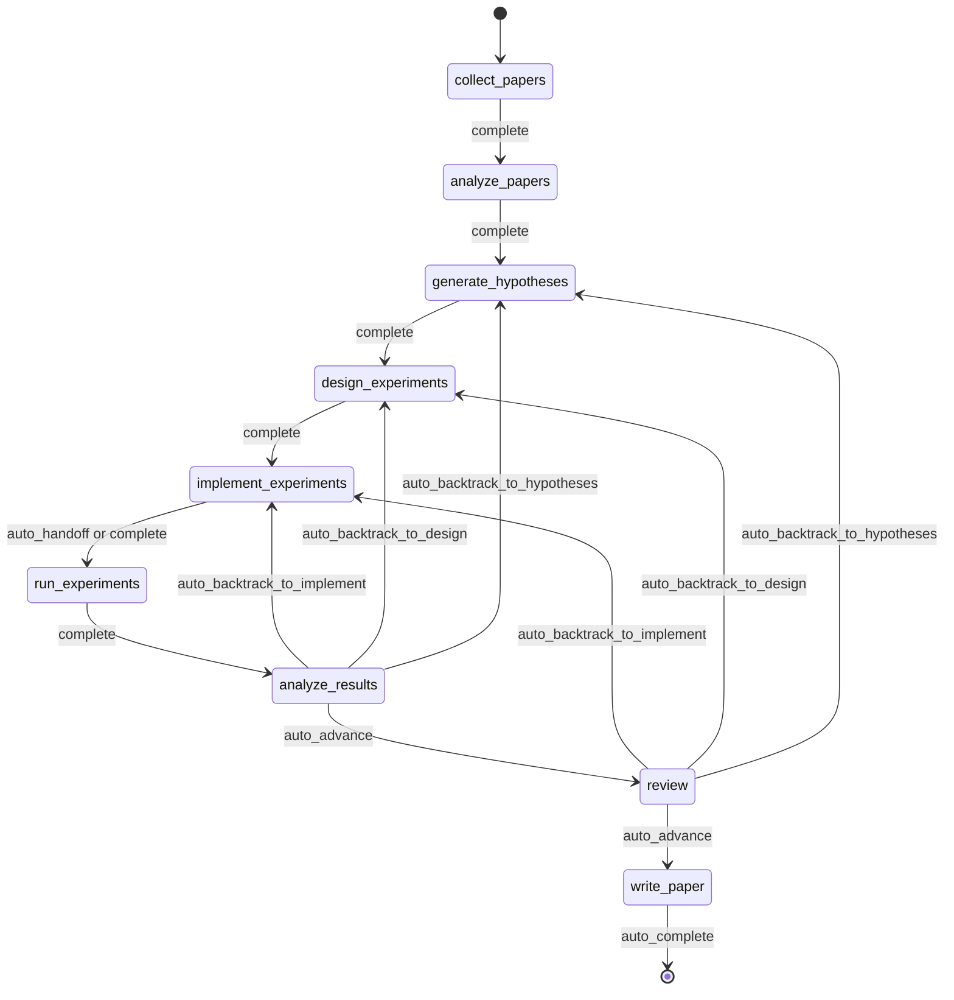
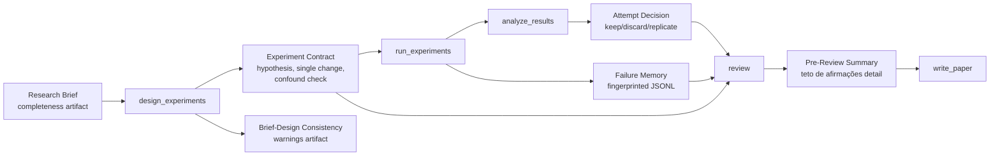
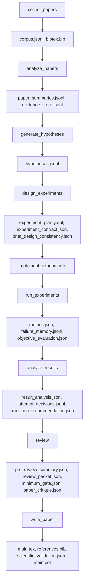
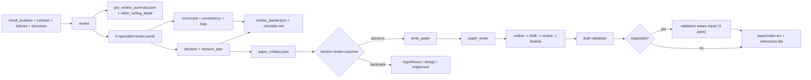
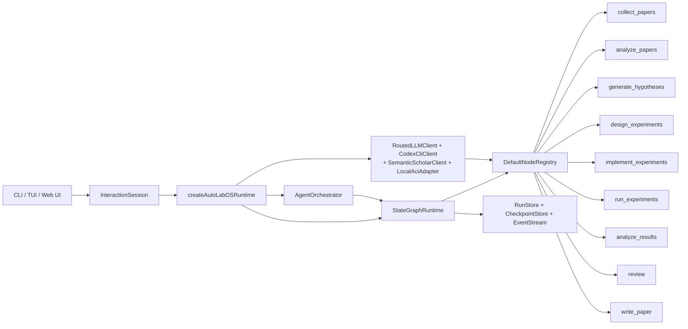

<div align="center">

  <br/>

  

  <h1>Um Sistema Operacional para Pesquisa Autônoma</h1>

  <p><strong>Execução autônoma de pesquisa, não apenas geração de texto para pesquisa.</strong><br/>
  Da literatura ao manuscrito — dentro de um ciclo governado, com checkpoints e passível de inspeção.</p>

  <p>
    <a href="../README.md"><strong>English</strong></a>
    &nbsp;&middot;&nbsp;
    <a href="./README.ko.md"><strong>한국어</strong></a>
    &nbsp;&middot;&nbsp;
    <a href="./README.ja.md"><strong>日本語</strong></a>
    &nbsp;&middot;&nbsp;
    <a href="./README.zh-CN.md"><strong>简体中文</strong></a>
    &nbsp;&middot;&nbsp;
    <a href="./README.zh-TW.md"><strong>繁體中文</strong></a>
    &nbsp;&middot;&nbsp;
    <a href="./README.es.md"><strong>Español</strong></a>
    &nbsp;&middot;&nbsp;
    <a href="./README.fr.md"><strong>Français</strong></a>
    &nbsp;&middot;&nbsp;
    <a href="./README.de.md"><strong>Deutsch</strong></a>
    &nbsp;&middot;&nbsp;
    <a href="./README.pt.md"><strong>Português</strong></a>
    &nbsp;&middot;&nbsp;
    <a href="./README.ru.md"><strong>Русский</strong></a>
  </p>

  <p><sub>Os READMEs localizados são traduções mantidas deste documento. Para a redação normativa e as edições mais recentes, use o README em inglês como referência canônica.</sub></p>

  <!-- CI & Quality -->
  <p>
    <a href="https://github.com/lhy0718/AutoLabOS/actions/workflows/ci.yml">
      
    </a>
    <a href="https://github.com/lhy0718/AutoLabOS/actions/workflows/smoke.yml">
      
    </a>
    
  </p>

  <!-- Tech stack -->
  <p>
    
    
    
  </p>

  <!-- Core features -->
  <p>
    
    
    
    
  </p>

  <!-- Integrations -->
  <p>
    
    
    
    
  </p>

  <!-- Community -->
  <p>
    <a href="https://github.com/lhy0718/AutoLabOS/stargazers">
      
    </a>
    <a href="https://github.com/lhy0718/AutoLabOS/commits/main">
      
    </a>
  </p>

</div>

---

A maioria das ferramentas que afirma automatizar pesquisa, na verdade, automatiza **geração de texto**. Elas produzem saídas com aparência polida a partir de raciocínio superficial, sem governança experimental, sem rastreamento de evidências e sem uma contabilidade honesta do que as evidências realmente sustentam.

O AutoLabOS assume uma posição diferente: **a parte difícil da pesquisa não é a escrita — é a disciplina entre a pergunta e o rascunho.** Fundamentação na literatura, teste de hipóteses, governança experimental, rastreamento de falhas, limitação de afirmações e controle de revisão acontecem dentro de um grafo de estado fixo com 9 nós. Cada nó produz artefatos auditáveis. Cada transição fica registrada em checkpoint. Cada afirmação tem um teto de evidência.

O resultado não é apenas um artigo. É um estado de pesquisa governado que você pode inspecionar, retomar e defender.

> **Evidência primeiro. Afirmações depois.**
>
> **Execuções que você pode inspecionar, retomar e defender.**
>
> **Um sistema operacional de pesquisa, não um pacote de prompts.**
>
> **Seu laboratório não deveria repetir o mesmo experimento fracassado duas vezes.**
>
> **Revisão é um gate estrutural, não uma etapa de polimento.**

---

## O Que Você Recebe Após uma Execução

O AutoLabOS não produz apenas um PDF. Ele produz um estado de pesquisa completo e rastreável:

| Saída | O que contém |
|---|---|
| **Corpus de literatura** | Artigos coletados, BibTeX, repositório de evidências extraídas |
| **Hipóteses** | Hipóteses fundamentadas na literatura com revisão cética |
| **Plano experimental** | Design governado com contrato, travamento de baseline e verificações de consistência |
| **Resultados executados** | Métricas, avaliação objetiva, log de memória de falhas |
| **Análise de resultados** | Análise estatística, decisões por tentativa, raciocínio de transição |
| **Pacote de revisão** | Scorecard de painel com 5 especialistas, teto de afirmações, crítica pré-rascunho |
| **Manuscrito** | Rascunho LaTeX com links de evidência, validação científica, PDF opcional |
| **Checkpoints** | Snapshots completos de estado em cada fronteira de nó — retome a qualquer momento |

Tudo fica em `.autolabos/runs/<run_id>/`, com saídas públicas espelhadas em `outputs/`.

---

## Por Que o AutoLabOS?

A maioria das ferramentas de pesquisa com IA otimiza para a **aparência da saída**. O AutoLabOS otimiza para a **execução governada**.

| | Ferramentas de pesquisa típicas | AutoLabOS |
|---|---|---|
| Workflow | Deriva aberta de agentes | Grafo fixo de 9 nós com transições limitadas |
| Design experimental | Não estruturado | Contratos com imposição de mudança única e detecção de confundidores |
| Experimentos fracassados | Esquecidos e repetidos | Registrados por assinatura na memória de falhas, nunca repetidos |
| Afirmações | Tão fortes quanto o LLM gerar | Limitadas por um teto de afirmações vinculado à evidência real |
| Revisão | Etapa opcional de polimento | Gate estrutural — bloqueia a escrita se a evidência for insuficiente |
| Avaliação do artigo | Verificação única de LLM "parece bom" | Gate de duas camadas: mínimo determinístico + avaliador de qualidade por LLM |
| Estado | Efêmero | Com checkpoints, retomável e inspecionável |

---

## Início Rápido

```bash
# 1. Instalar e compilar
npm install && npm run build && npm link

# 2. Ir para o workspace de pesquisa
cd /path/to/your-research-project

# 3. Iniciar (escolha um)
autolabos web    # UI no navegador — onboarding, dashboard, navegador de artefatos
autolabos        # Workflow por comandos slash no terminal
```

> **Primeira execução?** Ambas as UIs guiam você pelo onboarding se `.autolabos/config.yaml` ainda não existir.

### Pré-requisitos

| Item | Quando necessário | Observações |
|---|---|---|
| `SEMANTIC_SCHOLAR_API_KEY` | Sempre | Descoberta de artigos e metadados |
| `OPENAI_API_KEY` | Quando o provider ou modo PDF é `api` | Execução de modelo via API OpenAI |
| Login no Codex CLI | Quando o provider ou modo PDF é `codex` | Usa sua sessão local do Codex |

---

## O Workflow de 9 Nós

Um grafo fixo. Não uma sugestão — um contrato.



`collect_papers` → `analyze_papers` → `generate_hypotheses` → `design_experiments` → `implement_experiments` → `run_experiments` → `analyze_results` → `review` → `write_paper`

O backtracking é nativo. Se os resultados forem fracos, o grafo redireciona de volta para hipóteses ou design — não avança para uma escrita otimista. Toda automação acontece dentro de loops internos de nó com limites definidos.

---

## Propriedades Centrais

### Governança Experimental

Cada execução de experimento passa por um contrato estruturado:

- **Contrato experimental** — trava hipótese, mecanismo causal, regra de mudança única, condição de aborto e critérios de manter/descartar
- **Detecção de confundidores** — captura mudanças conjuntas, intervenções em formato de lista e incompatibilidades entre mecanismo e mudança
- **Consistência brief-design** — sinaliza quando o design se desvia do research brief original
- **Travamento de baseline** — o contrato de comparação congela a métrica objetiva e o baseline antes da execução

### Imposição do Teto de Afirmações

O sistema não permite que as afirmações ultrapassem as evidências.

O nó `review` produz um `pre_review_summary` contendo a **afirmação defensável mais forte**, uma lista de **afirmações mais fortes bloqueadas** com os motivos e **lacunas de evidência** que precisariam ser preenchidas para desbloqueá-las. Esse teto flui diretamente para a geração do manuscrito.

### Memória de Falhas

JSONL com escopo de execução que registra e desduplica padrões de falha:

- **Fingerprinting de erros** — remove timestamps, caminhos e números para clusterização estável
- **Parada por falha equivalente** — 3+ fingerprints idênticos esgotam as tentativas imediatamente
- **Marcadores de não-repetir** — falhas estruturais bloqueiam a reexecução até que o design mude

Seu laboratório aprende com suas próprias falhas dentro de uma execução.

### Avaliação de Artigo em Duas Camadas

A prontidão do artigo não é uma decisão única de um LLM.

- **Camada 1 — Gate mínimo determinístico**: 7 verificações de presença de artefatos que bloqueiam categoricamente trabalhos com evidência insuficiente de entrar em `write_paper`. Sem LLM envolvido. Aprovado ou reprovado.
- **Camada 2 — Avaliador de qualidade por LLM**: Crítica estruturada em 6 dimensões — significância dos resultados, rigor metodológico, força da evidência, estrutura da escrita, suporte às afirmações e honestidade nas limitações. Produz problemas bloqueantes, problemas não-bloqueantes e uma classificação do tipo de manuscrito.

Se a evidência for insuficiente, o sistema recomenda backtracking — não polimento.

### Painel de Revisão com 5 Especialistas

O nó `review` executa cinco passagens independentes de especialistas:

1. **Verificador de afirmações** — confronta afirmações com evidências
2. **Revisor de metodologia** — valida o design experimental
3. **Revisor de estatística** — avalia o rigor quantitativo
4. **Prontidão para escrita** — verifica clareza e completude
5. **Revisor de integridade** — identifica viés e conflitos

O painel produz um scorecard, uma avaliação de consistência e uma decisão de gate.

---

## Interface Dupla

Duas superfícies de UI, um runtime. Mesmos artefatos, mesmo workflow, mesmos checkpoints.

| | TUI | Web Ops UI |
|---|---|---|
| Iniciar | `autolabos` | `autolabos web` |
| Interação | Comandos slash, linguagem natural | Dashboard no navegador, composer |
| Visão do workflow | Progresso de nós em tempo real no terminal | Grafo visual de 9 nós com ações |
| Artefatos | Inspeção via CLI | Preview inline (texto, imagens, PDFs) |
| Ideal para | Iteração rápida, scripting | Monitoramento visual, navegação de artefatos |

---

## Modos de Execução

O AutoLabOS preserva o workflow de 9 nós e todos os gates de segurança em todos os modos.

| Modo | Comando | Comportamento |
|---|---|---|
| **Interativo** | `autolabos` | TUI com comandos slash e gates de aprovação explícitos |
| **Aprovação mínima** | Config: `approval_mode: minimal` | Aprova automaticamente transições seguras |
| **Overnight** | `/agent overnight [run]` | Passagem única não assistida, limite de 24 horas, backtracking conservador |
| **Autônomo** | `/agent autonomous [run]` | Exploração de pesquisa aberta, sem limite de tempo |

### Modo Autônomo

Projetado para loops sustentados de hipótese → experimento → análise com intervenção mínima. Executa dois loops internos paralelos:

1. **Exploração de pesquisa** — gerar hipóteses, projetar/executar experimentos, analisar, derivar a próxima hipótese
2. **Melhoria da qualidade do artigo** — identificar o ramo mais forte, refinar baselines, fortalecer a vinculação de evidências

Para quando: parada explícita do usuário, limites de recursos, detecção de estagnação ou falha catastrófica. **Não** para apenas porque um experimento foi negativo ou porque a qualidade do artigo está temporariamente estável.

---

## Sistema de Research Brief

Toda execução começa a partir de um brief estruturado em Markdown que define escopo, restrições e regras de governança.

```bash
/new                        # Criar um brief
/brief start --latest       # Validar, snapshot, extrair, iniciar
```

Os briefs possuem seções **centrais** (tópico, métrica objetiva) e seções de **governança** (comparação-alvo, evidência mínima, atalhos proibidos, teto do artigo). O AutoLabOS avalia a completude do brief e alerta quando a cobertura de governança é insuficiente para trabalho em escala de artigo.

<details>
<summary><strong>Seções e classificação do brief</strong></summary>

| Seção | Status | Propósito |
|---|---|---|
| `## Topic` | Obrigatório | Pergunta de pesquisa em 1–3 frases |
| `## Objective Metric` | Obrigatório | Métrica primária de sucesso |
| `## Constraints` | Recomendado | Orçamento de computação, limites de dataset, regras de reprodutibilidade |
| `## Plan` | Recomendado | Plano de experimento passo a passo |
| `## Target Comparison` | Governança | Método proposto vs. baseline explícito |
| `## Minimum Acceptable Evidence` | Governança | Tamanho mínimo de efeito, número de folds, fronteira de decisão |
| `## Disallowed Shortcuts` | Governança | Atalhos que invalidam os resultados |
| `## Paper Ceiling If Evidence Remains Weak` | Governança | Classificação máxima do artigo se a evidência for insuficiente |
| `## Manuscript Format` | Opcional | Número de colunas, orçamento de páginas, regras de referências/apêndices |

| Classificação | Significado | Pronto para escala de artigo? |
|---|---|---|
| `complete` | Centrais + 4+ seções de governança substantivas | Sim |
| `partial` | Centrais completas + 2+ de governança | Prosseguir com avisos |
| `minimal` | Apenas seções centrais | Não |

</details>

---

## Fluxo de Artefatos de Governança



---

## Fluxo de Artefatos

Cada nó produz artefatos estruturados e inspecionáveis.



<details>
<summary><strong>Bundle de saída pública</strong></summary>

```
outputs/<title-slug>-<run_id_prefix>/
  ├── paper/           # Fonte TeX, PDF, referências, log de build
  ├── experiment/      # Resumo do baseline, código do experimento
  ├── analysis/        # Tabela de resultados, análise de evidências
  ├── review/          # Crítica do artigo, decisão do gate
  ├── results/         # Resumos quantitativos compactos
  ├── reproduce/       # Scripts de reprodução, README
  ├── manifest.json    # Registro de seções
  └── README.md        # Resumo da execução legível por humanos
```

</details>

---

## Arquitetura dos Nós

| Nó | Papel(is) | O que faz |
|---|---|---|
| `collect_papers` | coletor, curador | Descobre e seleciona o conjunto de artigos candidatos via Semantic Scholar |
| `analyze_papers` | leitor, extrator de evidências | Extrai resumos e evidências dos artigos selecionados |
| `generate_hypotheses` | agente de hipóteses + revisor cético | Sintetiza ideias da literatura e depois as submete a testes de pressão |
| `design_experiments` | designer + painel de viabilidade/estatística/operações | Filtra planos por praticidade e escreve o contrato experimental |
| `implement_experiments` | implementador | Produz código e mudanças no workspace através de ações ACI |
| `run_experiments` | executor + triador de falhas + planejador de reexecução | Conduz a execução, registra falhas e decide reexecuções |
| `analyze_results` | analista + auditor de métricas + detector de confundidores | Verifica a confiabilidade dos resultados e registra decisões por tentativa |
| `review` | painel de 5 especialistas + teto de afirmações + gate de duas camadas | Revisão estrutural — bloqueia a escrita se a evidência for insuficiente |
| `write_paper` | escritor de artigo + crítica do revisor | Elabora o manuscrito, executa crítica pós-rascunho e gera o PDF |

<details>
<summary><strong>Grafos de conexão fase a fase</strong></summary>

**Descoberta e Leitura**

```mermaid
flowchart LR
    Topic["run topic + collect constraints"] --> CP["collect_papers"]
    CP --> CC["collector_curator"]
    CC --> SS["Semantic Scholar search"]
    SS --> Enrich["enrichment + BibTeX recovery"]
    Enrich --> Corpus["corpus.jsonl + bibtex.bib"]
    Corpus --> AP["analyze_papers"]
    AP --> Select["selection request + hybrid rerank"]
    Select --> Manifest["analysis_manifest resume / prune"]
    Manifest --> RE["reader_evidence_extractor"]
    RE --> Pdf["local text/image analysis or Responses API PDF"]
    Pdf --> ReviewLoop["extractor -> reviewer normalization"]
    ReviewLoop --> Evidence["paper_summaries.jsonl + evidence_store.jsonl"]
```



**Hipótese e Design Experimental**

```mermaid
flowchart LR
    Evidence["paper_summaries.jsonl + evidence_store.jsonl"] --> GH["generate_hypotheses"]
    GH --> HA["hypothesis_agent"]
    HA --> Axes["evidence synthesizer -> evidence axes"]
    Axes --> ToT["ToT branch expansion"]
    ToT --> Drafts["mechanism / contradiction / intervention drafts"]
    Drafts --> Reviews["skeptical reviewer"]
    Reviews --> Select["diversity + evidence-quality top-k selection"]
    Select --> Hyp["hypotheses.jsonl + axes/reviews/llm_trace"]
    Hyp --> DE["design_experiments"]
    DE --> ED["experiment_designer"]
    ED --> Profiles["constraint profile + objective metric profile"]
    Profiles --> Plans["design candidates"]
    Plans --> Panel["designer + feasibility + statistical + ops-capacity panel"]
    Panel --> Choice["panel selection"]
    Choice --> Contract["experiment_contract.json + brief_design_consistency.json"]
```



**Implementação, Execução e Loop de Resultados**

```mermaid
flowchart LR
    PlanYaml["experiment_plan.yaml"] --> IE["implement_experiments"]
    IE --> IM["ImplementSessionManager"]
    IM --> Impl["implementer"]
    IM --> Codex["Codex CLI session"]
    Codex --> VerifyPatch["local verification"]
    VerifyPatch --> Handoff{"auto handoff?"}
    Handoff -->|yes| RX["run_experiments"]
    Handoff -->|no| Gate["approval boundary"]
    Gate --> RX
    RX --> Runner["runner"]
    Runner --> FailCheck["failure memory: check do-not-retry"]
    FailCheck --> ACI["ACI preflight/tests/command"]
    ACI --> Triage["failure triager + rerun planner"]
    Triage -->|retry once if transient| ACI
    ACI --> FailRecord["record to failure_memory.jsonl"]
    ACI --> Metrics["metrics.json + supplemental runs"]
    Metrics --> AR["analyze_results"]
    AR --> ResultPanel["metric auditor + robustness + confounder + calibrator"]
    ResultPanel --> AttemptDec["attempt_decisions.jsonl"]
    ResultPanel --> Synth["transition recommendation"]
    Synth -->|advance| RV["review"]
    Synth -->|backtrack| IE
```



**Revisão, Escrita e Exposição**



</details>

---

## Automação com Limites

Toda automação interna possui um limite explícito.

| Nó | Automação interna | Limite |
|---|---|---|
| `analyze_papers` | Expansão automática da janela de evidências quando muito esparsa | No máximo 2 expansões |
| `design_experiments` | Pontuação determinística do painel + contrato experimental | Executa uma vez por design |
| `run_experiments` | Triagem de falhas + reexecução única para erros transientes | Nunca repete falhas estruturais |
| `run_experiments` | Fingerprinting de memória de falhas | 3+ idênticos esgotam as tentativas |
| `analyze_results` | Rematching objetivo + calibração do painel de resultados | Um rematch antes da pausa humana |
| `write_paper` | Scout de trabalhos relacionados + reparo ciente de validação | Máximo 1 passagem de reparo |

---

## Comandos Principais

| Comando | Descrição |
|---|---|
| `/new` | Criar um research brief |
| `/brief start <path\|--latest>` | Iniciar pesquisa a partir de um brief |
| `/runs [query]` | Listar ou pesquisar execuções |
| `/resume <run>` | Retomar uma execução |
| `/agent run <node> [run]` | Executar a partir de um nó do grafo |
| `/agent status [run]` | Mostrar status dos nós |
| `/agent overnight [run]` | Execução não assistida (limite de 24h) |
| `/agent autonomous [run]` | Pesquisa autônoma aberta |
| `/model` | Alternar modelo e esforço de raciocínio |
| `/doctor` | Diagnóstico de ambiente + workspace |

<details>
<summary><strong>Lista completa de comandos</strong></summary>

| Comando | Descrição |
|---|---|
| `/help` | Mostrar lista de comandos |
| `/new` | Criar arquivo de research brief |
| `/brief start <path\|--latest>` | Iniciar pesquisa a partir de arquivo de brief |
| `/doctor` | Diagnóstico de ambiente + workspace |
| `/runs [query]` | Listar ou pesquisar execuções |
| `/run <run>` | Selecionar execução |
| `/resume <run>` | Retomar execução |
| `/agent list` | Listar nós do grafo |
| `/agent run <node> [run]` | Executar a partir de nó |
| `/agent status [run]` | Mostrar status dos nós |
| `/agent collect [query] [options]` | Coletar artigos |
| `/agent recollect <n> [run]` | Coletar artigos adicionais |
| `/agent focus <node>` | Mover foco com salto seguro |
| `/agent graph [run]` | Mostrar estado do grafo |
| `/agent resume [run] [checkpoint]` | Retomar a partir de checkpoint |
| `/agent retry [node] [run]` | Retentar nó |
| `/agent jump <node> [run] [--force]` | Saltar para nó |
| `/agent overnight [run]` | Autonomia overnight (24h) |
| `/agent autonomous [run]` | Pesquisa autônoma aberta |
| `/model` | Seletor de modelo e raciocínio |
| `/approve` | Aprovar nó pausado |
| `/retry` | Retentar nó atual |
| `/settings` | Configurações de provider e modelo |
| `/quit` | Sair |

</details>

<details>
<summary><strong>Opções e exemplos de coleta</strong></summary>

```
--limit <n>          --last-years <n>      --year <spec>
--date-range <s:e>   --sort <relevance|citationCount|publicationDate>
--order <asc|desc>   --min-citations <n>   --open-access
--field <csv>        --venue <csv>         --type <csv>
--bibtex <generated|s2|hybrid>             --dry-run
--additional <n>     --run <run_id>
```

```bash
/agent collect --last-years 5 --sort relevance --limit 100
/agent collect "agent planning" --sort citationCount --min-citations 100
/agent collect --additional 200 --run <run_id>
```

</details>

---

## Web Ops UI

`autolabos web` inicia uma UI local no navegador em `http://127.0.0.1:4317`.

- **Onboarding** — mesma configuração do TUI, escreve `.autolabos/config.yaml`
- **Dashboard** — busca de execuções, visualização do workflow de 9 nós, ações por nó, logs em tempo real
- **Artefatos** — navegue pelas execuções, visualize texto/imagens/PDFs inline
- **Composer** — comandos slash e linguagem natural, com controle de plano passo a passo

```bash
autolabos web                              # Porta padrão 4317
autolabos web --host 0.0.0.0 --port 8080  # Bind personalizado
```

---

## Filosofia

O AutoLabOS é construído em torno de algumas restrições rígidas:

- **Conclusão do workflow ≠ prontidão para artigo.** Uma execução pode completar o grafo sem que a saída tenha qualidade de artigo. O sistema rastreia a diferença.
- **Afirmações não devem exceder as evidências.** O teto de afirmações é imposto estruturalmente, não por prompts mais fortes.
- **Revisão é um gate, não uma sugestão.** Se a evidência for insuficiente, o nó `review` bloqueia `write_paper` e recomenda backtracking.
- **Resultados negativos são permitidos.** Uma hipótese fracassada é um resultado de pesquisa válido — mas deve ser enquadrada com honestidade.
- **Reprodutibilidade é uma propriedade dos artefatos.** Checkpoints, contratos experimentais, logs de falhas e repositórios de evidências existem para que o raciocínio de uma execução possa ser rastreado e questionado.

---

## Desenvolvimento

```bash
npm install              # Instalar dependências (inclui sub-pacote web)
npm run build            # Compilar TypeScript + web UI
npm test                 # Executar todos os testes unitários (931+)
npm run test:watch       # Modo watch

# Arquivo de teste individual
npx vitest run tests/<name>.test.ts

# Testes de fumaça (smoke)
npm run test:smoke:all                      # Bundle completo de smoke local
npm run test:smoke:natural-collect          # Coleta NL -> comando pendente
npm run test:smoke:natural-collect-execute  # Coleta NL -> executar -> verificar
npm run test:smoke:ci                       # Seleção de smoke para CI
```

<details>
<summary><strong>Variáveis de ambiente para testes de fumaça</strong></summary>

```bash
AUTOLABOS_FAKE_CODEX_RESPONSE=1              # Evitar chamadas reais ao Codex
AUTOLABOS_FAKE_SEMANTIC_SCHOLAR_RESPONSE=1   # Evitar chamadas reais ao S2
AUTOLABOS_SMOKE_VERBOSE=1                    # Imprimir logs PTY completos
AUTOLABOS_SMOKE_MODE=<mode>                  # Seleção de modo CI
```

</details>

<details>
<summary><strong>Internos do runtime</strong></summary>

### Políticas do Grafo de Estado

- Checkpoints: `.autolabos/runs/<run_id>/checkpoints/` — fases: `before | after | fail | jump | retry`
- Política de retentativas: `maxAttemptsPerNode = 3`
- Rollback automático: `maxAutoRollbacksPerNode = 2`
- Modos de salto: `safe` (atual ou anterior) / `force` (avança, nós pulados são registrados)

### Padrões do Runtime de Agentes

- Loop **ReAct**: `PLAN_CREATED → TOOL_CALLED → OBS_RECEIVED`
- Separação **ReWOO** (planner/worker): usado para nós de alto custo
- **ToT** (Tree-of-Thoughts): usado nos nós de hipótese e design
- **Reflexion**: episódios de falha armazenados e reutilizados em retentativas

### Camadas de Memória

| Camada | Escopo | Formato |
|---|---|---|
| Memória de contexto de execução | Key/value por execução | `run_context.jsonl` |
| Armazenamento de longo prazo | Entre tentativas | Resumo JSONL e índice |
| Memória de episódios | Reflexion | Lições de falha para retentativas |

### Ações ACI

`implement_experiments` e `run_experiments` executam através de:
`read_file` · `write_file` · `apply_patch` · `run_command` · `run_tests` · `tail_logs`

</details>

<details>
<summary><strong>Diagrama do runtime de agentes</strong></summary>



</details>

---

## Documentação

| Documento | Cobertura |
|---|---|
| `docs/architecture.md` | Arquitetura do sistema e decisões de design |
| `docs/tui-live-validation.md` | Validação e abordagem de testes do TUI |
| `docs/experiment-quality-bar.md` | Padrões de execução de experimentos |
| `docs/paper-quality-bar.md` | Requisitos de qualidade do manuscrito |
| `docs/reproducibility.md` | Garantias de reprodutibilidade |
| `docs/research-brief-template.md` | Template completo de brief com todas as seções de governança |

---

## Status

O AutoLabOS está em desenvolvimento ativo (v0.1.0). O workflow, o sistema de governança e o runtime central são funcionais e testados. Interfaces, cobertura de artefatos e modos de execução estão sob validação contínua.

Contribuições e feedback são bem-vindos — veja [Issues](https://github.com/lhy0718/AutoLabOS/issues).

---

<div align="center">
  <sub>Feito para pesquisadores que querem seus experimentos governados e suas afirmações defensáveis.</sub>
</div>
