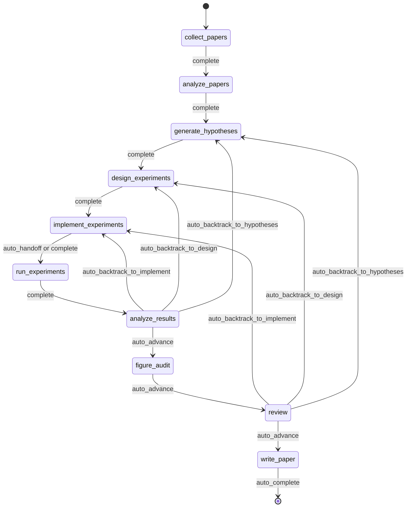
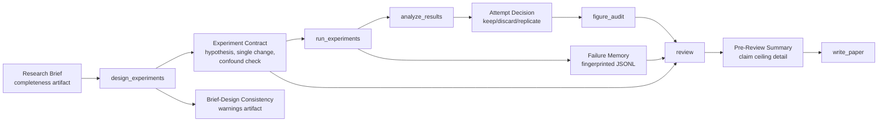
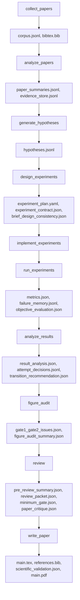

<div align="center">

  <br/>

  

  <h1>Um sistema operacional para pesquisa autônoma</h1>

  <p><strong>Não geração de pesquisa, mas execução autônoma de pesquisa.</strong><br/>
  Do brief ao manuscrito, dentro de uma execução governed, checkpointed e inspectable.</p>

  <p>
    <a href="../README.md"><strong>English</strong></a>
    &nbsp;&middot;&nbsp;
    <a href="./README.ko.md"><strong>한국어</strong></a>
    &nbsp;&middot;&nbsp;
    <a href="./README.ja.md"><strong>日本語</strong></a>
    &nbsp;&middot;&nbsp;
    <a href="./README.zh-CN.md"><strong>简体中文</strong></a>
    &nbsp;&middot;&nbsp;
    <a href="./README.zh-TW.md"><strong>繁體中文</strong></a>
    &nbsp;&middot;&nbsp;
    <a href="./README.es.md"><strong>Español</strong></a>
    &nbsp;&middot;&nbsp;
    <a href="./README.fr.md"><strong>Français</strong></a>
    &nbsp;&middot;&nbsp;
    <a href="./README.de.md"><strong>Deutsch</strong></a>
    &nbsp;&middot;&nbsp;
    <a href="./README.pt.md"><strong>Português</strong></a>
    &nbsp;&middot;&nbsp;
    <a href="./README.ru.md"><strong>Русский</strong></a>
  </p>

  <p><sub>Os READMEs localizados são traduções mantidas deste documento. Para a redação normativa e as edições mais recentes, use o README em inglês como canonical reference.</sub></p>

  <p>
    <a href="https://github.com/lhy0718/AutoLabOS/actions/workflows/ci.yml">
      
    </a>
    <a href="https://github.com/lhy0718/AutoLabOS/actions/workflows/smoke.yml">
      
    </a>
    
  </p>

  <p>
    
    
    
  </p>

  <p>
    
    
    
    
  </p>

</div>

---

AutoLabOS é um sistema operacional para execução de pesquisa governada. Ele trata um run como um estado de pesquisa checkpointed, e não como uma etapa única de geração.

Todo o loop central é inspectable. Coleta de literatura, formulação de hipóteses, design experimental, implementação, execução, análise, figure audit, review e redação do manuscrito produzem artifacts auditáveis. As afirmações permanecem evidence-bounded sob um claim ceiling. Review não é uma etapa de polimento; é um structural gate.

Hipóteses de qualidade são convertidas em checks explícitos. O comportamento real importa mais do que a aparência no nível do prompt. A reprodutibilidade é garantida por artifacts, checkpoints e inspectable transitions.

---

## Por que o AutoLabOS existe

Muitos sistemas de research agents são otimizados para produzir texto. O AutoLabOS é otimizado para executar um processo de pesquisa governado.

Essa diferença importa quando um projeto precisa de algo além de um rascunho convincente.

- um research brief que funciona como contrato de execução
- workflow gates explícitos em vez de deriva aberta de agentes
- checkpoints e artifacts que podem ser inspecionados depois
- review capaz de interromper trabalho fraco antes da geração do manuscrito
- failure memory para evitar repetir cegamente o mesmo experimento fracassado
- evidence-bounded claims em vez de prosa mais forte que os dados

O AutoLabOS é voltado para equipes que querem autonomia sem abrir mão de auditabilidade, backtracking e validation.

---

## O que acontece em um run

Um run governed segue sempre o mesmo arco de pesquisa.

`Brief.md` → literature → hypothesis → experiment design → implementation → execution → analysis → figure audit → review → manuscript

Na prática:

1. `/new` cria ou abre o research brief
2. `/brief start --latest` valida o brief, cria um snapshot dele dentro do run e inicia um run governed
3. o sistema percorre o workflow fixo e faz checkpoint de state e artifacts em cada fronteira
4. se a evidence for fraca, o sistema faz backtracking ou downgrade em vez de polir o texto
5. somente depois de passar pelo review gate o `write_paper` redige o manuscrito com base em evidence limitada

O contrato histórico de 9 nodes continua sendo a linha de base arquitetural. No runtime atual, `figure_audit` é o checkpoint extra aprovado entre `analyze_results` e `review`, para que a crítica das figuras possa ser checkpointed e retomada de forma independente.



Toda a automação dentro desse fluxo permanece limitada a bounded node-internal loops. Mesmo em modos não assistidos, o workflow continua governed.

---

## O que você obtém após um run

O AutoLabOS não produz apenas um PDF. Ele produz um estado de pesquisa rastreável.

| Saída | Conteúdo |
|---|---|
| **Corpus de literatura** | papers coletados, BibTeX, evidence store extraído |
| **Hipóteses** | hypotheses baseadas na literatura e skeptical review |
| **Plano experimental** | governed design com contract, baseline lock e checks de consistência |
| **Resultados executados** | metrics, objective evaluation, failure memory log |
| **Análise de resultados** | análise estatística, attempt decisions, transition reasoning |
| **Figure audit** | figure lint, caption/reference consistency e vision critique opcional |
| **Review packet** | scorecard do painel de 5 especialistas, claim ceiling, critique pré-rascunho |
| **Manuscrito** | rascunho LaTeX com evidence links, scientific validation e PDF opcional |
| **Checkpoints** | snapshots completos de state em cada fronteira de node, resumable a qualquer momento |

Tudo fica em `.autolabos/runs/<run_id>/`, com saídas públicas espelhadas em `outputs/`.

Esse é o modelo de reprodutibilidade: não um estado escondido, mas artifacts, checkpoints e inspectable transitions.

---

## Quick Start

```bash
# 1. Instalar e compilar
npm install
npm run build
npm link

# 2. Ir para seu workspace de pesquisa
cd /path/to/your-research-workspace

# 3. Iniciar uma interface
autolabos        # TUI
autolabos web    # Web UI
```

Fluxo típico de primeiro uso:

```bash
/new
/brief start --latest
/doctor
```

Notas:

- se `.autolabos/config.yaml` não existir, as duas interfaces guiam o onboarding
- não execute o AutoLabOS a partir da raiz do repositório; use um diretório de workspace separado para a execução de pesquisa
- TUI e Web UI compartilham o mesmo runtime, os mesmos artifacts e os mesmos checkpoints

### Pré-requisitos

| Item | Quando é necessário | Observações |
|---|---|---|
| `SEMANTIC_SCHOLAR_API_KEY` | Sempre | Descoberta de papers e metadata |
| `OPENAI_API_KEY` | Quando o provider é `api` | Execução com modelos da OpenAI API |
| Login no Codex CLI | Quando o provider é `codex` | Usa sua sessão local do Codex |

---

## Sistema de Research Brief

O brief não é apenas um documento inicial. Ele é o governed contract do run.

`/new` cria ou abre `Brief.md`. `/brief start --latest` valida o brief, cria um snapshot dele dentro do run e inicia a execução a partir desse snapshot. O run registra o source path do brief, o snapshot path e qualquer manuscript format parseado. Assim, a provenance do run permanece inspectable mesmo que o brief do workspace mude depois.
`Appendix Preferences` agora pode ser estruturado com `Prefer appendix for:` e `Keep in main body:` para deixar explícita no brief contract a intenção de appendix routing.

Em outras palavras, o brief não é apenas parte do prompt. Ele é parte do audit trail.

No contrato atual, `.autolabos/config.yaml` guarda principalmente defaults de provider/runtime e workspace policy. A intenção de pesquisa específica de cada run, os evidence bars, as expectativas de baseline, os objetivos de manuscript format e o caminho do manuscript template devem ficar no Brief. Por isso, o config persistido pode omitir defaults de `research` e alguns campos de manuscript-profile / paper-template.

```bash
/new
/brief start --latest
```

O brief precisa cobrir tanto a intenção de pesquisa quanto as restrições de governança: topic, objective metric, baseline ou comparator, minimum acceptable evidence, disallowed shortcuts e o paper ceiling quando a evidence permanecer fraca.

<details>
<summary><strong>Seções do brief e grading</strong></summary>

| Seção | Status | Propósito |
|---|---|---|
| `## Topic` | Obrigatória | Definir a pergunta de pesquisa em 1-3 frases |
| `## Objective Metric` | Obrigatória | Métrica principal de sucesso |
| `## Constraints` | Recomendada | compute budget, limites de dataset, regras de reprodutibilidade |
| `## Plan` | Recomendada | Plano experimental passo a passo |
| `## Target Comparison` | Governance | Comparação com um baseline explícito |
| `## Minimum Acceptable Evidence` | Governance | effect size mínimo, fold count, decision boundary |
| `## Disallowed Shortcuts` | Governance | atalhos que invalidam o resultado |
| `## Paper Ceiling If Evidence Remains Weak` | Governance | classificação máxima de paper se a evidence continuar fraca |
| `## Manuscript Format` | Opcional | número de colunas, orçamento de páginas, regras de references / appendix |

| Grau | Significado | Pronto para paper-scale? |
|---|---|---|
| `complete` | core + 4 ou mais seções substantivas de governance | Sim |
| `partial` | core completo + 2 ou mais seções de governance | Prossegue com avisos |
| `minimal` | Apenas seções core | Não |

</details>

---

## Duas interfaces, um runtime

O AutoLabOS oferece dois front ends sobre o mesmo runtime governed.

| | TUI | Web UI |
|---|---|---|
| Inicialização | `autolabos` | `autolabos web` |
| Interação | slash commands, linguagem natural | dashboard e composer no navegador |
| Visão do workflow | progresso dos nodes em tempo real no terminal | governed workflow graph com ações |
| Artifacts | inspeção via CLI | inline preview de texto, imagens e PDFs |
| Superfícies operacionais | `/watch`, `/queue`, `/explore`, `/doctor` | jobs queue, live watch cards, exploration status, diagnostics |
| Melhor para | iteração rápida e controle direto | monitoramento visual e navegação por artifacts |

O ponto importante é que as duas superfícies veem os mesmos checkpoints, os mesmos runs e os mesmos artifacts subjacentes.

---

## O que diferencia o AutoLabOS

O AutoLabOS foi projetado em torno de governed execution, não de prompt-only orchestration.

| | Ferramentas típicas de pesquisa | AutoLabOS |
|---|---|---|
| Workflow | deriva aberta de agentes | governed fixed graph com review boundaries explícitos |
| State | efêmero | checkpointed, resumable, inspectable |
| Claims | tão fortes quanto o modelo conseguir escrever | limitadas por evidence e claim ceiling |
| Review | cleanup pass opcional | structural gate capaz de bloquear a escrita |
| Failures | são esquecidos e tentados de novo | registrados com fingerprint em failure memory |
| Interfaces | caminhos de código separados | TUI e Web compartilham um único runtime |

Por isso, o sistema deve ser entendido mais como research infrastructure do que como paper generator.

---

## Garantias centrais

### Governed Workflow

O workflow é bounded e auditable. O backtracking faz parte do contract. Resultados que não justificam avançar são enviados de volta a hypotheses, design ou implementation, em vez de serem transformados em prose mais forte.

### Checkpointed Research State

Cada fronteira de node grava um state inspectable e resumable. A unidade de progresso não é apenas o texto produzido, mas um run com artifacts, transitions e recoverable state.

### Claim Ceiling

As claims permanecem abaixo do strongest defensible evidence ceiling. O sistema registra claims mais fortes que foram bloqueadas e os evidence gaps necessários para desbloqueá-las.

### Review As A Structural Gate

`review` não é uma etapa de limpeza cosmética. É o structural gate onde readiness, sanidade metodológica, evidence linkage, writing discipline e reproducibility handoff são verificados antes da geração do manuscrito.

### Failure Memory

Failure fingerprints são persistidos para que erros estruturais e equivalent failures repetidos não sejam reexecutados cegamente.

### Reproducibility Through Artifacts

A reprodutibilidade é imposta por artifacts, checkpoints e inspectable transitions. Até os resumos públicos se baseiam em persisted run outputs, e não em uma segunda fonte de verdade.

---

## Validation e modelo de qualidade orientado a harness

O AutoLabOS trata validation surfaces como first-class.

- `/doctor` verifica environment e workspace readiness antes de um run começar

Paper readiness não é apenas uma impressão produzida por um prompt.

- **Layer 1 - deterministic minimum gate** bloqueia under-evidenced work por meio de artifact / evidence-integrity checks explícitos
- **Layer 2 - LLM paper-quality evaluator** adiciona crítica estruturada sobre methodology, evidence strength, writing structure, claim support e limitations honesty
- **Review packet + specialist panel** decidem se o caminho do manuscrito deve advance, revise ou backtrack

`paper_readiness.json` pode incluir `overall_score`. Esse valor deve ser lido como um sinal interno de qualidade do run, não como um benchmark científico universal. Alguns caminhos avançados de evaluation / self-improvement usam esse sinal para comparar runs ou candidatos de prompt mutation.

---

## Capacidades avançadas de Self-Improvement

O AutoLabOS inclui caminhos bounded de self-improvement, mas não se trata de blind autonomous rewriting. Esses caminhos permanecem limitados por validation e rollback.

### `autolabos meta-harness`

`autolabos meta-harness` constrói um context directory em `outputs/meta-harness/<timestamp>/` com base em recent completed runs e no histórico de avaliação.

Ele pode incluir:

- run events filtrados
- node artifacts como `result_analysis.json` ou `review/decision.json`
- `paper_readiness.json`
- `outputs/eval-harness/history.jsonl`
- arquivos atuais de `node-prompts/` para o node alvo

O LLM é instruído por `TASK.md` a responder apenas com `TARGET_FILE + unified diff`, e o alvo fica restrito a `node-prompts/`. No modo apply, o candidato precisa passar em validation checks; se falhar, ocorre rollback e um audit log é escrito. `--no-apply` apenas gera o context. `--dry-run` mostra o diff sem alterar arquivos.

### `autolabos evolve`

`autolabos evolve` executa um bounded mutation-and-evaluation loop sobre `.codex` e `node-prompts`.

- suporta `--max-cycles`, `--target skills|prompts|all` e `--dry-run`
- lê a fitness do run a partir de `paper_readiness.overall_score`
- muta prompts e skills, executa validation e compara a fitness entre ciclos
- em caso de regressão, restaura `.codex` e `node-prompts` a partir da última good git tag

Esse é um caminho de self-improvement, mas não um caminho de reescrita repo-wide sem limites.

### Harness Preset Layer

O AutoLabOS também fornece built-in harness presets como `base`, `compact`, `failure-aware` e `review-heavy`. Eles ajustam artifact/context policy, ênfase em failure memory, prompt policy e compression strategy para caminhos de avaliação comparativa, sem alterar o governed production workflow.

---

## Comandos comuns

| Comando | Descrição |
|---|---|
| `/new` | Criar ou abrir `Brief.md` |
| `/brief start <path\|--latest>` | Iniciar pesquisa a partir de um brief |
| `/runs [query]` | Listar ou buscar runs |
| `/resume <run>` | Retomar um run |
| `/agent run <node> [run]` | Executar a partir de um node do graph |
| `/agent status [run]` | Mostrar status dos nodes |
| `/agent overnight [run]` | Executar unattended dentro de limites conservadores |
| `/agent autonomous [run]` | Executar bounded research exploration |
| `/watch` | Live watch de runs ativos e background jobs |
| `/explore` | Mostrar o estado do exploration engine do run ativo |
| `/queue` | Mostrar jobs running / waiting / stalled |
| `/doctor` | Diagnostics de environment e workspace |
| `/model` | Trocar modelo e reasoning effort |

<details>
<summary><strong>Lista completa de comandos</strong></summary>

| Comando | Descrição |
|---|---|
| `/help` | Mostrar lista de comandos |
| `/new` | Criar ou abrir o `Brief.md` do workspace |
| `/brief start <path\|--latest>` | Iniciar pesquisa a partir do `Brief.md` do workspace ou de um brief indicado |
| `/doctor` | Diagnostics de environment + workspace |
| `/runs [query]` | Listar ou buscar runs |
| `/run <run>` | Selecionar run |
| `/resume <run>` | Retomar run |
| `/agent list` | Listar nodes do graph |
| `/agent run <node> [run]` | Executar a partir de um node |
| `/agent status [run]` | Mostrar status dos nodes |
| `/agent collect [query] [options]` | Coletar papers |
| `/agent recollect <n> [run]` | Coletar papers adicionais |
| `/agent focus <node>` | Mover o foco com safe jump |
| `/agent graph [run]` | Mostrar o graph state |
| `/agent resume [run] [checkpoint]` | Retomar a partir de checkpoint |
| `/agent retry [node] [run]` | Tentar novamente um node |
| `/agent jump <node> [run] [--force]` | Saltar para um node |
| `/agent overnight [run]` | Overnight autonomy (24h) |
| `/agent autonomous [run]` | Open-ended autonomous research |
| `/model` | Seletor de modelo e reasoning |
| `/approve` | Aprovar um node pausado |
| `/queue` | Mostrar jobs running / waiting / stalled |
| `/watch` | Live watch de runs ativos |
| `/explore` | Mostrar estado do exploration engine |
| `/retry` | Tentar novamente o node atual |
| `/settings` | Configurações de provider e modelo |
| `/quit` | Sair |

</details>

---

## Para quem é / não é

### Bom encaixe

- equipes que querem autonomia sem abrir mão de um governed workflow
- trabalho de research engineering em que checkpoints e artifacts importam
- projetos paper-scale ou paper-adjacent que exigem disciplina de evidence
- ambientes em que review, traceability e resumability importam tanto quanto generation

### Não é um bom encaixe

- usuários que querem apenas um one-shot draft rápido
- workflows que não precisam de artifact trail ou review gates
- projetos que preferem free-form agent behavior em vez de governed execution
- casos em que uma ferramenta simples de resumo de literatura é suficiente

---

## Advanced Details

<details>
<summary><strong>Modos de execução</strong></summary>

O AutoLabOS preserva o governed workflow e os safety gates em todos os modos.

| Modo | Comando | Comportamento |
|---|---|---|
| **Interactive** | `autolabos` | TUI com slash commands e approval gates explícitos |
| **Minimal approval** | Config: `approval_mode: minimal` | Autoaprova transições seguras |
| **Hybrid approval** | Config: `approval_mode: hybrid` | Avança automaticamente em transições fortes e de baixo risco; pausa transições arriscadas ou de baixa confiança |
| **Overnight** | `/agent overnight [run]` | Execução unattended em uma passada, limite de 24h, backtracking conservador |
| **Autonomous** | `/agent autonomous [run]` | Open-ended bounded research exploration |

</details>

<details>
<summary><strong>Governance Artifact Flow</strong></summary>



</details>

<details>
<summary><strong>Artifact Flow</strong></summary>



</details>

<details>
<summary><strong>Arquitetura dos nodes</strong></summary>

| Node | Papel | O que faz |
|---|---|---|
| `collect_papers` | collector, curator | Descobre e filtra candidate paper sets via Semantic Scholar |
| `analyze_papers` | reader, evidence extractor | Extrai summaries e evidence dos papers selecionados |
| `generate_hypotheses` | hypothesis agent + skeptical reviewer | Sintetiza ideias da literatura e as pressure-test |
| `design_experiments` | designer + feasibility/statistical/ops panel | Filtra planos por viabilidade e escreve o experiment contract |
| `implement_experiments` | implementer | Produz mudanças de código e workspace por meio de ACI actions |
| `run_experiments` | runner + failure triager + rerun planner | Executa experimentos, registra failures e decide reruns |
| `analyze_results` | analyst + metric auditor + confounder detector | Verifica a confiabilidade dos results e grava attempt decisions |
| `figure_audit` | figure auditor + optional vision critique | Verifica evidence alignment, captions / references e publication readiness |
| `review` | 5-specialist panel + claim ceiling + two-layer gate | Faz structural review e bloqueia a escrita se faltar evidence |
| `write_paper` | paper writer + reviewer critique | Redige o manuscrito, faz post-draft critique e constrói o PDF |

</details>

<details>
<summary><strong>Bounded automation</strong></summary>

| Node | Automação interna | Limite |
|---|---|---|
| `analyze_papers` | Autoexpansão da evidence window quando a evidence é escassa | <= 2 expansões |
| `design_experiments` | Deterministic panel scoring + experiment contract | Uma vez por design |
| `run_experiments` | Failure triage + um rerun transitório | Nunca reexecuta failures estruturais |
| `run_experiments` | Failure memory fingerprinting | >= 3 failures idênticas esgotam os retries |
| `analyze_results` | Objective rematching + result panel calibration | Um rematch antes de pausa humana |
| `figure_audit` | Gate 3 figure critique + summary aggregation | A vision critique permanece resumable de forma independente |
| `write_paper` | Related-work scout + validation-aware repair | No máximo 1 repair |

</details>

<details>
<summary><strong>Public output bundle</strong></summary>

```
outputs/<title-slug>-<run_id_prefix>/
  ├── paper/
  ├── experiment/
  ├── analysis/
  ├── review/
  ├── results/
  ├── reproduce/
  ├── manifest.json
  └── README.md
```

</details>

---

## Status

O AutoLabOS é um projeto OSS ativo de research engineering. As referências canônicas para comportamento e contracts estão em `docs/`, especialmente:

- `docs/architecture.md`
- `docs/experiment-quality-bar.md`
- `docs/paper-quality-bar.md`
- `docs/reproducibility.md`
- `docs/research-brief-template.md`

