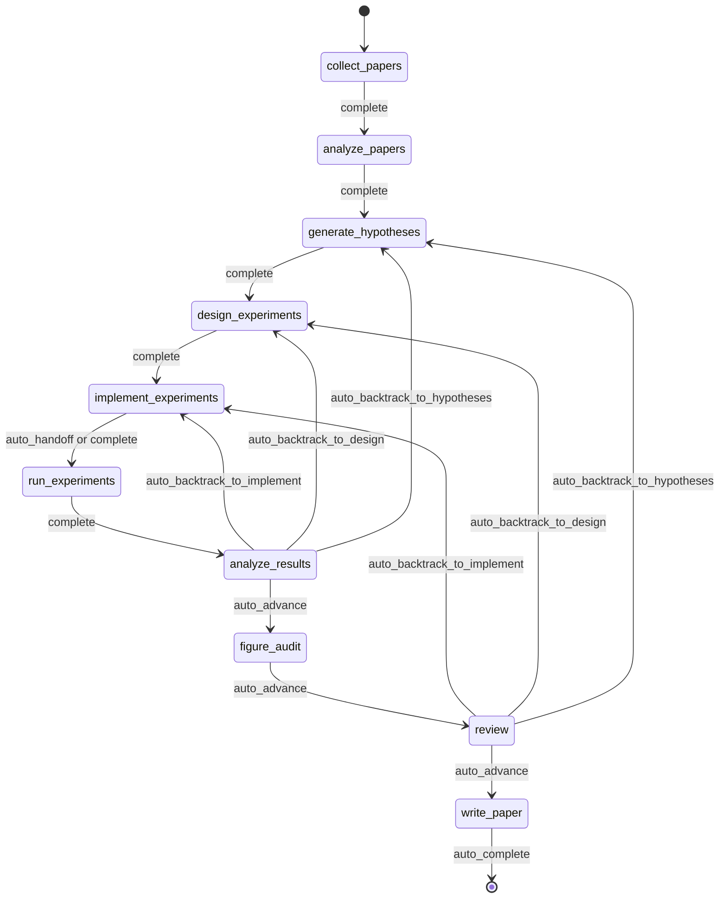
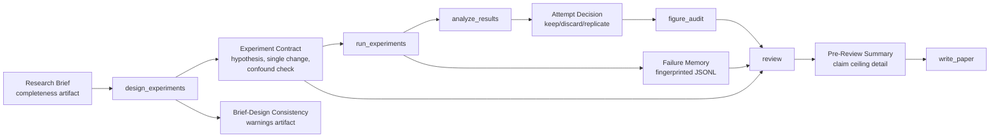
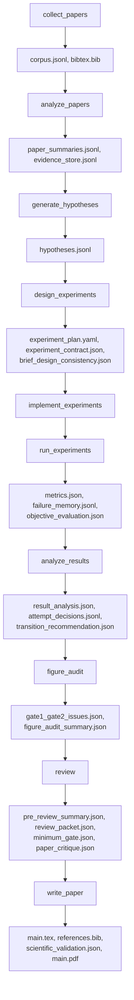

<div align="center">

  <br/>

  

  <h1>Операционная система для автономного исследования</h1>

  <p><strong>Не генерация исследования, а автономное выполнение исследования.</strong><br/>
  От brief до manuscript внутри governed, checkpointed и inspectable процесса.</p>

  <p>
    <a href="../README.md"><strong>English</strong></a>
    &nbsp;&middot;&nbsp;
    <a href="./README.ko.md"><strong>한국어</strong></a>
    &nbsp;&middot;&nbsp;
    <a href="./README.ja.md"><strong>日本語</strong></a>
    &nbsp;&middot;&nbsp;
    <a href="./README.zh-CN.md"><strong>简体中文</strong></a>
    &nbsp;&middot;&nbsp;
    <a href="./README.zh-TW.md"><strong>繁體中文</strong></a>
    &nbsp;&middot;&nbsp;
    <a href="./README.es.md"><strong>Español</strong></a>
    &nbsp;&middot;&nbsp;
    <a href="./README.fr.md"><strong>Français</strong></a>
    &nbsp;&middot;&nbsp;
    <a href="./README.de.md"><strong>Deutsch</strong></a>
    &nbsp;&middot;&nbsp;
    <a href="./README.pt.md"><strong>Português</strong></a>
    &nbsp;&middot;&nbsp;
    <a href="./README.ru.md"><strong>Русский</strong></a>
  </p>

  <p><sub>Локализованные README — это поддерживаемые переводы этого документа. Для нормативных формулировок и самых новых правок используйте английский README как canonical reference.</sub></p>

  <p>
    <a href="https://github.com/lhy0718/AutoLabOS/actions/workflows/ci.yml">
      
    </a>
    <a href="https://github.com/lhy0718/AutoLabOS/actions/workflows/smoke.yml">
      
    </a>
    
  </p>

  <p>
    
    
    
  </p>

  <p>
    
    
    
    
  </p>

</div>

---

AutoLabOS — это операционная система для governed research execution. Она рассматривает run как checkpointed состояние исследования, а не как одноразовый акт генерации.

Весь основной цикл inspectable. Сбор литературы, формирование гипотез, дизайн экспериментов, реализация, запуск, анализ, figure audit, review и написание manuscript оставляют auditируемые артефакты. Утверждения остаются evidence-bounded в рамках claim ceiling. Review — это не этап косметической правки, а structural gate.

Предположения о качестве превращаются в явные checks. Реальное поведение важнее, чем внешний вид на уровне prompt. Воспроизводимость обеспечивается за счёт артефактов, checkpoints и inspectable transitions.

---

## Зачем существует AutoLabOS

Многие системы research agents оптимизированы под производство текста. AutoLabOS оптимизирован под выполнение governed исследовательского процесса.

Эта разница важна, когда проекту нужно больше, чем просто правдоподобный черновик.

- research brief как контракт исполнения
- явные workflow gates вместо свободного дрейфа агентов
- checkpoints и артефакты, которые можно проверить постфактум
- review, способный остановить слабую работу до генерации manuscript
- failure memory, чтобы не повторять вслепую один и тот же неудачный эксперимент
- evidence-bounded claims вместо текста, который выходит за пределы данных

AutoLabOS рассчитан на команды, которым нужна автономность без отказа от auditability, backtracking и validation.

---

## Что происходит в одном run

Один governed run всегда проходит один и тот же исследовательский путь.

`Brief.md` → literature → hypothesis → experiment design → implementation → execution → analysis → figure audit → review → manuscript

На практике это выглядит так:

1. `/new` создаёт или открывает research brief
2. `/brief start --latest` валидирует brief, сохраняет его snapshot внутри run и запускает governed run
3. система проходит фиксированный workflow и checkpoint’ит state и artifacts на каждой границе
4. если evidence слабая, система выбирает backtracking или downgrade, а не автоматическую косметическую правку текста
5. только после прохождения review gate узел `write_paper` пишет manuscript на основе ограниченной evidence

Исторический контракт на 9 nodes остаётся архитектурной базой. В текущем runtime между `analyze_results` и `review` добавлен `figure_audit`, чтобы критику фигур можно было checkpointить и возобновлять независимо.



Вся автоматизация внутри этого потока ограничена bounded node-internal loops. Даже в unattended-режимах сам workflow остаётся governed.

---

## Что вы получаете после run

AutoLabOS создаёт не только PDF. Он создаёт трассируемое состояние исследования.

| Выход | Что содержит |
|---|---|
| **Литературный corpus** | собранные papers, BibTeX, извлечённый evidence store |
| **Гипотезы** | hypotheses, основанные на литературе, и skeptical review |
| **Экспериментальный план** | governed design с contract, baseline lock и checks согласованности |
| **Исполненные результаты** | metrics, objective evaluation, failure memory log |
| **Анализ результатов** | статистический анализ, attempt decisions, transition reasoning |
| **Figure audit** | figure lint, caption/reference consistency, опциональная vision critique |
| **Review packet** | scorecard панели из 5 специалистов, claim ceiling, critique до черновика |
| **Рукопись** | LaTeX draft с evidence links, scientific validation и опциональным PDF |
| **Checkpoints** | полные snapshots состояния на каждой границе node, resumable в любой момент |

Всё хранится под `.autolabos/runs/<run_id>/`, а публичные результаты зеркалируются в `outputs/`.

Так устроена модель воспроизводимости: не скрытое состояние, а артефакты, checkpoints и inspectable transitions.

---

## Quick Start

```bash
# 1. Установить и собрать
npm install
npm run build
npm link

# 2. Перейти в исследовательский workspace
cd /path/to/your-research-workspace

# 3. Запустить один интерфейс
autolabos        # TUI
autolabos web    # Web UI
```

Типичный первый сценарий:

```bash
/new
/brief start --latest
/doctor
```

Примечания:

- если `.autolabos/config.yaml` отсутствует, оба интерфейса проведут через onboarding
- не запускайте AutoLabOS из корня репозитория; используйте `test/` или собственный workspace
- TUI и Web UI используют один и тот же runtime, одни и те же artifacts и те же checkpoints

### Предварительные требования

| Пункт | Когда нужен | Примечания |
|---|---|---|
| `SEMANTIC_SCHOLAR_API_KEY` | Всегда | Поиск papers и metadata |
| `OPENAI_API_KEY` | Когда provider = `api` | Выполнение через модели OpenAI API |
| Вход в Codex CLI | Когда provider = `codex` | Используется локальная сессия Codex |

---

## Система Research Brief

Brief — это не просто стартовый документ. Это governed contract для run.

`/new` создаёт или открывает `Brief.md`. `/brief start --latest` валидирует его, сохраняет snapshot внутри run и запускает выполнение на основе этого snapshot. Run записывает source path brief, snapshot path и любой распознанный manuscript format. Благодаря этому provenance run остаётся inspectable даже если brief в workspace позже изменится.

Иными словами, brief — это не просто часть prompt. Это часть audit trail.

```bash
/new
/brief start --latest
```

Brief должен покрывать и исследовательское намерение, и governance-ограничения: topic, objective metric, baseline или comparator, minimum acceptable evidence, disallowed shortcuts и paper ceiling на случай, если evidence останется слабой.

<details>
<summary><strong>Разделы brief и grading</strong></summary>

| Раздел | Статус | Назначение |
|---|---|---|
| `## Topic` | Обязателен | Определить исследовательский вопрос в 1-3 предложениях |
| `## Objective Metric` | Обязателен | Главная метрика успеха |
| `## Constraints` | Рекомендуется | compute budget, ограничения dataset, правила воспроизводимости |
| `## Plan` | Рекомендуется | Пошаговый экспериментальный план |
| `## Target Comparison` | Governance | Сравнение с явным baseline |
| `## Minimum Acceptable Evidence` | Governance | минимальный effect size, fold count, decision boundary |
| `## Disallowed Shortcuts` | Governance | shortcuts, делающие результат недействительным |
| `## Paper Ceiling If Evidence Remains Weak` | Governance | максимальная paper-классификация при слабой evidence |
| `## Manuscript Format` | Необязателен | число колонок, бюджет страниц, правила references / appendix |

| Оценка | Значение | Готово для paper-scale? |
|---|---|---|
| `complete` | core + 4 и более содержательных governance-раздела | Да |
| `partial` | core полон + 2 и более governance-раздела | Продолжать с предупреждениями |
| `minimal` | Только core-разделы | Нет |

</details>

---

## Два интерфейса, один runtime

AutoLabOS предлагает два фронтенда поверх одного и того же governed runtime.

| | TUI | Web UI |
|---|---|---|
| Запуск | `autolabos` | `autolabos web` |
| Взаимодействие | slash-команды, естественный язык | браузерные dashboard и composer |
| Вид workflow | прогресс node в реальном времени в терминале | governed workflow graph с действиями |
| Artifacts | CLI inspection | inline preview текста, изображений и PDF |
| Операционные поверхности | `/watch`, `/queue`, `/explore`, `/doctor` | jobs queue, live watch cards, exploration status, diagnostics |
| Лучше всего подходит для | быстрой итерации и прямого контроля | визуального мониторинга и просмотра artifacts |

Важно то, что обе поверхности видят одни и те же checkpoints, одни и те же runs и одни и те же underlying artifacts.

---

## Что отличает AutoLabOS

AutoLabOS спроектирован вокруг governed execution, а не prompt-only orchestration.

| | Типичные исследовательские инструменты | AutoLabOS |
|---|---|---|
| Workflow | открытый дрейф агентов | governed fixed graph с явными review boundaries |
| State | эфемерен | checkpointed, resumable, inspectable |
| Claims | настолько сильные, насколько их напишет модель | ограничены evidence и claim ceiling |
| Review | необязательный cleanup pass | structural gate, способный остановить письмо |
| Failures | забываются и пробуются снова | сохраняются как fingerprint в failure memory |
| Validation | вторична | `/doctor`, harnesses, smoke и live validation — first-class |
| Interfaces | отдельные кодовые пути | TUI и Web разделяют один runtime |

Поэтому систему лучше понимать как research infrastructure, а не как paper generator.

---

## Ключевые гарантии

### Governed Workflow

Workflow bounded и auditable. Backtracking — часть contract. Результаты, которые не оправдывают движение вперёд, возвращаются к hypotheses, design или implementation, а не превращаются в более сильную prose.

### Checkpointed Research State

Каждая граница node записывает inspectable и resumable state. Единица прогресса — не только текстовый вывод, а run с artifacts, transitions и recoverable state.

### Claim Ceiling

Claims удерживаются ниже strongest defensible evidence ceiling. Система записывает более сильные claims, которые были заблокированы, и evidence gaps, необходимые для их разблокировки.

### Review As A Structural Gate

`review` — это не косметическая очистка. Это structural gate, где перед генерацией manuscript проверяются readiness, методологическая вменяемость, evidence linkage, writing discipline и reproducibility handoff.

### Failure Memory

Failure fingerprints сохраняются, чтобы структурные ошибки и повторяющиеся equivalent failures не запускались вслепую снова.

### Reproducibility Through Artifacts

Воспроизводимость обеспечивается через artifacts, checkpoints и inspectable transitions. Даже публичные сводки строятся по persisted run outputs, а не по второй «истине».

---

## Validation и модель качества, ориентированная на harness

AutoLabOS рассматривает validation surfaces как first-class.

- `/doctor` проверяет environment и workspace readiness перед запуском run
- harness validation защищает workflow, artifact и governance contracts
- targeted smoke checks дают диагностическое регрессионное покрытие
- когда важно интерактивное поведение, используется live validation

Paper readiness — это не просто впечатление от одного prompt.

- **Layer 1 - deterministic minimum gate** останавливает under-evidenced work через явные artifact / evidence-integrity checks
- **Layer 2 - LLM paper-quality evaluator** добавляет структурированную критику methodology, evidence strength, writing structure, claim support и limitations honesty
- **Review packet + specialist panel** решают, должен ли путь manuscript advance, revise или backtrack

`paper_readiness.json` может включать `overall_score`. Его следует читать как внутренний signal качества run, а не как универсальный научный benchmark. Некоторые продвинутые evaluation / self-improvement paths используют его для сравнения runs или кандидатов на prompt mutation.

<details>
<summary><strong>Почему эта модель validation важна</strong></summary>

Предположения о качестве переводятся в явные checks. Реальное поведение важнее, чем внешний вид на уровне prompt. Цель состоит не в том, чтобы «модель написала что-то убедительное», а в том, чтобы «этот run можно было inspect и defend».

</details>

---

## Продвинутые возможности Self-Improvement

AutoLabOS включает bounded пути self-improvement, но это не blind autonomous rewriting. Эти пути ограничены validation и rollback.

### `autolabos meta-harness`

`autolabos meta-harness` строит context directory в `outputs/meta-harness/<timestamp>/` на основе recent completed runs и истории evaluation.

Он может включать:

- отфильтрованные run events
- node artifacts вроде `result_analysis.json` или `review/decision.json`
- `paper_readiness.json`
- `outputs/eval-harness/history.jsonl`
- текущие файлы `node-prompts/` для целевого node

LLM через `TASK.md` ограничивается форматом ответа `TARGET_FILE + unified diff`, а целевая область ограничена `node-prompts/`. В apply-режиме кандидат должен пройти `validate:harness`; иначе выполняется rollback и пишется audit log. `--no-apply` только создаёт context. `--dry-run` показывает diff без изменения файлов.

### `autolabos evolve`

`autolabos evolve` запускает bounded mutation-and-evaluation loop поверх `.codex` и `node-prompts`.

- поддерживает `--max-cycles`, `--target skills|prompts|all` и `--dry-run`
- читает fitness run из `paper_readiness.overall_score`
- мутирует prompts и skills, запускает validation и сравнивает fitness между циклами
- при регрессии восстанавливает `.codex` и `node-prompts` из последнего good git tag

Это путь self-improvement, но не неограниченная repo-wide rewrite-механика.

### Harness Preset Layer

AutoLabOS также предоставляет built-in harness presets, такие как `base`, `compact`, `failure-aware` и `review-heavy`. Они настраивают artifact/context policy, акцент на failure memory, prompt policy и compression strategy для сравнительных evaluation paths, не меняя governed production workflow.

---

## Часто используемые команды

| Команда | Описание |
|---|---|
| `/new` | Создать или открыть `Brief.md` |
| `/brief start <path\|--latest>` | Начать исследование из brief |
| `/runs [query]` | Показать или искать runs |
| `/resume <run>` | Продолжить run |
| `/agent run <node> [run]` | Запустить с graph node |
| `/agent status [run]` | Показать статусы nodes |
| `/agent overnight [run]` | Выполнить unattended run в консервативных рамках |
| `/agent autonomous [run]` | Выполнить bounded research exploration |
| `/watch` | Live watch представление активных runs и background jobs |
| `/explore` | Показать состояние exploration engine текущего run |
| `/queue` | Показать jobs running / waiting / stalled |
| `/doctor` | Diagnostics для environment и workspace |
| `/model` | Переключить model и reasoning effort |

<details>
<summary><strong>Полный список команд</strong></summary>

| Команда | Описание |
|---|---|
| `/help` | Показать список команд |
| `/new` | Создать или открыть `Brief.md` в workspace |
| `/brief start <path\|--latest>` | Начать исследование из `Brief.md` workspace или указанного brief |
| `/doctor` | Diagnostics для environment + workspace |
| `/runs [query]` | Показать или искать runs |
| `/run <run>` | Выбрать run |
| `/resume <run>` | Продолжить run |
| `/agent list` | Показать graph nodes |
| `/agent run <node> [run]` | Запустить с node |
| `/agent status [run]` | Показать статусы nodes |
| `/agent collect [query] [options]` | Собирать papers |
| `/agent recollect <n> [run]` | Собрать дополнительные papers |
| `/agent focus <node>` | Переместить focus через safe jump |
| `/agent graph [run]` | Показать graph state |
| `/agent resume [run] [checkpoint]` | Возобновить с checkpoint |
| `/agent retry [node] [run]` | Повторить node |
| `/agent jump <node> [run] [--force]` | Перейти к node |
| `/agent overnight [run]` | Overnight autonomy (24h) |
| `/agent autonomous [run]` | Open-ended autonomous research |
| `/model` | Selector model и reasoning |
| `/approve` | Подтвердить paused node |
| `/queue` | Показать jobs running / waiting / stalled |
| `/watch` | Live watch для активных runs |
| `/explore` | Показать состояние exploration engine |
| `/retry` | Повторить текущий node |
| `/settings` | Настройки provider и model |
| `/quit` | Выйти |

</details>

---

## Для кого подходит / не подходит

### Хорошо подходит

- командам, которым нужна автономность без отказа от governed workflow
- research engineering работе, где checkpoints и artifacts действительно важны
- paper-scale или paper-adjacent проектам, требующим дисциплины evidence
- средам, где review, traceability и resumability важны так же, как generation

### Плохо подходит

- пользователям, которым нужен только быстрый one-shot draft
- workflow, которым не нужен artifact trail или review gate
- проектам, предпочитающим free-form agent behavior вместо governed execution
- случаям, где достаточно простого инструмента для literature summary

---

## Разработка

```bash
npm install
npm run build
npm test
npm run test:web
npm run validate:harness
```

Выбирайте минимальный validation set, который честно покрывает изменение. Для interactive defects, если среда позволяет, не ограничивайтесь только tests — заново запускайте тот же TUI / Web flow.

Полезные команды:

```bash
npm run test:watch
npm run test:smoke:natural-collect
npm run test:smoke:natural-collect-execute
npm run test:smoke:all
```

---

## Advanced Details

<details>
<summary><strong>Режимы выполнения</strong></summary>

AutoLabOS сохраняет governed workflow и safety gates во всех режимах.

| Режим | Команда | Поведение |
|---|---|---|
| **Interactive** | `autolabos` | TUI со slash-командами и явными approval gates |
| **Minimal approval** | Config: `approval_mode: minimal` | Автоматически одобряет безопасные переходы |
| **Hybrid approval** | Config: `approval_mode: hybrid` | Автоматически продвигает сильные и малорисковые переходы; ставит на паузу рискованные или низкоуверенные |
| **Overnight** | `/agent overnight [run]` | Unattended single-pass run, лимит 24 часа, консервативный backtracking |
| **Autonomous** | `/agent autonomous [run]` | Open-ended bounded research exploration |

</details>

<details>
<summary><strong>Governance Artifact Flow</strong></summary>



</details>

<details>
<summary><strong>Artifact Flow</strong></summary>



</details>

<details>
<summary><strong>Архитектура nodes</strong></summary>

| Node | Роль | Что делает |
|---|---|---|
| `collect_papers` | collector, curator | Ищет и отбирает candidate paper sets через Semantic Scholar |
| `analyze_papers` | reader, evidence extractor | Извлекает summaries и evidence из выбранных papers |
| `generate_hypotheses` | hypothesis agent + skeptical reviewer | Синтезирует идеи из literature и pressure-test их |
| `design_experiments` | designer + feasibility/statistical/ops panel | Фильтрует планы по выполнимости и пишет experiment contract |
| `implement_experiments` | implementer | Создаёт изменения кода и workspace через ACI actions |
| `run_experiments` | runner + failure triager + rerun planner | Запускает experiments, фиксирует failures и решает reruns |
| `analyze_results` | analyst + metric auditor + confounder detector | Проверяет надёжность results и пишет attempt decisions |
| `figure_audit` | figure auditor + optional vision critique | Проверяет evidence alignment, captions / references и publication readiness |
| `review` | 5-specialist panel + claim ceiling + two-layer gate | Проводит structural review и блокирует письмо при нехватке evidence |
| `write_paper` | paper writer + reviewer critique | Пишет manuscript, делает post-draft critique и собирает PDF |

</details>

<details>
<summary><strong>Bounded automation</strong></summary>

| Node | Внутренняя автоматизация | Предел |
|---|---|---|
| `analyze_papers` | Авторасширение evidence window при нехватке evidence | <= 2 расширений |
| `design_experiments` | Deterministic panel scoring + experiment contract | Один раз на design |
| `run_experiments` | Failure triage + один transient rerun | Structural failures не повторяются |
| `run_experiments` | Failure memory fingerprinting | >= 3 одинаковых failures исчерпывают retries |
| `analyze_results` | Objective rematching + result panel calibration | Один rematch до human pause |
| `figure_audit` | Gate 3 figure critique + summary aggregation | Vision critique остаётся независимо resumable |
| `write_paper` | Related-work scout + validation-aware repair | Максимум 1 repair |

</details>

<details>
<summary><strong>Public output bundle</strong></summary>

```
outputs/<title-slug>-<run_id_prefix>/
  ├── paper/
  ├── experiment/
  ├── analysis/
  ├── review/
  ├── results/
  ├── reproduce/
  ├── manifest.json
  └── README.md
```

</details>

---

## Status

AutoLabOS — активный OSS-проект в области research engineering. Канонические ссылки на поведение и contracts находятся в `docs/`, особенно:

- `docs/architecture.md`
- `docs/tui-live-validation.md`
- `docs/experiment-quality-bar.md`
- `docs/paper-quality-bar.md`
- `docs/reproducibility.md`
- `docs/research-brief-template.md`

Если вы меняете поведение runtime, относитесь к этим документам, опубликованным tests и observable artifacts как к source of truth.
