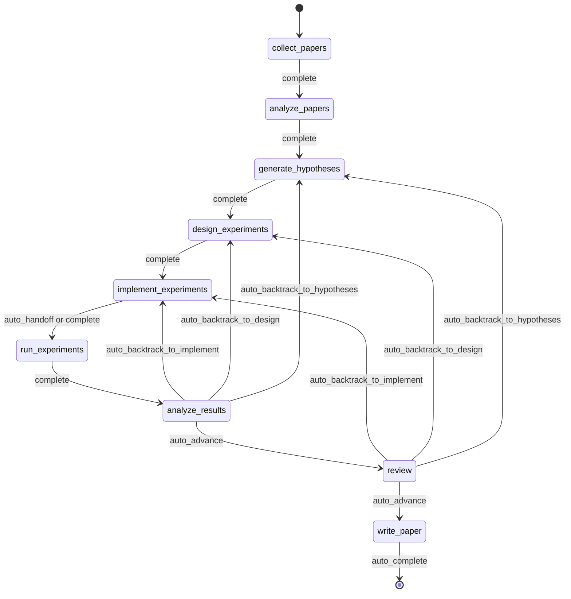
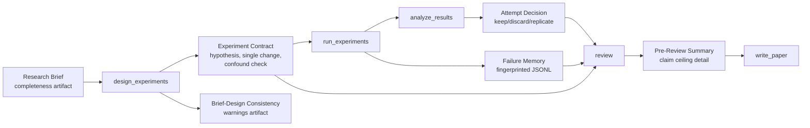
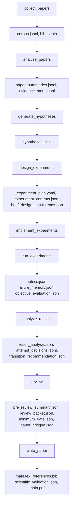
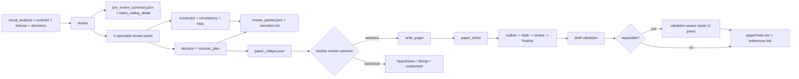
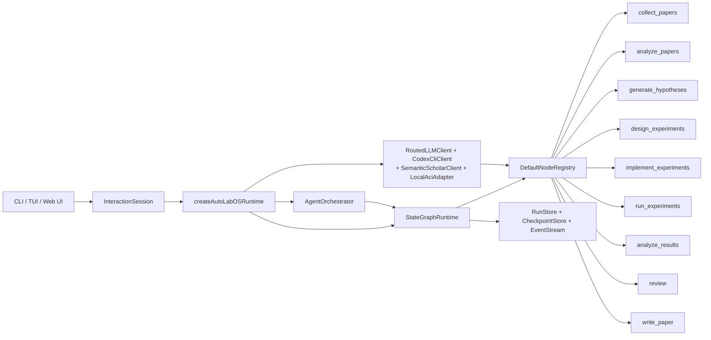

<div align="center">

  <br/>

  

  <h1>Операционная система для автономных исследований</h1>

  <p><strong>Автономное выполнение исследований, а не просто генерация текста.</strong><br/>
  От литературы до рукописи — внутри управляемого цикла с контрольными точками и возможностью проверки.</p>

  <p>
    <a href="../README.md"><strong>English</strong></a>
    &nbsp;&middot;&nbsp;
    <a href="./README.ko.md"><strong>한국어</strong></a>
    &nbsp;&middot;&nbsp;
    <a href="./README.ja.md"><strong>日本語</strong></a>
    &nbsp;&middot;&nbsp;
    <a href="./README.zh-CN.md"><strong>简体中文</strong></a>
    &nbsp;&middot;&nbsp;
    <a href="./README.zh-TW.md"><strong>繁體中文</strong></a>
    &nbsp;&middot;&nbsp;
    <a href="./README.es.md"><strong>Español</strong></a>
    &nbsp;&middot;&nbsp;
    <a href="./README.fr.md"><strong>Français</strong></a>
    &nbsp;&middot;&nbsp;
    <a href="./README.de.md"><strong>Deutsch</strong></a>
    &nbsp;&middot;&nbsp;
    <a href="./README.pt.md"><strong>Português</strong></a>
    &nbsp;&middot;&nbsp;
    <a href="./README.ru.md"><strong>Русский</strong></a>
  </p>

  <p><sub>Локализованные README являются поддерживаемыми переводами этого документа. Для нормативных формулировок и последних изменений используйте английский README как каноническую ссылку.</sub></p>

  <!-- CI & Quality -->
  <p>
    <a href="https://github.com/lhy0718/AutoLabOS/actions/workflows/ci.yml">
      
    </a>
    <a href="https://github.com/lhy0718/AutoLabOS/actions/workflows/smoke.yml">
      
    </a>
    
  </p>

  <!-- Tech stack -->
  <p>
    
    
    
  </p>

  <!-- Core features -->
  <p>
    
    
    
    
  </p>

  <!-- Integrations -->
  <p>
    
    
    
    
  </p>

  <!-- Community -->
  <p>
    <a href="https://github.com/lhy0718/AutoLabOS/stargazers">
      
    </a>
    <a href="https://github.com/lhy0718/AutoLabOS/commits/main">
      
    </a>
  </p>

</div>

---

Большинство инструментов, претендующих на автоматизацию исследований, на деле автоматизируют **генерацию текста**. Они выдают гладкие на вид результаты на основе поверхностных рассуждений, без управления экспериментами, без отслеживания доказательств и без честного учёта того, что доказательства действительно подтверждают.

AutoLabOS занимает другую позицию: **трудная часть исследования — не написание текста, а дисциплина между вопросом и черновиком.** Опора на литературу, проверка гипотез, управление экспериментами, отслеживание неудач, ограничение утверждений и контрольные шлюзы рецензирования — всё это происходит внутри фиксированного графа состояний из 9 узлов. Каждый узел создаёт проверяемые артефакты. Каждый переход сохраняется в контрольной точке. У каждого утверждения есть потолок доказательств.

Результат — это не просто статья. Это управляемое состояние исследования, которое можно проверять, возобновлять и защищать.

> **Сначала доказательства. Потом утверждения.**
>
> **Запуски, которые можно проверять, возобновлять и защищать.**
>
> **Исследовательская операционная система, а не набор промптов.**
>
> **Ваша лаборатория не должна повторять один и тот же провалившийся эксперимент дважды.**
>
> **Рецензирование — это структурный шлюз, а не полировка текста.**

---

## Что вы получаете после запуска

AutoLabOS создаёт не просто PDF. Он создаёт полное, прослеживаемое состояние исследования:

| Результат | Содержание |
|---|---|
| **Корпус литературы** | Собранные статьи, BibTeX, извлечённое хранилище доказательств |
| **Гипотезы** | Гипотезы, основанные на литературе, со скептической рецензией |
| **План эксперимента** | Управляемый дизайн с контрактом, фиксацией базовой линии и проверками согласованности |
| **Результаты выполнения** | Метрики, объективная оценка, журнал памяти неудач |
| **Анализ результатов** | Статистический анализ, решения по попыткам, обоснование переходов |
| **Пакет рецензирования** | Табель оценок панели из 5 специалистов, потолок утверждений, критика перед черновиком |
| **Рукопись** | Черновик LaTeX со ссылками на доказательства, научной валидацией, опциональным PDF |
| **Контрольные точки** | Полные снимки состояния на каждой границе узла — возобновление в любой момент |

Всё хранится в `.autolabos/runs/<run_id>/`, а публичные результаты зеркалируются в `outputs/`.

---

## Почему AutoLabOS?

Большинство AI-инструментов для исследований оптимизируют **внешний вид результата**. AutoLabOS оптимизирует **управляемое выполнение**.

| | Типичные инструменты исследований | AutoLabOS |
|---|---|---|
| Рабочий процесс | Неограниченный дрейф агента | Фиксированный граф из 9 узлов с ограниченными переходами |
| Дизайн эксперимента | Неструктурированный | Контракты с правилом единственного изменения, детекция конфаундеров |
| Неудачные эксперименты | Забываются и повторяются | Отпечатаны в памяти неудач, никогда не повторяются |
| Утверждения | Настолько сильные, насколько сгенерирует LLM | Ограничены потолком утверждений, привязанным к реальным доказательствам |
| Рецензирование | Необязательный этап доработки | Структурный шлюз — блокирует написание при недостаточности доказательств |
| Оценка статьи | Единичная проверка LLM «выглядит хорошо» | Двухслойный шлюз: детерминированный минимум + LLM-оценщик качества |
| Состояние | Эфемерное | С контрольными точками, возобновляемое, инспектируемое |

---

## Быстрый старт

```bash
# 1. Установка и сборка
npm install && npm run build && npm link

# 2. Перейдите в рабочее пространство исследования
cd /path/to/your-research-project

# 3. Запуск (выберите один)
autolabos web    # Браузерный UI — онбординг, дашборд, браузер артефактов
autolabos        # Терминальный рабочий процесс с slash-командами
```

> **Первый запуск?** Оба интерфейса проведут вас через онбординг, если `.autolabos/config.yaml` ещё не существует.

### Предварительные требования

| Элемент | Когда необходим | Примечания |
|---|---|---|
| `SEMANTIC_SCHOLAR_API_KEY` | Всегда | Поиск и метаданные статей |
| `OPENAI_API_KEY` | Когда провайдер — `api` | Выполнение моделей через OpenAI API |
| Вход в Codex CLI | Когда провайдер — `codex` | Используется ваша локальная сессия Codex |

---

## 9-узловой рабочий процесс

Фиксированный граф. Не рекомендация — контракт.



`collect_papers` → `analyze_papers` → `generate_hypotheses` → `design_experiments` → `implement_experiments` → `run_experiments` → `analyze_results` → `review` → `write_paper`

Откат встроен. Если результаты слабые, граф направляет обратно к гипотезам или дизайну — а не вперёд к необоснованному написанию. Вся автоматизация работает внутри ограниченных внутриузловых циклов.

---

## Ключевые свойства

### Управление экспериментами

Каждый запуск эксперимента проходит через структурированный контракт:

- **Экспериментальный контракт** — фиксирует гипотезу, каузальный механизм, правило единственного изменения, условие прерывания и критерии сохранения/отбрасывания
- **Детекция конфаундеров** — обнаруживает конъюнктивные изменения, списочные интервенции и несоответствия механизм-изменение
- **Согласованность брифа и дизайна** — предупреждает, когда дизайн отклоняется от исходного исследовательского брифа
- **Фиксация базовой линии** — контракт сравнения замораживает объективную метрику и базовую линию перед выполнением

### Принудительный потолок утверждений

Система не позволяет утверждениям опережать доказательства.

Узел `review` создаёт `pre_review_summary`, содержащий **наиболее сильное защитимое утверждение**, список **заблокированных более сильных утверждений** с причинами и **пробелы в доказательствах**, которые необходимо заполнить для их разблокировки. Этот потолок напрямую передаётся в генерацию рукописи.

### Память неудач

JSONL в рамках запуска, который записывает и дедуплицирует паттерны неудач:

- **Отпечатки ошибок** — удаляет временные метки, пути и числа для стабильной кластеризации
- **Остановка эквивалентных неудач** — 3+ идентичных отпечатка немедленно исчерпывают повторные попытки
- **Маркеры запрета повтора** — структурные сбои блокируют повторное выполнение до изменения дизайна

Ваша лаборатория учится на собственных неудачах в рамках одного запуска.

### Двухслойная оценка статьи

Готовность статьи — это не единичное суждение LLM.

- **Слой 1 — Детерминированный минимальный шлюз**: 7 проверок наличия артефактов, которые категорически блокируют недостаточно обоснованную работу от входа в `write_paper`. Без участия LLM. Прошёл или не прошёл.
- **Слой 2 — LLM-оценщик качества статьи**: Структурированная критика по 6 измерениям — значимость результатов, строгость методологии, сила доказательств, структура изложения, обоснованность утверждений и честность в описании ограничений. Выдаёт блокирующие проблемы, неблокирующие проблемы и классификацию типа рукописи.

Если доказательств недостаточно, система рекомендует откат — а не полировку.

### Панель из 5 специалистов-рецензентов

Узел `review` запускает пять независимых специализированных проходов:

1. **Верификатор утверждений** — проверяет утверждения по доказательствам
2. **Рецензент методологии** — валидирует экспериментальный дизайн
3. **Рецензент статистики** — оценивает количественную строгость
4. **Рецензент готовности текста** — проверяет ясность и полноту
5. **Рецензент целостности** — выявляет предвзятость и конфликты

Панель создаёт табель оценок, оценку согласованности и решение шлюза.

---

## Двойной интерфейс

Два UI-поверхности, один рантайм. Одинаковые артефакты, рабочий процесс и контрольные точки.

| | TUI | Web Ops UI |
|---|---|---|
| Запуск | `autolabos` | `autolabos web` |
| Взаимодействие | Slash-команды, естественный язык | Браузерный дашборд, композер |
| Отображение процесса | Прогресс узлов в реальном времени в терминале | Визуальный граф из 9 узлов с действиями |
| Артефакты | Просмотр через CLI | Встроенный предпросмотр (текст, изображения, PDF) |
| Оптимально для | Быстрая итерация, скриптинг | Визуальный мониторинг, просмотр артефактов |

---

## Режимы выполнения

AutoLabOS сохраняет 9-узловой рабочий процесс и все защитные шлюзы во всех режимах.

| Режим | Команда | Поведение |
|---|---|---|
| **Интерактивный** | `autolabos` | TUI со slash-командами и явными шлюзами утверждения |
| **Минимальное утверждение** | Конфигурация: `approval_mode: minimal` | Автоматически утверждает безопасные переходы |
| **Ночной** | `/agent overnight [run]` | Автономный однопроходный запуск, лимит 24 часа, консервативный откат |
| **Автономный** | `/agent autonomous [run]` | Открытое исследовательское исследование, без ограничения по времени |

### Автономный режим

Спроектирован для продолжительных циклов гипотеза → эксперимент → анализ с минимальным вмешательством. Запускает два параллельных внутренних цикла:

1. **Исследовательский поиск** — генерация гипотез, проектирование/выполнение экспериментов, анализ, вывод следующей гипотезы
2. **Улучшение качества статьи** — определение наиболее сильной ветки, ужесточение базовых линий, укрепление связи с доказательствами

Останавливается при: явной команде пользователя, достижении лимита ресурсов, обнаружении стагнации или катастрофическом сбое. **Не** останавливается только потому, что один эксперимент дал отрицательный результат или качество статьи временно застыло.

---

## Система исследовательских брифов

Каждый запуск начинается со структурированного Markdown-брифа, определяющего объём, ограничения и правила управления.

```bash
/new                        # Создать бриф
/brief start --latest       # Валидировать, сделать снимок, извлечь, запустить
```

Брифы содержат **основные** разделы (тема, объективная метрика) и **управленческие** разделы (целевое сравнение, минимальные доказательства, запрещённые упрощения, потолок статьи). AutoLabOS оценивает полноту брифа и предупреждает, когда покрытие управления недостаточно для работы масштаба статьи.

<details>
<summary><strong>Разделы и оценки брифа</strong></summary>

| Раздел | Статус | Назначение |
|---|---|---|
| `## Topic` | Обязательный | Исследовательский вопрос в 1–3 предложениях |
| `## Objective Metric` | Обязательный | Основная метрика успеха |
| `## Constraints` | Рекомендуемый | Вычислительный бюджет, ограничения данных, правила воспроизводимости |
| `## Plan` | Рекомендуемый | Пошаговый план эксперимента |
| `## Target Comparison` | Управление | Предлагаемый метод vs. явная базовая линия |
| `## Minimum Acceptable Evidence` | Управление | Минимальный размер эффекта, количество фолдов, граница решения |
| `## Disallowed Shortcuts` | Управление | Упрощения, которые делают результаты невалидными |
| `## Paper Ceiling If Evidence Remains Weak` | Управление | Максимальная классификация статьи при слабых доказательствах |
| `## Manuscript Format` | Необязательный | Количество колонок, бюджет страниц, правила ссылок/приложений |

| Оценка | Значение | Готовность к масштабу статьи? |
|---|---|---|
| `complete` | Основные + 4+ управленческих раздела с содержанием | Да |
| `partial` | Основные завершены + 2+ управленческих | Продолжение с предупреждениями |
| `minimal` | Только основные разделы | Нет |

</details>

---

## Поток управленческих артефактов



---

## Поток артефактов

Каждый узел создаёт структурированные, инспектируемые артефакты.



<details>
<summary><strong>Публичный пакет результатов</strong></summary>

```
outputs/
  ├── paper/           # Исходники TeX, PDF, ссылки, лог сборки
  ├── experiment/      # Сводка базовой линии, код эксперимента
  ├── analysis/        # Таблица результатов, анализ доказательств
  ├── review/          # Критика статьи, решение шлюза
  ├── results/         # Компактные количественные сводки
  ├── reproduce/       # Скрипты воспроизведения, README
  ├── manifest.json    # Реестр разделов
  └── README.md        # Человекочитаемая сводка запуска
```

</details>

---

## Архитектура узлов

| Узел | Роли | Что делает |
|---|---|---|
| `collect_papers` | сборщик, куратор | Находит и курирует набор статей-кандидатов через Semantic Scholar |
| `analyze_papers` | читатель, экстрактор доказательств | Извлекает резюме и доказательства из отобранных статей |
| `generate_hypotheses` | агент гипотез + скептический рецензент | Синтезирует идеи из литературы, затем подвергает их критическому давлению |
| `design_experiments` | дизайнер + панель осуществимости/статистики/операций | Фильтрует планы по реализуемости, составляет экспериментальный контракт |
| `implement_experiments` | реализатор | Создаёт код и изменения рабочего пространства через ACI-действия |
| `run_experiments` | исполнитель + триажёр неудач + планировщик перезапусков | Управляет выполнением, записывает неудачи, решает о перезапуске |
| `analyze_results` | аналитик + аудитор метрик + детектор конфаундеров | Проверяет надёжность результатов, записывает решения по попыткам |
| `review` | панель из 5 специалистов + потолок утверждений + двухслойный шлюз | Структурное рецензирование — блокирует написание при недостаточности доказательств |
| `write_paper` | автор статьи + критика рецензента | Составляет рукопись, проводит критику после черновика, собирает PDF |

<details>
<summary><strong>Графы связей по фазам</strong></summary>

**Поиск и чтение**

```mermaid
flowchart LR
    Topic["run topic + collect constraints"] --> CP["collect_papers"]
    CP --> CC["collector_curator"]
    CC --> SS["Semantic Scholar search"]
    SS --> Enrich["enrichment + BibTeX recovery"]
    Enrich --> Corpus["corpus.jsonl + bibtex.bib"]
    Corpus --> AP["analyze_papers"]
    AP --> Select["selection request + hybrid rerank"]
    Select --> Manifest["analysis_manifest resume / prune"]
    Manifest --> RE["reader_evidence_extractor"]
    RE --> Pdf["local text/image analysis or Responses API PDF"]
    Pdf --> ReviewLoop["extractor -> reviewer normalization"]
    ReviewLoop --> Evidence["paper_summaries.jsonl + evidence_store.jsonl"]
```



**Гипотезы и дизайн эксперимента**

```mermaid
flowchart LR
    Evidence["paper_summaries.jsonl + evidence_store.jsonl"] --> GH["generate_hypotheses"]
    GH --> HA["hypothesis_agent"]
    HA --> Axes["evidence synthesizer -> evidence axes"]
    Axes --> ToT["ToT branch expansion"]
    ToT --> Drafts["mechanism / contradiction / intervention drafts"]
    Drafts --> Reviews["skeptical reviewer"]
    Reviews --> Select["diversity + evidence-quality top-k selection"]
    Select --> Hyp["hypotheses.jsonl + axes/reviews/llm_trace"]
    Hyp --> DE["design_experiments"]
    DE --> ED["experiment_designer"]
    ED --> Profiles["constraint profile + objective metric profile"]
    Profiles --> Plans["design candidates"]
    Plans --> Panel["designer + feasibility + statistical + ops-capacity panel"]
    Panel --> Choice["panel selection"]
    Choice --> Contract["experiment_contract.json + brief_design_consistency.json"]
```



**Реализация, выполнение и цикл результатов**

```mermaid
flowchart LR
    PlanYaml["experiment_plan.yaml"] --> IE["implement_experiments"]
    IE --> IM["ImplementSessionManager"]
    IM --> Impl["implementer"]
    IM --> Codex["Codex CLI session"]
    Codex --> VerifyPatch["local verification"]
    VerifyPatch --> Handoff{"auto handoff?"}
    Handoff -->|yes| RX["run_experiments"]
    Handoff -->|no| Gate["approval boundary"]
    Gate --> RX
    RX --> Runner["runner"]
    Runner --> FailCheck["failure memory: check do-not-retry"]
    FailCheck --> ACI["ACI preflight/tests/command"]
    ACI --> Triage["failure triager + rerun planner"]
    Triage -->|retry once if transient| ACI
    ACI --> FailRecord["record to failure_memory.jsonl"]
    ACI --> Metrics["metrics.json + supplemental runs"]
    Metrics --> AR["analyze_results"]
    AR --> ResultPanel["metric auditor + robustness + confounder + calibrator"]
    ResultPanel --> AttemptDec["attempt_decisions.jsonl"]
    ResultPanel --> Synth["transition recommendation"]
    Synth -->|advance| RV["review"]
    Synth -->|backtrack| IE
```



**Рецензирование, написание и представление**



</details>

---

## Ограниченная автоматизация

Каждая внутренняя автоматизация имеет явное ограничение.

| Узел | Внутренняя автоматизация | Ограничение |
|---|---|---|
| `analyze_papers` | Автоматическое расширение окна доказательств при нехватке | Не более 2 расширений |
| `design_experiments` | Детерминированная оценка панелью + экспериментальный контракт | Один раз на дизайн |
| `run_experiments` | Триаж неудач + однократный перезапуск при транзиентной ошибке | Структурные сбои никогда не перезапускаются |
| `run_experiments` | Отпечатки неудач в памяти | 3+ идентичных отпечатка → исчерпание повторов |
| `analyze_results` | Повторное сопоставление метрик + калибровка панелью результатов | Одно повторное сопоставление до паузы |
| `write_paper` | Поиск связанных работ + восстановление с учётом валидации | Максимум 1 проход восстановления |

---

## Основные команды

| Команда | Описание |
|---|---|
| `/new` | Создать исследовательский бриф |
| `/brief start <path\|--latest>` | Начать исследование из брифа |
| `/runs [query]` | Список или поиск запусков |
| `/resume <run>` | Возобновить запуск |
| `/agent run <node> [run]` | Выполнить с определённого узла графа |
| `/agent status [run]` | Показать статусы узлов |
| `/agent overnight [run]` | Автономный запуск (лимит 24 часа) |
| `/agent autonomous [run]` | Открытое автономное исследование |
| `/model` | Переключить модель и уровень рассуждения |
| `/doctor` | Диагностика окружения + рабочего пространства |

<details>
<summary><strong>Полный список команд</strong></summary>

| Команда | Описание |
|---|---|
| `/help` | Показать список команд |
| `/new` | Создать файл исследовательского брифа |
| `/brief start <path\|--latest>` | Начать исследование из файла брифа |
| `/doctor` | Диагностика окружения + рабочего пространства |
| `/runs [query]` | Список или поиск запусков |
| `/run <run>` | Выбрать запуск |
| `/resume <run>` | Возобновить запуск |
| `/agent list` | Список узлов графа |
| `/agent run <node> [run]` | Выполнить с узла |
| `/agent status [run]` | Показать статусы узлов |
| `/agent collect [query] [options]` | Собрать статьи |
| `/agent recollect <n> [run]` | Собрать дополнительные статьи |
| `/agent focus <node>` | Переместить фокус с безопасным прыжком |
| `/agent graph [run]` | Показать состояние графа |
| `/agent resume [run] [checkpoint]` | Возобновить из контрольной точки |
| `/agent retry [node] [run]` | Повторить узел |
| `/agent jump <node> [run] [--force]` | Прыжок к узлу |
| `/agent overnight [run]` | Ночная автономия (24ч) |
| `/agent autonomous [run]` | Открытое автономное исследование |
| `/model` | Выбор модели и рассуждения |
| `/approve` | Утвердить приостановленный узел |
| `/retry` | Повторить текущий узел |
| `/settings` | Настройки провайдера и модели |
| `/quit` | Выход |

</details>

<details>
<summary><strong>Опции и примеры сбора</strong></summary>

```
--limit <n>          --last-years <n>      --year <spec>
--date-range <s:e>   --sort <relevance|citationCount|publicationDate>
--order <asc|desc>   --min-citations <n>   --open-access
--field <csv>        --venue <csv>         --type <csv>
--bibtex <generated|s2|hybrid>             --dry-run
--additional <n>     --run <run_id>
```

```bash
/agent collect --last-years 5 --sort relevance --limit 100
/agent collect "agent planning" --sort citationCount --min-citations 100
/agent collect --additional 200 --run <run_id>
```

</details>

---

## Web Ops UI

`autolabos web` запускает локальный браузерный UI по адресу `http://127.0.0.1:4317`.

- **Онбординг** — та же настройка, что и в TUI, записывает `.autolabos/config.yaml`
- **Дашборд** — поиск запусков, 9-узловое отображение процесса, действия над узлами, живые логи
- **Артефакты** — просмотр запусков, встроенный предпросмотр текста/изображений/PDF
- **Композер** — slash-команды и естественный язык с пошаговым управлением планом

```bash
autolabos web                              # Порт по умолчанию 4317
autolabos web --host 0.0.0.0 --port 8080  # Пользовательская привязка
```

---

## Философия

AutoLabOS построен вокруг нескольких жёстких ограничений:

- **Завершение рабочего процесса ≠ готовность статьи.** Запуск может пройти весь граф, но результат при этом может не быть пригодным для публикации. Система отслеживает это различие.
- **Утверждения не должны превышать доказательства.** Потолок утверждений обеспечивается структурно, а не усилением промптинга.
- **Рецензирование — это шлюз, а не рекомендация.** Если доказательств недостаточно, узел `review` блокирует `write_paper` и рекомендует откат.
- **Отрицательные результаты допустимы.** Опровергнутая гипотеза — это валидный результат исследования, но он должен быть описан честно.
- **Воспроизводимость — это свойство артефактов.** Контрольные точки, экспериментальные контракты, журналы неудач и хранилища доказательств существуют для того, чтобы ход рассуждений запуска можно было проследить и оспорить.

---

## Разработка

```bash
npm install              # Установка зависимостей (включая web-подпакет)
npm run build            # Сборка TypeScript + web UI
npm test                 # Запуск всех юнит-тестов (931+)
npm run test:watch       # Режим наблюдения

# Отдельный тестовый файл
npx vitest run tests/<name>.test.ts

# Smoke-тесты
npm run test:smoke:all                      # Полный локальный smoke-пакет
npm run test:smoke:natural-collect          # NL сбор -> ожидающая команда
npm run test:smoke:natural-collect-execute  # NL сбор -> выполнение -> проверка
npm run test:smoke:ci                       # CI smoke-набор
```

<details>
<summary><strong>Переменные окружения smoke-тестов</strong></summary>

```bash
AUTOLABOS_FAKE_CODEX_RESPONSE=1              # Избежать реальных вызовов Codex
AUTOLABOS_FAKE_SEMANTIC_SCHOLAR_RESPONSE=1   # Избежать реальных вызовов S2
AUTOLABOS_SMOKE_VERBOSE=1                    # Полный вывод PTY-логов
AUTOLABOS_SMOKE_MODE=<mode>                  # Выбор CI-режима
```

</details>

<details>
<summary><strong>Внутренние компоненты рантайма</strong></summary>

### Политики графа состояний

- Контрольные точки: `.autolabos/runs/<run_id>/checkpoints/` — фазы: `before | after | fail | jump | retry`
- Политика повторов: `maxAttemptsPerNode = 3`
- Автоматический откат: `maxAutoRollbacksPerNode = 2`
- Режимы прыжков: `safe` (текущий или предыдущий) / `force` (вперёд, пропущенные узлы записываются)

### Паттерны рантайма агентов

- **ReAct** цикл: `PLAN_CREATED → TOOL_CALLED → OBS_RECEIVED`
- **ReWOO** разделение (planner/worker): используется для дорогостоящих узлов
- **ToT** (Tree-of-Thoughts): используется в узлах гипотез и дизайна
- **Reflexion**: эпизоды неудач сохраняются и повторно используются при повторных попытках

### Слои памяти

| Слой | Область | Формат |
|---|---|---|
| Контекстная память запуска | Ключ/значение на запуск | `run_context.jsonl` |
| Долгосрочное хранилище | Между попытками | JSONL-резюме и индекс |
| Эпизодическая память | Reflexion | Уроки неудач для повторных попыток |

### ACI-действия

`implement_experiments` и `run_experiments` выполняются через:
`read_file` · `write_file` · `apply_patch` · `run_command` · `run_tests` · `tail_logs`

</details>

<details>
<summary><strong>Диаграмма рантайма агентов</strong></summary>



</details>

---

## Документация

| Документ | Покрытие |
|---|---|
| `docs/architecture.md` | Архитектура системы и проектные решения |
| `docs/tui-live-validation.md` | Валидация TUI и подход к тестированию |
| `docs/experiment-quality-bar.md` | Стандарты выполнения экспериментов |
| `docs/paper-quality-bar.md` | Требования к качеству рукописи |
| `docs/reproducibility.md` | Гарантии воспроизводимости |
| `docs/research-brief-template.md` | Полный шаблон брифа со всеми управленческими разделами |

---

## Статус

AutoLabOS находится в активной разработке (v0.1.0). Рабочий процесс, система управления и ядро рантайма функциональны и покрыты тестами. Интерфейсы, покрытие артефактов и режимы выполнения непрерывно валидируются.

Вклад и обратная связь приветствуются — см. [Issues](https://github.com/lhy0718/AutoLabOS/issues).

---

<div align="center">
  <sub>Создано для исследователей, которые хотят, чтобы их эксперименты были управляемыми, а утверждения — защитимыми.</sub>
</div>
