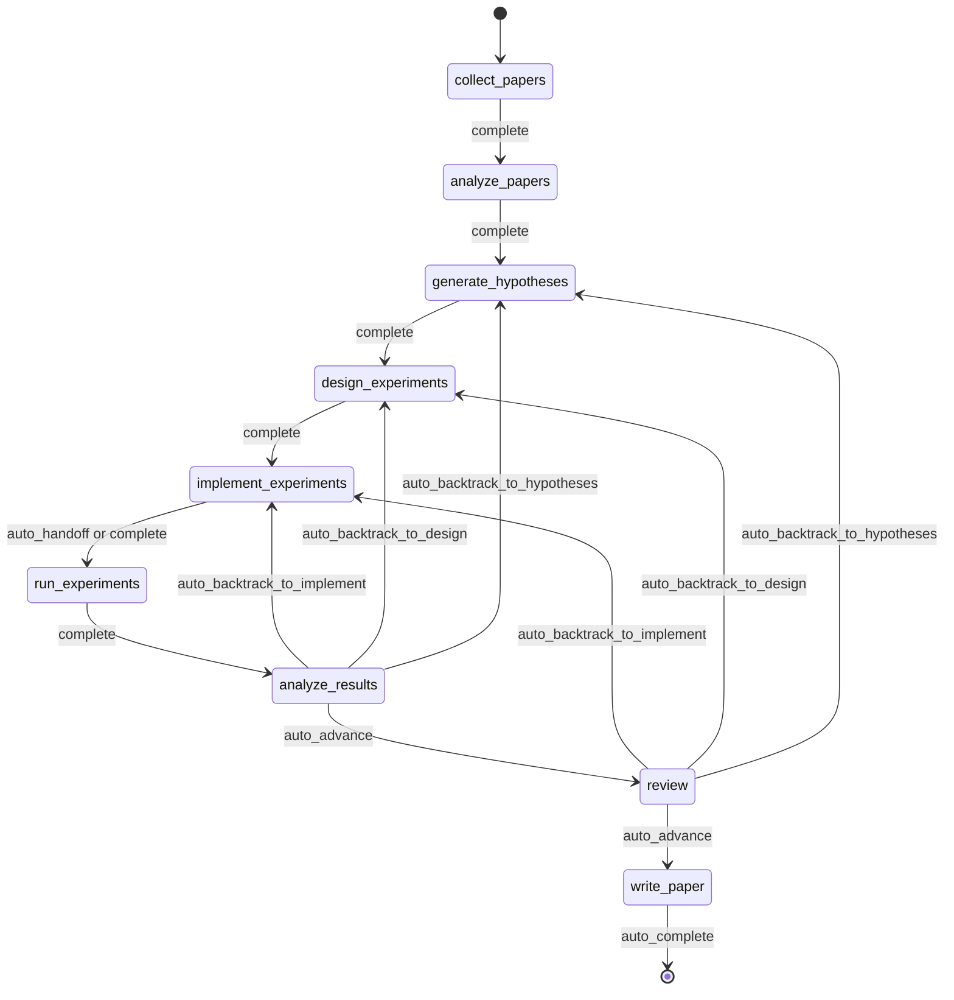
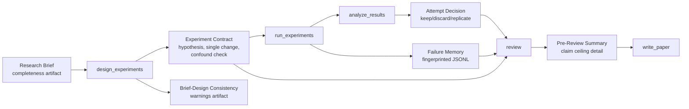
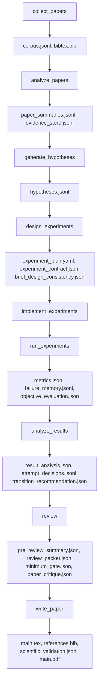
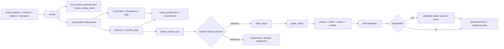
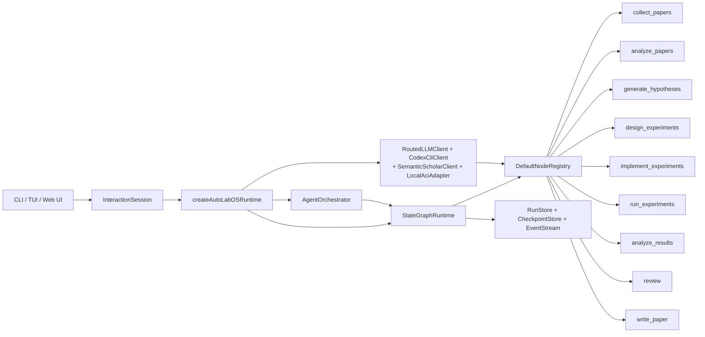

<div align="center">

  <br/>

  

  <h1>面向自主科研的操作系统</h1>

  <p><strong>不是研究文本生成，而是自主科研执行。</strong><br/>
  从文献到论文稿件，全部运行在受治理、可检查点恢复、可审计的闭环中。</p>

  <p>
    <a href="../README.md"><strong>English</strong></a>
    &nbsp;&middot;&nbsp;
    <a href="./README.ko.md"><strong>한국어</strong></a>
    &nbsp;&middot;&nbsp;
    <a href="./README.ja.md"><strong>日本語</strong></a>
    &nbsp;&middot;&nbsp;
    <a href="./README.zh-CN.md"><strong>简体中文</strong></a>
    &nbsp;&middot;&nbsp;
    <a href="./README.zh-TW.md"><strong>繁體中文</strong></a>
    &nbsp;&middot;&nbsp;
    <a href="./README.es.md"><strong>Español</strong></a>
    &nbsp;&middot;&nbsp;
    <a href="./README.fr.md"><strong>Français</strong></a>
    &nbsp;&middot;&nbsp;
    <a href="./README.de.md"><strong>Deutsch</strong></a>
    &nbsp;&middot;&nbsp;
    <a href="./README.pt.md"><strong>Português</strong></a>
    &nbsp;&middot;&nbsp;
    <a href="./README.ru.md"><strong>Русский</strong></a>
  </p>

  <p><sub>此 README 为英文 README 全量结构的翻译版。技术基准文档仍以英文 README 为准。</sub></p>

  <p>
    <a href="https://github.com/lhy0718/AutoLabOS/actions/workflows/ci.yml">
      
    </a>
    <a href="https://github.com/lhy0718/AutoLabOS/actions/workflows/smoke.yml">
      
    </a>
    
  </p>

  <p>
    
    
    
  </p>

  <p>
    
    
    
    
  </p>

  <p>
    
    
    
    
  </p>

  <p>
    <a href="https://github.com/lhy0718/AutoLabOS/stargazers">
      
    </a>
    <a href="https://github.com/lhy0718/AutoLabOS/commits/main">
      
    </a>
  </p>

</div>

---

许多声称要自动化科研的工具，实际上自动化的只是 **文本生成**。它们可以产出看起来很 polished 的内容，但没有实验治理、没有证据追踪，也没有对“证据到底支持到什么程度”进行诚实约束。

AutoLabOS 采取了不同立场。**科研真正困难的部分不是写作，而是问题与草稿之间的纪律。** 文献扎根、假设检验、实验治理、失败追踪、主张上限和评审闸门，全部发生在固定的 9 节点状态图之内。每个节点都会产出可审计的工件。每次状态迁移都会被 checkpoint。每个主张都有证据上限。

输出不只是论文，而是一个可检查、可恢复、可辩护的受治理科研状态。

> **证据优先，主张其次。**
>
> **能够被检查、恢复和辩护的运行。**
>
> **这是科研操作系统，而不是提示词包。**
>
> **你的实验室不该把同一个失败实验做两次。**
>
> **评审是结构性闸门，不是润色环节。**

---

## 一次运行后你会得到什么

AutoLabOS 不只是生成 PDF。它会生成完整且可追踪的科研状态。

| 输出 | 包含内容 |
|---|---|
| **文献语料** | 收集到的论文、BibTeX、抽取后的证据存储 |
| **假设** | 基于文献的假设与怀疑式评审 |
| **实验计划** | 带契约、基线锁定和一致性检查的受治理设计 |
| **执行结果** | 指标、客观评估、失败记忆日志 |
| **结果分析** | 统计分析、尝试决策、状态迁移推理 |
| **评审包** | 5 位专家评分卡、主张上限、起草前批评 |
| **论文稿件** | 带证据链接、科学验证和可选 PDF 的 LaTeX 草稿 |
| **检查点** | 每个节点边界的完整状态快照，可随时恢复 |

所有内容都存放在 `.autolabos/runs/<run_id>/` 下，对外输出镜像到 `outputs/`。

---

## 为什么是 AutoLabOS

大多数 AI 科研工具优化的是 **输出表面效果**。AutoLabOS 优化的是 **受治理的执行过程**。

| | 常见科研工具 | AutoLabOS |
|---|---|---|
| 工作流 | 开放式 agent 漂移 | 受限状态迁移的固定 9 节点图 |
| 实验设计 | 非结构化 | 带单变量变更约束和混杂检测的契约 |
| 失败实验 | 被遗忘后再次尝试 | 写入失败记忆并指纹化，不再重复 |
| 主张 | LLM 能写多强就有多强 | 被实际证据绑定的主张上限所约束 |
| 评审 | 可选的清理步骤 | 结构性闸门，证据不足就阻止写作 |
| 论文评估 | 单个 LLM 的“看起来不错” | 双层闸门: 确定性最低门槛 + LLM 质量评估 |
| 状态 | 短暂 | 可 checkpoint、可恢复、可检查 |

---

## 快速开始

```bash
# 1. 安装并构建
npm install && npm run build && npm link

# 2. 进入你的研究工作区
cd /path/to/your-research-project

# 3. 启动（二选一）
autolabos web    # 浏览器 UI：onboarding、dashboard、artifact browser
autolabos        # 终端优先的 slash-command 工作流
```

> **第一次运行？** 如果还没有 `.autolabos/config.yaml`，两个 UI 都会引导你完成 onboarding。

### 前置要求

| 项目 | 何时需要 | 说明 |
|---|---|---|
| `SEMANTIC_SCHOLAR_API_KEY` | 始终 | 论文发现与元数据获取 |
| `OPENAI_API_KEY` | 当 provider 或 PDF mode 为 `api` | OpenAI API 模型执行 |
| Codex CLI 登录 | 当 provider 或 PDF mode 为 `codex` | 使用本地 Codex 会话 |

---

## 9 节点工作流

固定图，不是建议，而是契约。



`collect_papers` → `analyze_papers` → `generate_hypotheses` → `design_experiments` → `implement_experiments` → `run_experiments` → `analyze_results` → `review` → `write_paper`

系统内建回退机制。如果结果薄弱，图会回到假设或设计阶段，而不是继续往“乐观写作”方向推进。所有自动化都只发生在边界清晰的节点内部循环中。

---

## 核心属性

### 实验治理

每次实验执行都必须经过结构化契约。

- **实验契约**：锁定假设、因果机制、单变量变更规则、中止条件以及保留/丢弃标准
- **混杂检测**：捕捉组合式修改、列表式干预与机制-变更不一致
- **简报-设计一致性**：当设计偏离原始 research brief 时发出警告
- **基线锁定**：执行前冻结客观指标与 baseline

### 主张上限约束

系统不允许主张跑到证据前面去。

`review` 节点会生成 `pre_review_summary`，其中包含 **当前最可辩护的最强主张**、带原因的 **被阻止的更强主张列表**，以及解锁这些主张所需补足的 **证据缺口**。这个上限会直接流入论文生成过程。

### 失败记忆

使用 run 级 JSONL 记录并去重失败模式。

- **错误指纹化**：移除时间戳、路径和数字，以便稳定聚类
- **等价失败停止**：相同指纹出现 3 次以上时立即耗尽重试
- **禁止重试标记**：结构性失败在设计改变之前不允许重跑

你的实验室会在单次运行内部从自身失败中学习。

### 双层论文评估

论文准备度不是单个 LLM 的主观判断。

- **第一层，确定性最低门槛**：7 项工件存在性检查，直接阻止证据不足的工作进入 `write_paper`。不依赖 LLM。结果只有通过或失败。
- **第二层，LLM 论文质量评估器**：从 6 个维度给出结构化批评，包括结果重要性、方法严谨性、证据强度、写作结构、主张支持度和对局限性的诚实程度。输出阻塞问题、非阻塞问题和稿件类型分类。

当证据不足时，系统会建议回退，而不是继续润色。

### 5 位专家评审面板

`review` 节点会运行五个独立的专家视角。

1. **主张核查者**：核对主张与证据
2. **方法论评审者**：验证实验设计
3. **统计评审者**：评估定量严谨性
4. **写作准备度评审者**：检查清晰度和完整性
5. **完整性评审者**：识别偏差与冲突

该面板输出评分卡、一致性评估和闸门决策。

---

## 双界面

两个 UI 表面，一个运行时。共享同一套工件、同一套工作流、同一套检查点。

| | TUI | Web Ops UI |
|---|---|---|
| 启动 | `autolabos` | `autolabos web` |
| 交互 | slash commands、自然语言 | 浏览器 dashboard、composer |
| 工作流视图 | 终端中的实时节点进度 | 可操作的 9 节点可视图 |
| 工件 | CLI 检查 | 文本、图片、PDF 内联预览 |
| 适用场景 | 快速迭代、脚本化 | 可视监控、工件浏览 |

---

## 执行模式

AutoLabOS 在所有模式下都保留 9 节点工作流与全部安全闸门。

| 模式 | 命令 | 行为 |
|---|---|---|
| **Interactive** | `autolabos` | 带显式批准闸门的 slash-command TUI |
| **Minimal approval** | 配置：`approval_mode: minimal` | 自动批准安全迁移 |
| **Overnight** | `/agent overnight [run]` | 无人单次执行，24 小时限制，保守回退 |
| **Autonomous** | `/agent autonomous [run]` | 开放式科研探索，无时间限制 |

### Autonomous 模式

为在最少人工干预下持续执行“假设 → 实验 → 分析”循环而设计。内部运行两条并行循环：

1. **科研探索**：生成假设、设计/运行实验、分析结果、提出下一条假设
2. **论文质量提升**：识别最强分支、强化 baseline、加强证据映射

停止条件包括：明确的用户停止、资源限制、停滞检测或灾难性失败。仅仅因为某一次实验是负结果，或者论文质量暂时没有提升，**不会停止**。

---

## Research Brief 系统

每次运行都从一个结构化 Markdown brief 开始，它定义范围、约束与治理规则。

```bash
/new                        # 创建 brief
/brief start --latest       # 校验、快照、抽取、启动
```

brief 同时包含 **核心** 部分（主题、客观指标）和 **治理** 部分（目标比较、最低证据、禁止捷径、论文上限）。AutoLabOS 会对 brief 完整度打分，并在治理覆盖不足以支撑论文级工作时给出警告。

<details>
<summary><strong>Brief 章节与分级</strong></summary>

| 章节 | 状态 | 目的 |
|---|---|---|
| `## Topic` | 必需 | 用 1-3 句话给出研究问题 |
| `## Objective Metric` | 必需 | 主要成功指标 |
| `## Constraints` | 推荐 | 计算预算、数据集限制、复现规则 |
| `## Plan` | 推荐 | 分步实验计划 |
| `## Target Comparison` | 治理 | 提出的方法与明确 baseline 的比较 |
| `## Minimum Acceptable Evidence` | 治理 | 最小效应量、fold 数、决策边界 |
| `## Disallowed Shortcuts` | 治理 | 会使结果失效的捷径 |
| `## Paper Ceiling If Evidence Remains Weak` | 治理 | 证据偏弱时允许的最高论文级别 |
| `## Manuscript Format` | 可选 | 栏数、页数预算、参考文献/附录规则 |

| 等级 | 含义 | 是否达到论文级准备 |
|---|---|---|
| `complete` | 核心 + 4 个以上实质性治理章节 | 是 |
| `partial` | 核心完整 + 2 个以上治理章节 | 带警告继续 |
| `minimal` | 只有核心章节 | 否 |

</details>

---

## 治理工件流



---

## 工件流

每个节点都会产出结构化、可检查的工件。



<details>
<summary><strong>公开输出包</strong></summary>

```
outputs/<title-slug>-<run_id_prefix>/
  ├── paper/           # TeX 源文件、PDF、参考文献、构建日志
  ├── experiment/      # baseline 摘要、实验代码
  ├── analysis/        # 结果表、证据分析
  ├── review/          # 论文批评、闸门决策
  ├── results/         # 紧凑定量摘要
  ├── reproduce/       # 复现脚本、README
  ├── manifest.json    # 章节注册表
  └── README.md        # 面向人的运行摘要
```

</details>

---

## 节点架构

| 节点 | 角色 | 作用 |
|---|---|---|
| `collect_papers` | collector, curator | 通过 Semantic Scholar 发现并整理候选论文集 |
| `analyze_papers` | reader, evidence extractor | 从所选论文中抽取摘要与证据 |
| `generate_hypotheses` | hypothesis agent + skeptical reviewer | 从文献综合想法，再进行怀疑式压力测试 |
| `design_experiments` | designer + feasibility/statistical/ops panel | 按可行性筛选方案，写出实验契约 |
| `implement_experiments` | implementer | 通过 ACI actions 产出代码与工作区变更 |
| `run_experiments` | runner + failure triager + rerun planner | 驱动执行、记录失败、决定是否重跑 |
| `analyze_results` | analyst + metric auditor + confounder detector | 检查结果可靠性，写出尝试决策 |
| `review` | 5-specialist panel + claim ceiling + two-layer gate | 结构性评审，证据不足就阻止写作 |
| `write_paper` | paper writer + reviewer critique | 起草论文、运行草稿后批评、构建 PDF |

<details>
<summary><strong>分阶段连接图</strong></summary>

**发现与阅读**

```mermaid
flowchart LR
    Topic["run topic + collect constraints"] --> CP["collect_papers"]
    CP --> CC["collector_curator"]
    CC --> SS["Semantic Scholar search"]
    SS --> Enrich["enrichment + BibTeX recovery"]
    Enrich --> Corpus["corpus.jsonl + bibtex.bib"]
    Corpus --> AP["analyze_papers"]
    AP --> Select["selection request + hybrid rerank"]
    Select --> Manifest["analysis_manifest resume / prune"]
    Manifest --> RE["reader_evidence_extractor"]
    RE --> Pdf["local text/image analysis or Responses API PDF"]
    Pdf --> ReviewLoop["extractor -> reviewer normalization"]
    ReviewLoop --> Evidence["paper_summaries.jsonl + evidence_store.jsonl"]
```



**假设与实验设计**

```mermaid
flowchart LR
    Evidence["paper_summaries.jsonl + evidence_store.jsonl"] --> GH["generate_hypotheses"]
    GH --> HA["hypothesis_agent"]
    HA --> Axes["evidence synthesizer -> evidence axes"]
    Axes --> ToT["ToT branch expansion"]
    ToT --> Drafts["mechanism / contradiction / intervention drafts"]
    Drafts --> Reviews["skeptical reviewer"]
    Reviews --> Select["diversity + evidence-quality top-k selection"]
    Select --> Hyp["hypotheses.jsonl + axes/reviews/llm_trace"]
    Hyp --> DE["design_experiments"]
    DE --> ED["experiment_designer"]
    ED --> Profiles["constraint profile + objective metric profile"]
    Profiles --> Plans["design candidates"]
    Plans --> Panel["designer + feasibility + statistical + ops-capacity panel"]
    Panel --> Choice["panel selection"]
    Choice --> Contract["experiment_contract.json + brief_design_consistency.json"]
```



**实现、执行与结果循环**

```mermaid
flowchart LR
    PlanYaml["experiment_plan.yaml"] --> IE["implement_experiments"]
    IE --> IM["ImplementSessionManager"]
    IM --> Impl["implementer"]
    IM --> Codex["Codex CLI session"]
    Codex --> VerifyPatch["local verification"]
    VerifyPatch --> Handoff{"auto handoff?"}
    Handoff -->|yes| RX["run_experiments"]
    Handoff -->|no| Gate["approval boundary"]
    Gate --> RX
    RX --> Runner["runner"]
    Runner --> FailCheck["failure memory: check do-not-retry"]
    FailCheck --> ACI["ACI preflight/tests/command"]
    ACI --> Triage["failure triager + rerun planner"]
    Triage -->|retry once if transient| ACI
    ACI --> FailRecord["record to failure_memory.jsonl"]
    ACI --> Metrics["metrics.json + supplemental runs"]
    Metrics --> AR["analyze_results"]
    AR --> ResultPanel["metric auditor + robustness + confounder + calibrator"]
    ResultPanel --> AttemptDec["attempt_decisions.jsonl"]
    ResultPanel --> Synth["transition recommendation"]
    Synth -->|advance| RV["review"]
    Synth -->|backtrack| IE
```



**评审、写作与对外呈现**



</details>

---

## 有边界的自动化

每个内部自动化都有显式上限。

| 节点 | 内部自动化 | 上限 |
|---|---|---|
| `analyze_papers` | 证据过稀时自动扩展证据窗口 | 最多 2 次 |
| `design_experiments` | 确定性 panel 评分 + 实验契约 | 每个设计运行 1 次 |
| `run_experiments` | 失败分诊 + 一次性瞬时错误重跑 | 结构性失败绝不重试 |
| `run_experiments` | 失败记忆指纹化 | 同一指纹 3 次以上即耗尽重试 |
| `analyze_results` | 客观重匹配 + 结果 panel 校准 | 人工暂停前 1 次 |
| `write_paper` | 相关工作 scout + 验证感知修复 | 最多 1 次修复 |

---

## 常用命令

| 命令 | 说明 |
|---|---|
| `/new` | 创建 research brief |
| `/brief start <path\|--latest>` | 从 brief 启动研究 |
| `/runs [query]` | 列出或搜索 runs |
| `/resume <run>` | 恢复 run |
| `/agent run <node> [run]` | 从图节点执行 |
| `/agent status [run]` | 显示节点状态 |
| `/agent overnight [run]` | 无人运行（24 小时限制） |
| `/agent autonomous [run]` | 开放式自主研究 |
| `/model` | 切换模型与推理强度 |
| `/doctor` | 环境 + 工作区诊断 |

<details>
<summary><strong>完整命令列表</strong></summary>

| 命令 | 说明 |
|---|---|
| `/help` | 显示命令列表 |
| `/new` | 创建 research brief 文件 |
| `/brief start <path\|--latest>` | 从 brief 文件启动研究 |
| `/doctor` | 环境 + 工作区诊断 |
| `/runs [query]` | 列出或搜索 runs |
| `/run <run>` | 选择 run |
| `/resume <run>` | 恢复 run |
| `/agent list` | 列出图节点 |
| `/agent run <node> [run]` | 从节点执行 |
| `/agent status [run]` | 显示节点状态 |
| `/agent collect [query] [options]` | 收集论文 |
| `/agent recollect <n> [run]` | 追加收集论文 |
| `/agent focus <node>` | 安全跳转焦点 |
| `/agent graph [run]` | 显示图状态 |
| `/agent resume [run] [checkpoint]` | 从 checkpoint 恢复 |
| `/agent retry [node] [run]` | 重试节点 |
| `/agent jump <node> [run] [--force]` | 跳转节点 |
| `/agent overnight [run]` | overnight 自主运行（24 小时） |
| `/agent autonomous [run]` | 开放式自主研究 |
| `/model` | 模型与推理选择器 |
| `/approve` | 批准暂停节点 |
| `/retry` | 重试当前节点 |
| `/settings` | provider 和 model 设置 |
| `/quit` | 退出 |

</details>

<details>
<summary><strong>收集选项与示例</strong></summary>

```
--limit <n>          --last-years <n>      --year <spec>
--date-range <s:e>   --sort <relevance|citationCount|publicationDate>
--order <asc|desc>   --min-citations <n>   --open-access
--field <csv>        --venue <csv>         --type <csv>
--bibtex <generated|s2|hybrid>             --dry-run
--additional <n>     --run <run_id>
```

```bash
/agent collect --last-years 5 --sort relevance --limit 100
/agent collect "agent planning" --sort citationCount --min-citations 100
/agent collect --additional 200 --run <run_id>
```

</details>

---

## Web Ops UI

`autolabos web` 会在 `http://127.0.0.1:4317` 启动本地浏览器 UI。

- **Onboarding**：与 TUI 相同，写入 `.autolabos/config.yaml`
- **Dashboard**：run 搜索、9 节点工作流视图、节点动作、实时日志
- **Artifacts**：浏览 runs，内联预览文本、图片和 PDF
- **Composer**：支持 slash commands 和自然语言，并提供分步计划控制

```bash
autolabos web                              # 默认端口 4317
autolabos web --host 0.0.0.0 --port 8080  # 自定义绑定
```

---

## 哲学

AutoLabOS 围绕几个硬约束构建。

- **工作流完成 ≠ 论文已准备好。** 一个 run 可以跑完整张图，但输出未必达到论文级。系统会明确区分两者。
- **主张不能超过证据。** 主张上限不是通过“更用力 prompt”实现，而是通过结构强制。
- **评审是闸门，不是建议。** 如果证据不足，`review` 节点会阻止 `write_paper` 并建议回退。
- **负结果是允许的。** 失败的假设也可以是有效科研结果，但必须诚实表述。
- **可复现性是工件属性。** 检查点、实验契约、失败日志和证据存储存在的目的，就是让一次运行的推理过程可以被追溯和质疑。

---

## 开发

```bash
npm install              # 安装依赖（也安装 web 子包）
npm run build            # 构建 TypeScript + web UI
npm test                 # 运行全部单元测试（931+）
npm run test:watch       # watch 模式

# 单个测试文件
npx vitest run tests/<name>.test.ts

# Smoke tests
npm run test:smoke:all
npm run test:smoke:natural-collect
npm run test:smoke:natural-collect-execute
npm run test:smoke:ci
```

<details>
<summary><strong>Smoke test 环境变量</strong></summary>

```bash
AUTOLABOS_FAKE_CODEX_RESPONSE=1
AUTOLABOS_FAKE_SEMANTIC_SCHOLAR_RESPONSE=1
AUTOLABOS_SMOKE_VERBOSE=1
AUTOLABOS_SMOKE_MODE=<mode>
```

</details>

<details>
<summary><strong>运行时内部</strong></summary>

### 状态图策略

- 检查点：`.autolabos/runs/<run_id>/checkpoints/`，阶段为 `before | after | fail | jump | retry`
- 重试策略：`maxAttemptsPerNode = 3`
- 自动回滚：`maxAutoRollbacksPerNode = 2`
- 跳转模式：`safe`（当前或之前）/ `force`（向前跳转并记录被跳过节点）

### Agent 运行时模式

- **ReAct** 循环：`PLAN_CREATED → TOOL_CALLED → OBS_RECEIVED`
- **ReWOO** 分离（planner/worker）：用于高成本节点
- **ToT**：用于假设与设计节点
- **Reflexion**：保存失败 episode，并在重试时复用

### 记忆层

| 层 | 范围 | 格式 |
|---|---|---|
| Run context memory | 每个 run 的 key/value | `run_context.jsonl` |
| Long-term store | 跨尝试 | JSONL 摘要与索引 |
| Episode memory | Reflexion | 用于重试的失败经验 |

### ACI 动作

`implement_experiments` 和 `run_experiments` 通过以下动作执行：
`read_file` · `write_file` · `apply_patch` · `run_command` · `run_tests` · `tail_logs`

</details>

<details>
<summary><strong>Agent 运行时图</strong></summary>



</details>

---

## 文档

| 文档 | 覆盖内容 |
|---|---|
| `docs/architecture.md` | 系统架构与设计决策 |
| `docs/tui-live-validation.md` | TUI 验证与测试方法 |
| `docs/experiment-quality-bar.md` | 实验执行标准 |
| `docs/paper-quality-bar.md` | 论文稿件质量要求 |
| `docs/reproducibility.md` | 可复现性保证 |
| `docs/research-brief-template.md` | 含全部治理章节的完整 brief 模板 |

---

## 状态

AutoLabOS 仍在积极开发中（v0.1.0）。工作流、治理系统和核心运行时已经可用并有测试覆盖。界面、工件覆盖范围和执行模式仍在持续验证。

欢迎贡献和反馈，请参见 [Issues](https://github.com/lhy0718/AutoLabOS/issues)。

---

<div align="center">
  <sub>为那些希望实验受治理、主张可辩护的研究者而构建。</sub>
</div>
