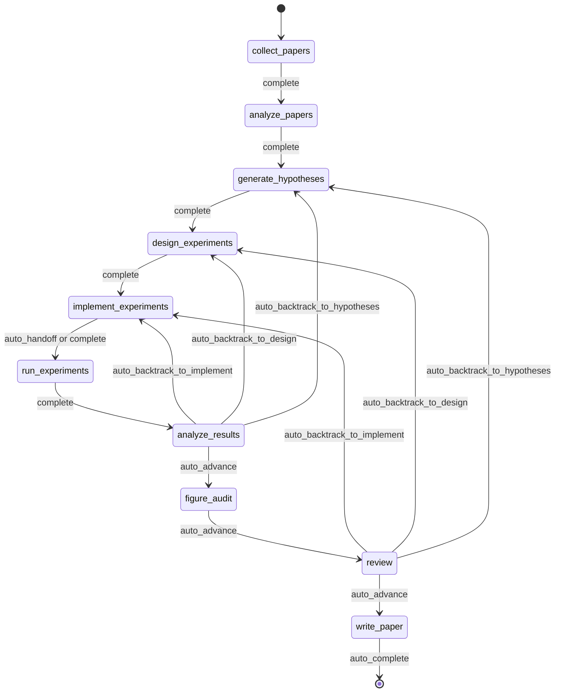
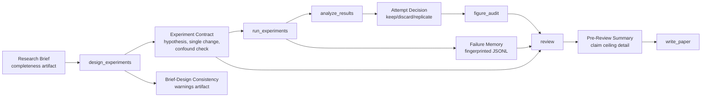
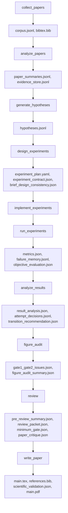

<div align="center">

  <br/>

  

  <h1>面向自主研究的操作系统</h1>

  <p><strong>不是研究生成，而是自主研究执行。</strong><br/>
  从 brief 到 manuscript，以 governed、checkpointed、inspectable 的方式运行研究。</p>

  <p>
    <a href="../README.md"><strong>English</strong></a>
    &nbsp;&middot;&nbsp;
    <a href="./README.ko.md"><strong>한국어</strong></a>
    &nbsp;&middot;&nbsp;
    <a href="./README.ja.md"><strong>日本語</strong></a>
    &nbsp;&middot;&nbsp;
    <a href="./README.zh-CN.md"><strong>简体中文</strong></a>
    &nbsp;&middot;&nbsp;
    <a href="./README.zh-TW.md"><strong>繁體中文</strong></a>
    &nbsp;&middot;&nbsp;
    <a href="./README.es.md"><strong>Español</strong></a>
    &nbsp;&middot;&nbsp;
    <a href="./README.fr.md"><strong>Français</strong></a>
    &nbsp;&middot;&nbsp;
    <a href="./README.de.md"><strong>Deutsch</strong></a>
    &nbsp;&middot;&nbsp;
    <a href="./README.pt.md"><strong>Português</strong></a>
    &nbsp;&middot;&nbsp;
    <a href="./README.ru.md"><strong>Русский</strong></a>
  </p>

  <p><sub>各语言 README 都是依据此文维护的翻译版本。规范表述和最新更新以 English README 为 canonical reference。</sub></p>

  <p>
    <a href="https://github.com/lhy0718/AutoLabOS/actions/workflows/ci.yml">
      
    </a>
    <a href="https://github.com/lhy0718/AutoLabOS/actions/workflows/smoke.yml">
      
    </a>
    
  </p>

  <p>
    
    
    
  </p>

  <p>
    
    
    
    
  </p>

</div>

---

AutoLabOS 是一个面向 governed research execution 的操作系统。它把一次 run 视为可 checkpoint 的研究状态，而不是一次性的生成过程。

整个核心循环都是可检查的。文献收集、假设形成、实验设计、实现、执行、分析、figure audit、review、原稿撰写都会留下可审计的 artifacts。主张会被限制在 claim ceiling 之下，保持 evidence-bounded。review 不是润色步骤，而是 structural gate。

质量假设会被转成显式 checks。系统更重视真实行为，而不是 prompt 层面的表面效果。可复现性通过 artifacts、checkpoints 和 inspectable transitions 来保证。

---

## 为什么需要 AutoLabOS

很多 research-agent 系统更偏向于生成文本。AutoLabOS 更偏向于执行一个受治理的研究过程。

当一个项目需要的不只是看起来像样的草稿时，这种差异就很重要。

- 作为执行契约的 research brief
- 明确的 workflow gate，而不是 agent 自由漂移
- 可事后检查的 checkpoints 与 artifacts
- 能在 manuscript generation 前阻止薄弱工作的 review
- 避免盲目重复失败实验的 failure memory
- 不是 prose 超过数据，而是 evidence-bounded claims

AutoLabOS 面向那些希望获得自主性，但又不愿放弃 auditability、backtracking 和 validation 的团队。

---

## 一次 run 会发生什么

一次 governed run 会始终遵循同样的研究路径。

`Brief.md` → literature → hypothesis → experiment design → implementation → execution → analysis → figure audit → review → manuscript

实际过程大致如下：

1. `/new` 创建或打开 research brief
2. `/brief start --latest` 校验 brief，将其 snapshot 到 run 中，然后启动 governed run
3. 系统沿固定 workflow 前进，并在每个边界写入 state 与 artifacts checkpoint
4. 如果 evidence 不足，系统会选择 backtracking 或 downgrade，而不是自动润色文本
5. 只有通过 review gate 后，`write_paper` 才会基于 bounded evidence 生成原稿

历史上的 9-node contract 仍然是架构基线。当前 runtime 在 `analyze_results` 与 `review` 之间加入了 `figure_audit`，这样 figure quality critique 可以独立 checkpoint 与 resume。



这条路径中的所有自动化都被限制在 bounded node-internal loops 中。即使在无人值守模式下，workflow 本身也保持 governed。

---

## 一次 run 之后会得到什么

AutoLabOS 不只是产出 PDF。它会留下一个可追踪的研究状态。

| 输出 | 包含内容 |
|---|---|
| **文献 corpus** | 收集的 papers、BibTeX、提取出的 evidence store |
| **假设** | 基于文献的 hypotheses 与 skeptical review |
| **实验计划** | 包含 contract、baseline lock 和一致性检查的 governed design |
| **执行结果** | metrics、objective evaluation、failure memory log |
| **结果分析** | 统计分析、attempt decision、transition reasoning |
| **Figure audit** | figure lint、caption/reference consistency、可选 vision critique summary |
| **Review packet** | 5 人 specialist panel scorecard、claim ceiling、draft 前 critique |
| **原稿** | 包含 evidence links、scientific validation、可选 PDF 的 LaTeX draft |
| **Checkpoints** | 每个 node 边界的完整 state snapshot，可随时 resume |

所有内容都存放在 `.autolabos/runs/<run_id>/` 下，public-facing output 会镜像到 `outputs/`。

这就是它的可复现性模型：不是依赖隐藏状态，而是依赖 artifacts、checkpoints 和 inspectable transitions。

---

## Quick Start

```bash
# 1. 安装并构建
npm install
npm run build
npm link

# 2. 进入研究工作区
cd /path/to/your-research-workspace

# 3. 启动一个界面
autolabos        # TUI
autolabos web    # Web UI
```

第一次使用时常见流程：

```bash
/new
/brief start --latest
/doctor
```

注意：

- 如果 `.autolabos/config.yaml` 不存在，两种 UI 都会引导 onboarding
- 不要直接在仓库根目录运行，应该使用 `test/` 或你自己的研究 workspace
- TUI 和 Web UI 共享同一个 runtime、同一组 artifacts 和 checkpoints

### 前置条件

| 项目 | 何时需要 | 说明 |
|---|---|---|
| `SEMANTIC_SCHOLAR_API_KEY` | 始终需要 | 用于 paper discovery 与 metadata |
| `OPENAI_API_KEY` | provider 为 `api` 时 | 用于 OpenAI API model 执行 |
| Codex CLI login | provider 为 `codex` 时 | 使用本地 Codex session |

---

## Research Brief 系统

Brief 不只是启动文档。它是 run 的 governed contract。

`/new` 会创建或打开 `Brief.md`。`/brief start --latest` 会校验它，将其 snapshot 到 run 中，再基于这个 snapshot 开始执行。run 会记录 brief source path、snapshot path，以及解析出的 manuscript format（如果有）。即使 workspace 的 brief 后续发生变化，该 run 的 provenance 仍然可检查。

也就是说，brief 不是 prompt 的一部分，而是 audit trail 的一部分。

在当前契约里，`.autolabos/config.yaml` 主要保存 provider/runtime 默认值和 workspace policy。每个 run 的研究意图、evidence 门槛、baseline 预期、manuscript format 目标以及 manuscript template 路径，原则上应放在 Brief 中。因此，持久化后的 config 可能会省略 `research` 默认值以及部分 manuscript-profile / paper-template 字段。

```bash
/new
/brief start --latest
```

Brief 需要同时覆盖研究意图和治理约束，例如：topic、objective metric、baseline 或 comparator、minimum acceptable evidence、disallowed shortcuts，以及当 evidence 不足时允许的 paper ceiling。

<details>
<summary><strong>Brief 章节与 grading</strong></summary>

| 章节 | 状态 | 目的 |
|---|---|---|
| `## Topic` | 必需 | 用 1-3 句话定义研究问题 |
| `## Objective Metric` | 必需 | 主要成功指标 |
| `## Constraints` | 推荐 | compute budget、dataset 限制、reproducibility 规则 |
| `## Plan` | 推荐 | 分步骤实验计划 |
| `## Target Comparison` | Governance | 提案方法与显式 baseline 的比较 |
| `## Minimum Acceptable Evidence` | Governance | 最小 effect size、fold count、decision boundary |
| `## Disallowed Shortcuts` | Governance | 会使结果失效的 shortcuts |
| `## Paper Ceiling If Evidence Remains Weak` | Governance | evidence 较弱时允许的最高 paper classification |
| `## Manuscript Format` | 可选 | 栏数、页数 budget、references / appendix 规则 |

| 等级 | 含义 | 是否 paper-scale ready |
|---|---|---|
| `complete` | core + 4 个以上实质性 governance 章节 | 是 |
| `partial` | core 完整 + 2 个以上 governance 章节 | 带警告继续 |
| `minimal` | 只有 core 章节 | 否 |

</details>

---

## 两个界面，一个 runtime

AutoLabOS 在同一个 governed runtime 之上提供两个前端。

| | TUI | Web UI |
|---|---|---|
| 启动 | `autolabos` | `autolabos web` |
| 交互 | slash commands、自然语言 | 浏览器 dashboard 与 composer |
| Workflow 视图 | 终端中的实时 node progress | 带 actions 的 governed workflow graph |
| Artifacts | CLI inspection | 文本、图片、PDF 的 inline preview |
| 运营 surface | `/watch`, `/queue`, `/explore`, `/doctor` | jobs queue、live watch card、exploration status、diagnostics |
| 适用场景 | 快速迭代与直接控制 | 可视化监控与 artifact 浏览 |

关键点在于，两种界面看到的是同一组 checkpoints、同一组 runs 和同一份底层 artifacts。

---

## AutoLabOS 的不同之处

AutoLabOS 的核心不是 prompt-only orchestration，而是 governed execution。

| | 常见研究工具 | AutoLabOS |
|---|---|---|
| Workflow | 开放式 agent 漂移 | 带显式 review 边界的 governed fixed graph |
| State | 短暂的 | checkpointed、resumable、inspectable |
| Claims | 模型能生成多强就写多强 | 受 evidence 与 claim ceiling 限制 |
| Review | 可选 cleanup pass | 可以阻止继续写作的 structural gate |
| Failures | 被遗忘后再试一次 | 以 fingerprint 形式写入 failure memory |
| Validation | 次要 | `/doctor`、harness、smoke、live validation 都是 first-class |
| Interfaces | 不同代码路径 | TUI 与 Web 共用一个 runtime |

因此，这个系统更适合被理解为 research infrastructure，而不是 paper generator。

---

## 核心保证

### Governed Workflow

workflow 是 bounded 且 auditable 的。backtracking 是 contract 的一部分。无法支持继续前进的结果，会被送回 hypotheses、design 或 implementation，而不是被直接包装成更强的 prose。

### Checkpointed Research State

每个 node 边界都会写入可 inspection、可 resume 的 state。进展单位不只是文本输出，而是带有 artifacts、transitions 与可恢复 state 的 run。

### Claim Ceiling

claims 会被限制在 strongest defensible evidence ceiling 之下。系统会记录被阻止的更强 claims，以及解锁它们所需的 evidence gap。

### Review As A Structural Gate

`review` 不是 cosmetic cleanup。它是在 manuscript generation 之前检查 readiness、方法论 sanity、evidence linkage、writing discipline 与 reproducibility handoff 的 structural gate。

### Failure Memory

failure fingerprint 会被持久化，因此结构性错误和重复出现的 equivalent failure 不会被盲目重试。

### Reproducibility Through Artifacts

可复现性通过 artifacts、checkpoints 和 inspectable transitions 来保障。public-facing summary 也以 persisted run output 为准，而不是再创造第二套 truth source。

---

## Validation 与 Harness 导向的质量模型

AutoLabOS 把 validation surface 当作 first-class。

- `/doctor` 会在 run 开始前检查 environment 和 workspace readiness
- harness validation 会保护 workflow、artifact 和 governance contract
- targeted smoke checks 提供诊断性的回归覆盖
- 当 interactive behavior 重要时，使用 live validation

paper readiness 不是单一 prompt 的感性判断。

- **Layer 1 - deterministic minimum gate** 通过显式 artifact / evidence-integrity checks 阻止 under-evidenced work 继续前进
- **Layer 2 - LLM paper-quality evaluator** 对 methodology、evidence strength、writing structure、claim support、limitations honesty 做结构化批评
- **Review packet + specialist panel** 决定 manuscript path 应该 advance、revise 还是 backtrack

`paper_readiness.json` 中可能包含 `overall_score`。它应该被理解为系统内部的 run-quality signal，而不是通用的 scientific benchmark。一些更高级的 evaluation / self-improvement path 会用它来比较不同 run 或 prompt mutation 候选。

<details>
<summary><strong>为什么这个 validation 模型重要</strong></summary>

质量假设会被转成显式 checks。系统看重的不是 prompt 层面的表面效果，而是真实行为。目标不是“模型写得看起来可信”，而是“这个 run 可以被 inspection 并被 defend”。

</details>

---

## 高级 Self-Improvement 能力

AutoLabOS 具备 bounded self-improvement path，但这不是 blind autonomous rewriting，而是由 validation 与 rollback 约束的改进路径。

### `autolabos meta-harness`

`autolabos meta-harness` 会基于 recent completed runs 和 evaluation history，在 `outputs/meta-harness/<timestamp>/` 下构建 context directory。

其中可以包括：

- 过滤后的 run events
- `result_analysis.json`、`review/decision.json` 等 node artifacts
- `paper_readiness.json`
- `outputs/eval-harness/history.jsonl`
- 针对目标 node 的当前 `node-prompts/` 文件

LLM 通过 `TASK.md` 被限制为只返回 `TARGET_FILE + unified diff`，并且 target 被限定在 `node-prompts/` 内。apply mode 下候选变更必须通过 `validate:harness`；否则会 rollback 并写入 audit log。`--no-apply` 只构建 context，`--dry-run` 只展示 diff 而不改文件。

### `autolabos evolve`

`autolabos evolve` 会围绕 `.codex` 与 `node-prompts` 执行一个 bounded mutation-and-evaluation loop。

- 支持 `--max-cycles`、`--target skills|prompts|all`、`--dry-run`
- 从 `paper_readiness.overall_score` 读取 run fitness
- 对 prompts 与 skills 做 mutation，运行 validation，并比较不同 cycle 的 fitness
- 当出现 regression 时，用最后一个 good git tag 恢复 `.codex` 与 `node-prompts`

这是一个 self-improvement path，但不是无限制的 repo-wide rewrite path。

### Harness Preset Layer

AutoLabOS 还提供 `base`、`compact`、`failure-aware`、`review-heavy` 等 built-in harness preset。它们会调整 artifact/context policy、failure-memory emphasis、prompt policy 和 compression strategy，用于 comparative evaluation，但不会改变 governed production workflow 本身。

---

## 常用命令

| 命令 | 说明 |
|---|---|
| `/new` | 创建或打开 `Brief.md` |
| `/brief start <path\|--latest>` | 从 brief 启动研究 |
| `/runs [query]` | 列出或搜索 runs |
| `/resume <run>` | 恢复 run |
| `/agent run <node> [run]` | 从 graph node 开始执行 |
| `/agent status [run]` | 显示 node 状态 |
| `/agent overnight [run]` | 在保守边界内执行无人值守 run |
| `/agent autonomous [run]` | 执行 bounded research exploration |
| `/watch` | 查看 active runs 与 background jobs 的 live watch 视图 |
| `/explore` | 显示当前 run 的 exploration-engine 状态 |
| `/queue` | 显示 running / waiting / stalled jobs |
| `/doctor` | environment 与 workspace diagnostics |
| `/model` | 切换 model 与 reasoning effort |

<details>
<summary><strong>完整命令列表</strong></summary>

| 命令 | 说明 |
|---|---|
| `/help` | 显示命令列表 |
| `/new` | 创建或打开 workspace `Brief.md` |
| `/brief start <path\|--latest>` | 从 workspace `Brief.md` 或指定 brief 启动研究 |
| `/doctor` | environment + workspace diagnostics |
| `/runs [query]` | 列出或搜索 runs |
| `/run <run>` | 选择 run |
| `/resume <run>` | 恢复 run |
| `/agent list` | 列出 graph nodes |
| `/agent run <node> [run]` | 从 node 执行 |
| `/agent status [run]` | 显示 node 状态 |
| `/agent collect [query] [options]` | 收集 papers |
| `/agent recollect <n> [run]` | 追加收集 papers |
| `/agent focus <node>` | 使用 safe jump 切换 focus |
| `/agent graph [run]` | 显示 graph state |
| `/agent resume [run] [checkpoint]` | 从 checkpoint 恢复 |
| `/agent retry [node] [run]` | 重试 node |
| `/agent jump <node> [run] [--force]` | 跳转 node |
| `/agent overnight [run]` | overnight autonomy (24h) |
| `/agent autonomous [run]` | open-ended autonomous research |
| `/model` | model 与 reasoning selector |
| `/approve` | 批准暂停的 node |
| `/queue` | 显示 running / waiting / stalled jobs |
| `/watch` | 查看 active run 的 live watch |
| `/explore` | 显示 exploration-engine 状态 |
| `/retry` | 重试当前 node |
| `/settings` | provider 与 model 设置 |
| `/quit` | 退出 |

</details>

---

## 适合谁 / 不适合谁

### 适合

- 希望获得自主性，同时又需要 governed workflow 的团队
- checkpoint 与 artifact 很重要的 research engineering 工作
- 需要 evidence discipline 的 paper-scale 或 paper-adjacent 项目
- generation 之外，同样重视 review、traceability、resumability 的环境

### 不适合

- 只想快速得到 one-shot draft 的用户
- 不需要 artifact trail 或 review gate 的 workflow
- 比起 governed execution 更想要 free-form agent behavior 的项目
- 只需要简单 literature summary tool 的场景

---

## 开发

```bash
npm install
npm run build
npm test
npm run test:web
npm run validate:harness
```

请为改动选择能诚实覆盖范围的最小 validation set。对于 interactive defect，如果环境允许，不应只依赖 tests，还应重新跑一遍相同的 TUI / Web flow。

常用命令：

```bash
npm run test:watch
npm run test:smoke:natural-collect
npm run test:smoke:natural-collect-execute
npm run test:smoke:all
```

---

## Advanced Details

<details>
<summary><strong>执行模式</strong></summary>

AutoLabOS 在所有模式下都保持 governed workflow 与 safety gates。

| 模式 | 命令 | 行为 |
|---|---|---|
| **Interactive** | `autolabos` | 带显式 approval gate 的 slash-command TUI |
| **Minimal approval** | 配置: `approval_mode: minimal` | 自动批准安全转移 |
| **Hybrid approval** | 配置: `approval_mode: hybrid` | 强且低风险的转移自动前进，风险高或低置信的转移暂停 |
| **Overnight** | `/agent overnight [run]` | 无人值守单次执行，24 小时限制，保守 backtracking |
| **Autonomous** | `/agent autonomous [run]` | open-ended bounded research exploration |

</details>

<details>
<summary><strong>Governance artifact flow</strong></summary>



</details>

<details>
<summary><strong>Artifact flow</strong></summary>



</details>

<details>
<summary><strong>Node architecture</strong></summary>

| Node | 角色 | 作用 |
|---|---|---|
| `collect_papers` | collector, curator | 通过 Semantic Scholar 发现并筛选 candidate paper set |
| `analyze_papers` | reader, evidence extractor | 从选中的 papers 中提取 summaries 与 evidence |
| `generate_hypotheses` | hypothesis agent + skeptical reviewer | 从 literature 合成 ideas 并做 pressure-test |
| `design_experiments` | designer + feasibility/statistical/ops panel | 过滤计划的可执行性并写出 experiment contract |
| `implement_experiments` | implementer | 通过 ACI actions 生成代码与 workspace changes |
| `run_experiments` | runner + failure triager + rerun planner | 驱动 execution，记录 failures，决定 rerun |
| `analyze_results` | analyst + metric auditor + confounder detector | 检查 results 的可靠性并写入 attempt decisions |
| `figure_audit` | figure auditor + optional vision critique | 检查 evidence alignment、captions / references、publication readiness |
| `review` | 5-specialist panel + claim ceiling + two-layer gate | 执行 structural review，在 evidence 不足时阻止写作 |
| `write_paper` | paper writer + reviewer critique | 生成 manuscript，执行 post-draft critique，并构建 PDF |

</details>

<details>
<summary><strong>Bounded automation</strong></summary>

| Node | 内部自动化 | 上限 |
|---|---|---|
| `analyze_papers` | 当 evidence 太稀疏时自动扩展 evidence window | <= 2 次 |
| `design_experiments` | deterministic panel scoring + experiment contract | 每个 design 运行 1 次 |
| `run_experiments` | failure triage + 一次 transient failure 重试 | structural failure 不重试 |
| `run_experiments` | failure memory fingerprinting | >= 3 次相同失败则耗尽 retries |
| `analyze_results` | objective rematching + result panel calibration | human pause 前 1 次 rematch |
| `figure_audit` | Gate 3 figure critique + summary aggregation | vision critique 可独立 resume |
| `write_paper` | related-work scout + validation-aware repair | 最多 1 次 repair |

</details>

<details>
<summary><strong>Public output bundle</strong></summary>

```
outputs/<title-slug>-<run_id_prefix>/
  ├── paper/
  ├── experiment/
  ├── analysis/
  ├── review/
  ├── results/
  ├── reproduce/
  ├── manifest.json
  └── README.md
```

</details>

---

## 状态

AutoLabOS 是一个持续开发中的 OSS research-engineering 项目。行为与 contract 的 canonical reference 在仓库 `docs/` 目录下，尤其是：

- `docs/architecture.md`
- `docs/tui-live-validation.md`
- `docs/experiment-quality-bar.md`
- `docs/paper-quality-bar.md`
- `docs/reproducibility.md`
- `docs/research-brief-template.md`

如果你要修改 runtime behavior，请把这些文档、已发布 tests 以及 observable artifacts 视为 source of truth。
