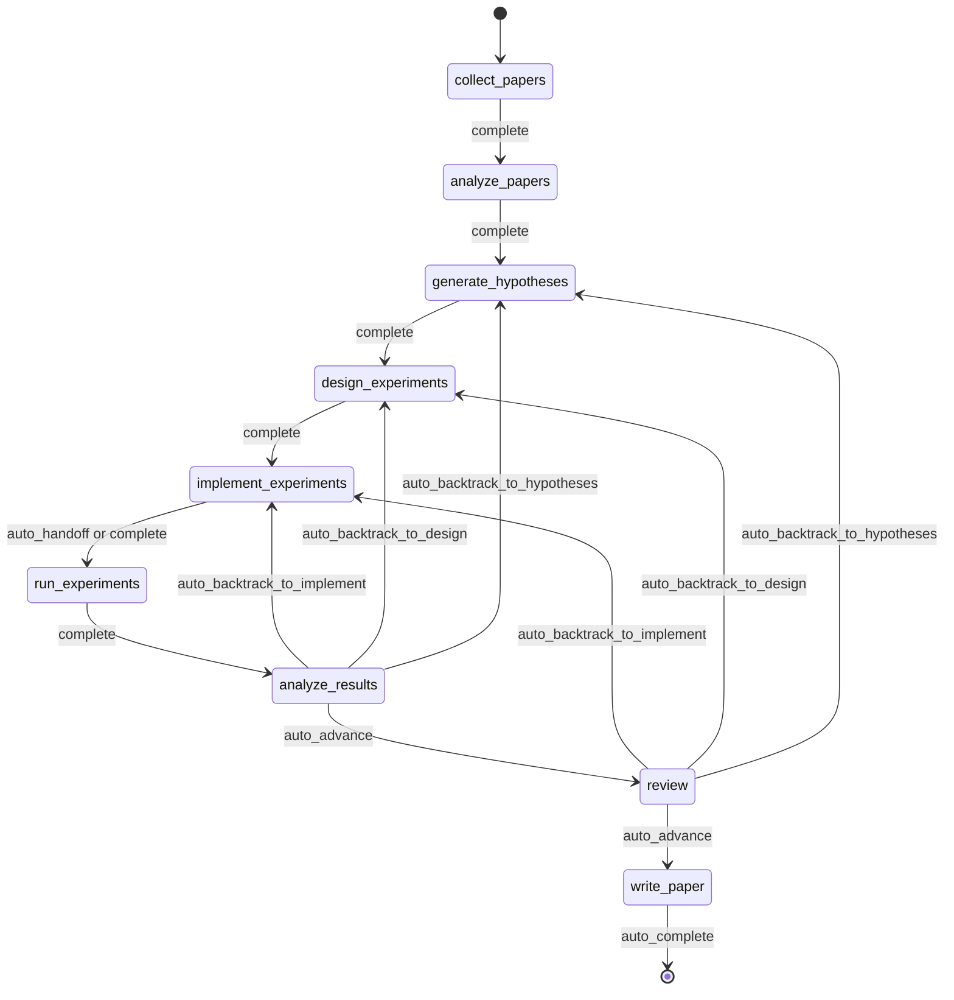
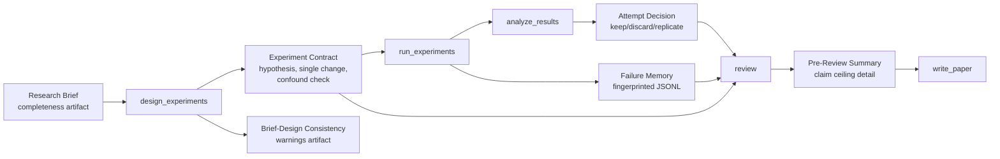
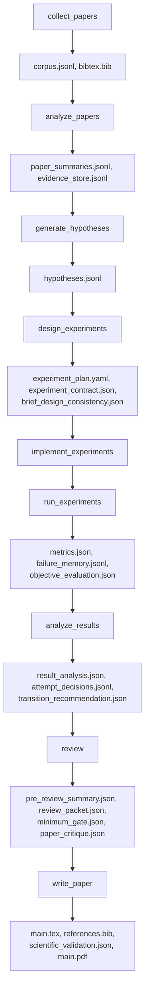
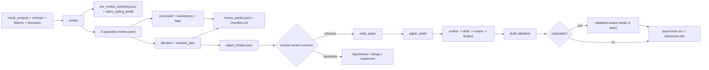
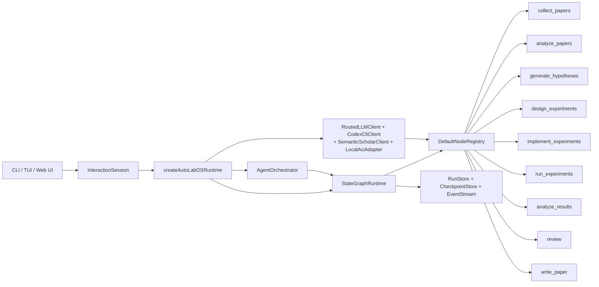

<div align="center">

  <br/>

  

  <h1>面向自主研究的作業系統</h1>

  <p><strong>不是研究內容生成，而是自主研究執行。</strong><br/>
  從文獻到論文草稿，全部都在受治理、具備檢查點、且可檢視的閉環中完成。</p>

  <p>
    <a href="../README.md"><strong>English</strong></a>
    &nbsp;&middot;&nbsp;
    <a href="./README.ko.md"><strong>한국어</strong></a>
    &nbsp;&middot;&nbsp;
    <a href="./README.ja.md"><strong>日本語</strong></a>
    &nbsp;&middot;&nbsp;
    <a href="./README.zh-CN.md"><strong>简体中文</strong></a>
    &nbsp;&middot;&nbsp;
    <a href="./README.zh-TW.md"><strong>繁體中文</strong></a>
    &nbsp;&middot;&nbsp;
    <a href="./README.es.md"><strong>Español</strong></a>
    &nbsp;&middot;&nbsp;
    <a href="./README.fr.md"><strong>Français</strong></a>
    &nbsp;&middot;&nbsp;
    <a href="./README.de.md"><strong>Deutsch</strong></a>
    &nbsp;&middot;&nbsp;
    <a href="./README.pt.md"><strong>Português</strong></a>
    &nbsp;&middot;&nbsp;
    <a href="./README.ru.md"><strong>Русский</strong></a>
  </p>

  <p><sub>各語言 README 為本文件的翻譯版本。規範性用語與最新修改請以英文 README 為準。</sub></p>

  <!-- CI & Quality -->
  <p>
    <a href="https://github.com/lhy0718/AutoLabOS/actions/workflows/ci.yml">
      
    </a>
    <a href="https://github.com/lhy0718/AutoLabOS/actions/workflows/smoke.yml">
      
    </a>
    
  </p>

  <!-- Tech stack -->
  <p>
    
    
    
  </p>

  <!-- Core features -->
  <p>
    
    
    
    
  </p>

  <!-- Integrations -->
  <p>
    
    
    
    
  </p>

  <!-- Community -->
  <p>
    <a href="https://github.com/lhy0718/AutoLabOS/stargazers">
      
    </a>
    <a href="https://github.com/lhy0718/AutoLabOS/commits/main">
      
    </a>
  </p>

</div>

---

多數宣稱能自動化研究的工具，實際上自動化的是**文字生成**。它們會產出看起來很精緻的內容，但缺少實驗治理、缺少證據追蹤，也缺少對「證據實際上能支撐到哪裡」的誠實約束。

AutoLabOS 採取不同的立場：**研究最困難的部分不是寫作，而是問題與草稿之間的紀律。** 文獻基礎、假設驗證、實驗治理、失敗追蹤、主張上限與審查關卡，都在固定的 9 節點狀態圖中完成。每個節點都會產出可審計的成果物。每一次狀態轉移都會留下檢查點。每一個主張都有證據上限。

輸出不只是論文，而是一個可檢視、可恢復、可辯護的受治理研究狀態。

> **先有證據，再談主張。**
>
> **可檢視、可恢復、可辯護的執行。**
>
> **這是研究作業系統，不是提示詞工具包。**
>
> **實驗室不應該把同一個失敗實驗做兩次。**
>
> **審查是結構性關卡，不是潤飾程序。**

---

## 執行一次之後你會得到什麼

AutoLabOS 不只是輸出 PDF。它會產出完整、可追蹤的研究狀態。

| 輸出 | 內容 |
|---|---|
| **文獻語料庫** | 收集到的論文、BibTeX、抽取出的證據儲存 |
| **假設** | 以文獻為基礎的假設與懷疑式審查 |
| **實驗計畫** | 具有契約、基準線鎖定與一致性檢查的受治理設計 |
| **執行結果** | 指標、客觀評估、失敗記憶日誌 |
| **結果分析** | 統計分析、嘗試決策、轉移推理 |
| **審查封包** | 5 位專家 panel 評分卡、主張上限、寫稿前批評 |
| **稿件** | 含證據連結、科學驗證與可選 PDF 的 LaTeX 草稿 |
| **Checkpoints** | 每個節點邊界的完整狀態快照，可隨時恢復 |

所有內容都保存在 `.autolabos/runs/<run_id>/`，對外輸出會鏡像到 `outputs/`。

---

## 為什麼是 AutoLabOS

大多數 AI 研究工具優化的是**輸出的外觀**。AutoLabOS 優化的是**受治理的執行**。

| | 一般研究工具 | AutoLabOS |
|---|---|---|
| 工作流程 | 開放式 agent 漂移 | 有界轉移的固定 9 節點圖 |
| 實驗設計 | 非結構化 | 帶有單一變更規則與混雜檢測的契約 |
| 失敗實驗 | 被遺忘後再次重試 | 以指紋方式寫入失敗記憶，不再重複 |
| 主張 | LLM 想寫多強就寫多強 | 以真實證據綁定的主張上限 |
| 審查 | 可選的整理步驟 | 結構性關卡——證據不足就阻止寫作 |
| 論文評估 | 單一 LLM 的「看起來不錯」判斷 | 兩層關卡：決定性最低門檻 + LLM 品質評估器 |
| 狀態 | 暫時性 | 具備檢查點、可恢復、可檢查 |

---

## 快速開始

```bash
# 1. 安裝並建置
npm install && npm run build && npm link

# 2. 進入你的研究 workspace
cd /path/to/your-research-project

# 3. 啟動（擇一）
autolabos web    # 瀏覽器 UI：引導設定、儀表板、成果物瀏覽器
autolabos        # 以終端為主的斜線指令工作流程
```

> **第一次執行？** 若還沒有 `.autolabos/config.yaml`，兩個 UI 都會引導你完成 onboarding。

### 前置需求

| 項目 | 何時需要 | 說明 |
|---|---|---|
| `SEMANTIC_SCHOLAR_API_KEY` | 一律需要 | 論文探索與中繼資料 |
| `OPENAI_API_KEY` | 當 provider 或 PDF mode 為 `api` | OpenAI API 模型執行 |
| Codex CLI 登入 | 當 provider 或 PDF mode 為 `codex` | 使用本機 Codex session |

---

## 9 節點工作流程

這是一個固定圖。不是建議，而是契約。



`collect_papers` → `analyze_papers` → `generate_hypotheses` → `design_experiments` → `implement_experiments` → `run_experiments` → `analyze_results` → `review` → `write_paper`

系統內建回溯機制。若結果偏弱，圖會回到假設或設計，而不是朝著過度樂觀的寫作繼續前進。所有自動化都侷限在邊界清楚的節點內部循環裡。

---

## 核心特性

### 實驗治理

每一次實驗執行都會經過結構化契約：

- **實驗契約** ── 鎖定假設、因果機制、單一變更規則、中止條件以及保留/捨棄標準
- **混雜檢測** ── 偵測組合式變更、列表式介入與機制-變更不一致
- **研究簡述與設計一致性** ── 當設計偏離原始研究簡述時提出警告
- **基準線鎖定** ── 比較契約在執行前凍結客觀指標與基準線

### 主張上限強制

系統不允許主張跑在證據前面。

`review` 節點會產生 `pre_review_summary`，其中包含**目前最可辯護的最強主張**、附帶原因的**被阻止的更強主張列表**，以及解鎖這些主張所需補足的**證據缺口**。這個上限會直接進入稿件生成。

### 失敗記憶

系統會以單次執行範圍的 JSONL 記錄並去重失敗模式：

- **錯誤指紋化** ── 移除時間戳、路徑與數字，以便做穩定分群
- **等價失敗停止** ── 同一個指紋出現 3 次以上時立即耗盡重試
- **不可重試標記** ── 結構性失敗在設計改變前禁止再執行

你的實驗室會在單次 run 內從自己的失敗中學習。

### 兩層論文評估

論文準備度不是單一 LLM 的感覺判斷。

- **第一層 ── 決定性最低關卡**：7 項成果物存在性檢查，直接阻止證據不足的工作進入 `write_paper`。不需要 LLM。結果只有通過或失敗。
- **第二層 ── LLM 論文品質評估器**：從結果重要性、方法嚴謹性、證據強度、寫作結構、主張支持度、限制描述誠實度等 6 個面向進行結構化批評。產出阻塞性問題、非阻塞性問題與稿件類型分類。

證據不足時，系統建議的是回溯，而不是潤飾。

### 5 位專家審查 Panel

`review` 節點會執行五個獨立的專家評審：

1. **主張驗證者** ── 比對主張與證據
2. **方法論審查者** ── 驗證實驗設計
3. **統計審查者** ── 評估定量嚴謹性
4. **寫作準備度審查者** ── 檢查清晰度與完整性
5. **完整性審查者** ── 識別偏差與利益衝突

此 panel 會輸出評分卡、一致性評估與關卡決定。

---

## 雙介面

兩個 UI 表面，一個 runtime。相同的 artifacts、相同的 workflow、相同的 checkpoints。

| | TUI | Web Ops UI |
|---|---|---|
| 啟動 | `autolabos` | `autolabos web` |
| 互動 | Slash commands、自然語言 | 瀏覽器 dashboard、composer |
| Workflow 視圖 | 終端中的即時節點進度 | 可操作的 9 節點視覺圖 |
| Artifacts | CLI 檢查 | 文字、圖片、PDF inline preview |
| 適用情境 | 快速迭代、腳本化 | 視覺監控、artifact 瀏覽 |

---

## 執行模式

AutoLabOS 在所有模式下都保留 9 節點 workflow 與所有安全關卡。

| 模式 | 指令 | 行為 |
|---|---|---|
| **Interactive** | `autolabos` | 帶明確批准關卡的 slash-command TUI |
| **Minimal approval** | 設定：`approval_mode: minimal` | 自動批准安全轉移 |
| **Overnight** | `/agent overnight [run]` | 無人單次執行、24 小時限制、保守 backtracking |
| **Autonomous** | `/agent autonomous [run]` | 開放式研究探索，無時間限制 |

### Autonomous 模式

此模式設計為在極少人工干預下持續執行「假設 → 實驗 → 分析」循環。內部有兩條並行循環：

1. **研究探索** ── 產生假設、設計/執行實驗、分析結果、導出下一個假設
2. **論文品質提升** ── 找出最強分支、加強 baseline、強化證據連結

停止條件包括：使用者明確停止、資源限制、停滯檢測或災難性失敗。單一實驗為負結果，或論文品質暫時停滯，**都不會讓系統停止**。

---

## Research Brief 系統

每次 run 都從一份結構化 Markdown brief 開始，用來定義範圍、限制與治理規則。

```bash
/new                        # 建立 brief
/brief start --latest       # 驗證、快照、抽取、啟動
```

Brief 會同時包含**核心**章節（主題、客觀指標）與**治理**章節（目標比較、最低證據、禁止捷徑、論文上限）。AutoLabOS 會對 brief 完整度評分，若治理覆蓋不足以支撐論文級工作，便提出警告。

<details>
<summary><strong>Brief 章節與分級</strong></summary>

| 章節 | 狀態 | 目的 |
|---|---|---|
| `## Topic` | 必填 | 用 1–3 句定義研究問題 |
| `## Objective Metric` | 必填 | 主要成功指標 |
| `## Constraints` | 建議 | 計算預算、資料集限制、可重現性規則 |
| `## Plan` | 建議 | 步驟式實驗計畫 |
| `## Target Comparison` | 治理 | 提案方法與明確 baseline 的比較 |
| `## Minimum Acceptable Evidence` | 治理 | 最小效果量、fold 數、決策邊界 |
| `## Disallowed Shortcuts` | 治理 | 會使結果無效的捷徑 |
| `## Paper Ceiling If Evidence Remains Weak` | 治理 | 證據偏弱時允許的最高論文分類 |
| `## Manuscript Format` | 可選 | 欄數、頁數預算、參考文獻/附錄規則 |

| 等級 | 意義 | 是否達到論文級準備 |
|---|---|---|
| `complete` | 核心 + 4 個以上實質治理章節 | 是 |
| `partial` | 核心完整 + 2 個以上治理章節 | 帶警告繼續 |
| `minimal` | 只有核心章節 | 否 |

</details>

---

## 治理 Artifact 流



---

## Artifact 流

每個節點都會產出結構化、可檢查的 artifacts。



<details>
<summary><strong>公開輸出 bundle</strong></summary>

```
outputs/
  ├── paper/           # TeX 原始碼、PDF、參考文獻、建置日誌
  ├── experiment/      # Baseline 摘要、實驗程式碼
  ├── analysis/        # 結果表格、證據分析
  ├── review/          # 論文批評、關卡決定
  ├── results/         # 精簡的定量摘要
  ├── reproduce/       # 重現腳本、README
  ├── manifest.json    # 區段登錄表
  └── README.md        # 人類可讀的執行摘要
```

</details>

---

## Node 架構

| Node | 角色 | 作用 |
|---|---|---|
| `collect_papers` | collector, curator | 透過 Semantic Scholar 發現並整理候選論文集合 |
| `analyze_papers` | reader, evidence extractor | 從選定論文抽取摘要與證據 |
| `generate_hypotheses` | hypothesis agent + skeptical reviewer | 從文獻綜合想法，再進行壓力測試 |
| `design_experiments` | designer + feasibility/statistical/ops panel | 依可行性過濾方案並撰寫實驗契約 |
| `implement_experiments` | implementer | 透過 ACI actions 產生程式碼與 workspace 變更 |
| `run_experiments` | runner + failure triager + rerun planner | 驅動執行、記錄失敗、決定是否重跑 |
| `analyze_results` | analyst + metric auditor + confounder detector | 檢查結果可靠性並撰寫嘗試決策 |
| `review` | 5-specialist panel + claim ceiling + two-layer gate | 結構性審查——證據不足就阻止寫作 |
| `write_paper` | paper writer + reviewer critique | 起草稿件、執行草稿後批評、建置 PDF |

<details>
<summary><strong>階段式連結圖</strong></summary>

**探索與閱讀**

```mermaid
flowchart LR
    Topic["run topic + collect constraints"] --> CP["collect_papers"]
    CP --> CC["collector_curator"]
    CC --> SS["Semantic Scholar search"]
    SS --> Enrich["enrichment + BibTeX recovery"]
    Enrich --> Corpus["corpus.jsonl + bibtex.bib"]
    Corpus --> AP["analyze_papers"]
    AP --> Select["selection request + hybrid rerank"]
    Select --> Manifest["analysis_manifest resume / prune"]
    Manifest --> RE["reader_evidence_extractor"]
    RE --> Pdf["local text/image analysis or Responses API PDF"]
    Pdf --> ReviewLoop["extractor -> reviewer normalization"]
    ReviewLoop --> Evidence["paper_summaries.jsonl + evidence_store.jsonl"]
```



**假設與實驗設計**

```mermaid
flowchart LR
    Evidence["paper_summaries.jsonl + evidence_store.jsonl"] --> GH["generate_hypotheses"]
    GH --> HA["hypothesis_agent"]
    HA --> Axes["evidence synthesizer -> evidence axes"]
    Axes --> ToT["ToT branch expansion"]
    ToT --> Drafts["mechanism / contradiction / intervention drafts"]
    Drafts --> Reviews["skeptical reviewer"]
    Reviews --> Select["diversity + evidence-quality top-k selection"]
    Select --> Hyp["hypotheses.jsonl + axes/reviews/llm_trace"]
    Hyp --> DE["design_experiments"]
    DE --> ED["experiment_designer"]
    ED --> Profiles["constraint profile + objective metric profile"]
    Profiles --> Plans["design candidates"]
    Plans --> Panel["designer + feasibility + statistical + ops-capacity panel"]
    Panel --> Choice["panel selection"]
    Choice --> Contract["experiment_contract.json + brief_design_consistency.json"]
```



**實作、執行與結果循環**

```mermaid
flowchart LR
    PlanYaml["experiment_plan.yaml"] --> IE["implement_experiments"]
    IE --> IM["ImplementSessionManager"]
    IM --> Impl["implementer"]
    IM --> Codex["Codex CLI session"]
    Codex --> VerifyPatch["local verification"]
    VerifyPatch --> Handoff{"auto handoff?"}
    Handoff -->|yes| RX["run_experiments"]
    Handoff -->|no| Gate["approval boundary"]
    Gate --> RX
    RX --> Runner["runner"]
    Runner --> FailCheck["failure memory: check do-not-retry"]
    FailCheck --> ACI["ACI preflight/tests/command"]
    ACI --> Triage["failure triager + rerun planner"]
    Triage -->|retry once if transient| ACI
    ACI --> FailRecord["record to failure_memory.jsonl"]
    ACI --> Metrics["metrics.json + supplemental runs"]
    Metrics --> AR["analyze_results"]
    AR --> ResultPanel["metric auditor + robustness + confounder + calibrator"]
    ResultPanel --> AttemptDec["attempt_decisions.jsonl"]
    ResultPanel --> Synth["transition recommendation"]
    Synth -->|advance| RV["review"]
    Synth -->|backtrack| IE
```



**審查、寫作與成果呈現**



</details>

---

## 有界自動化

所有內部自動化都有明確上限。

| Node | 內部自動化 | 上限 |
|---|---|---|
| `analyze_papers` | 證據過少時自動擴展證據視窗 | 最多 2 次擴展 |
| `design_experiments` | 決定性 panel scoring + 實驗契約 | 每個設計執行 1 次 |
| `run_experiments` | 失敗分流 + 一次性暫時性重跑 | 結構性失敗不重試 |
| `run_experiments` | 失敗記憶指紋化 | 同一指紋 ≥3 次即耗盡重試 |
| `analyze_results` | 客觀重匹配 + 結果 panel 校準 | 人工暫停前 1 次重匹配 |
| `write_paper` | 相關研究 scout + 驗證感知修復 | 最多 1 次修復 |

---

## 常用指令

| 指令 | 說明 |
|---|---|
| `/new` | 建立 research brief |
| `/brief start <path\|--latest>` | 從 brief 啟動研究 |
| `/runs [query]` | 列出或搜尋 runs |
| `/resume <run>` | 恢復 run |
| `/agent run <node> [run]` | 從圖節點開始執行 |
| `/agent status [run]` | 顯示節點狀態 |
| `/agent overnight [run]` | 無人執行（24 小時限制） |
| `/agent autonomous [run]` | 開放式自主研究 |
| `/model` | 切換模型與推理強度 |
| `/doctor` | 環境 + workspace 診斷 |

<details>
<summary><strong>完整指令列表</strong></summary>

| 指令 | 說明 |
|---|---|
| `/help` | 顯示指令列表 |
| `/new` | 建立 research brief 檔案 |
| `/brief start <path\|--latest>` | 從 brief 檔案啟動研究 |
| `/doctor` | 環境 + workspace 診斷 |
| `/runs [query]` | 列出或搜尋 runs |
| `/run <run>` | 選擇 run |
| `/resume <run>` | 恢復 run |
| `/agent list` | 列出圖節點 |
| `/agent run <node> [run]` | 從節點開始執行 |
| `/agent status [run]` | 顯示節點狀態 |
| `/agent collect [query] [options]` | 收集論文 |
| `/agent recollect <n> [run]` | 追加收集論文 |
| `/agent focus <node>` | 以安全跳轉移動焦點 |
| `/agent graph [run]` | 顯示圖狀態 |
| `/agent resume [run] [checkpoint]` | 從 checkpoint 恢復 |
| `/agent retry [node] [run]` | 重試節點 |
| `/agent jump <node> [run] [--force]` | 跳轉節點 |
| `/agent overnight [run]` | Overnight 自主執行（24 小時） |
| `/agent autonomous [run]` | 開放式自主研究 |
| `/model` | 模型與推理強度選擇器 |
| `/approve` | 批准暫停中的節點 |
| `/retry` | 重試目前節點 |
| `/settings` | Provider 與模型設定 |
| `/quit` | 離開 |

</details>

<details>
<summary><strong>收集選項與範例</strong></summary>

```
--limit <n>          --last-years <n>      --year <spec>
--date-range <s:e>   --sort <relevance|citationCount|publicationDate>
--order <asc|desc>   --min-citations <n>   --open-access
--field <csv>        --venue <csv>         --type <csv>
--bibtex <generated|s2|hybrid>             --dry-run
--additional <n>     --run <run_id>
```

```bash
/agent collect --last-years 5 --sort relevance --limit 100
/agent collect "agent planning" --sort citationCount --min-citations 100
/agent collect --additional 200 --run <run_id>
```

</details>

---

## Web Ops UI

`autolabos web` 會在 `http://127.0.0.1:4317` 啟動本機瀏覽器 UI。

- **Onboarding** ── 與 TUI 相同的設定流程，寫入 `.autolabos/config.yaml`
- **Dashboard** ── run 搜尋、9 節點 workflow 視圖、節點操作、即時日誌
- **Artifacts** ── 瀏覽 runs，inline preview 文字、圖片與 PDF
- **Composer** ── 支援 slash commands 與自然語言，具有逐步計畫控制功能

```bash
autolabos web                              # 預設 port 4317
autolabos web --host 0.0.0.0 --port 8080  # 自訂綁定
```

---

## 哲學

AutoLabOS 圍繞幾條硬性約束來設計：

- **Workflow 完成 ≠ 論文就緒。** 一次 run 可以跑完整個圖，但產出不一定達到論文水準。系統會追蹤這個差異。
- **主張不能超過證據。** 主張上限是以結構方式強制的，而不是靠更強的 prompting。
- **審查是關卡，不是建議。** 若證據不足，`review` 節點會阻止 `write_paper` 並建議 backtracking。
- **負結果是允許的。** 失敗的假設也是有效的研究成果——但必須誠實地陳述。
- **可重現性是 artifact 的屬性。** Checkpoints、實驗契約、失敗日誌與證據儲存的存在，就是為了讓一次 run 的推理過程可以被追蹤與挑戰。

---

## 開發

```bash
npm install              # 安裝依賴（同時安裝 web 子套件）
npm run build            # 建置 TypeScript + web UI
npm test                 # 執行所有單元測試（931+）
npm run test:watch       # Watch 模式

# 單一測試檔案
npx vitest run tests/<name>.test.ts

# Smoke 測試
npm run test:smoke:all                      # 完整本機 smoke bundle
npm run test:smoke:natural-collect          # 自然語言收集 -> pending 指令
npm run test:smoke:natural-collect-execute  # 自然語言收集 -> 執行 -> 驗證
npm run test:smoke:ci                       # CI smoke 選擇
```

<details>
<summary><strong>Smoke 測試環境變數</strong></summary>

```bash
AUTOLABOS_FAKE_CODEX_RESPONSE=1              # 避免實際 Codex 呼叫
AUTOLABOS_FAKE_SEMANTIC_SCHOLAR_RESPONSE=1   # 避免實際 S2 呼叫
AUTOLABOS_SMOKE_VERBOSE=1                    # 印出完整 PTY 日誌
AUTOLABOS_SMOKE_MODE=<mode>                  # CI 模式選擇
```

</details>

<details>
<summary><strong>Runtime 內部結構</strong></summary>

### 狀態圖策略

- Checkpoints：`.autolabos/runs/<run_id>/checkpoints/`——階段：`before | after | fail | jump | retry`
- 重試策略：`maxAttemptsPerNode = 3`
- 自動回滾：`maxAutoRollbacksPerNode = 2`
- 跳轉模式：`safe`（當前或前一個）/ `force`（向前跳轉，跳過的節點會被記錄）

### Agent Runtime 模式

- **ReAct** 循環：`PLAN_CREATED → TOOL_CALLED → OBS_RECEIVED`
- **ReWOO** 拆分（planner/worker）：用於高成本節點
- **ToT**（Tree-of-Thoughts）：用於假設與設計節點
- **Reflexion**：儲存失敗 episode 並在重試時重新利用

### 記憶層

| 層 | 範圍 | 格式 |
|---|---|---|
| Run context memory | 每次 run 的 key/value | `run_context.jsonl` |
| Long-term store | 跨 attempt | JSONL 摘要與索引 |
| Episode memory | Reflexion | 供重試使用的失敗教訓 |

### ACI Actions

`implement_experiments` 與 `run_experiments` 透過以下 actions 執行：
`read_file` · `write_file` · `apply_patch` · `run_command` · `run_tests` · `tail_logs`

</details>

<details>
<summary><strong>Agent runtime 圖</strong></summary>



</details>

---

## 文件

| 文件 | 涵蓋範圍 |
|---|---|
| `docs/architecture.md` | 系統架構與設計決策 |
| `docs/tui-live-validation.md` | TUI 驗證與測試方法 |
| `docs/experiment-quality-bar.md` | 實驗執行標準 |
| `docs/paper-quality-bar.md` | 稿件品質要求 |
| `docs/reproducibility.md` | 可重現性保證 |
| `docs/research-brief-template.md` | 含所有治理章節的完整 brief 範本 |

---

## 狀態

AutoLabOS 正處於活躍開發階段（v0.1.0）。工作流程、治理系統與核心 runtime 已可運作並經過測試。介面、artifact 覆蓋範圍與執行模式正在持續驗證中。

歡迎貢獻與回饋——請參閱 [Issues](https://github.com/lhy0718/AutoLabOS/issues)。

---

<div align="center">
  <sub>為希望實驗受治理、主張可辯護的研究者而打造。</sub>
</div>
