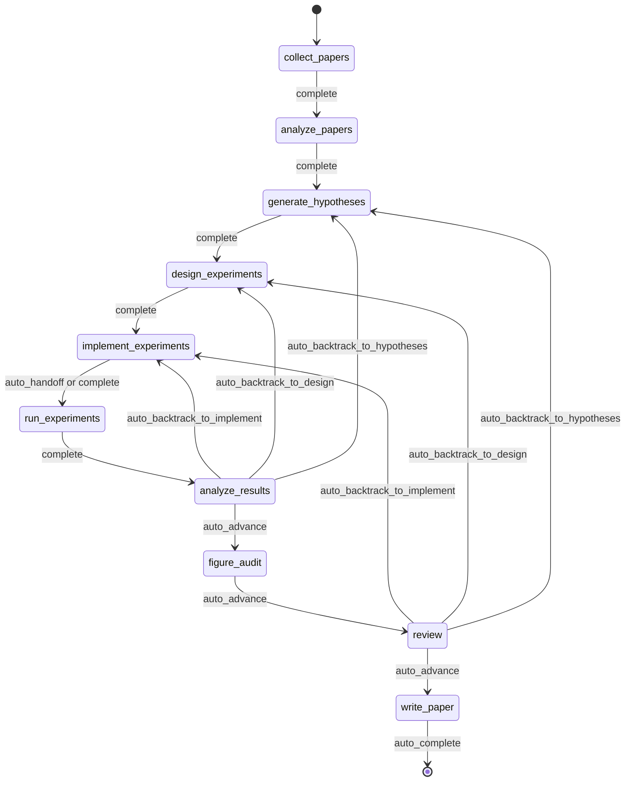
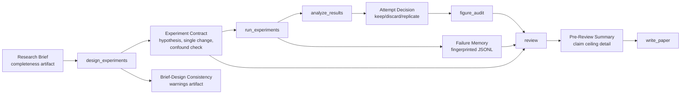
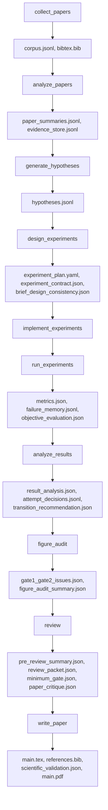

<div align="center">

  <br/>

  

  <h1>面向自主研究的作業系統</h1>

  <p><strong>不是研究生成，而是自主研究執行。</strong><br/>
  從 brief 到 manuscript，以 governed、checkpointed、inspectable 的方式運行研究。</p>

  <p>
    <a href="../README.md"><strong>English</strong></a>
    &nbsp;&middot;&nbsp;
    <a href="./README.ko.md"><strong>한국어</strong></a>
    &nbsp;&middot;&nbsp;
    <a href="./README.ja.md"><strong>日本語</strong></a>
    &nbsp;&middot;&nbsp;
    <a href="./README.zh-CN.md"><strong>简体中文</strong></a>
    &nbsp;&middot;&nbsp;
    <a href="./README.zh-TW.md"><strong>繁體中文</strong></a>
    &nbsp;&middot;&nbsp;
    <a href="./README.es.md"><strong>Español</strong></a>
    &nbsp;&middot;&nbsp;
    <a href="./README.fr.md"><strong>Français</strong></a>
    &nbsp;&middot;&nbsp;
    <a href="./README.de.md"><strong>Deutsch</strong></a>
    &nbsp;&middot;&nbsp;
    <a href="./README.pt.md"><strong>Português</strong></a>
    &nbsp;&middot;&nbsp;
    <a href="./README.ru.md"><strong>Русский</strong></a>
  </p>

  <p><sub>各語言 README 都是根據此文件維護的翻譯版本。規範表述與最新更新以 English README 為 canonical reference。</sub></p>

  <p>
    <a href="https://github.com/lhy0718/AutoLabOS/actions/workflows/ci.yml">
      
    </a>
    <a href="https://github.com/lhy0718/AutoLabOS/actions/workflows/smoke.yml">
      
    </a>
    
  </p>

  <p>
    
    
    
  </p>

  <p>
    
    
    
    
  </p>

</div>

---

AutoLabOS 是一個面向 governed research execution 的作業系統。它把一次 run 視為可 checkpoint 的研究狀態，而不是一次性的生成步驟。

整個核心循環都是可檢視的。文獻收集、假設形成、實驗設計、實作、執行、分析、figure audit、review、原稿撰寫都會留下可審計的 artifacts。主張會被限制在 claim ceiling 之下，保持 evidence-bounded。review 不是潤飾步驟，而是 structural gate。

品質假設會被轉成明確的 checks。系統更重視真實行為，而不是 prompt 層面的表面效果。可重現性透過 artifacts、checkpoints 與 inspectable transitions 來保障。

---

## 為什麼需要 AutoLabOS

許多 research-agent 系統主要優化的是文字生成。AutoLabOS 主要優化的是一個受治理的研究執行流程。

當一個專案需要的不只是看起來合理的草稿時，這種差異很重要。

- 可作為執行契約的 research brief
- 明確的 workflow gate，而不是 agent 自由漂移
- 可事後檢查的 checkpoints 與 artifacts
- 能在 manuscript generation 前阻止薄弱工作的 review
- 避免盲目重複失敗實驗的 failure memory
- 不是 prose 超過資料，而是 evidence-bounded claims

AutoLabOS 適合那些想要自主性，但不願放棄 auditability、backtracking 與 validation 的團隊。

---

## 一次 run 會發生什麼

一次 governed run 會始終遵循同樣的研究流程。

`Brief.md` → literature → hypothesis → experiment design → implementation → execution → analysis → figure audit → review → manuscript

實際流程如下：

1. `/new` 建立或開啟 research brief
2. `/brief start --latest` 驗證 brief，將其 snapshot 到 run 中，然後啟動 governed run
3. 系統沿著固定 workflow 前進，並在每個邊界寫入 state 與 artifacts checkpoint
4. 如果 evidence 不足，系統會選擇 backtracking 或 downgrade，而不是直接潤飾文字
5. 只有通過 review gate 後，`write_paper` 才會基於 bounded evidence 生成原稿

歷史上的 9-node contract 仍然是架構基線。目前 runtime 在 `analyze_results` 與 `review` 之間加入了 `figure_audit`，讓 figure quality critique 可以獨立 checkpoint 與 resume。



這條流程中的所有自動化都被限制在 bounded node-internal loops 裡。即使在無人值守模式下，workflow 本身仍然保持 governed。

---

## 一次 run 之後會得到什麼

AutoLabOS 不只會輸出 PDF。它會留下可追蹤的研究狀態。

| 輸出 | 包含內容 |
|---|---|
| **文獻 corpus** | 收集到的 papers、BibTeX、提取出的 evidence store |
| **假設** | 基於文獻的 hypotheses 與 skeptical review |
| **實驗計畫** | 含有 contract、baseline lock、一致性檢查的 governed design |
| **執行結果** | metrics、objective evaluation、failure memory log |
| **結果分析** | 統計分析、attempt decision、transition reasoning |
| **Figure audit** | figure lint、caption/reference consistency、可選 vision critique summary |
| **Review packet** | 5 人 specialist panel scorecard、claim ceiling、draft 前 critique |
| **原稿** | 含有 evidence links、scientific validation、可選 PDF 的 LaTeX draft |
| **Checkpoints** | 每個 node 邊界的完整 state snapshot，可隨時 resume |

所有內容都存放在 `.autolabos/runs/<run_id>/` 下，public-facing output 會 mirror 到 `outputs/`。

這就是它的可重現性模型：不是依賴隱藏狀態，而是依賴 artifacts、checkpoints 與 inspectable transitions。

---

## Quick Start

```bash
# 1. 安裝並建置
npm install
npm run build
npm link

# 2. 進入研究工作區
cd /path/to/your-research-workspace

# 3. 啟動一個介面
autolabos        # TUI
autolabos web    # Web UI
```

第一次使用時常見流程：

```bash
/new
/brief start --latest
/doctor
```

注意：

- 如果 `.autolabos/config.yaml` 不存在，兩種 UI 都會引導 onboarding
- 不要直接在儲存庫根目錄執行，請使用 `test/` 或你自己的研究 workspace
- TUI 與 Web UI 共享同一個 runtime、同一組 artifacts 和 checkpoints

### 前置條件

| 項目 | 何時需要 | 說明 |
|---|---|---|
| `SEMANTIC_SCHOLAR_API_KEY` | 一律需要 | 用於 paper discovery 與 metadata |
| `OPENAI_API_KEY` | provider 為 `api` 時 | 用於 OpenAI API model 執行 |
| Codex CLI login | provider 為 `codex` 時 | 使用本地 Codex session |

---

## Research Brief 系統

Brief 不只是啟動文件。它是 run 的 governed contract。

`/new` 會建立或開啟 `Brief.md`。`/brief start --latest` 會驗證它、將其 snapshot 到 run 中，再基於這個 snapshot 啟動執行。run 會記錄 brief source path、snapshot path，以及解析出的 manuscript format（如果有）。即使 workspace 的 brief 後續變動，該 run 的 provenance 仍然可檢視。

也就是說，brief 不是 prompt 的一部分，而是 audit trail 的一部分。

在目前的契約中，`.autolabos/config.yaml` 主要保存 provider/runtime 預設值與 workspace policy。每個 run 的研究意圖、evidence 門檻、baseline 預期、manuscript format 目標，以及 manuscript template 路徑，原則上都應該放在 Brief 裡。因此，持久化後的 config 可能會省略 `research` 預設值，以及部分 manuscript-profile / paper-template 欄位。

```bash
/new
/brief start --latest
```

Brief 需要同時包含研究意圖與治理限制，例如：topic、objective metric、baseline 或 comparator、minimum acceptable evidence、disallowed shortcuts，以及 evidence 不足時允許的 paper ceiling。

<details>
<summary><strong>Brief 章節與 grading</strong></summary>

| 章節 | 狀態 | 目的 |
|---|---|---|
| `## Topic` | 必要 | 用 1-3 句定義研究問題 |
| `## Objective Metric` | 必要 | 主要成功指標 |
| `## Constraints` | 建議 | compute budget、dataset 限制、reproducibility 規則 |
| `## Plan` | 建議 | 分步實驗計畫 |
| `## Target Comparison` | Governance | 提案方法與明確 baseline 的比較 |
| `## Minimum Acceptable Evidence` | Governance | 最小 effect size、fold count、decision boundary |
| `## Disallowed Shortcuts` | Governance | 會使結果失效的 shortcuts |
| `## Paper Ceiling If Evidence Remains Weak` | Governance | evidence 較弱時允許的最高 paper classification |
| `## Manuscript Format` | 選填 | 欄數、頁數 budget、references / appendix 規則 |

| 等級 | 含義 | 是否 paper-scale ready |
|---|---|---|
| `complete` | core + 4 個以上實質性 governance 章節 | 是 |
| `partial` | core 完整 + 2 個以上 governance 章節 | 帶警告繼續 |
| `minimal` | 只有 core 章節 | 否 |

</details>

---

## 兩個介面，一個 runtime

AutoLabOS 在同一個 governed runtime 之上提供兩個前端。

| | TUI | Web UI |
|---|---|---|
| 啟動 | `autolabos` | `autolabos web` |
| 互動 | slash commands、自然語言 | 瀏覽器 dashboard 與 composer |
| Workflow 視圖 | 終端中的即時 node progress | 帶 actions 的 governed workflow graph |
| Artifacts | CLI inspection | 文字、圖片、PDF 的 inline preview |
| 運營 surface | `/watch`, `/queue`, `/explore`, `/doctor` | jobs queue、live watch card、exploration status、diagnostics |
| 適合場景 | 快速迭代與直接控制 | 視覺化監控與 artifact 瀏覽 |

關鍵點在於，兩個介面看到的是同一組 checkpoints、同一組 runs 與同一份底層 artifacts。

---

## AutoLabOS 的不同之處

AutoLabOS 的核心不是 prompt-only orchestration，而是 governed execution。

| | 常見研究工具 | AutoLabOS |
|---|---|---|
| Workflow | 開放式 agent 漂移 | 帶有明確 review boundary 的 governed fixed graph |
| State | 短暫的 | checkpointed、resumable、inspectable |
| Claims | 模型能生成多強就寫多強 | 受 evidence 與 claim ceiling 限制 |
| Review | 可選 cleanup pass | 能阻止繼續寫作的 structural gate |
| Failures | 被遺忘後再試一次 | 以 fingerprint 形式寫入 failure memory |
| Validation | 次要 | `/doctor`、harness、smoke、live validation 都是 first-class |
| Interfaces | 不同程式路徑 | TUI 與 Web 共享同一個 runtime |

因此，這個系統更適合被理解為 research infrastructure，而不是 paper generator。

---

## 核心保證

### Governed Workflow

workflow 是 bounded 且 auditable 的。backtracking 是 contract 的一部分。無法支撐繼續前進的結果，會被送回 hypotheses、design 或 implementation，而不是直接包裝成更強的 prose。

### Checkpointed Research State

每個 node 邊界都會寫入可 inspection、可 resume 的 state。進展單位不只是文字輸出，而是帶有 artifacts、transitions 與可恢復 state 的 run。

### Claim Ceiling

claims 會被限制在 strongest defensible evidence ceiling 之下。系統會記錄被阻止的更強 claims，以及解鎖它們所需的 evidence gap。

### Review As A Structural Gate

`review` 不是 cosmetic cleanup。它是在 manuscript generation 之前檢查 readiness、方法論 sanity、evidence linkage、writing discipline 與 reproducibility handoff 的 structural gate。

### Failure Memory

failure fingerprint 會被持久化，因此結構性錯誤與重複出現的 equivalent failure 不會被盲目重試。

### Reproducibility Through Artifacts

可重現性透過 artifacts、checkpoints 與 inspectable transitions 來保障。public-facing summary 也以 persisted run output 為準，而不是再創造第二套 truth source。

---

## Validation 與 Harness 導向的品質模型

AutoLabOS 把 validation surface 當成 first-class。

- `/doctor` 會在 run 開始前檢查 environment 與 workspace readiness
- harness validation 會保護 workflow、artifact 與 governance contract
- targeted smoke checks 提供診斷性的回歸覆蓋
- 當 interactive behavior 很重要時，使用 live validation

paper readiness 不是單一 prompt 的感性判斷。

- **Layer 1 - deterministic minimum gate** 透過明確的 artifact / evidence-integrity checks 阻止 under-evidenced work 繼續前進
- **Layer 2 - LLM paper-quality evaluator** 對 methodology、evidence strength、writing structure、claim support、limitations honesty 做結構化批評
- **Review packet + specialist panel** 決定 manuscript path 應該 advance、revise 還是 backtrack

`paper_readiness.json` 中可能包含 `overall_score`。它應被理解為系統內部的 run-quality signal，而不是通用的 scientific benchmark。一些更高階的 evaluation / self-improvement path 會用它來比較不同 run 或 prompt mutation 候選。

<details>
<summary><strong>為什麼這個 validation 模型重要</strong></summary>

品質假設會被轉成明確的 checks。系統看重的不是 prompt 層面的表面效果，而是真實行為。目標不是「模型寫得看起來可信」，而是「這個 run 可以被 inspection 並被 defend」。

</details>

---

## 高階 Self-Improvement 能力

AutoLabOS 具備 bounded self-improvement path，但這不是 blind autonomous rewriting，而是由 validation 與 rollback 約束的改進路徑。

### `autolabos meta-harness`

`autolabos meta-harness` 會根據 recent completed runs 與 evaluation history，在 `outputs/meta-harness/<timestamp>/` 下建立 context directory。

其中可以包括：

- 過濾後的 run events
- `result_analysis.json`、`review/decision.json` 等 node artifacts
- `paper_readiness.json`
- `outputs/eval-harness/history.jsonl`
- 目標 node 的目前 `node-prompts/` 檔案

LLM 透過 `TASK.md` 被限制為只回傳 `TARGET_FILE + unified diff`，而且 target 被限定在 `node-prompts/` 內。apply mode 下候選變更必須通過 `validate:harness`；否則會 rollback 並寫入 audit log。`--no-apply` 只建立 context，`--dry-run` 只顯示 diff 而不改檔。

### `autolabos evolve`

`autolabos evolve` 會圍繞 `.codex` 與 `node-prompts` 執行一個 bounded mutation-and-evaluation loop。

- 支援 `--max-cycles`、`--target skills|prompts|all`、`--dry-run`
- 從 `paper_readiness.overall_score` 讀取 run fitness
- 對 prompts 與 skills 做 mutation，執行 validation，並比較不同 cycle 的 fitness
- 當出現 regression 時，以最後一個 good git tag 還原 `.codex` 與 `node-prompts`

這是一條 self-improvement path，但不是無限制的 repo-wide rewrite path。

### Harness Preset Layer

AutoLabOS 還提供 `base`、`compact`、`failure-aware`、`review-heavy` 等 built-in harness preset。它們會調整 artifact/context policy、failure-memory emphasis、prompt policy 與 compression strategy，用於 comparative evaluation，但不會改變 governed production workflow 本身。

---

## 常用命令

| 命令 | 說明 |
|---|---|
| `/new` | 建立或開啟 `Brief.md` |
| `/brief start <path\|--latest>` | 從 brief 啟動研究 |
| `/runs [query]` | 列出或搜尋 runs |
| `/resume <run>` | 恢復 run |
| `/agent run <node> [run]` | 從 graph node 開始執行 |
| `/agent status [run]` | 顯示 node 狀態 |
| `/agent overnight [run]` | 在保守邊界內執行無人值守 run |
| `/agent autonomous [run]` | 執行 bounded research exploration |
| `/watch` | 查看 active runs 與 background jobs 的 live watch 視圖 |
| `/explore` | 顯示目前 run 的 exploration-engine 狀態 |
| `/queue` | 顯示 running / waiting / stalled jobs |
| `/doctor` | environment 與 workspace diagnostics |
| `/model` | 切換 model 與 reasoning effort |

<details>
<summary><strong>完整命令列表</strong></summary>

| 命令 | 說明 |
|---|---|
| `/help` | 顯示命令列表 |
| `/new` | 建立或開啟 workspace `Brief.md` |
| `/brief start <path\|--latest>` | 從 workspace `Brief.md` 或指定 brief 啟動研究 |
| `/doctor` | environment + workspace diagnostics |
| `/runs [query]` | 列出或搜尋 runs |
| `/run <run>` | 選擇 run |
| `/resume <run>` | 恢復 run |
| `/agent list` | 列出 graph nodes |
| `/agent run <node> [run]` | 從 node 執行 |
| `/agent status [run]` | 顯示 node 狀態 |
| `/agent collect [query] [options]` | 收集 papers |
| `/agent recollect <n> [run]` | 追加收集 papers |
| `/agent focus <node>` | 使用 safe jump 切換 focus |
| `/agent graph [run]` | 顯示 graph state |
| `/agent resume [run] [checkpoint]` | 從 checkpoint 恢復 |
| `/agent retry [node] [run]` | 重試 node |
| `/agent jump <node> [run] [--force]` | 跳轉 node |
| `/agent overnight [run]` | overnight autonomy (24h) |
| `/agent autonomous [run]` | open-ended autonomous research |
| `/model` | model 與 reasoning selector |
| `/approve` | 批准暫停的 node |
| `/queue` | 顯示 running / waiting / stalled jobs |
| `/watch` | 查看 active run 的 live watch |
| `/explore` | 顯示 exploration-engine 狀態 |
| `/retry` | 重試目前 node |
| `/settings` | provider 與 model 設定 |
| `/quit` | 結束 |

</details>

---

## 適合誰 / 不適合誰

### 適合

- 想要自主性，同時也需要 governed workflow 的團隊
- checkpoint 與 artifact 很重要的 research engineering 工作
- 需要 evidence discipline 的 paper-scale 或 paper-adjacent 專案
- generation 之外，同樣重視 review、traceability、resumability 的環境

### 不適合

- 只想快速得到 one-shot draft 的使用者
- 不需要 artifact trail 或 review gate 的 workflow
- 比起 governed execution 更想要 free-form agent behavior 的專案
- 只需要簡單 literature summary tool 的場景

---

## 開發

```bash
npm install
npm run build
npm test
npm run test:web
npm run validate:harness
```

請為修改選擇能誠實覆蓋範圍的最小 validation set。對於 interactive defect，如果環境允許，不應只依賴 tests，也應重新跑一遍相同的 TUI / Web flow。

常用命令：

```bash
npm run test:watch
npm run test:smoke:natural-collect
npm run test:smoke:natural-collect-execute
npm run test:smoke:all
```

---

## Advanced Details

<details>
<summary><strong>執行模式</strong></summary>

AutoLabOS 在所有模式下都維持 governed workflow 與 safety gates。

| 模式 | 命令 | 行為 |
|---|---|---|
| **Interactive** | `autolabos` | 帶有明確 approval gate 的 slash-command TUI |
| **Minimal approval** | 設定: `approval_mode: minimal` | 自動批准安全轉移 |
| **Hybrid approval** | 設定: `approval_mode: hybrid` | 強且低風險的轉移自動前進，高風險或低信賴轉移則暫停 |
| **Overnight** | `/agent overnight [run]` | 無人值守單次執行，24 小時限制，保守 backtracking |
| **Autonomous** | `/agent autonomous [run]` | open-ended bounded research exploration |

</details>

<details>
<summary><strong>Governance artifact flow</strong></summary>



</details>

<details>
<summary><strong>Artifact flow</strong></summary>



</details>

<details>
<summary><strong>Node architecture</strong></summary>

| Node | 角色 | 作用 |
|---|---|---|
| `collect_papers` | collector, curator | 透過 Semantic Scholar 發現並篩選 candidate paper set |
| `analyze_papers` | reader, evidence extractor | 從選中的 papers 中提取 summaries 與 evidence |
| `generate_hypotheses` | hypothesis agent + skeptical reviewer | 從 literature 合成 ideas 並做 pressure-test |
| `design_experiments` | designer + feasibility/statistical/ops panel | 過濾計畫的可執行性並寫出 experiment contract |
| `implement_experiments` | implementer | 透過 ACI actions 產生程式碼與 workspace changes |
| `run_experiments` | runner + failure triager + rerun planner | 驅動 execution，記錄 failures，決定 rerun |
| `analyze_results` | analyst + metric auditor + confounder detector | 檢查 results 的可靠性並寫入 attempt decisions |
| `figure_audit` | figure auditor + optional vision critique | 檢查 evidence alignment、captions / references、publication readiness |
| `review` | 5-specialist panel + claim ceiling + two-layer gate | 執行 structural review，在 evidence 不足時阻止寫作 |
| `write_paper` | paper writer + reviewer critique | 生成 manuscript，執行 post-draft critique，並建置 PDF |

</details>

<details>
<summary><strong>Bounded automation</strong></summary>

| Node | 內部自動化 | 上限 |
|---|---|---|
| `analyze_papers` | 當 evidence 太稀疏時自動擴展 evidence window | <= 2 次 |
| `design_experiments` | deterministic panel scoring + experiment contract | 每個 design 執行 1 次 |
| `run_experiments` | failure triage + 一次 transient failure 重試 | structural failure 不重試 |
| `run_experiments` | failure memory fingerprinting | >= 3 次相同失敗則耗盡 retries |
| `analyze_results` | objective rematching + result panel calibration | human pause 前 1 次 rematch |
| `figure_audit` | Gate 3 figure critique + summary aggregation | vision critique 可獨立 resume |
| `write_paper` | related-work scout + validation-aware repair | 最多 1 次 repair |

</details>

<details>
<summary><strong>Public output bundle</strong></summary>

```
outputs/<title-slug>-<run_id_prefix>/
  ├── paper/
  ├── experiment/
  ├── analysis/
  ├── review/
  ├── results/
  ├── reproduce/
  ├── manifest.json
  └── README.md
```

</details>

---

## 狀態

AutoLabOS 是一個持續開發中的 OSS research-engineering 專案。行為與 contract 的 canonical reference 在儲存庫 `docs/` 目錄下，尤其是：

- `docs/architecture.md`
- `docs/tui-live-validation.md`
- `docs/experiment-quality-bar.md`
- `docs/paper-quality-bar.md`
- `docs/reproducibility.md`
- `docs/research-brief-template.md`

如果你要修改 runtime behavior，請把這些文件、已發布 tests 與 observable artifacts 視為 source of truth。
